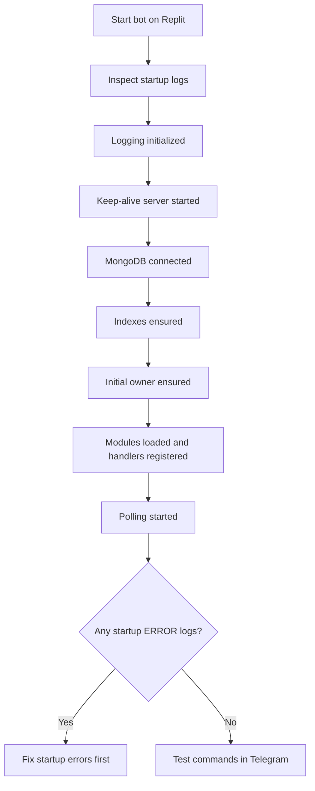

# Replit Environment: TCF Bot

Read [`CLAUDE.md`](CLAUDE.md) first. This file documents Replit-specific runtime, secrets, and deployment guidance. For top-level Replit deployment notes, see [`../replit.md`](../replit.md). For local and Docker setup, see [`../docs/setup.md`](../docs/setup.md). For project rules, see [`RULES.md`](RULES.md).

---

## Runtime Summary

| Setting | Value |
|---|---|
| Start command | `uv run python -m tcbot` |
| Bot mode | Long polling, no webhook |
| Keep-alive | Flask server from `tcbot/alive.py` |
| Replit port | `PORT=8080` |
| Local default port | `PORT=5000` when unset |
| Dependency manager | `uv` |

Use the Replit workflow or Run button to start and restart the bot. If the bot is
already running, stop it before restarting after code changes.

---

## Required Secrets

Store production secrets in Replit Secrets, not in tracked files.

| Secret | Description |
|---|---|
| `BOT_TOKEN` | Telegram bot token from BotFather |
| `MONGODB_URI` | MongoDB connection string |

Never paste these values into:

- `config.env` committed to git.
- Markdown documentation.
- Tests.
- Code comments.
- Console output or screenshots shared publicly.

---

## Environment Variables

Non-secret runtime configuration can also be managed through Replit environment
variables. Use `config.env.example` as the complete template.

Common variables:

| Variable | Description |
|---|---|
| `OWNER_ID` | Telegram user ID of the initial Founder |
| `DB_NAME` | MongoDB database name, default `tcbot` |
| `COMMUNITY_NAME` | Display name used in bot messages |
| `PREFIXES` | Command prefix list, default `['/', '!', '.']` |
| `PORT` | Use `8080` on Replit |
| `MAIN_GROUP` | Main group/forum chat ID |
| `MAIN_CHANNEL` | Main channel chat ID |
| `EXTEND_GROUP` | Additional configured group ID |
| `LOGS` | Log destination: `chat_id` or `chat_id/thread_id` |
| `LOGS_ERRORS` | Error log destination |
| `PROOFS` | Ban proof destination |
| `APPEALS` | Appeal record destination |
| `APPEAL_LOG_HANDLE` | Public handle shown in appeal instructions |
| `APPEAL_DISCUSSION_TOPIC` | Thread ID in `MAIN_GROUP` for appeal review |
| `PROOF_TIMEOUT_SECONDS` | Proof conversation timeout |
| `APPEAL_TIMEOUT_SECONDS` | Appeal conversation timeout |
| `ALBUM_DEBOUNCE_SECONDS` | Media album debounce window |
| `LOG_LEVEL` | Logging level |
| `MODULES_LOAD` | Optional module allowlist |
| `MODULES_NO_LOAD` | Optional module denylist |

Do not include real production values in documentation examples.

---

## `config.env` on Replit

`config.env` is gitignored and is mainly a local-development fallback. On Replit,
prefer Replit Secrets/environment management for deployed values.

Rules:

- Do not commit `config.env`.
- Do not put production secrets in tracked files.
- Keep `config.env.example` as placeholders only.
- If `config.env` is used for local testing, ensure it stays untracked.

---

## Port Behavior

`tcbot/alive.py` starts Flask on `cfg.port`.

- Local default: `5000`.
- Replit: set `PORT=8080` so Replit can route health checks correctly.

Do not hardcode Replit port values in code. Use the environment variable.

---

## Installing Dependencies

Runtime dependencies:

```bash
uv sync
```

Test dependencies:

```bash
uv sync --extra test
```

Add dependencies through `uv` only:

```bash
uv add <package>
```

Do not add packages to `requirements.txt`.

---

## Running Tests on Replit

Full offline suite:

```bash
uv run --extra test pytest tests/ -v
```

The tests should not require real Telegram or MongoDB access. If a test does,
fix the test to mock external dependencies.

---

## Logs and Startup Checks

After starting the bot, inspect logs for:

- Logging initialized.
- Keep-alive server started on the configured port.
- MongoDB connected to the configured database.
- Indexes ensured.
- Initial owner ensured.
- Modules loaded and handlers registered.
- Polling started.

Fix startup `ERROR` logs before testing commands in Telegram.



---

## Safe Replit Operations

Allowed:

- Restart the workflow after code changes.
- Run tests and Ruff commands.
- Update non-secret environment variables when required by a feature.
- Add dependencies through `uv` when justified.

Forbidden:

- Committing `config.env`.
- Pasting `BOT_TOKEN` or `MONGODB_URI` into docs or code.
- Switching the bot to webhook mode unless explicitly requested and planned.
- Hardcoding deployment chat IDs, secrets, or Replit-specific paths in source.
- Editing unrelated root docs or configuration during scoped tasks.

---

## Local Development Difference

For local development outside Replit:

```bash
cp config.env.example config.env
# Fill config.env locally; keep it untracked.
uv sync
uv run python -m tcbot
```
