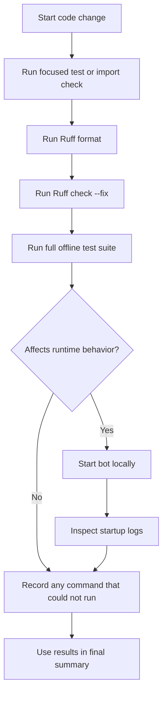

# Development Workflow: TCF Bot

Read [`CLAUDE.md`](CLAUDE.md) first. This file describes the safe working process for changes in TCF Bot. For project rules, see [`RULES.md`](RULES.md). For testing and validation, see [`TEST-RUFF.md`](TEST-RUFF.md). For commit conventions, see [`../docs/git-commit.md`](../docs/git-commit.md). For CI/CD automation, see [`../docs/workflows-guide.md`](../docs/workflows-guide.md).

---

## Scope Discipline

Before changing anything:

1. Identify the exact files in scope.
2. Read the existing file before editing it.
3. Search for existing helpers or patterns.
4. Avoid unrelated refactors.
5. Do not edit `config.env` during normal development tasks.
6. Do not touch secrets, production credentials, or private deployment values.

When the user explicitly limits write scope, obey that scope even if other files
contain stale information.

---

## Standard Local Setup

Install dependencies:

```bash
uv sync
```

Install test dependencies:

```bash
uv sync --extra test
```

Run the bot locally:

```bash
uv run python -m tcbot
```

---

## Validation Workflow

For code changes, prefer this order:

1. Run a focused test or import check for the changed area.
2. Run Ruff formatting and linting.
3. Run the full offline test suite.
4. If the task affects runtime behavior, start the bot and inspect startup logs.

Commands:

```bash
uv run ruff format .
uv run ruff check --fix .
uv run --extra test pytest tests/ -v
uv run python -m tcbot
```

If a command cannot run in the current environment, record the exact command and
error in the final summary.



---

## Adding or Changing Command Modules

1. Put command handlers in `tcbot/modules/<name>.py`.
2. Use the standard file header and import order.
3. Define `__module_name__` and `__help_text__` unless the module is intentionally
   hidden from help.
4. Use `build_prefixed_filters()` for command filters.
5. Apply the decorator stack in the required order.
6. Use shared helpers for formatting, target extraction, roles, keyboards, and DB
   access.
7. Export handlers through `__handlers__` at the bottom.
8. Add or update tests when logic changes.

---

## Adding Database Helpers

1. Add or edit the owning `tcbot/database/<name>_db.py` file.
2. Keep all collection writes inside database helper modules.
3. Use a private `_col()` accessor inside the DB helper if direct `col()` access
   is needed.
4. Keep helpers async and fully typed.
5. Add document shapes to `documents.py` when needed.
6. Add domain primitives to `types.py` only when they improve clarity and are used
   consistently.
7. Add indexes to `mongos.ensure_indexes()` for new indexed queries.
8. Invalidate caches after writes when relevant.
9. Update every read path if a stored field changes.
10. Add or update offline tests.

Do not rename or delete MongoDB fields without a migration plan.

---

## Adding Conversation Flows

Never create `*_conv.py` files.

Use existing flow factories where possible:

| Action | Workflow |
|---|---|
| Kick / Mute / Warn | `reason_flow.build_modaction_conv()` |
| Ban | `ban_flow.ban_conversation(entry_fn)` |
| Appeal | `appeal_flow.build_handler()` |

For a new standalone flow:

1. Create `tcbot/modules/helper/workflows/<name>_flow.py`.
2. Model the state graph after `appeal_flow.py`.
3. Name states `WAITING_*`.
4. Include a cancel fallback.
5. Use `cfg.proof_timeout` or `cfg.appeal_timeout` for timeouts.
6. Keep Telegram messages HTML-only and escaped.
7. Add tests for state transitions and pure helpers.

---

## Adding Dependencies

Use `uv`; do not edit `requirements.txt`.

```bash
uv add <package>
uv sync
```

Before adding a dependency, confirm:

- The project does not already provide the needed functionality.
- The package is maintained and compatible with Python 3.12.
- The package does not require secrets or network access during tests.
- The dependency is justified by the feature scope.

---

## Branch and Commit Guidance

Suggested branch names:

| Prefix | Use |
|---|---|
| `feat/` | User-facing features |
| `fix/` | Bug fixes |
| `refactor/` | Behavior-preserving code changes |
| `docs/` | Documentation-only work |
| `test/` | Test-only changes |
| `chore/` | Maintenance |

Commit messages should be short, imperative, and focused. Conventional prefixes
are welcome when helpful:

```text
feat: add federation sweep command
fix: guard appeal review callbacks
docs: refresh agent project rules
test: cover warning reset flow
```

Do not commit unless the user explicitly asks.

---

## Deployment Checklist

Before deploying or merging runtime changes:

- [ ] Ruff format completed.
- [ ] Ruff lint completed.
- [ ] Full offline tests passed.
- [ ] Bot starts without import errors.
- [ ] MongoDB connection succeeds in startup logs.
- [ ] Keep-alive server starts on the configured port.
- [ ] Relevant command or workflow was tested manually when practical.
- [ ] No real secrets were added to tracked files.
- [ ] `config.env` remains untracked.
- [ ] Any database schema impact is documented with a migration plan.

---

## Replit Runtime Workflow

For Replit-specific deployment details, read `.agents/REPLIT.md`.

Operational summary:

- Start command: `uv run python -m tcbot`.
- Replit health port: set `PORT=8080`.
- Store `BOT_TOKEN` and `MONGODB_URI` in Replit Secrets.
- Store non-sensitive environment values through Replit environment management or
  a gitignored local `config.env` only when appropriate.

---

## Final Response Checklist for Agents

When completing a task, summarize:

1. What changed.
2. Which project-relative files changed.
3. What validation ran and the result.
4. Any commands that could not run and why.
5. Any safe follow-up the user may want.
