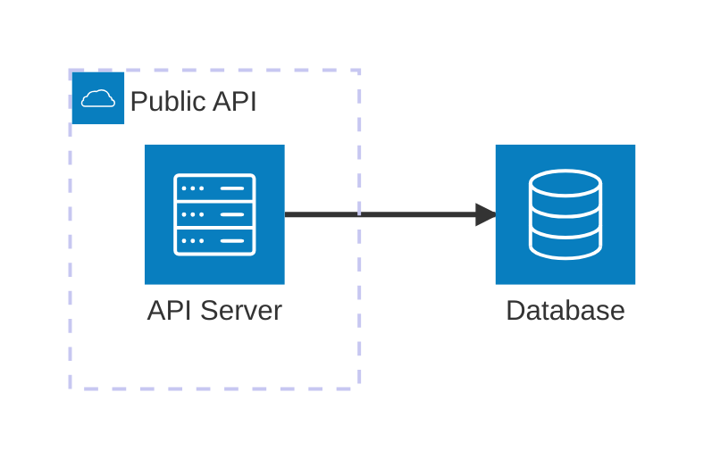
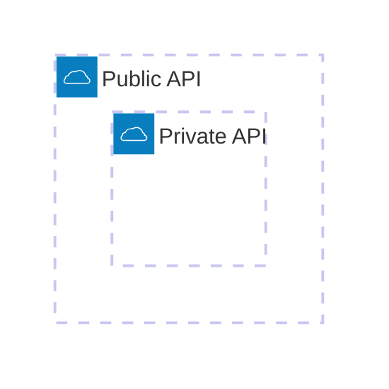
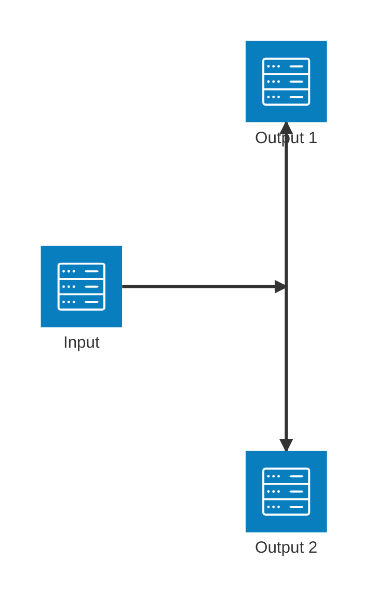

# Architecture Diagrams Reference

Architecture diagrams visualize cloud services, CI/CD deployments, and infrastructure
relationships. The `architecture-beta` syntax requires Mermaid v11.1.0 or newer in renderers
that implement it. A target platform may bundle an older or customized renderer, so check the
actual renderer before using this syntax.

## Compatibility matrix

| Feature or syntax | Minimum Mermaid version | Compatibility guidance |
|---|---:|---|
| Common diagram types | Varies by feature | Check the target renderer when using newer configuration or layout options. |
| `architecture-beta` | 11.1.0 | Do not use when the target renderer is older, even if a local package is newer. |
| Iconify-backed architecture icons | Renderer and icon-pack dependent | Verify renderer support and local icon-pack availability. |
| ELK layout | Renderer and version dependent | Treat it as optional and validate the rendered result. |

If the target version is unknown, use a broadly supported diagram type such as `flowchart`, or
provide a compatibility fallback instead of claiming that every Mermaid renderer supports the
same syntax.

## Basic Syntax



## Building Blocks

### Groups

Group related services together:

```
group {groupId}({icon})[{title}] (in {parentId})?
```



### Services

Declare services (nodes):

```
service {serviceId}({icon})[{title}] (in {parentId})?
```

```mermaid
architecture-beta
    service api(server)[API Server]
    service db(database)[Database]
    service cache(redis)[Cache] in api
```

### Edges

Connect services with edges:

```
{serviceId}{{group}}?:{T|B|L|R} {<}?--{>}? {T|B|L|R}:{serviceId}{{group}}?
```

**Directions:** `T` (top), `B` (bottom), `L` (left), `R` (right)

**Arrows:** `<` for incoming, `>` for outgoing

```mermaid
architecture-beta
    service client(browser)[Client]
    service api(server)[API]
    service db(database)[Database]

    client:B --> T:api
    api:R --> L:db
```



### Junctions

Create 4-way splits:

```
junction {junctionId} (in {parentId})?
```



## Icons

**Default icons:** `cloud`, `database`, `disk`, `internet`, `server`

> Compatibility: custom icons, icon packs, and some service shapes are renderer-dependent. Use
> the default set when the target capabilities are unknown.

**Custom icons:** Use any of 200,000+ icons from iconify.design:

```mermaid
architecture-beta
    service web(aws:ec2)[Web Server]
    service storage(aws:s3)[Storage]
```



### Using @iconify-json Icon Packs

Use already-installed icon packs with Mermaid CLI for a wide variety of technology logos:

```bash
mmdc --iconPacks @iconify-json/logos -i ./diagram.mmd -o ./output.svg
```

Installing icon packs or Mermaid CLI changes the environment and requires explicit approval.

Use icons with the `logos:` prefix:

```mermaid
architecture-beta
    service web(logos:docker)[Docker Container]
    service k8s(logos:kubernetes)[Kubernetes Cluster]
    service aws(logos:aws)[AWS Services]
    service github(logos:github)[GitHub Actions]

    web:R --> L:k8s
    k8s:R --> L:aws
    web:R --> L:github
```



**Popular icon packs:**

| Icon Pack                    | Description                                   | Package                            |
| ---------------------------- | --------------------------------------------- | ---------------------------------- |
| `@iconify-json/logos`        | Technology brands | `npm install @iconify-json/logos@latest` |
| `@iconify-json/bi`           | Bootstrap icons | `npm install @iconify-json/bi@latest` |
| `@iconify-json/mdi`          | Material Design icons | `npm install @iconify-json/mdi@latest` |
| `@iconify-json/simple-icons` | Simple icons | `npm install @iconify-json/simple-icons@latest` |

Usage: `pack:icon-name` (e.g., `logos:docker`, `mdi:database`)

## Complex Example

```mermaid
architecture-beta
    group internet(cloud)[Internet]
    group private_vpc(cloud)[Private VPC]

    service lb(load_balancer)[Load Balancer] in internet
    service api1(api)[API Server 1] in private_vpc
    service api2(api)[API Server 2] in private_vpc
    service db(database)[Primary Database] in private_vpc
    service replica(database)[Read Replica] in private_vpc

    lb:R --> L:api1
    lb:R --> L:api2
    api1:R --> L:db
    api2:R --> L:db
    db:R --> L:replica
```



## Edge Patterns

| Pattern              | Description               |
| -------------------- | ------------------------- |
| `A:R -- L:B`         | Horizontal edge           |
| `A:T -- B:B`         | Vertical edge (90 degree) |
| `A:R --> L:B`        | Edge with arrow           |
| `A:R <--> L:B`       | Bidirectional edge        |
| `A{group}:R --> L:B` | Edge from group boundary  |

## Group Edges

Connect groups using the `{group}` modifier:

```mermaid
architecture-beta
    group frontend(cloud)[Frontend]
    group backend(cloud)[Backend]

    service client(browser)[Client] in frontend
    service api(server)[API] in backend

    client{group}:B --> T:api{group}
```



## Best Practices

1. Group services by environment (public/private) or layer (frontend/backend)
2. Use consistent icons for service types
3. Label edges with protocols (HTTPS, TCP, etc.)
4. Use junctions for fan-out patterns
5. Keep diagrams focused; split complex architectures into multiple views

## Reference

- [Official Documentation](https://mermaid.js.org/syntax/architecture.html)
- [Iconify Icons](https://iconify.design)
