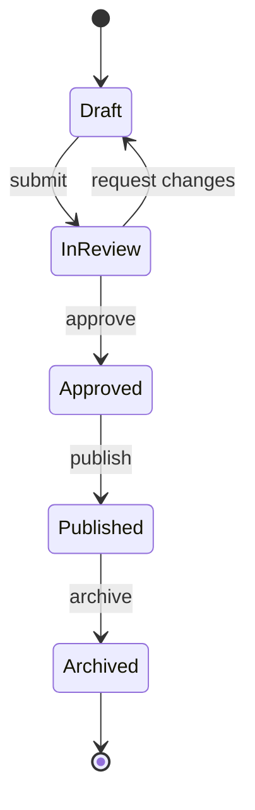
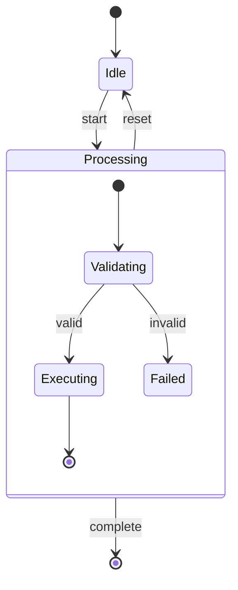
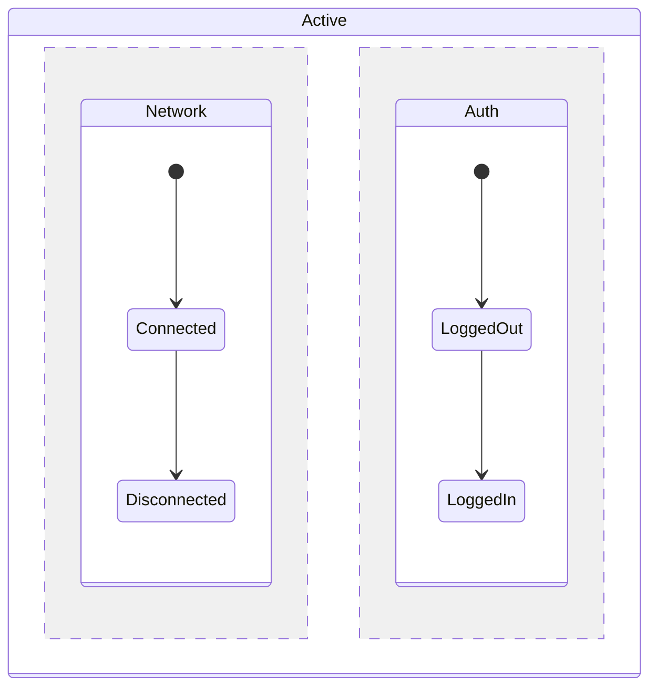
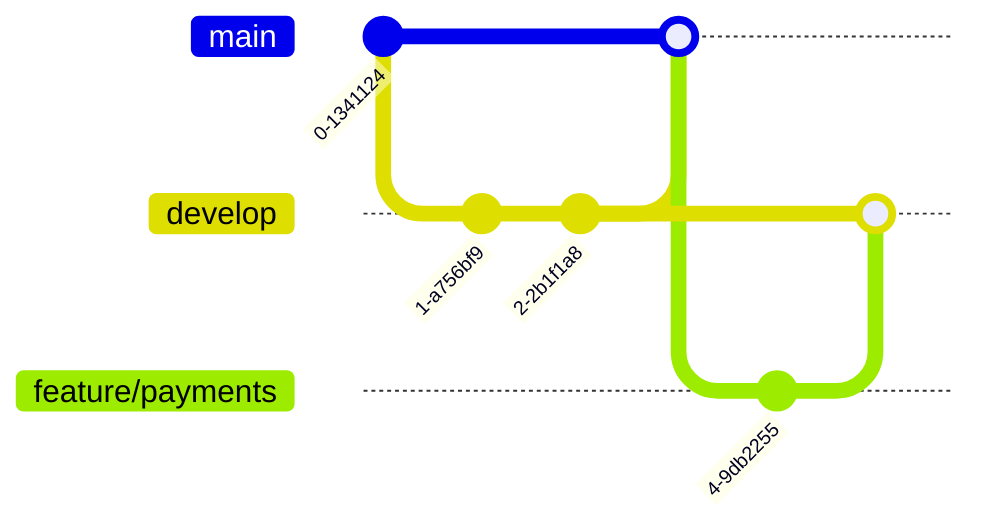
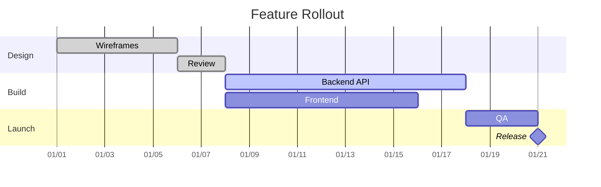
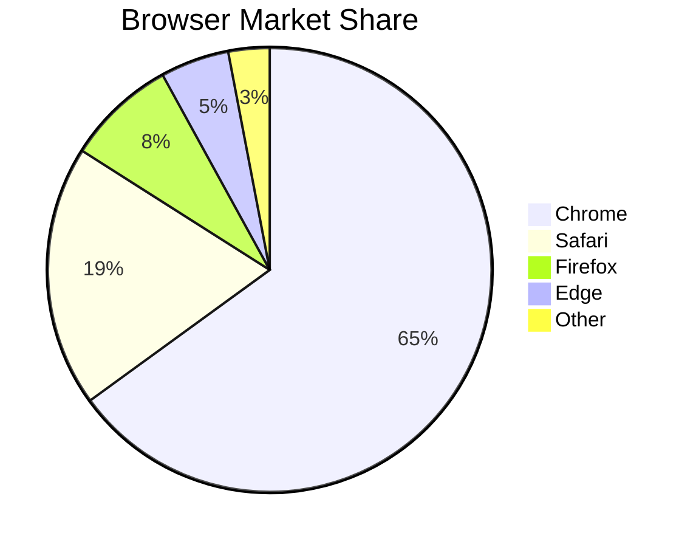
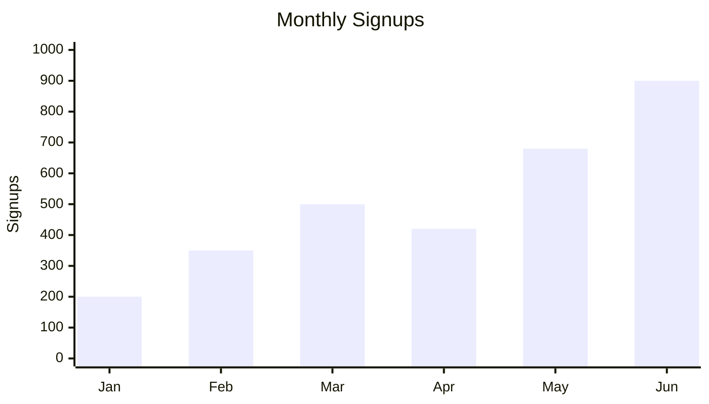

# State Diagrams, Git Graphs, Gantt Charts, Pie and Bar Charts

The original skill listed these four types in its overview but had no reference depth for any
of them, this file closes that gap.

## State diagrams

Model an object's lifecycle: the valid states it can be in and what transitions between them.

- `[*]` marks the initial and final pseudo-states.
- Transitions are labeled with the event or action that causes them, put that label after the
  colon, not the resulting state name again.
- Composite states (a state that contains its own sub-states) use nested blocks:

- Concurrent regions (parallel independent state tracks within one composite state) are
  separated with `--`:

Use a state diagram over a flowchart when the subject is specifically one entity's status over
its lifetime, not a general process, a flowchart better fits a one-time process with a clear
start and end rather than a status that can cycle.

## Git graphs

Model branching and merging strategy for version control.

- `commit` adds a commit to the current branch, optionally with `id: "label"` or
  `tag: "v1.0"`.
- `branch <name>` creates a branch from the current branch, `checkout <name>` switches to it.
- `merge <name>` merges the named branch into the current one.
- Use this to document a release strategy or branching convention, not to record actual
  literal commit history, that belongs in the real git log, not a diagram.

## Gantt charts

Model a project timeline with tasks, durations, and dependencies.

- Each task line is `Task name :status, id, start, duration`. `status` is optional (`done`,
  `active`, `crit`), `id` lets other tasks reference it.
- `after <id>` makes a task start when another finishes, use this instead of hardcoding dates
  whenever tasks are sequentially dependent, hardcoded dates drift out of sync as the plan
  changes.
- `section` groups related tasks under a labeled heading.
- A duration of `0d` with the `milestone` status marks a point-in-time event rather than a
  span.

## Pie and bar charts

Model proportions or simple category comparisons. These are for lightweight data
visualization, not a replacement for a real charting library when the data is complex or the
chart needs to be interactive.

- Pie chart values don't need to sum to 100, Mermaid computes proportions automatically.
- Use a pie chart for a handful of categories at most, more than 6 to 8 slices becomes hard to
  read at a glance, consider a bar chart or a table instead at that point.
- The `xychart-beta` syntax for bar and line charts is newer and less universally supported
  across renderers than the other diagram types here, check the target renderer (GitHub,
  Notion, the specific tool in use) actually supports it before relying on it, fall back to a
  plain Markdown table if unsure.
