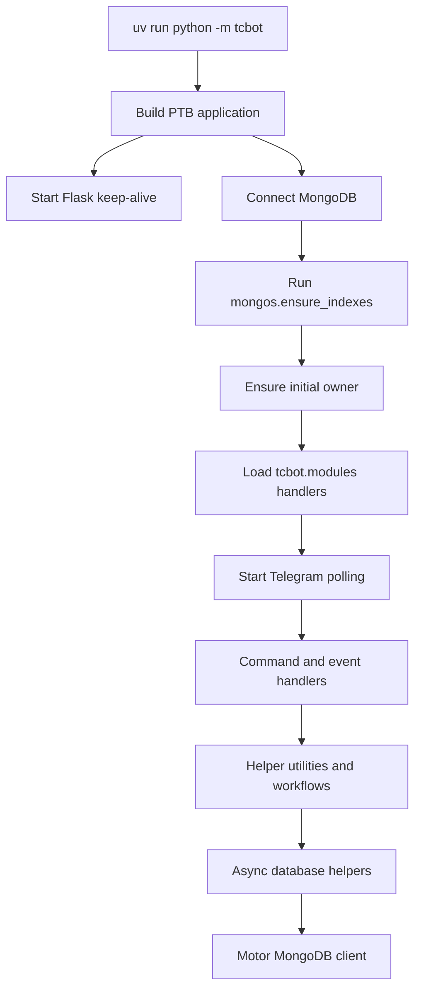
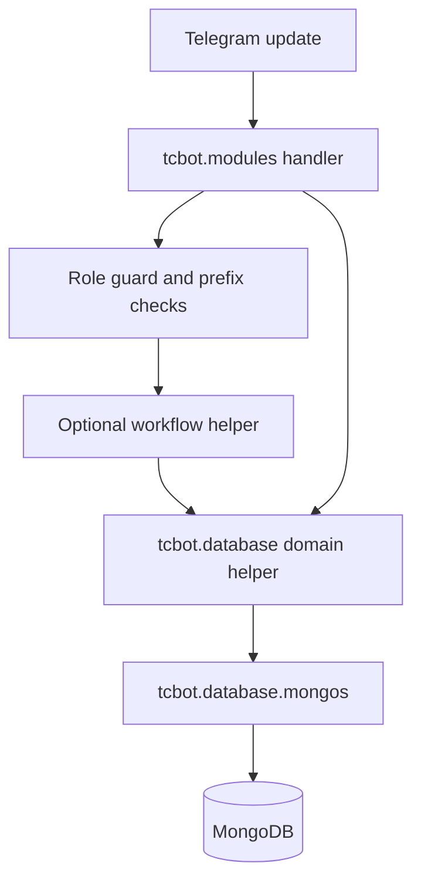
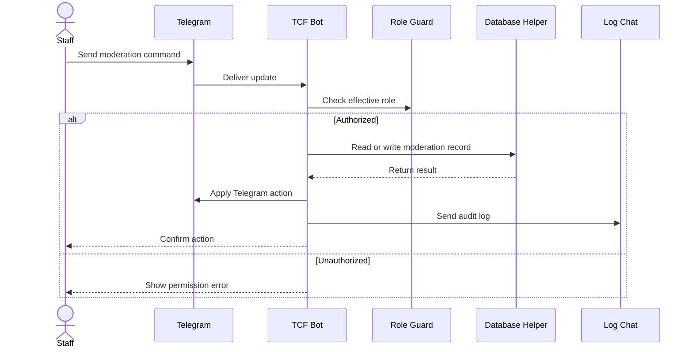
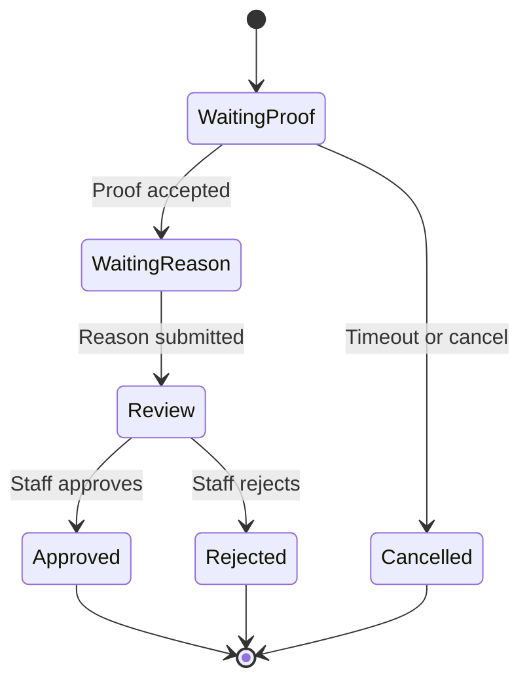
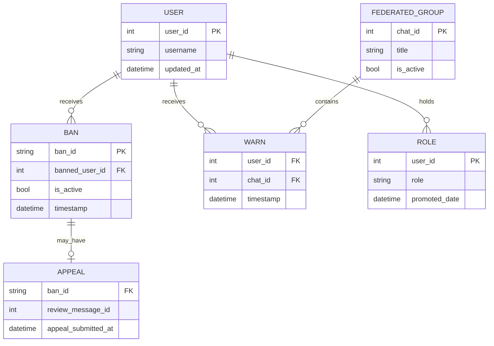

# Mermaid Diagrams for TCF Bot

Before invoking this skill, confirm the read/update rules in [`.agents/CLAUDE.md`](../../CLAUDE.md#mandatory-read-these-files-before-any-work). After adding or updating a diagram, update [`CHANGELOG.md`](../../../CHANGELOG.md) noting which doc gained the diagram, in the same turn.

Use this skill to create clear, professional Mermaid diagrams for the TCF Bot codebase. Prefer diagrams that help contributors understand architecture, Telegram bot flows, MongoDB data relationships, moderation workflows, and operational boundaries.

Last refreshed for this project: 2026-05-29.

## Project Context

TCF Bot is a Python 3.12 Telegram bot built with `python-telegram-bot` (latest), Motor async MongoDB helpers, a Flask keep-alive endpoint, and Ruff.

Relevant project structure:

- `tcbot/__main__.py` builds the PTB application, starts keep-alive, connects MongoDB, ensures indexes, registers handlers, and starts polling.
- `tcbot/modules/` contains top-level Telegram command and event handler modules.
- `tcbot/modules/helper/` contains shared handler helpers.
- `tcbot/modules/helper/workflows/*_flow.py` contains `ConversationHandler` workflows.
- `tcbot/database/*_db.py` contains domain-specific async MongoDB helpers.
- `tcbot/database/mongos.py` owns the Motor client, collection accessor, and `ensure_indexes()`.
- `tcbot/utils/` contains dispatch, logging, prefixes, and datetime helpers.

## What to Diagram First

Prioritize these diagram types for this repository:

1. **Architecture flowcharts** for runtime structure, module boundaries, and deployment/health-check context.
2. **Sequence diagrams** for Telegram update handling, command execution, moderation actions, appeals, proof collection, and logging.
3. **Flowcharts** for command workflows, role checks, ban/kick/mute/warn paths, appeal decisions, and error handling.
4. **ER diagrams** for MongoDB collections and relationships between users, roles, groups, moderation records, warnings, caches, and queues.
5. **State diagrams** for `ConversationHandler` states such as `WAITING_*`, proof submission, appeals, promotion requests, or review flows.

Use class diagrams only when modeling Python object responsibilities or typed document shapes. Use C4-style diagrams only when the user wants a layered architecture view.

## Render-Safe Mermaid Rules

Zed renders Mermaid using the editor's Mermaid renderer. Keep diagrams portable and safe:

- Use standard Mermaid blocks: `flowchart`, `sequenceDiagram`, `erDiagram`, `stateDiagram-v2`, `classDiagram`, `gitGraph`, `gantt`, `pie`, `journey`, `timeline`, `mindmap`, `quadrantChart`, or `xychart-beta` when appropriate.
- Do **not** include `%%{init}%%` directives.
- Do **not** hardcode themes, hex colors, or custom `classDef` styles unless the user explicitly asks for exact colors.
- Do **not** use inline HTML in labels or notes.
- Prefer simple labels with letters, numbers, spaces, hyphens, underscores, parentheses, colons, and slashes.
- Quote labels that contain punctuation likely to confuse Mermaid.
- Avoid `{}`, `[]`, pipes, and raw angle brackets inside labels unless syntax requires them.
- Prefer taller diagrams over very wide diagrams for editor readability.
- Split large systems into multiple focused diagrams instead of one dense diagram.
- Keep node IDs short and stable, and put readable text in labels.

## TCF Bot Diagram Patterns

### Runtime Architecture

Use this pattern when explaining how the bot starts and routes work:

### Handler-to-Database Boundary

Use this pattern to reinforce repository boundaries. Modules should call domain helpers, not collections directly:

### Telegram Command Sequence

Use sequence diagrams for temporal behavior and external API calls:

### Conversation Workflow

Use flowcharts or state diagrams for `ConversationHandler` flows:

### MongoDB ER Diagram

Use ER diagrams for collections and fields. Keep fields representative, not exhaustive, unless the user asks for a full schema:

## Diagram Creation Workflow

1. Identify the question: architecture, runtime flow, database model, workflow state, or interaction sequence.
2. Inspect relevant files before diagramming when paths are known. For this project, common sources are `tcbot/__main__.py`, `tcbot/modules/`, `tcbot/modules/helper/workflows/`, `tcbot/database/`, and `tcbot/utils/`.
3. Choose the smallest useful diagram type.
4. Use project names exactly where helpful, but keep labels concise.
5. Prefer HTML-safe, readable labels. Do not paste long code expressions into nodes.
6. Add a one- or two-sentence explanation before or after the diagram when it clarifies scope.
7. If the diagram is inferred rather than verified, say so.

## Detailed References

Load these project-local references when deeper Mermaid syntax guidance is needed:

- `references/architecture-diagrams.md` for architecture and infrastructure views.
- `references/sequence-diagrams.md` for Telegram/API interactions and call ordering.
- `references/flowcharts.md` for command paths and decision logic.
- `references/erd-diagrams.md` for MongoDB collections and schema relationships.
- `references/class-diagrams.md` for domain modeling or Python responsibility maps.
- `references/c4-diagrams.md` for system context, container, and component diagrams.
- `references/advanced-features.md` only when the user asks for advanced Mermaid syntax or export details.

## Quality Checklist

Before returning a diagram:

- The diagram uses a Mermaid type supported by Zed.
- It contains no inline HTML, `%%{init}%%`, hardcoded theme config, or unnecessary styling.
- It is focused enough to render in a narrow editor pane.
- It reflects TCF Bot boundaries: handlers in `tcbot/modules/`, workflows in `tcbot/modules/helper/workflows/`, database access through `tcbot/database/*_db.py`, and MongoDB connection/indexing through `tcbot/database/mongos.py`.
- User-provided or uncertain details are labeled as assumptions instead of facts.
