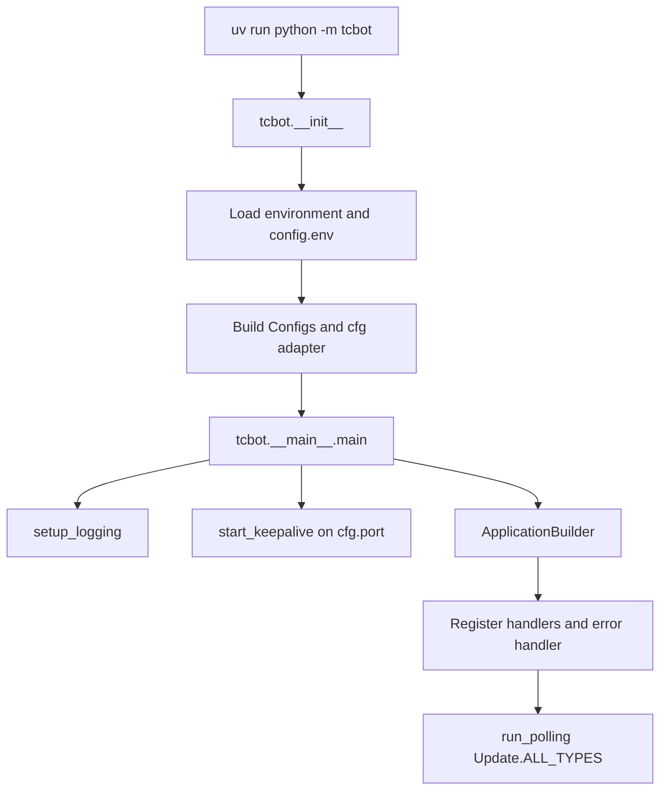
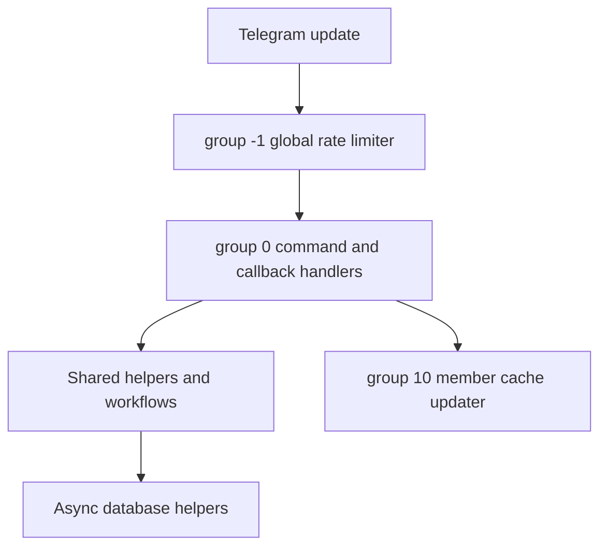

# TCF Bot: Planning and Project State

This document tracks how TCF Bot currently runs, what is considered stable, and what should be improved next. Keep it practical: record current behavior, known risks, and validation commands rather than aspirational placeholders.

For user-facing overview, see [`README.md`](README.md). For contributor rules and style, see [`AGENTS.md`](AGENTS.md). For deployment notes, see [`replit.md`](replit.md). For developer documentation, see [`docs/README.md`](docs/README.md). For CI/CD automation details, see [`docs/workflows-guide.md`](docs/workflows-guide.md). For changelog of recent changes, see [`CHANGELOG.md`](CHANGELOG.md).

## Current Project State

| Area | Status |
|---|---|
| Runtime | Long-polling Telegram bot started with `uv run python -m tcbot`. |
| Python target | Python 3.12 project target (`pyproject.toml` requires `>=3.12`). |
| Bot framework | `python-telegram-bot` (with the `[job-queue]` extra), tracking the latest compatible release. |
| Database | MongoDB through Motor, connected during PTB `post_init`. |
| Health check | Flask app in `tcbot/alive.py`, `GET /` returns `OK` on `PORT` (default `5000`). |
| Dependency management | `uv` with `uv.lock`; CI installs with frozen lockfile by default. |
| Formatting/linting | Ruff, configured in `pyproject.toml`. |
| Deployment notes | Local `config.env`, Docker Compose, and Replit/hosted environment variables are documented. |

## Runtime Flow

### Startup Sequence



### `post_init` Sequence

`_post_init(app)` runs after the PTB application is built and before polling starts:

1. Required env vars are parsed before startup; `BOT_TOKEN`, `MONGODB_URI`, and `OWNER_ID` must be present.
2. Enabled modules are imported during handler collection; import failures stop startup instead of silently skipping handlers.
3. `connect()` creates the Motor client and verifies MongoDB with `ping`.
4. `ensure_indexes()` creates required MongoDB indexes in parallel.
5. `ensure_initial_owner(cfg.initial_owner_id)` seeds the first owner when needed.
6. `error_reporter.attach(...)` stores the bot and error destination for async reports.
7. The asyncio loop exception handler is registered.

### Request Processing Pipeline



## Architecture Summary

### Main Package Boundaries

| Path | Responsibility |
|---|---|
| `tcbot/__init__.py` | Environment parsing, `Configs`, and the global `cfg` adapter. |
| `tcbot/__main__.py` | Application startup, handler registration, MongoDB startup, polling, error handling. |
| `tcbot/alive.py` | Flask health-check server. |
| `tcbot/modules/` | Command modules and Telegram handlers. |
| `tcbot/modules/helper/` | Shared formatter, keyboard, decorator, target extraction, and role guard helpers. |
| `tcbot/modules/helper/workflows/` | ConversationHandler flows, all named `*_flow.py`. |
| `tcbot/database/` | Async MongoDB access helpers and document/type definitions. |
| `tcbot/utils/` | Logging, bounded fan-out dispatch, prefix filters, datetime helpers, error reporting. |

### Module Discovery

`tcbot/modules/__init__.py` discovers top-level `*.py` files in `tcbot/modules/`, excludes `__init__.py`, applies the optional `MODULES_LOAD` allowlist and `MODULES_NO_LOAD` denylist, imports active modules, and collects their `__handlers__` lists. If any enabled module fails to import, startup now exits with the failing module names so a partially registered bot is not deployed.

### Database Layer

All database operations are async and should go through helper modules in `tcbot/database/`.

Current collection/domain owners include:

| Collection/domain | Helper |
|---|---|
| Federation bans | `bans_db.py` |
| Connected and pending groups | `groups_db.py` |
| Member profile cache | `users_cache.py` |
| Owners/admins + dev/tester roles | `users_roles.py` |
| Warnings | `warns_db.py` |
| Kicks | `kicks_db.py` |
| Mutes | `mutes_db.py` |
| Promotion requests | `queues_db.py` |
| MongoDB client/indexes | `mongos.py` |
| In-memory caches | `cache.py` |
| Typed document shapes | `documents.py` |
| Domain primitive types | `types.py` |

### Error Handling

| Layer | Location | Purpose |
|---|---|---|
| PTB error handler | `app.add_error_handler(_error_handler)` | Reports unhandled handler exceptions. |
| Asyncio exception handler | `loop.set_exception_handler(...)` | Reports background task failures. |
| Logging integration | `tcbot/utils/error_reporter.py` | Sends formatted error details to the configured destination. |

## Role System Summary

Role hierarchy:

1. Founder
2. Admin
3. Developer
4. Tester

Important rules:

- Use canonical role helpers from `tcbot.database.users_roles` and `tcbot.modules.helper.decorators.resolve_and_check`.
- Do not duplicate manual role-check chains in handlers.
- Ban and kick flows must auto-demote targets that currently hold a federation role.
- Promotion and demotion workflows should preserve auditability through logs and queue records.

## Conversation Flow Summary

Conversation flows live in `tcbot/modules/helper/workflows/` and use `ConversationHandler` where needed.

Primary flows:

| Flow | Purpose |
|---|---|
| `ban_flow.py` | Ban proof collection, album buffering, and federation ban execution. |
| `appeal_flow.py` | Private appeal submission and staff decision handling. |
| `connected_flow.py` | Group join approval and connection checks. |
| `reason_flow.py` | Shared reason/proof steps for moderation actions. |
| `proof_flow.py` | Proof upload helpers and prompts. |
| `kicking_flow.py`, `muting_flow.py`, `warning_flow.py`, `unban_flow.py` | Action-specific moderation workflows. |
| `promote_flow.py` | Role promotion execution helpers. |
| `stats_flow.py` | Unified `Stats` class covering overview, staff roster, users, chats, bans, and search. |

For detailed behavior, see `docs/workflows/workflows.md`.

## Development and Validation Commands

Install dependencies:

```bash
uv sync
```

Run the bot:

```bash
uv run python -m tcbot
```

Format and lint:

```bash
uv run ruff format .
uv run ruff check --fix .
```

Run local bot + MongoDB:

```bash
docker-compose up --build
```

## Improvement Strategy

Priorities, in order:

1. **Correctness and safety:** preserve federation moderation behavior, secrets safety, and database compatibility.
2. **Clear module boundaries:** handlers call helpers; database writes stay in `tcbot/database/`; shared flows stay in `workflows/`.
3. **Operational visibility:** errors and important moderation events should be logged to configured destinations.
4. **Performance:** use bounded fan-out for group-wide operations and avoid sequential I/O where safe.

## Current Priority Backlog

> The backlog below was re-verified line by line against the source tree on
> 2026-06-01. Each prior entry was checked against the actual code rather than
> trusted from a previous review pass. The disposition of every prior claim is
> recorded under "Backlog Review" so the audit trail stays clear.

## Code Review Findings

Use this section to keep code review findings in one consistent place. It applies
to anyone reviewing this codebase. After a review, add each finding as a row in the
table for its priority tier, where P1 is the highest and P5 is the lowest.
Confirmed and prioritized items move up into the
[Current Priority Backlog](#current-priority-backlog) above. Cleared items are set
to `Dismissed` with the reason written in the Evidence column. The italic rows are
placeholders that show the expected format, so replace them and do not leave them
in.

### How to record a finding

- One finding per row, specific and self-contained.
- **Location** must be a real `file.py:line` you actually opened, never a guess.
- **Evidence** must quote the relevant code or describe the behavior you observed
  that proves the finding is real. A finding with no evidence counts as unverified.
- **Verify first.** Open the cited file and confirm the issue is not already
  handled before listing it. In the 2026-06-01 review, several findings flagged as
  critical turned out to be already implemented in the code.
- **Do not overstate severity.** Already-validated input, idiomatic framework
  usage, and marginal micro-optimizations are not P1 or P2.
- **Status** uses the values below. Use `Resolved` only when a fix has landed and
  validation passes. Use `Dismissed` (with a reason) when verification shows the finding
  is not a real issue.

**Status values:**

- `Open`: logged, not started.
- `Verified`: confirmed against the code.
- `In Progress`: being worked on.
- `Resolved`: fixed and validated.
- `Dismissed`: checked and not a real issue, with the reason in Evidence.

**Priority tiers:**

- **P1 (Critical):** security holes, data loss, crashes, or broken core moderation; fix before the next release.
- **P2 (High):** incorrect behavior in critical logic such as auth and federation actions.
- **P3 (Medium):** maintainability and non-hot-path performance.
- **P4 (Low):** documentation gaps, minor cleanups, and naming.
- **P5 (Optional / Future):** speculative or nice-to-have ideas; gather evidence before promoting them.

### P1 (Critical)

| # | Finding | Location (`file.py:line`) | Evidence (code quote / observed behavior) | Proposed Fix | Status |
|--|--|--|--|--|--|
| 1 | `_paginate`, `_nav_row`, `_date` undefined at runtime in `stats_flow.py` | `tcbot/modules/helper/workflows/stats_flow.py:1` | All twelve call sites used private names (`_paginate`, `_nav_row`, `_date`) that were never defined in the module; calling any Stats drill-down raised `NameError` immediately | Replace all call sites with `paginate(..., _PAGE_SIZE)`, `nav_row(...)`, `date_or_unknown(...)` imported from `tcbot.utils.pagination` | `Resolved` |
| 2 | `_paginate`, `_nav_row`, `_date` undefined at runtime in `check_flow.py` | `tcbot/modules/helper/workflows/check_flow.py:1` | Same root cause as stats_flow: twelve call sites used stale private names leftover from before pagination was extracted to utils; any Check drill-down raised `NameError` | Add `from tcbot.utils.pagination import date_or_unknown, nav_row, paginate` and replace all twelve call sites | `Resolved` |
| 3 | `_kb` undefined at runtime in `tcbot/modules/groups.py` | `tcbot/modules/groups.py:85,103` | `_kb(False)` and `_kb(detailed)` called but never defined; `/tcgroups` and Detail/Simple toggle both raised `NameError` immediately | Imported `tcgroups_kb` from `tcbot.modules.helper.keyboards` and replaced both `_kb(...)` call sites | `Resolved` |

### P2 (High)

| # | Finding | Location (`file.py:line`) | Evidence (code quote / observed behavior) | Proposed Fix | Status |
|--|--|--|--|--|--|
| _1_ | _Example finding_ | _`file.py:line`_ | _Quoted code or observed behavior_ | _Proposed fix_ | _Open_ |

### P3 (Medium)

| # | Finding | Location (`file.py:line`) | Evidence (code quote / observed behavior) | Proposed Fix | Status |
|--|--|--|--|--|--|
| 1 | `uv run ruff` documented throughout `.agents/` but silently failed on Replit | `.agents/STYLE-CODE.md:17`, `.agents/RUFF.md:53` | `uv run ruff format .` exited with code 1 because ruff was in `[project.optional-dependencies.dev]`, which `uv run` does not install by default | Moved ruff to `[dependency-groups] dev = ["ruff"]` in `pyproject.toml`; `uv sync` now installs it automatically; `uv run ruff check .` and `uv run ruff format .` both pass clean | `Resolved` |

### P4 (Low)

| # | Finding | Location (`file.py:line`) | Evidence (code quote / observed behavior) | Proposed Fix | Status |
|--|--|--|--|--|--|
| 1 | `performance.yml` benchmark imported non-existent module `users_db` | `.github/workflows/performance.yml:49,68` | `from tcbot.database import users_db`: module was split and removed; correct module is `users_cache`; calls to `users_db.get_first_names_batch` and `users_db.get_mention_data_batch` would fail at import time | Replace both imports with `users_cache`; rename all call sites | `Resolved` |
| 2 | `performance.yml` Compare-baseline script used `os.environ` without `import os` | `.github/workflows/performance.yml:207` | Python inline script imported only `sys`; `os.environ["GITHUB_OUTPUT"]` on regression would raise `NameError: os is not defined` | Add `import os` at top of script | `Resolved` |
| 3 | `auto-fix.yml` schedule cron `0 4 * * 1` annotated as "02:00 UTC" | `.github/workflows/auto-fix.yml:10` | Comment read `# Weekly Monday 02:00 UTC` but cron fires at 04:00 UTC; same wrong time propagated to `README.md` and two places in `docs/workflows-guide.md` | Fix comment in YAML; update four documentation references | `Resolved` |
| 4 | `docs/workflows-guide.md` and `README.md` described run-bot.yml as "Manual deployment" | `docs/workflows-guide.md:251`, `README.md:255` | `run-bot.yml` has `schedule: cron: "0 */4 * * *"`: it runs every 4 hours automatically; "Manual dispatch only" was wrong | Update overview line, section body, and README entry | `Resolved` |
| 5 | `config.env.example` claimed `PORT=auto` lets system pick a free port | `config.env.example:31` | `parse_port()` returns 5000 for "auto"; no OS port discovery exists | Rewrite PORT comment to describe actual fallback behavior | `Resolved` |
| 6 | `config.env.example` claimed `PROOFS/LOGS/LOGS_ERRORS/APPEALS=auto` creates forum threads | `config.env.example:57,65,73,81` | No forum-thread auto-creation code exists anywhere in `tcbot/`; these comments described non-existent functionality | Remove the four "auto" comment blocks; replace with accurate format guidance | `Resolved` |
| 7 | 12 public functions had no docstrings | multiple files | `bold()`, `italic()`, `code()`, `link()`, `esc()`, `on_groups_details()`, `on_groups_simple()`, `on_help_menu()`, `on_helpc_main()`, `appeal_deep_link()`, `on_menu_groups()`, `on_menu_groups_simple()` had empty docstring slots | Add one-line docstrings to each | `Resolved` |

### P5 (Optional / Future)

| # | Finding | Location (`file.py:line`) | Evidence (code quote / observed behavior) | Proposed Fix | Status |
|--|--|--|--|--|--|
| 1 | `member_cache` batch queries could benefit from a covered composite index | `tcbot/database/mongos.py:1` | `get_first_names_batch` issues `$in` on `user_id` with a `first_name` projection; existing `user_id` index is not covering | `{user_id: 1, first_name: 1, username: 1}` index added to `ensure_indexes()` on 2026-06-02; batch `$in` projections are now covered queries. | `Resolved` |

## Maintenance Rules

- Do not commit real secrets or private chat IDs.
- Do not edit `config.env` for normal documentation or code changes.
- Do not add dependencies manually to a requirements file; use `uv` and `pyproject.toml`.
- Keep database schema changes backward-compatible unless a migration plan is included.
- Keep bot messages HTML-only and escape user-provided text through formatter helpers.
- Keep conversation files named `*_flow.py`.

## Recent Documentation Baseline

This documentation pass updates the root Markdown files to reflect the current project stack, runtime flow, configuration model, and deployment guidance:

- `AGENTS.md`
- `README.md`
- `PLAN.md`
- `replit.md`