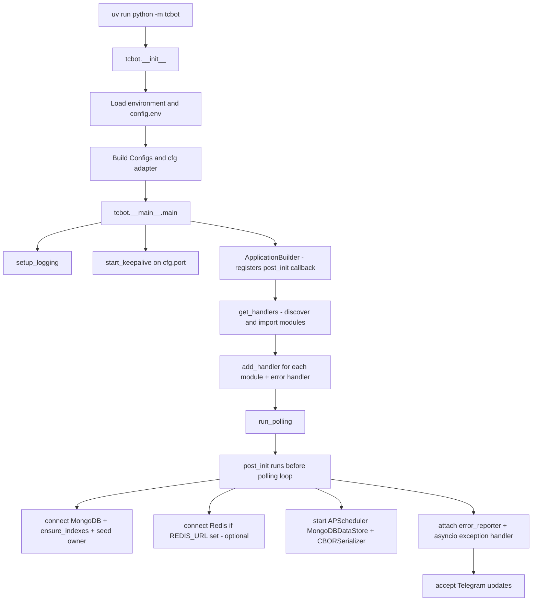
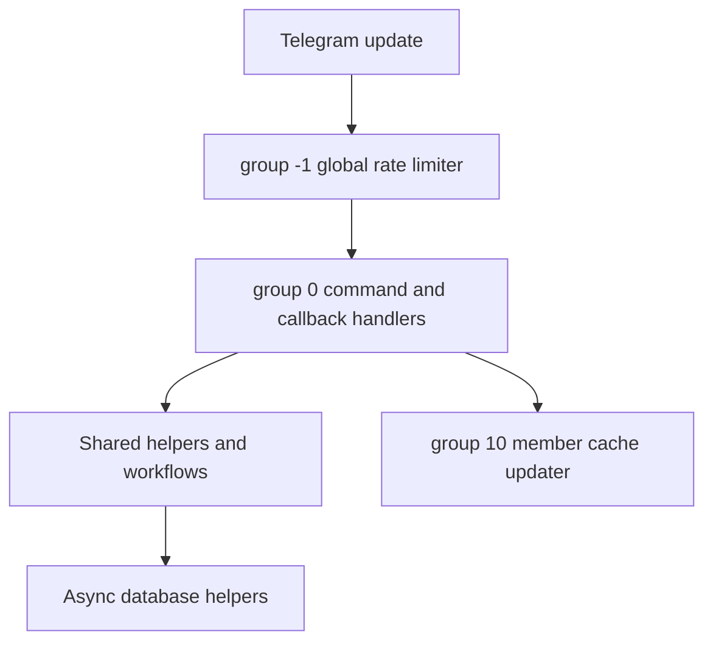

# TCF Bot: Planning and Project State

This document tracks how TCF Bot currently runs, what is considered stable, and what should be improved next. Keep it practical: record current behavior, known risks, and validation commands rather than aspirational placeholders.

For user-facing overview, see [`README.md`](README.md). For contributor rules and style, see [`AGENTS.md`](AGENTS.md). For deployment notes, see [`replit.md`](replit.md). For developer documentation, see [`docs/README.md`](docs/README.md). For CI/CD automation details, see [`docs/workflows-guide.md`](docs/workflows-guide.md). For changelog of recent changes, see [`CHANGELOG.md`](CHANGELOG.md).

## Current Project State

| Area | Status |
|---|---|
| Runtime | Long-polling Telegram bot started with `uv run python -m tcbot`. |
| Python target | Python 3.12 project target (`pyproject.toml` requires `>=3.12`). |
| Bot framework | `python-telegram-bot` (plain, no `[job-queue]` extra), tracking the latest compatible release. |
| Database | MongoDB through Motor, connected during PTB `post_init`. |
| Cache | In-process `TTLCache` L1 + optional Redis L2 via `TwoLevelCache`. `hiredis` C extension required when Redis is active. Configured via `REDIS_URL`. |
| Scheduler | APScheduler **4.0.0a6** (`AsyncScheduler` + `MongoDBDataStore` + `CBORSerializer`); persistent moderation jobs survive restarts. The pinned alpha carries CVE-2026-31072 (no upstream patch); accepted and tracked risk, see Core Subsystem Design / Persistent Scheduler. |
| Health check | Flask app in `tcbot/alive.py`. `GET /` returns `OK`. `GET /health` returns JSON `{status, mongodb, redis, scheduler, ts}` with HTTP 200 (all ok) or HTTP 503 (degraded). Port from `PORT` env var (default `5000`). |
| Dependency management | `uv` with `uv.lock`; CI installs with frozen lockfile by default. |
| Formatting/linting | Ruff, configured in `pyproject.toml`. |
| Deployment notes | Local `config.env`, Docker Compose, and Replit/hosted environment variables are documented. |

## Runtime Flow

### Startup Sequence



### `post_init` Sequence

`_post_init(app)` runs after the PTB application is built and before polling starts:

1. Required env vars are parsed before startup; `BOT_TOKEN`, `MONGODB_URI`, and `OWNER_ID` must be present.
2. Enabled modules are imported during handler collection; import failures stop startup instead of silently skipping handlers.
3. `connect()` creates the Motor client and verifies MongoDB with `ping`.
4. `ensure_indexes()` creates required MongoDB indexes in parallel.
5. `ensure_initial_owner(cfg.initial_owner_id)` seeds the first owner when needed.
6. `redis_client.connect(cfg.redis_url)` connects to Redis when `REDIS_URL` is set. On failure, logs a warning and continues with in-memory cache only (Redis is optional).
7. `sched_mod.start()` starts APScheduler 4.x with `MongoDBDataStore` and `CBORSerializer`. Blocks until the scheduler background task is ready. Registers recurring warn-expiry and DB-cleanup jobs.
8. `error_reporter.attach(...)` stores the bot and error destination for async reports.
9. The asyncio loop exception handler is registered.

### Request Processing Pipeline



## Architecture Summary

### Main Package Boundaries

| Path | Responsibility |
|---|---|
| `tcbot/__init__.py` | Environment parsing, `Configs`, and the global `cfg` adapter. |
| `tcbot/__main__.py` | Application startup, handler registration, MongoDB startup, polling, error handling. |
| `tcbot/alive.py` | Flask health-check server. |
| `tcbot/modules/` | Command modules and Telegram handlers. |
| `tcbot/modules/helper/` | Shared formatter, keyboard, decorator, target extraction, and role guard helpers. |
| `tcbot/modules/helper/workflows/` | ConversationHandler flows, all named `*_flow.py`. |
| `tcbot/database/` | Async MongoDB access helpers and document/type definitions. |
| `tcbot/utils/` | Logging, bounded fan-out dispatch, prefix filters, datetime helpers, error reporting. |

### Module Discovery

`tcbot/modules/__init__.py` discovers top-level `*.py` files in `tcbot/modules/`, excludes `__init__.py`, applies the optional `MODULES_LOAD` allowlist and `MODULES_NO_LOAD` denylist, imports active modules, and collects their `__handlers__` lists. If any enabled module fails to import, startup now exits with the failing module names so a partially registered bot is not deployed.

### Database Layer

All database operations are async and should go through helper modules in `tcbot/database/`.

Current collection/domain owners include:

| Collection/domain | Helper |
|---|---|
| Federation bans | `bans_db.py` |
| Connected and pending groups | `groups_db.py` |
| Member profile cache | `users_cache.py` |
| Owners/admins + dev/tester roles | `users_roles.py` |
| Warnings | `warns_db.py` |
| Kicks | `kicks_db.py` |
| Mutes | `mutes_db.py` |
| Promotion requests | `queues_db.py` |
| MongoDB client/indexes | `mongos.py` |
| In-memory + Redis caches | `cache.py` |
| Redis client and connection pool | `redis_client.py` |
| Persistent moderation scheduler | `scheduler.py` |
| Typed document shapes | `documents.py` |
| Domain primitive types | `types.py` |

### Error Handling

| Layer | Location | Purpose |
|---|---|---|
| PTB error handler | `app.add_error_handler(_error_handler)` | Reports unhandled handler exceptions. |
| Asyncio exception handler | `loop.set_exception_handler(...)` | Reports background task failures. |
| Logging integration | `tcbot/utils/error_reporter.py` | Sends formatted error details to the configured destination. |

## Core Subsystem Design

This section records how the three load-bearing subsystems (MongoDB access, the
caching layer, and the persistent scheduler) are built today, the tuning knobs
that exist, and the recommended direction for each. It is the canonical design
reference for these subsystems; keep it in sync when the code changes.

### Data Store: MongoDB via Motor

**Current design** (`tcbot/database/mongos.py`):

- One shared `AsyncIOMotorClient` is created in `connect()` and stored as the
  module global `_db`. All access goes through `db()` and `col(name)`; no module
  opens its own client. `connect()` verifies the link with a `ping` before
  startup proceeds.
- Connection pool and timeout parameters are centralised as module constants:

  | Parameter | Value | Purpose |
  |---|---|---|
  | `serverSelectionTimeoutMS` | 10000 | Fail fast when no node is reachable. |
  | `connectTimeoutMS` | 10000 | Cap the initial TCP/TLS handshake. |
  | `socketTimeoutMS` | 45000 | Cap a single operation; long enough for slow aggregations. |
  | `maxPoolSize` | 20 | Upper bound on concurrent sockets for one bot instance. |
  | `minPoolSize` | 2 | Keep warm sockets ready. |
  | `maxIdleTimeMS` | 60000 | Recycle idle sockets. |
  | `heartbeatFrequencyMS` | 30000 | Topology monitoring cadence. |
  | `compressors` | `["zlib"]` | Wire compression. |
  | `retryWrites` / `retryReads` | True | Transparent one-time retry on transient errors. |

- `ensure_indexes()` creates roughly two dozen indexes in parallel with
  `asyncio.gather(..., return_exceptions=True)`. Individual index failures are
  logged and counted (`X/Y succeeded`) rather than silently dropped. Several
  indexes are deliberately covered: for example the
  `(user_id, first_name, username)` index on `member_cache` serves the batch
  `$in` projections in `users_cache` without touching documents.
- `_patch_dns_if_needed()` installs a fallback resolver (8.8.8.8 / 8.8.4.4) when
  `/etc/resolv.conf` is absent, so `mongodb+srv://` works on Termux/Android and
  similar restricted hosts.
- `make_short_id()` issues URL-safe, cryptographically random record IDs.

**Recommendations:**

- Keep every new collection's indexes in `ensure_indexes()` and match query
  shapes to an existing index; consult the `mongodb-query-optimizer` guidance
  before adding a query.
- Operational hardening is the main lever for the scheduler CVE below: use a
  least-privilege MongoDB user scoped to this database only, restrict network
  access with an Atlas IP allowlist (or a firewall for self-hosted), and never
  let `MONGODB_URI` reach git, logs, or screenshots.
- Consider replacing the weekly `member_cache` cleanup job with a MongoDB TTL
  index on `last_updated` (`expireAfterSeconds` = 90 days). The server would then
  expire stale rows on its own, removing one persistent APScheduler job and the
  weekly `delete_many` sweep. Optional simplification, recorded as a future idea.

### Caching: L1 in-process / L2 Redis / L3 MongoDB

**Current design** (`tcbot/database/cache.py`):

The read hot-path is a three-tier lookup implemented by
`TwoLevelCache.get_or_fetch(key, fetch)`:

| Tier | Backing | Cost | Behaviour |
|---|---|---|---|
| L1 | in-process `cachetools.TTLCache` | sub-microsecond, no I/O | LRU + TTL eviction, bounded by `maxsize`. |
| L2 | Redis (optional) | one round-trip | Shared across runs/processes; JSON-encoded values. |
| L3 | the `fetch()` coroutine | a MongoDB query | Source of truth; the result back-fills L1 (and L2). |

- Writes and invalidations (`put` / `invalidate`) update L1 synchronously and
  fire-and-forget the matching Redis write/delete. Background Redis tasks are
  held in a strong-reference set so they are not garbage-collected mid-flight.
- Redis is fully optional. When `REDIS_URL` is unset or Redis is unreachable,
  all Redis operations are skipped and the cache behaves exactly like a pure L1
  `TTLCache`. Redis errors are logged at debug level and never propagate.
- The shared singletons and their tuned TTLs:

  | Cache | L1 TTL | L2 TTL | maxsize | Invalidated by |
  |---|---|---|---|---|
  | `effective_role_cache` | 60s | 90s | 2048 | every role write |
  | `connected_cache` | 120s | 180s | 512 | group add/deactivate |
  | `active_groups_cache` | 30s | 45s | 4 | group add/deactivate |
  | `owner_id_cache` | 300s | 360s | 4 | set_owner / initial seed |
  | `user_mention_cache` | 300s | 600s | 4096 | upsert_user |

  L2 TTLs are deliberately a little longer than L1 so Redis can still serve a
  warm value just after an L1 entry expires.

**Recommendations:**

- L1 invalidation is per-process. The bot runs as a single long-polling instance
  (the `tcf-bot-runner` concurrency group guarantees exactly one poller), so this
  is correct today. If the bot is ever scaled past one instance, an L1 entry
  invalidated on instance A stays warm on instance B until its `memory_ttl`
  expires; design a Redis pub/sub invalidation channel before scaling out.
- `get_or_fetch` takes no per-key lock, so several concurrent misses on the same
  key each run `fetch()` (a cache stampede). On a single event loop with the
  current low contention this is acceptable; revisit only if profiling shows a
  hot key.
- Cached value types must stay JSON-round-trippable because Redis stores JSON.
  Tuples return as lists; keep the existing list-typed annotations and the
  caller-side casts.

### Persistent Scheduler: APScheduler 4.x

**Current design** (`tcbot/database/scheduler.py`):

- Uses `AsyncScheduler` with `MongoDBDataStore` + `CBORSerializer`, so schedules
  and job state live in MongoDB and survive bot restarts.
- The whole `async with AsyncScheduler()` lifecycle runs inside one dedicated
  asyncio task (`tcbot.scheduler`), because AnyIO requires the cancel scope to be
  entered and exited in the same task. `start()` blocks on a ready `Event`;
  `stop()` sets a stop `Event` and waits up to 10s for a clean exit.
- Jobs are module-level callables so their import paths can be serialised and
  re-bound after a restart. `ConflictPolicy.replace` plus stable IDs keep
  recurring schedules from duplicating across restarts.

  | Job | Trigger | Notes |
  |---|---|---|
  | `_expire_old_warns` | every 24h | Only when `WARN_EXPIRY_DAYS > 0`; otherwise the schedule is removed. |
  | `_execute_scheduled_unban` | one-off `DateTrigger` | Flips the ban record `is_active = False` at expiry. |

  `member_cache` cleanup is now handled by a MongoDB TTL index on `last_updated`
  (`expireAfterSeconds=7776000`, 90 days) created in `mongos.ensure_indexes()`.
  The former `_cleanup_old_records` weekly APScheduler job has been retired;
  it remains as a no-op migration shim so any persisted schedule can be deserialised,
  and is actively removed from the APScheduler datastore on first startup.

- Note on scheduled unban: the real Telegram unban is enforced natively by the
  timed `restrict_chat_member` / `ban_chat_member` `until_date` set at ban time.
  The scheduled job only deactivates the DB record for history hygiene; it is not
  what actually frees the user.

**Security: CVE-2026-31072 (GHSA-9cfw-f3f9-7mm7), accepted and tracked risk**

- Advisory: APScheduler's `JSONSerializer` and `CBORSerializer` are vulnerable to
  RCE via insecure deserialization. `unmarshal_object` can be coerced into
  instantiating an arbitrary class and calling `__setstate__` on it when it
  deserialises a crafted JSON/CBOR payload. CVSS 9.8.
- Affected range: `>= 4.0.0a1, <= 4.0.0a6`. The project is pinned to `4.0.0a6`
  in `uv.lock`. There is no patched release: every published 4.x is a vulnerable
  alpha, and the 3.x line is a different API with no `AsyncScheduler` /
  `MongoDBDataStore`. `first_patched_version` is null.
- Reachability in this deployment is low. The serializer only ever deserialises
  schedule documents that the bot itself wrote into its own private MongoDB data
  store, and those documents reference fixed module-level callables with
  primitive kwargs (`ban_id`, `user_id`, `warn_expiry_days`). No Telegram-facing
  code path lets a user write arbitrary bytes into the `apscheduler` collections.
  Exploitation therefore requires an attacker who already holds write access to
  the bot's MongoDB (a leaked `MONGODB_URI`, an exposed or unauthenticated
  instance, or a shared cluster). Under a private, authenticated, IP-allowlisted
  MongoDB this is defense-in-depth, not a remotely triggerable hole.
- Decision: accept the risk for now. There is nothing to upgrade to, and a
  downgrade would remove the persistence the scheduler depends on.
- Mitigations (operational, see the MongoDB recommendations above): private,
  least-privilege, IP-allowlisted MongoDB; secret hygiene for `MONGODB_URI`;
  rotate the URI immediately on any suspected leak.
- Watch: re-check the alert and upgrade as soon as APScheduler ships a fixed
  release. Quick check:

  ```bash
  gh api repos/D1ZZY4/tcbot/dependabot/alerts/2 --jq '.security_vulnerability.first_patched_version'
  ```

- Optional future hardening: the only one-off job is the DB-side unban, which is
  redundant with Telegram's native timed unban. Recomputing `is_active` from the
  stored expiry on read (or a periodic sweep), plus a MongoDB TTL index for the
  member_cache cleanup, would let both the one-off and weekly scheduler jobs
  retire and shrink the deserialisation surface. Recorded as a direction, not a
  mandate.

## Role System Summary

Role hierarchy:

1. Founder
2. Admin
3. Developer
4. Tester

Important rules:

- Use canonical role helpers from `tcbot.database.users_roles` and `tcbot.modules.helper.decorators.resolve_and_check`.
- Do not duplicate manual role-check chains in handlers.
- Ban and kick flows must auto-demote targets that currently hold a federation role.
- Promotion and demotion workflows should preserve auditability through logs and queue records.

## Conversation Flow Summary

Conversation flows live in `tcbot/modules/helper/workflows/` and use `ConversationHandler` where needed.

Primary flows:

| Flow | Purpose |
|---|---|
| `ban_flow.py` | Ban proof collection, album buffering, and federation ban execution. |
| `appeal_flow.py` | Private appeal submission and staff decision handling. |
| `connected_flow.py` | Group join approval and connection checks. |
| `reason_flow.py` | Shared reason/proof steps for moderation actions. |
| `proof_flow.py` | Proof upload helpers and prompts. |
| `kicking_flow.py`, `muting_flow.py`, `warning_flow.py`, `unban_flow.py` | Action-specific moderation workflows. |
| `promote_flow.py` | Role promotion execution helpers. |
| `stats_flow.py` | Unified `Stats` class covering overview, staff roster, users, chats, bans, and search. |

For detailed behavior, see `docs/workflows/workflows.md`.

## Development and Validation Commands

Install dependencies:

```bash
uv sync
```

Run the bot:

```bash
uv run python -m tcbot
```

Format and lint:

```bash
uv run ruff format .
uv run ruff check --fix .
```

Run local bot + MongoDB:

```bash
docker-compose up --build
```

## Improvement Strategy

Priorities, in order:

1. **Correctness and safety:** preserve federation moderation behavior, secrets safety, and database compatibility.
2. **Clear module boundaries:** handlers call helpers; database writes stay in `tcbot/database/`; shared flows stay in `workflows/`.
3. **Operational visibility:** errors and important moderation events should be logged to configured destinations.
4. **Performance:** use bounded fan-out for group-wide operations and avoid sequential I/O where safe.

## Current Priority Backlog

> The backlog below was re-verified line by line against the source tree on
> 2026-06-01. Each prior entry was checked against the actual code rather than
> trusted from a previous review pass. The disposition of every prior claim is
> recorded under "Backlog Review" so the audit trail stays clear.

## Code Review Findings

Use this section to keep code review findings in one consistent place. It applies
to anyone reviewing this codebase. After a review, add each finding as a row in the
table for its priority tier, where P1 is the highest and P5 is the lowest.
Confirmed and prioritized items move up into the
[Current Priority Backlog](#current-priority-backlog) above. Cleared items are set
to `Dismissed` with the reason written in the Evidence column. The italic rows are
placeholders that show the expected format, so replace them and do not leave them
in.

### How to record a finding

- One finding per row, specific and self-contained.
- **Location** must be a real `file.py:line` you actually opened, never a guess.
- **Evidence** must quote the relevant code or describe the behavior you observed
  that proves the finding is real. A finding with no evidence counts as unverified.
- **Verify first.** Open the cited file and confirm the issue is not already
  handled before listing it. In the 2026-06-01 review, several findings flagged as
  critical turned out to be already implemented in the code.
- **Do not overstate severity.** Already-validated input, idiomatic framework
  usage, and marginal micro-optimizations are not P1 or P2.
- **Status** uses the values below. Use `Resolved` only when a fix has landed and
  validation passes. Use `Dismissed` (with a reason) when verification shows the finding
  is not a real issue.

**Status values:**

- `Open`: logged, not started.
- `Verified`: confirmed against the code.
- `In Progress`: being worked on.
- `Resolved`: fixed and validated.
- `Dismissed`: checked and not a real issue, with the reason in Evidence.

**Priority tiers:**

- **P1 (Critical):** security holes, data loss, crashes, or broken core moderation; fix before the next release.
- **P2 (High):** incorrect behavior in critical logic such as auth and federation actions.
- **P3 (Medium):** maintainability and non-hot-path performance.
- **P4 (Low):** documentation gaps, minor cleanups, and naming.
- **P5 (Optional / Future):** speculative or nice-to-have ideas; gather evidence before promoting them.

### P1 (Critical)

| # | Finding | Location (`file.py:line`) | Evidence (code quote / observed behavior) | Proposed Fix | Status |
|--|--|--|--|--|--|
| 1 | `_paginate`, `_nav_row`, `_date` undefined at runtime in `stats_flow.py` | `tcbot/modules/helper/workflows/stats_flow.py:1` | All twelve call sites used private names (`_paginate`, `_nav_row`, `_date`) that were never defined in the module; calling any Stats drill-down raised `NameError` immediately | Replace all call sites with `paginate(..., _PAGE_SIZE)`, `nav_row(...)`, `date_or_unknown(...)` imported from `tcbot.utils.pagination` | `Resolved` |
| 2 | `_paginate`, `_nav_row`, `_date` undefined at runtime in `check_flow.py` | `tcbot/modules/helper/workflows/check_flow.py:1` | Same root cause as stats_flow: twelve call sites used stale private names leftover from before pagination was extracted to utils; any Check drill-down raised `NameError` | Add `from tcbot.utils.pagination import date_or_unknown, nav_row, paginate` and replace all twelve call sites | `Resolved` |
| 3 | `_kb` undefined at runtime in `tcbot/modules/groups.py` | `tcbot/modules/groups.py:85,103` | `_kb(False)` and `_kb(detailed)` called but never defined; `/tcgroups` and Detail/Simple toggle both raised `NameError` immediately | Imported `tcgroups_kb` from `tcbot.modules.helper.keyboards` and replaced both `_kb(...)` call sites | `Resolved` |
| 4 | APScheduler 4.0.0a6 RCE via insecure deserialization (CVE-2026-31072 / GHSA-9cfw-f3f9-7mm7) | `tcbot/database/scheduler.py:35`, `uv.lock` (apscheduler 4.0.0a6) | CVSS 9.8. `unmarshal_object` instantiates an arbitrary class and calls `__setstate__` on a crafted CBOR/JSON payload. No patched release exists (all published 4.x are affected alphas; `first_patched` is null). Reachability is gated by MongoDB write access: only the bot writes fixed module-level callables with primitive kwargs, so it is not triggerable from Telegram. Full analysis under Core Subsystem Design / Persistent Scheduler. | Upgrade as soon as upstream ships a fix; until then mitigate operationally (private, least-privilege, IP-allowlisted MongoDB; `MONGODB_URI` secret hygiene). Accepted/tracked risk. | `Open` |
| 5 | Warning auto-ban is group-local only, not federation-wide | `tcbot/modules/helper/workflows/warning_flow.py:95` | When `count >= WARN_LIMIT`, the code calls `ctx.bot.ban_chat_member(chat_id, target_id)` — only the originating group. No `db.bans_db.add_ban(...)` is called and no `fan_out` propagates the ban to other connected groups. A user can accumulate 2 warns in Group A, 2 warns in Group B, 2 warns in Group C and never trigger a federation ban anywhere. This is a meaningful enforcement gap across a 50+ group federation. | Rewrote the `count >= WARN_LIMIT` branch: now fetches active groups + checks existing ban + sends log in one parallel gather; creates a DB ban record via `bans_db.create_ban()`; fans out `ban_chat_member` to all active and primary groups via `fan_out()`; clears warns and notifies in originating chat. Existing federation bans are detected and the DB create is skipped to avoid duplicates. | `Resolved` |
| 6 | No `my_chat_member` handler to auto-disconnect when bot is kicked | `tcbot/modules/*.py` (no handler present) | There is no `ChatMemberHandler` or equivalent watching for the bot being removed from a group. If a group owner kicks the bot without running `/tcdisconnect`, the group stays `is_active=True` in the DB indefinitely. Every subsequent federation ban then attempts `ban_chat_member` against that dead group, producing silent failures across the entire `fan_out` for the lifetime of the bot. On a 50+ group federation this compounds: stale groups accumulate and inflate every moderation action's error budget. | Added `on_my_chat_member` handler in `tcbot/modules/greeting.py` with `ChatMemberHandler`. Detects `status in (left, kicked)`, skips primary groups (not in `federated_groups`), calls `db.groups_db.deactivate_group(chat_id)` on removal. Registered as the first entry in `__handlers__`. | `Resolved` |

### P2 (High)

| # | Finding | Location (`file.py:line`) | Evidence (code quote / observed behavior) | Proposed Fix | Status |
|--|--|--|--|--|--|
| 1 | Layer 3 asyncio exception handler scheduled a fire-and-forget report task without a strong reference | `tcbot/__main__.py:150` | `lp.create_task(error_reporter.report_exc(...))` discarded the returned task; Python may garbage collect the task before it runs, dropping the error report from the last-resort handler | Store each task in a module-level `set` and register a `discard` done-callback (mirrors `logger._tg_tasks`). RUF006 missed it because the task is created through the `lp` parameter, which ruff cannot statically identify as an event loop | `Resolved` |
| 2 | Appeal reject permanently locks out re-appeal by never clearing `review_message_id` | `tcbot/modules/helper/workflows/appeal_flow.py:285` | In `on_decision()`, the `reject` branch edits the review card and updates the appeal log but never calls `db.bans_db.clear_review(ban_id)` or any equivalent. `_start()` gates entry with `if ban.get("review_message_id"): return _ERR_PENDING_REVIEW`. Since the field is never cleared after rejection, the banned user is permanently blocked from submitting a second appeal with no recourse and no indication to staff. | Added `clear_review(ban_id)` to `bans_db.py` (sets `review_message_id=None, review_timestamp=None`). Called in the reject gather alongside the existing notify/edit tasks so the ban is immediately re-appealable after rejection. | `Resolved` |
| 3 | Rejector identity not recorded in ban document on appeal reject | `tcbot/modules/helper/workflows/appeal_flow.py:285` | The `reject` branch in `on_decision()` edits the review card with `mention(admin.id, admin.first_name)` and updates the log, but the `ban` MongoDB document is never updated with `rejector_id`, `rejected_by_name`, or `rejected_at`. If the log message is deleted or the channel is unavailable, there is no recoverable audit record of who rejected the appeal and when. | Added `set_rejected_by(ban_id, admin_id, admin_name)` to `bans_db.py` (sets `rejected_by_id`, `rejected_by_name`, `rejected_at` on the ban document). Called in the reject gather in parallel with the notify/edit calls. Added corresponding fields to `BanDoc` TypedDict in `documents.py`. | `Resolved` |
| 4 | Duplicate `my_chat_member` handler: `greeting.on_my_chat_member` and `connected_flow.on_bot_added` are both `ChatMemberHandler(MY_CHAT_MEMBER)` in the same handler group, so one permanently shadows the other (which one is nondeterministic across hosts) | `tcbot/modules/connecting.py:203`, `tcbot/modules/greeting.py:360`, `tcbot/modules/__init__.py:26`, `tcbot/__main__.py:345` | Both modules register a `ChatMemberHandler` for `MY_CHAT_MEMBER` (greeting uses the default `chat_member_types`, which already is `MY_CHAT_MEMBER`); both are added to default group 0 by `for handler in get_handlers(): app.add_handler(handler)`. PTB runs only the first matching handler per group, so the second never fires. Module order comes from `Path.glob("*.py")` (unsorted, filesystem-dependent), so which handler wins varies by host. If `connecting` wins, the bot-demotion mod-log warning (Bug #349) never runs — staff are never alerted when the bot loses admin and silently stops enforcing bans in a group. If `greeting` wins, `on_bot_added`'s MEMBER/ADMINISTRATOR branch never runs — adding the bot never shows the connect prompt and pending→admin completion never fires, breaking onboarding entirely. | Merged demotion-warning branch into `connected_flow.on_bot_added` (MEMBER/RESTRICTED + old_status==ADMINISTRATOR guard, mod-channel warning, primary groups excluded). Removed `ChatMemberHandler(on_my_chat_member)` from `greeting.__handlers__` and deleted the now-dead `on_my_chat_member` function. Removed `ChatMemberHandler` import from `greeting.py`. Single MY_CHAT_MEMBER handler remains. | `Resolved` |

### P3 (Medium)

| # | Finding | Location (`file.py:line`) | Evidence (code quote / observed behavior) | Proposed Fix | Status |
|--|--|--|--|--|--|
| 1 | `uv run ruff` documented throughout `.agents/` but silently failed on Replit | `.agents/STYLE-CODE.md:17`, `.agents/RUFF.md:53` | `uv run ruff format .` exited with code 1 because ruff was in `[project.optional-dependencies.dev]`, which `uv run` does not install by default | Moved ruff to `[dependency-groups] dev = ["ruff"]` in `pyproject.toml`; `uv sync` now installs it automatically; `uv run ruff check .` and `uv run ruff format .` both pass clean | `Resolved` |
| 2 | Per-user rate limiters are in-process and reset on every bot restart | `tcbot/modules/helper/decorators.py:26` | `_cmd_limiter` and `_cbq_limiter` are module-level `_RateLimiter` instances backed by `dict[int, deque[float]]` — pure in-memory, no Redis persistence. `run-bot.yml` restarts the bot every 4 hours (`cron: "0 */4 * * *"`). Every restart wipes all sliding-window state, giving every user a full clean quota immediately after each restart. A determined user aware of the schedule can spike commands right after a restart with no throttle. | Replaced `_cmd_limiter` and `_cbq_limiter` with `_AsyncRateLimiter` instances. When Redis is available, uses a sorted-set sliding window per user (ZADD/ZREMRANGEBYSCORE/ZCARD via atomic Lua script) so quota survives bot restarts. Falls back transparently to the in-process `_RateLimiter` when Redis is absent or errors. `ratelimiter()` factory also upgraded to `_AsyncRateLimiter` with a per-function key prefix. | `Resolved` |
| 3 | Cross-group warn count is invisible to staff and to the auto-ban threshold | `tcbot/database/warns_db.py`, `tcbot/modules/helper/workflows/warning_flow.py:60` | `add_warn(target_id, reason_text, admin_id, chat_id)` keys warnings by `(user_id, chat_id)`. `warn_count` and `get_warns` both filter on `chat_id`. A user can accumulate 2 warns in each of 25 groups without any single group seeing a count above 1 — the auto-ban never fires and no staff member has visibility into the aggregate unless they manually query every group. On a 50+ group federation this is a systematic blind spot. | Added `federation_warn_count(user_id)` to `warns_db.py` (sums `count` from all `warn_counts` documents regardless of `chat_id`). Surfaced in `/tcheck` profile as "N active across M group(s) (K total historical)". The Warnings drill-down button now shows the active count. Both reads are included in the 10-way parallel profile gather. | `Resolved` |
| 4 | Help text bypasses `formatter.*` helpers — raw HTML hardcoded in 15 modules | `tcbot/modules/admins.py`, `tcbot/modules/banning.py`, and 13 other help-bearing modules | Grep finds 127 bare `<code>`/`</code>` tags and 82 bare `<b>`/`</b>` tags embedded as string literals in `__help_text__` and `__help_sections__` content across every help-bearing module. `formatter.py` already provides `bold()`, `code()`, `esc()`, `italic()` for exactly this purpose and is imported in `help.py` itself. Any future change to HTML structure (e.g. switching parse mode, adding wrapper classes) must be applied to 200+ string sites manually instead of one helper. `esc()` is also not called on dynamic values in several strings. | Replace all bare `<b>`, `<code>`, `<i>` tags inside `__help_text__` and `__help_sections__` content with the corresponding `formatter.*` calls. Run `uv run ruff format .` after each module. One module per commit keeps diffs reviewable. | `Done` |
| 5 | `_builder_help()` reads help attributes via silent `getattr` fallbacks — no enforced interface | `tcbot/modules/help.py:46` | `getattr(mod, "__help_sections__", [])` silently returns `[]` if a module misspells the attribute as `__help_section__`; the bot serves help with no sections and no error or log warning. `HELP_CONTENT` values are bare `tuple[str, str, list]` — callers index by position with no label, no IDE completion, and no static check. | Define a `HelpEntry` TypedDict (fields: `name`, `overview`, `sections: list[HelpSection]`) in `tcbot/modules/helper/replies.py` or a new `help_types.py`. Each module declares one `__help__: HelpEntry` instead of three separate attributes. `_builder_help()` reads `__help__` and catches `KeyError` at import time. Keep a backward-compat `getattr` shim during migration, then remove it once all modules are updated. | `Done` |
| 6 | Cross-group warn accumulation never triggers a federation ban — the enforcement half of P3 #3 is still open (only visibility was added) | `tcbot/modules/helper/workflows/warning_flow.py:66`, `tcbot/modules/helper/workflows/warning_flow.py:79`, `tcbot/database/warns_db.py:92`, `tcbot/database/warns_db.py:216` | `execute_warn` triggers the federation auto-ban on `if count == WARN_LIMIT`, where `count = add_warn(...)` returns the **per-chat** counter (`warn_counts` keyed by `(user_id, chat_id)`). A user who collects 2 warns in each of 25 groups (50 federation-wide) never reaches 3 in any single group and is never auto-banned. P3 #3 added `federation_warn_count()` and surfaced it in `/tcheck` for staff visibility, but the auto-ban trigger still ignores it. On a 50+ group federation this is a deliberate-looking evasion path: spread violations thin and never cross any local threshold. | Added `FED_WARN_LIMIT` env var (`cfg.fed_warn_limit`, default 0 = disabled). Restructured `execute_warn` to determine an `auto_ban_trigger` ("per_group" / "fed_global" / None): per-group uses `count == WARN_LIMIT` (existing atomicity guarantee); fed-global uses `federation_warn_count(target_id) >= fed_limit` (separate DB read, uses `>=` to avoid miss). Both paths share a single auto-ban code block (demote, fan_out, create_ban, reply). Reply text distinguishes the trigger. `already_banned` guard prevents double bans from concurrent triggers. Default 0 preserves backward compatibility. | `Resolved` |
| 7 | No global Telegram API pacing; `fan_out` bounds concurrency but not rate, and connect-time mass-ban replays the entire active-ban list in one burst | `tcbot/utils/dispatch.py:19`, `tcbot/__main__.py:317`, `tcbot/modules/helper/workflows/connected_flow.py:200` | The Application is built without PTB's `AIORateLimiter` (plain PTB, no `[rate-limiter]` extra), so there is no global ~30 req/s pacing and no automatic 429/FloodWait retry. `fan_out` caps at 10 concurrent (`_MAX_CONCURRENT`) but does not pace, and swallows per-call failures via `return_exceptions`. A single ban fans `ban_chat_member` to every connected group; `complete_join` fans `ban_chat_member` for **every** active federation ban (`active_ban_user_ids()`) to a newly connected group. At the stated scale (50+ groups, thousands of active bans) this bursts past Telegram's flood threshold and a subset of calls silently fail (logged only as "X/Y failed"). Ban-on-join partially self-heals dropped bans when the user is next seen joining, but connect-time gaps and timed actions do not. | Added `python-telegram-bot[rate-limiter]` extra to `pyproject.toml` (`aiolimiter==1.2.1` installed). Imported `AIORateLimiter` from `telegram.ext` in `__main__.py`. Added `.rate_limiter(AIORateLimiter())` to `ApplicationBuilder` chain, providing automatic ~30 req/s global pacing and RetryAfter/429 backoff across all outgoing API calls. Works alongside existing `fan_out` semaphore (max 10 concurrent) and per-user decorator limiter (handler group -1). | `Resolved` |

### P4 (Low)

| # | Finding | Location (`file.py:line`) | Evidence (code quote / observed behavior) | Proposed Fix | Status |
|--|--|--|--|--|--|
| 1 | `performance.yml` benchmark imported non-existent module `users_db` | `.github/workflows/performance.yml:49,68` | `from tcbot.database import users_db`: module was split and removed; correct module is `users_cache`; calls to `users_db.get_first_names_batch` and `users_db.get_mention_data_batch` would fail at import time | Replace both imports with `users_cache`; rename all call sites | `Resolved` |
| 2 | `performance.yml` Compare-baseline script used `os.environ` without `import os` | `.github/workflows/performance.yml:207` | Python inline script imported only `sys`; `os.environ["GITHUB_OUTPUT"]` on regression would raise `NameError: os is not defined` | Add `import os` at top of script | `Resolved` |
| 3 | `auto-fix.yml` schedule cron `0 4 * * 1` annotated as "02:00 UTC" | `.github/workflows/auto-fix.yml:10` | Comment read `# Weekly Monday 02:00 UTC` but cron fires at 04:00 UTC; same wrong time propagated to `README.md` and two places in `docs/workflows-guide.md` | Fix comment in YAML; update four documentation references | `Resolved` |
| 4 | `docs/workflows-guide.md` and `README.md` described run-bot.yml as "Manual deployment" | `docs/workflows-guide.md:251`, `README.md:255` | `run-bot.yml` has `schedule: cron: "0 */4 * * *"`: it runs every 4 hours automatically; "Manual dispatch only" was wrong | Update overview line, section body, and README entry | `Resolved` |
| 5 | `config.env.example` claimed `PORT=auto` lets system pick a free port | `config.env.example:31` | `parse_port()` returns 5000 for "auto"; no OS port discovery exists | Rewrite PORT comment to describe actual fallback behavior | `Resolved` |
| 6 | `config.env.example` claimed `PROOFS/LOGS/LOGS_ERRORS/APPEALS=auto` creates forum threads | `config.env.example:57,65,73,81` | No forum-thread auto-creation code exists anywhere in `tcbot/`; these comments described non-existent functionality | Remove the four "auto" comment blocks; replace with accurate format guidance | `Resolved` |
| 7 | 12 public functions had no docstrings | multiple files | `bold()`, `italic()`, `code()`, `link()`, `esc()`, `on_groups_details()`, `on_groups_simple()`, `on_help_menu()`, `on_helpc_main()`, `appeal_deep_link()`, `on_menu_groups()`, `on_menu_groups_simple()` had empty docstring slots | Add one-line docstrings to each | `Resolved` |
| 8 | Appeal message text has no length validation | `tcbot/modules/helper/workflows/appeal_flow.py:233` | `_on_message` accepts any text starting with `#appeal` and forwards it verbatim to the appeals channel without checking `len(text)`. Telegram messages can be up to 4096 characters. Oversized appeals can produce unwieldy review cards in the main group and allow low-effort flooding of the appeals channel by a single banned user within one session. | Added a 2000-character length gate in `_on_message` immediately after the `starts_with_appeal_tag` check. If exceeded, replies with "Your appeal message is too long (max 2000 characters). Please shorten it and try again." and returns `WAITING_APPEAL` so the user can revise and re-submit without restarting the conversation. | `Resolved` |
| 9 | `__module_name__` values follow no consistent naming convention | `tcbot/modules/admins.py:1`, `tcbot/modules/checking.py:1`, `tcbot/modules/maintenance.py:1`, and 12 others | Current names mix gerunds (`"Checking"`), bare verbs (`"Ban"`, `"Connect"`, `"Kick"`, `"Mute"`, `"Unban"`, `"Disconnect"`), plural nouns (`"Admins"`, `"Warnings"`, `"Groups"`), and abbreviations (`"Stats"`). Worst case: `maintenance.py` → `"Cleanup"` — the display name has no relation to the filename, the module slug, or the commands it exposes (`tcmaintenance` / `tcm`). These names render side-by-side in the help index menu. | Standardise to action nouns (title-cased, no trailing `s` unless inherently plural). Key corrections: `"Checking"` → `"Check"`, `"Cleanup"` → `"Maintenance"`, `"Admins"` → `"Admin"`. All other names are already acceptable under that convention. `_MODULE_NAME_MAP` in `help.py` is derived at import time from `__module_name__`, so no change needed there. | `Done` |
| 10 | Conversation timeouts are not wired: `cfg.proof_timeout`/`cfg.appeal_timeout` are parsed but never consumed, and the `_on_timeout` handlers are unreachable dead code | `tcbot/modules/helper/workflows/appeal_flow.py:320`, `tcbot/modules/helper/workflows/reason_flow.py:279`, `tcbot/__init__.py:359`, `tcbot/__init__.py:364` | No `ConversationHandler` sets `conversation_timeout=`; grep finds `conversation_timeout` only inside a docstring. `appeal._on_timeout` and `reason_flow._on_timeout` are defined but never registered (no `ConversationHandler.TIMEOUT` state, not in `fallbacks`), so they can never fire, and `_MSG_TIMEOUT` is dead with them. `cfg.proof_timeout`/`cfg.appeal_timeout` are parsed from env but consumed nowhere (only `cfg.album_debounce` is actually used). Flows only "time out" when the admin later sends another command (the `_end_conv` / `on_proof_timeout` command fallback). RULES.md states "Timeouts use cfg.proof_timeout or cfg.appeal_timeout" — currently false. Note: real `conversation_timeout` needs PTB's JobQueue (`[job-queue]` extra), which the project omits by design. | Removed dead `appeal_flow.BuildAppeal._on_timeout` + `_MSG_TIMEOUT` and `reason_flow._on_timeout`. Updated `cfg.proof_timeout`/`cfg.appeal_timeout` docstrings and `config.env.example` comments to document they are parsed but not yet enforced (reserved for future job-queue wiring). Conversations end via command-fallback only. | `Resolved` |

### P5 (Optional / Future)

| # | Finding | Location (`file.py:line`) | Evidence (code quote / observed behavior) | Proposed Fix | Status |
|--|--|--|--|--|--|
| 1 | `member_cache` batch queries could benefit from a covered composite index | `tcbot/database/mongos.py:1` | `get_first_names_batch` issues `$in` on `user_id` with a `first_name` projection; existing `user_id` index is not covering | `{user_id: 1, first_name: 1, username: 1}` index added to `ensure_indexes()` on 2026-06-02; batch `$in` projections are now covered queries. | `Resolved` |

### Improvements

Evidence-grounded improvement ideas. Same format as the priority tiers; these are
enhancements rather than defects, so they stay here until promoted into a backlog
item when work begins.

| # | Finding | Location (`file.py:line`) | Evidence (code quote / observed behavior) | Proposed Fix | Status |
|--|--|--|--|--|--|
| 1 | Health check is not meaningful for 24/7 monitoring | `tcbot/alive.py:24` | `GET /` returned the literal `OK` regardless of MongoDB or polling state; silently dead bot looked healthy | Added `GET /health` endpoint: returns JSON with `mongodb`, `redis`, `scheduler` subsystem states, `status` (ok/degraded), and `ts` (ISO timestamp); returns HTTP 503 when degraded. `mongos.is_connected()` and `sched_mod.is_ready()` added as public state-readers | `Resolved` |
| 2 | No documented backup for irreplaceable federation data | `tcbot/database/bans_db.py:1`, `tcbot/database/users_roles.py:1`, `tcbot/database/groups_db.py:1` | Federation bans, roles (`tc_owners`/`tc_admins`/`tc_roles`), and connected groups cannot be reconstructed; the P1 tier counts data loss as critical, yet no backup procedure exists | Enable Atlas continuous or snapshot backups (or a `mongodump` cron for self-hosted) and write a short restore runbook; also bounds the blast radius of the scheduler CVE | `Done` |
| 3 | Persistent-scheduler surface is larger than it needs to be | `tcbot/database/scheduler.py:106`, `tcbot/database/scheduler.py:92` | `_execute_scheduled_unban` only flips `is_active = False` (the real unban is enforced natively by Telegram's `until_date`); `_cleanup_old_records` was a single weekly `delete_many` on an age threshold | Replaced the weekly cleanup with a MongoDB TTL index on `member_cache.last_updated` (`expireAfterSeconds=7776000`, 90 days) in `mongos.ensure_indexes()`; the `_cleanup_old_records` job retired to a no-op migration shim; stale schedule removed from APScheduler datastore on first startup after upgrade | `Resolved` |
| 4 | L1 cache invalidation is per-process (blocks scaling out) | `tcbot/database/cache.py:147` | `invalidate` updates only the local in-process L1; this is correct only because the `tcf-bot-runner` concurrency group guarantees a single poller | Add a Redis pub/sub invalidation channel so an L1 entry dropped on one instance is dropped everywhere, before ever running more than one instance; not needed while single-instance | `Open` |
| 5 | Dependency upgrades are unguarded except by the import check | `pyproject.toml:6`, `.github/workflows/dependency-update.yml:1` | Top-level dependencies were unversioned and floated to latest via the weekly `uv lock --upgrade`; APScheduler used `>=4.0.0a1` which could float to any vulnerable alpha | Pinned APScheduler to `==4.0.0a6` in `pyproject.toml`; prevents blind upgrade to another vulnerable alpha until upstream ships a patched release | `Resolved` |
| 6 | `replies.py` centralises section labels but not section body constructors | `tcbot/modules/helper/replies.py:1` | `SEC_COMMANDS`, `SEC_WHO`, `SEC_WHERE`, `SEC_WHAT` are shared constants — good. But each module still builds its own `list[tuple[str, str]]` with per-module inline content for every section body. Standard fields like `SEC_WHO` and `SEC_WHERE` repeat near-identical boilerplate (same perm string, same context string) across 10+ modules with no shared constructor. Coupling this with the `HelpEntry` TypedDict migration (P3 #5) means section declarations could be reduced to single-call helpers. | Added `who_section(perm)`, `where_section(ctx)`, and `target_section()` constructor helpers to `replies.py`. All 15 help-bearing modules updated to use these helpers in place of inline 4-line tuple blocks. `ruff check .` passes clean. | `Done` |
| 7 | Federation mutes are not re-applied to groups joined or connected after the mute (mute evasion via new group) | `tcbot/modules/helper/workflows/muting_flow.py:114`, `tcbot/modules/greeting.py:47`, `tcbot/database/mutes_db.py:32` | `_execute_mute` fans `restrict_chat_member` only to the groups connected **at mute time**; `mutes_db` is log-only (no active-mute store). `_handle_member` (on join) and `complete_join` (on group connect) re-apply active **bans** but never mutes. So a federation-muted user who is in a group connected after the mute — or whose mute should follow them into a newly federated group — is not muted there. (Within the same supergroup Telegram preserves the restriction across rejoin, so the gap is specifically post-mute groups, narrower than the ban case.) | Added `active_mutes` collection (one document per muted user: `user_id`, `until_date`, `timestamp`). `set_active_mute(user_id, until=...)` upserted in `_execute_mute` gather; `clear_active_mute(user_id)` called in `execute_unmute` gather. `_handle_member` now fetches `get_active_mute(user_id)` in parallel with `get_active_ban` and re-applies restriction if found. `complete_join` now fetches `active_mute_docs()` in parallel with `active_ban_user_ids()` and fans out `restrict_chat_member` for each active mute. Expired timed mutes filtered at query time (`until_date > now`). Two indexes added: `[("user_id", 1)] unique` + `[("until_date", 1)]`. `ActiveMuteDoc` TypedDict added to `documents.py`. | `Resolved` |

## Maintenance Rules

- Do not commit real secrets or private chat IDs.
- Do not edit `config.env` for normal documentation or code changes.
- Do not add dependencies manually to a requirements file; use `uv` and `pyproject.toml`.
- Keep database schema changes backward-compatible unless a migration plan is included.
- Keep bot messages HTML-only and escape user-provided text through formatter helpers.
- Keep conversation files named `*_flow.py`.

## Recent Documentation Baseline

This documentation pass updates the root Markdown files to reflect the current project stack, runtime flow, configuration model, and deployment guidance:

- `AGENTS.md`
- `README.md`
- `PLAN.md`
- `replit.md`