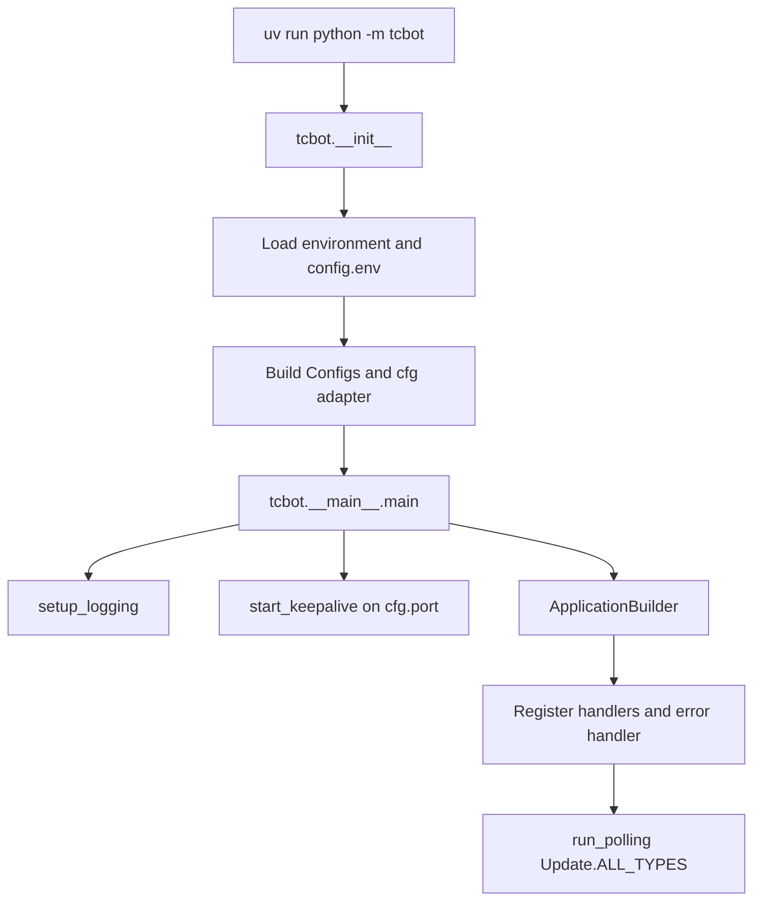
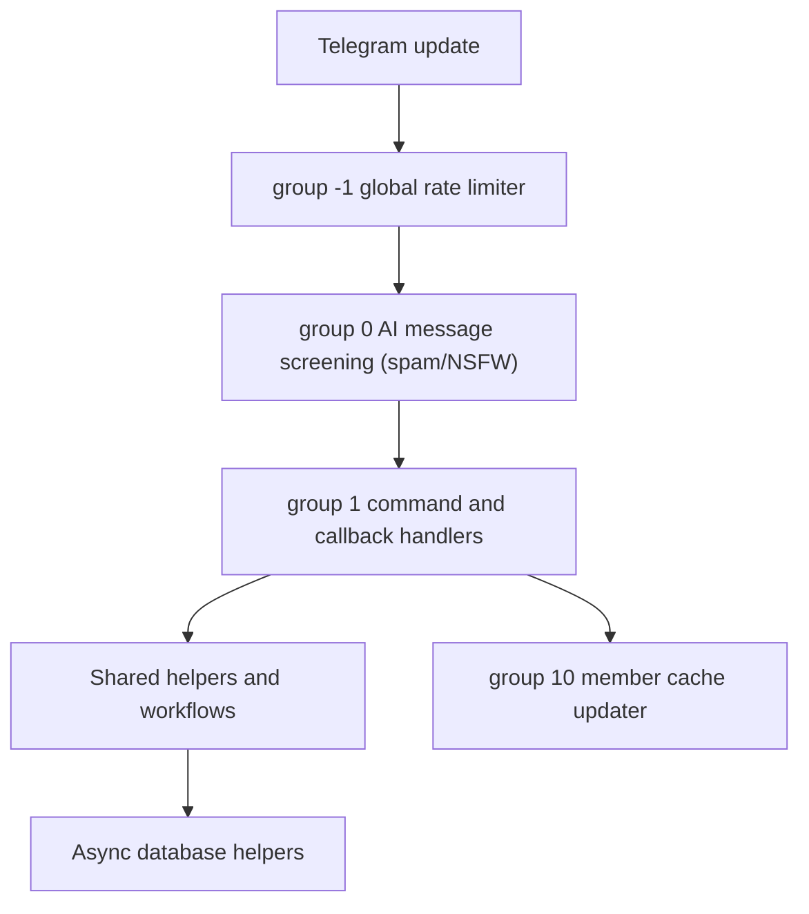

# TCF Bot: Planning and Project State

This document tracks how TCF Bot currently runs, what is considered stable, and what should be improved next. Keep it practical: record current behavior, known risks, and validation commands rather than aspirational placeholders.

For user-facing overview, see [`README.md`](README.md). For contributor rules and style, see [`AGENTS.md`](AGENTS.md). For deployment notes, see [`replit.md`](replit.md). For developer documentation, see [`docs/README.md`](docs/README.md). For CI/CD automation details, see [`docs/workflows-guide.md`](docs/workflows-guide.md). For changelog of recent changes, see [`CHANGELOG.md`](CHANGELOG.md).

## Current Project State

| Area | Status |
|---|---|
| Runtime | Long-polling Telegram bot started with `uv run python -m tcbot`. |
| Python target | Python 3.12 project target (`pyproject.toml` requires `>=3.12`). |
| Bot framework | `python-telegram-bot` (with the `[job-queue]` extra), tracking the latest compatible release. |
| Database | MongoDB through Motor, connected during PTB `post_init`. |
| Health check | Flask app in `tcbot/alive.py`, `GET /` returns `OK` on `PORT` (default `5000`). |
| Dependency management | `uv` with `uv.lock`; CI installs with frozen lockfile by default. |
| Formatting/linting | Ruff, configured in `pyproject.toml`. |
| AI moderation | Not yet implemented; plan includes local Ollama-based spam and NSFW detection. |
| Deployment notes | Local `config.env`, Docker Compose, and Replit/hosted environment variables are documented. |

## Runtime Flow

### Startup Sequence



### `post_init` Sequence

`_post_init(app)` runs after the PTB application is built and before polling starts:

1. Required env vars are parsed before startup; `BOT_TOKEN`, `MONGODB_URI`, and `OWNER_ID` must be present.
2. Enabled modules are imported during handler collection; import failures stop startup instead of silently skipping handlers.
3. `connect()` creates the Motor client and verifies MongoDB with `ping`.
4. `ensure_indexes()` creates required MongoDB indexes in parallel.
5. `ensure_initial_owner(cfg.initial_owner_id)` seeds the first owner when needed.
6. `error_reporter.attach(...)` stores the bot and error destination for async reports.
7. The asyncio loop exception handler is registered.
8. **[Future]** `ensure_ollama_models()` verifies that required Ollama models are available when AI moderation is enabled.

### Request Processing Pipeline



## Architecture Summary

### Main Package Boundaries

| Path | Responsibility |
|---|---|
| `tcbot/__init__.py` | Environment parsing, `Configs`, and the global `cfg` adapter. |
| `tcbot/__main__.py` | Application startup, handler registration, MongoDB startup, polling, error handling. |
| `tcbot/alive.py` | Flask health-check server. |
| `tcbot/modules/` | Command modules and Telegram handlers. |
| `tcbot/modules/helper/` | Shared formatter, keyboard, decorator, target extraction, and role guard helpers. |
| `tcbot/modules/helper/workflows/` | ConversationHandler flows, all named `*_flow.py`. |
| `tcbot/modules/ai_mod/` | **[Future]** AI moderation: spam detector, NSFW detector, feedback storage, Ollama client. |
| `tcbot/database/` | Async MongoDB access helpers and document/type definitions. |
| `tcbot/utils/` | Logging, bounded fan-out dispatch, prefix filters, datetime helpers, error reporting. |

### Module Discovery

`tcbot/modules/__init__.py` discovers top-level `*.py` files in `tcbot/modules/`, excludes `__init__.py`, applies the optional `MODULES_LOAD` allowlist and `MODULES_NO_LOAD` denylist, imports active modules, and collects their `__handlers__` lists. If any enabled module fails to import, startup now exits with the failing module names so a partially registered bot is not deployed.

### Database Layer

All database operations are async and should go through helper modules in `tcbot/database/`.

Current collection/domain owners include:

| Collection/domain | Helper |
|---|---|
| Federation bans | `bans_db.py` |
| Connected and pending groups | `groups_db.py` |
| Member profile cache | `users_cache.py` |
| Owners/admins + dev/tester roles | `users_roles.py` |
| Warnings | `warns_db.py` |
| Kicks | `kicks_db.py` |
| Mutes | `mutes_db.py` |
| Promotion requests | `queues_db.py` |
| **[Future]** AI moderation feedback | `ai_feedback_db.py` |
| **[Future]** Federation rules | `rules_db.py` |
| **[Future]** User trust/reputation | `user_trust_db.py` |
| **[Future]** Message reports | `reports_db.py` |
| MongoDB client/indexes | `mongos.py` |
| In-memory caches | `cache.py` |
| Typed document shapes | `documents.py` |
| Domain primitive types | `types.py` |

### Error Handling

| Layer | Location | Purpose |
|---|---|---|
| PTB error handler | `app.add_error_handler(_error_handler)` | Reports unhandled handler exceptions. |
| Asyncio exception handler | `loop.set_exception_handler(...)` | Reports background task failures. |
| Logging integration | `tcbot/utils/error_reporter.py` | Sends formatted error details to the configured destination. |

## Role System Summary

Role hierarchy:

1. Founder
2. Admin
3. Developer
4. Tester

Important rules:

- Use canonical role helpers from `tcbot.database.users_roles` and `tcbot.modules.helper.decorators.resolve_and_check`.
- Do not duplicate manual role-check chains in handlers.
- Ban and kick flows must auto-demote targets that currently hold a federation role.
- Promotion and demotion workflows should preserve auditability through logs and queue records.

## Conversation Flow Summary

Conversation flows live in `tcbot/modules/helper/workflows/` and use `ConversationHandler` where needed.

Primary flows:

| Flow | Purpose |
|---|---|
| `ban_flow.py` | Ban proof collection, album buffering, and federation ban execution. |
| `appeal_flow.py` | Private appeal submission and staff decision handling. |
| `connected_flow.py` | Group join approval and connection checks. |
| `reason_flow.py` | Shared reason/proof steps for moderation actions. |
| `proof_flow.py` | Proof upload helpers and prompts. |
| `kicking_flow.py`, `muting_flow.py`, `warning_flow.py`, `unban_flow.py` | Action-specific moderation workflows. |
| `promote_flow.py` | Role promotion execution helpers. |
| `stats_flow.py` | Unified `Stats` class covering overview, staff roster, users, chats, bans, and search. |
| **[Future]** `rules_flow.py` | Federation rules creation, viewing, and editing. |

For detailed behavior, see `docs/workflows/workflows.md`.

## Development and Validation Commands

Install dependencies:

```bash
uv sync
```

Run the bot:

```bash
uv run python -m tcbot
```

Format and lint:

```bash
uv run ruff format .
uv run ruff check --fix .
```

Run local bot + MongoDB:

```bash
docker-compose up --build
```

## Improvement Strategy

Priorities, in order:

1. **Correctness and safety:** preserve federation moderation behavior, secrets safety, and database compatibility.
2. **Clear module boundaries:** handlers call helpers; database writes stay in `tcbot/database/`; shared flows stay in `workflows/`.
3. **Operational visibility:** errors and important moderation events should be logged to configured destinations.
4. **Performance:** use bounded fan-out for group-wide operations and avoid sequential I/O where safe.
5. **AI moderation:** add spam and NSFW detection using local Ollama, with self-correcting feedback loops for accuracy.
6. **Message consistency:** audit and standardize all help text, command descriptions, and user-facing bot messages for tone, formatting, and English quality.

## Current Priority Backlog

### AI Moderation Features (From SPR Bot Reference Integration)

The following items implement intelligent message screening and reporting features adapted from the SpamProtectionRobot reference (see `spr-bot-reference/` in the workspace). All AI operations run locally via Ollama (no paid APIs or cloud services). Features are integrated as automatic message handlers, not slash commands, and all moderation metadata is stored in MongoDB.

#### Todo: Research and Select Ollama AI Models

**Status:** Todo  
**Description:** Evaluate and recommend specific Ollama models for spam and NSFW classification. The models must be lightweight enough to screen 50+ active federation groups in real-time (<2s per message), accurate (>90% precision preferred), and available on Ollama Hub. Research candidates and write a brief justification in the plan item notes.

**Candidates to evaluate:**
- **Spam classification:** `llama3.2:1b` (1.3B lightweight general-purpose), `qwen2.5:0.5b` (0.5B ultra-light), `neural-chat:7b` (if 7B model fits compute constraints)
- **NSFW/vision classification:** `moondream2` (vision model for image NSFW detection), `llava:7b` (multimodal), or dedicated classifiers if available

**Implementation scope:** Research and documentation only; no code changes required for this item.  
**Dependencies:** None.  
**Notes:**
- Confirm actual inference speed with batch requests to plan rate limits and queue strategy.
- Test model output format consistency (classification scores, confidence ranges, label format).
- Verify models run locally without external API calls.

---

#### Todo: Create Ollama Client Wrapper Module

**Status:** Todo  
**Description:** Implement `tcbot/utils/ollama_client.py` to wrap Ollama API calls. The wrapper provides consistent async methods for spam/NSFW classification with configurable timeout, retry logic, and error handling. All inference requests are instrumented with confidence scores and decision logging.

**Implementation scope:** 
- Create Ollama HTTP client wrapper in `/tcbot/utils/`
- Modify `/tcbot/__init__.py` to add `OLLAMA_ENDPOINT`, `OLLAMA_TIMEOUT_S`, `SPAM_MODEL`, `NSFW_MODEL` config vars
- Modify `config.env.example` to document Ollama configuration

**Dependencies:** Must come before any AI detector module.  
**Notes:**
- Use `aiohttp.ClientSession` for async HTTP calls.
- All config values flow through `cfg`; no hardcoded endpoints or model names.
- Wrap inference calls in `asyncio.wait_for(timeout=cfg.ollama_timeout_s)` to prevent stalled requests.
- Cache model availability on startup to fail fast if models are not loaded in Ollama.

---

#### Todo: Create AI Feedback Database Schema and Helpers

**Status:** Todo  
**Description:** Design MongoDB schema for storing AI moderation decisions and human feedback. The `tc_ai_feedback` collection records every AI decision (spam/NSFW), its confidence score, the mod team's verdict (Correct/Incorrect), and context for future model refinement. Create `tcbot/database/ai_feedback_db.py` with async helpers for storing, retrieving, and aggregating feedback.

**Schema (tc_ai_feedback collection):**
```python
{
"_id": ObjectId,
"decision_id": str,            # Unique ID for decision traceability
"timestamp": datetime,         # When AI made the decision
"chat_id": int,               # Group where message appeared
"message_id": int,            # Telegram message ID
"user_id": int,               # Who sent the message
"message_snippet": str,       # Text or hashed description (privacy)
"ai_type": str,               # "spam" or "nsfw"
"ai_confidence": float,       # 0.0-1.0 confidence score
"ai_decision": str,           # "positive" (flagged) or "negative" (clean)
"mod_verdict": str | None,    # "correct" or "incorrect" or None
"mod_id": int | None,         # Who made the verdict
"verdict_timestamp": datetime | None,
"rule_violated": str | None,  # Rule ID if applicable
}
```

**Implementation scope:**
- Create database helpers for AI feedback in `/tcbot/database/`
- Modify `tcbot/database/mongos.py` to add `tc_ai_feedback` collection indexes
- Modify `tcbot/database/documents.py` to add feedback document type definitions

**Dependencies:** Ollama client wrapper must exist.  
**Database indexes:**
- `{timestamp: -1}` for recent-first queries
- `{ai_type: 1, ai_confidence: 1}` for filtering by type and confidence
- `{mod_verdict: 1, timestamp: -1}` for unreviewed feedback
- `{user_id: 1, timestamp: -1}` for per-user feedback history

**Notes:**
- Message snippet must be truncated or hashed to avoid storing sensitive text.
- Feedback is immutable; incorrect verdicts become new records (no updates).
- This collection is the backbone of the self-correcting feedback loop.

---

#### Todo: Implement Spam Detector Handler Module

**Status:** Todo  
**Description:** Create `tcbot/modules/ai_mod/spam_detector.py` to analyze text messages for spam. The handler runs on every message in federation groups, calculates spam probability via Ollama, logs the decision with confidence score, and triggers moderation if confidence exceeds the configured threshold.

**Handler behavior:**
1. Extract text from `message.text` or `message.caption`.
2. Call Ollama spam classifier.
3. If confidence >= `SPAM_CONFIDENCE_THRESHOLD` (config, default 0.85):
- Log to `ai_feedback` with decision and confidence score.
- Forward message and AI verdict to `SPAM_LOG_CHANNEL` with **Correct**/**Incorrect** buttons.
- Auto-delete message if enabled (`SPAM_AUTO_DELETE`, config, default False).
- Optionally mute/kick user based on federation config.
4. If confidence < threshold: log silently to database for pattern analysis.

**Implementation scope:**
- Implement spam detector in `/tcbot/modules/ai/`
- Modify `tcbot/__init__.py` to add spam configuration: `SPAM_CONFIDENCE_THRESHOLD`, `SPAM_AUTO_DELETE`, `SPAM_LOG_CHANNEL`
- Modify `config.env.example` to document spam detector settings
- Source: review `spr-bot-reference/spr/modules/watcher.py` for spam detection patterns

**Dependencies:** Ollama client, AI feedback database.  
**Handler registration:** MessageHandler for text + groups (not DMs).  
**Notes:**
- Use `asyncio.wait_for` to timeout stalled Ollama calls.
- Log all errors (timeout, connection, parsing) to mod log with decision_id.
- Skip spam checks for federation staff and bots.
- Store spam confidence scores on user record in `users_cache` for reputation tracking.

---

#### Todo: Implement NSFW Detector Handler Module

**Status:** Todo  
**Description:** Create `tcbot/modules/ai_mod/nsfw_detector.py` to classify media for adult content. The handler runs on media messages in federation groups, downloads media, analyzes via Ollama vision model, and takes action if confidence exceeds threshold.

**Handler behavior:**
1. Listen for messages with photo, document (images only), sticker, or video.
2. Download media file.
3. Call Ollama NSFW classifier.
4. If confidence >= `NSFW_CONFIDENCE_THRESHOLD` (config, default 0.80):
- Log to `ai_feedback` with classification breakdown.
- Forward media and verdict to `NSFW_LOG_CHANNEL` with **Correct**/**Incorrect** buttons.
- Delete original message if enabled (`NSFW_AUTO_DELETE`, config, default True).
5. If confidence < threshold: log silently for pattern analysis.

**Implementation scope:**
- Implement NSFW detector in `/tcbot/modules/ai/`
- Modify `tcbot/__init__.py` to add NSFW configuration: `NSFW_CONFIDENCE_THRESHOLD`, `NSFW_AUTO_DELETE`, `NSFW_LOG_CHANNEL`
- Modify `config.env.example` to document NSFW detector settings
- Source: review `spr-bot-reference/spr/modules/watcher.py` for NSFW detection patterns

**Dependencies:** Ollama client, AI feedback database, spam detector precedent.  
**Handler registration:** MessageHandler for media types, group-only.  
**Notes:**
- Downloaded files must be cleaned up immediately after analysis.
- Vision models are slower; use `asyncio.wait_for(timeout=5.0)` or longer timeout.
- Skip NSFW checks for staff and bots.
- Provide detailed classification breakdown in log message for mod review.

---

#### Todo: Implement Self-Correcting Feedback Loop

**Status:** Todo  
**Description:** Create inline callback handlers for **Correct** and **Incorrect** buttons on spam/NSFW log messages. When a mod presses a button, the handler records the verdict in the feedback database and optionally reverses the moderation action. Accumulated feedback is used as context (few-shot examples) in subsequent Ollama prompts to improve accuracy.

**Callback behavior:**
1. Mod presses **Correct** or **Incorrect** on a spam/NSFW log message.
2. Retrieve the linked feedback record by `decision_id`.
3. Update feedback with mod verdict and timestamp.
4. If **Incorrect**: reverse the moderation action (restore message, unmute/unban user, etc.).
5. On next AI decision: query recent correct/incorrect feedback for the user and AI type, inject as context in Ollama prompt (few-shot examples).

**Implementation scope:**
- Implement feedback callback handlers in `/tcbot/modules/ai/`
- Update spam and NSFW detectors to pass `decision_id` in button callback data
- Extend Ollama client in `/tcbot/utils/` with context-aware classification method
- Add feedback query and update helpers to database layer in `/tcbot/database/`
- Source: review `spr-bot-reference/spr/modules/vote.py` for feedback voting patterns

**Dependencies:** Spam and NSFW detectors, feedback database.  
**Handler registration:** CallbackQueryHandler for patterns `ai_feedback_correct_*` and `ai_feedback_incorrect_*`.  
**Notes:**
- Callback data format: `ai_feedback_correct_<decision_id>` (max 64 chars; use hex digest).
- Context injection example: `"Recent human feedback for this user:\n- [user_id=123, spam, 0.92]: Incorrect (false positive)\n\nClassify this message..."`
- Limit context to last 10 feedback verdicts per user per type to avoid prompt bloat.
- Log context injection events for debugging.

---

#### Todo: Implement Message Report System

**Status:** Todo  
**Description:** Create a user-facing message report mechanism. Users forward a message to the bot or reply with `/report`, the bot analyzes the message via AI, forwards the report + AI verdict to a mod queue, and mods can act directly from the queue with buttons (Dismiss, Warn, Mute, Kick, Ban).

**Workflow:**
1. User forwards a message to the bot or replies with `/report`.
2. Bot extracts message context (text, media, sender, chat).
3. Bot calls AI classifier (spam/NSFW/other).
4. Bot stores report in `reports` collection.
5. Bot forwards original message + AI verdict + action buttons to `REPORTS_LOG_CHANNEL`.
6. Mod presses Dismiss, Warn, Mute, Kick, or Ban.
7. Corresponding moderation action is executed.
8. Report is marked resolved in database.

**Implementation scope:**
- Implement message report handler in `/tcbot/modules/ai/`
- Create reports database helpers in `/tcbot/database/`
- Modify `tcbot/__init__.py` to add `REPORTS_LOG_CHANNEL` configuration
- Modify `config.env.example` to document reports channel
- Source: review `spr-bot-reference/spr/modules/manage.py` and `watcher.py` for report patterns

**Dependencies:** Spam/NSFW detectors, feedback database.  
**Handler registration:** MessageHandler for forwarded_from and reply_to_message, or explicit `/report` command.  
**Notes:**
- Reports are immutable snapshots; store full message metadata for auditing.
- Action buttons trigger existing moderation flows.
- Reports that result in no action are still logged for pattern analysis.

---

#### Todo: Implement Federation Rules System

**Status:** Todo  
**Description:** Create a centralized, configurable rule system for the federation. Rules are stored in MongoDB, displayed in `/rules` command, and referenced in moderation logs. Founder can add/edit/delete rules via conversation flow.

**Schema (tc_rules collection):**
```python
{
"_id": ObjectId,
"rule_id": int,                # 1-based rule number
"title": str,                  # e.g., "No Spam"
"description": str,            # Full rule text in HTML
"severity": str,               # "info", "warning", "kick", "ban"
"created_at": datetime,
"updated_by": int,             # Founder ID
"ai_keywords": list[str],      # [Optional] keywords for AI detection
}
```

**Implementation scope:**
- Create federation rules database helpers in `/tcbot/database/`
- Implement rules command handler in `/tcbot/modules/`
- Create rules edit/delete conversation flow in `/tcbot/modules/helper/workflows/`
- Modify `tcbot/database/mongos.py` to add rules collection indexes
- Update existing moderation workflows to reference rules

**Dependencies:** None; can be standalone.  
**Notes:**
- Rules are displayed in paginated format (see `stats_flow.py` for pagination pattern).
- Rules can optionally link to AI keywords for automatic suggestion.
- Moderation logs must always include the rule violated (or "AI judgment").

---

#### Todo: Implement User Trust and Reputation Tracking

**Status:** Todo  
**Description:** Create a trust and reputation score system based on user behavior. The score is calculated from spam/NSFW history and mod feedback. Mods can view the score via `/info <user>`. AI decisions can be weighted by user trust.

**Schema addition to users_cache:**
```python
{
# Existing fields...
"trust_score": float,           # 0-100, default 100
"spam_count": int,              # Number of spam messages
"nsfw_count": int,              # Number of NSFW messages
"false_positive_count": int,    # Feedback marked "Incorrect"
"last_spam_timestamp": datetime | None,
}
```

**Implementation scope:**
- Extend user cache in `/tcbot/database/users_cache.py` to track trust scores
- Update AI detectors in `/tcbot/modules/ai/` to record spam and NSFW counts
- Update feedback callbacks to adjust trust on mod verdicts
- Modify user info command in `/tcbot/modules/checking.py` to display trust tier
- Source: review `spr-bot-reference/spr/modules/info.py` for user stats patterns

**Dependencies:** AI detectors and feedback loop.  
**Notes:**
- Trust calculation: `trust_score = 100 - (spam_count * 5) - (nsfw_count * 10) + (false_positive_count * 2)`, clamped to [0, 100].
- Trust scores decay over time; use `last_spam_timestamp` in calculation.
- Display trust tier: "Trusted" (80-100), "Neutral" (50-79), "Suspicious" (20-49), "Blocked" (0-19).

---

#### Todo: Audit and Rewrite Help Text (`__help_text__` Cleanup)

**Status:** Todo  
**Description:** Review every `__help_text__` string in `tcbot/modules/*.py` for consistency, tone, HTML formatting, and accuracy. Rewrite strings to follow bot voice rules (professional + friendly, no emoji, correct HTML formatting, concise descriptions).

**Implementation scope:** Review and update all `__help_text__` definitions across `tcbot/modules/` (currently 20+ modules).  
**Validation:** Run `tcbot/modules/help.py` tests to ensure all help topics are renderable.  
**Dependencies:** None; can run in parallel.  
**Notes:**
- Bot voice rules: no pictograph emoji; no text emoticons (`:)`, `:v`); friendly but professional; short and direct.
- HTML tags: `<b>`, `<i>`, `<code>`, `<a>` only; escape user-provided text.
- Format each help entry as: `<b>Command:</b> /cmd [args]\n<b>Description:</b> What it does.\n<b>Usage:</b> Example.\n<b>Permissions:</b> Who can use it.`
- Checklist: (1) All modules have non-None `__help_text__`. (2) All descriptions under 200 chars. (3) No emoji. (4) HTML valid. (5) No hardcoded IDs.

---

#### Todo: Bot Message Audit and Centralization

**Status:** Todo  
**Description:** Find and rewrite every user-facing message string in the entire codebase for consistent tone, voice, HTML formatting, and English quality. Centralize all strings in `tcbot/modules/helper/strings.py` so the bot voice is consistent.

**Scope:** All messages returned via `message.reply_text()`, `query.answer()`, `cq.edit_message_text()`, exception messages, and mod-visible log messages.  
**Implementation scope:** 
- Create centralized message strings module in `/tcbot/modules/helper/`
- Update all handler modules in `/tcbot/modules/` and workflow files in `/tcbot/modules/helper/workflows/` to use centralized message constants
- Extend existing identity and formatter helpers to use centralized strings

**Dependencies:** Help text audit (finish first for consistency).  
**Validation:**
```bash
grep -r "reply_text\|edit_message_text\|answer" tcbot/ | grep -v ".pyc" | wc -l
```

**Notes:**
- Bot voice: short, direct, friendly-formal, English-only, HTML-formatted, no emoji, no hardcoded IDs.
- Categories: error messages, success messages, confirmation prompts, state transitions, rate-limit messages, permission denials, etc.
- Each string has one variable name and single responsibility.
- Example structure:
```python
MSG_PERMISSION_DENIED = "You don't have permission to use this command."
MSG_USER_NOT_FOUND = "User not found. Try again with a valid user ID or mention."
MSG_CONFIRM_BAN = "<b>Confirm ban</b>\n\nUser: {user}\nReason: {reason}\n\nProceed?"
```

---

### Code Quality and Maintenance

#### Todo: Async Parallelism Review and Fix

**Status:** Todo  
**Description:** Audit every command handler and callback for opportunities to parallelize independent async operations using `asyncio.gather()`. This is a correctness issue: sequential awaits that could run in parallel cause unnecessary delays in user-facing responses.

**Scope:** All `tcbot/modules/` handlers and `tcbot/modules/helper/workflows/` state functions.  
**Audit checklist:**
1. Find every `await` statement.
2. If the next statement is another `await` and they are independent (don't share data dependencies), combine with `asyncio.gather()`.
3. If all awaits in a function are sequential and independent, refactor to parallel.
4. Document the parallelism in a comment pointing at the gather block.

**Examples to refactor:**
```python
# BEFORE: Sequential (slow)
user = await db.users_cache.get_first_name(user_id)
role = await db.users_roles.get_effective_role(user_id)

# AFTER: Parallel (fast)
user, role = await asyncio.gather(
db.users_cache.get_first_name(user_id),
db.users_roles.get_effective_role(user_id),
)
```

**Implementation scope:** Audit and parallelize handlers across `tcbot/modules/`, `tcbot/modules/helper/workflows/`, and `tcbot/modules/helper/`.  
**Dependencies:** None; can run independently.  
**Validation:** Run profiler on a known slow handler and confirm response time improves.  
**Notes:**
- Data-fetching gathers that unpack results should NOT use `return_exceptions=True`; let failures propagate.
- Pure side-effect gathers (DM + log + audit) SHOULD use `return_exceptions=True`.
- Document each parallelism opportunity with a comment and justification.

---

> The backlog below was re-verified line by line against the source tree on
> 2026-06-01. Each prior entry was checked against the actual code rather than
> trusted from a previous review pass. The disposition of every prior claim is
> recorded under "Backlog Review" so the audit trail stays clear.

## Code Review Findings

Use this section to keep code review findings in one consistent place. It applies
to anyone reviewing this codebase. After a review, add each finding as a row in the
table for its priority tier, where P1 is the highest and P5 is the lowest.
Confirmed and prioritized items move up into the
[Current Priority Backlog](#current-priority-backlog) above. Cleared items are set
to `Dismissed` with the reason written in the Evidence column. The italic rows are
placeholders that show the expected format, so replace them and do not leave them
in.

### How to record a finding

- One finding per row, specific and self-contained.
- **Location** must be a real `file.py:line` you actually opened, never a guess.
- **Evidence** must quote the relevant code or describe the behavior you observed
that proves the finding is real. A finding with no evidence counts as unverified.
- **Verify first.** Open the cited file and confirm the issue is not already
handled before listing it. In the 2026-06-01 review, several findings flagged as
critical turned out to be already implemented in the code.
- **Do not overstate severity.** Already-validated input, idiomatic framework
usage, and marginal micro-optimizations are not P1 or P2.
- **Status** uses the values below. Use `Resolved` only when a fix has landed and
validation passes. Use `Dismissed` (with a reason) when verification shows the finding
is not a real issue.

**Status values:**

- `Open`: logged, not started.
- `Verified`: confirmed against the code.
- `In Progress`: being worked on.
- `Resolved`: fixed and validated.
- `Dismissed`: checked and not a real issue, with the reason in Evidence.

**Priority tiers:**

- **P1 (Critical):** security holes, data loss, crashes, or broken core moderation; fix before the next release.
- **P2 (High):** incorrect behavior in critical logic such as auth and federation actions.
- **P3 (Medium):** maintainability and non-hot-path performance.
- **P4 (Low):** documentation gaps, minor cleanups, and naming.
- **P5 (Optional / Future):** speculative or nice-to-have ideas; gather evidence before promoting them.

### P1 (Critical)

| # | Finding | Location (`file.py:line`) | Evidence (code quote / observed behavior) | Proposed Fix | Status |
|--|--|--|--|--|--|
| 1 | `_paginate`, `_nav_row`, `_date` undefined at runtime in `stats_flow.py` | `tcbot/modules/helper/workflows/stats_flow.py:1` | All twelve call sites used private names (`_paginate`, `_nav_row`, `_date`) that were never defined in the module; calling any Stats drill-down raised `NameError` immediately | Replace all call sites with `paginate(..., _PAGE_SIZE)`, `nav_row(...)`, `date_or_unknown(...)` imported from `tcbot.utils.pagination` | `Resolved` |
| 2 | `_paginate`, `_nav_row`, `_date` undefined at runtime in `check_flow.py` | `tcbot/modules/helper/workflows/check_flow.py:1` | Same root cause as stats_flow: twelve call sites used stale private names leftover from before pagination was extracted to utils; any Check drill-down raised `NameError` | Add `from tcbot.utils.pagination import date_or_unknown, nav_row, paginate` and replace all twelve call sites | `Resolved` |
| 3 | `_kb` undefined at runtime in `tcbot/modules/groups.py` | `tcbot/modules/groups.py:85,103` | `_kb(False)` and `_kb(detailed)` called but never defined; `/tcgroups` and Detail/Simple toggle both raised `NameError` immediately | Imported `tcgroups_kb` from `tcbot.modules.helper.keyboards` and replaced both `_kb(...)` call sites | `Resolved` |

### P2 (High)

| # | Finding | Location (`file.py:line`) | Evidence (code quote / observed behavior) | Proposed Fix | Status |
|--|--|--|--|--|--|
| _1_ | _Example finding_ | _`file.py:line`_ | _Quoted code or observed behavior_ | _Proposed fix_ | _Open_ |

### P3 (Medium)

| # | Finding | Location (`file.py:line`) | Evidence (code quote / observed behavior) | Proposed Fix | Status |
|--|--|--|--|--|--|
| 1 | `uv run ruff` documented throughout `.agents/` but silently failed on Replit | `.agents/STYLE-CODE.md:17`, `.agents/RUFF.md:53` | `uv run ruff format .` exited with code 1 because ruff was in `[project.optional-dependencies.dev]`, which `uv run` does not install by default | Moved ruff to `[dependency-groups] dev = ["ruff"]` in `pyproject.toml`; `uv sync` now installs it automatically; `uv run ruff check .` and `uv run ruff format .` both pass clean | `Resolved` |

### P4 (Low)

| # | Finding | Location (`file.py:line`) | Evidence (code quote / observed behavior) | Proposed Fix | Status |
|--|--|--|--|--|--|
| 1 | `performance.yml` benchmark imported non-existent module `users_db` | `.github/workflows/performance.yml:49,68` | `from tcbot.database import users_db`: module was split and removed; correct module is `users_cache`; calls to `users_db.get_first_names_batch` and `users_db.get_mention_data_batch` would fail at import time | Replace both imports with `users_cache`; rename all call sites | `Resolved` |
| 2 | `performance.yml` Compare-baseline script used `os.environ` without `import os` | `.github/workflows/performance.yml:207` | Python inline script imported only `sys`; `os.environ["GITHUB_OUTPUT"]` on regression would raise `NameError: os is not defined` | Add `import os` at top of script | `Resolved` |
| 3 | `auto-fix.yml` schedule cron `0 4 * * 1` annotated as "02:00 UTC" | `.github/workflows/auto-fix.yml:10` | Comment read `# Weekly Monday 02:00 UTC` but cron fires at 04:00 UTC; same wrong time propagated to `README.md` and two places in `docs/workflows-guide.md` | Fix comment in YAML; update four documentation references | `Resolved` |
| 4 | `docs/workflows-guide.md` and `README.md` described run-bot.yml as "Manual deployment" | `docs/workflows-guide.md:251`, `README.md:255` | `run-bot.yml` has `schedule: cron: "0 */4 * * *"`: it runs every 4 hours automatically; "Manual dispatch only" was wrong | Update overview line, section body, and README entry | `Resolved` |
| 5 | `config.env.example` claimed `PORT=auto` lets system pick a free port | `config.env.example:31` | `parse_port()` returns 5000 for "auto"; no OS port discovery exists | Rewrite PORT comment to describe actual fallback behavior | `Resolved` |
| 6 | `config.env.example` claimed `PROOFS/LOGS/LOGS_ERRORS/APPEALS=auto` creates forum threads | `config.env.example:57,65,73,81` | No forum-thread auto-creation code exists anywhere in `tcbot/`; these comments described non-existent functionality | Remove the four "auto" comment blocks; replace with accurate format guidance | `Resolved` |
| 7 | 12 public functions had no docstrings | multiple files | `bold()`, `italic()`, `code()`, `link()`, `esc()`, `on_groups_details()`, `on_groups_simple()`, `on_help_menu()`, `on_helpc_main()`, `appeal_deep_link()`, `on_menu_groups()`, `on_menu_groups_simple()` had empty docstring slots | Add one-line docstrings to each | `Resolved` |

### P5 (Optional / Future)

| # | Finding | Location (`file.py:line`) | Evidence (code quote / observed behavior) | Proposed Fix | Status |
|--|--|--|--|--|--|
| 1 | `member_cache` batch queries could benefit from a covered composite index | `tcbot/database/mongos.py:1` | `get_first_names_batch` issues `$in` on `user_id` with a `first_name` projection; existing `user_id` index is not covering | `{user_id: 1, first_name: 1, username: 1}` index added to `ensure_indexes()` on 2026-06-02; batch `$in` projections are now covered queries. | `Resolved` |

## Maintenance Rules

- Do not commit real secrets or private chat IDs.
- Do not edit `config.env` for normal documentation or code changes.
- Do not add dependencies manually to a requirements file; use `uv` and `pyproject.toml`.
- Keep database schema changes backward-compatible unless a migration plan is included.
- Keep bot messages HTML-only and escape user-provided text through formatter helpers.
- Keep conversation files named `*_flow.py`.
- All AI operations run locally via Ollama; no cloud APIs, paid services, or ARQ.
- All moderation decisions (AI or manual) must be logged to configured destinations for audit trail.
- All AI feedback is stored in MongoDB for future model improvement and pattern analysis.

## Recent Documentation Baseline

This documentation pass updates the root Markdown files to reflect the current project stack, runtime flow, configuration model, and deployment guidance:

- `AGENTS.md`
- `README.md`
- `PLAN.md`
- `replit.md`
