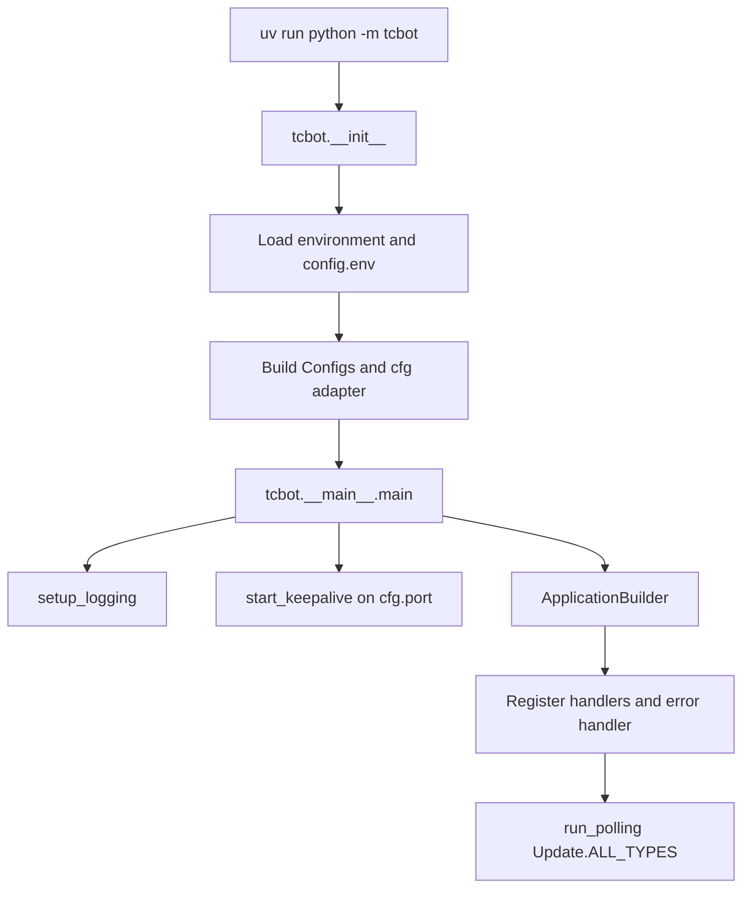
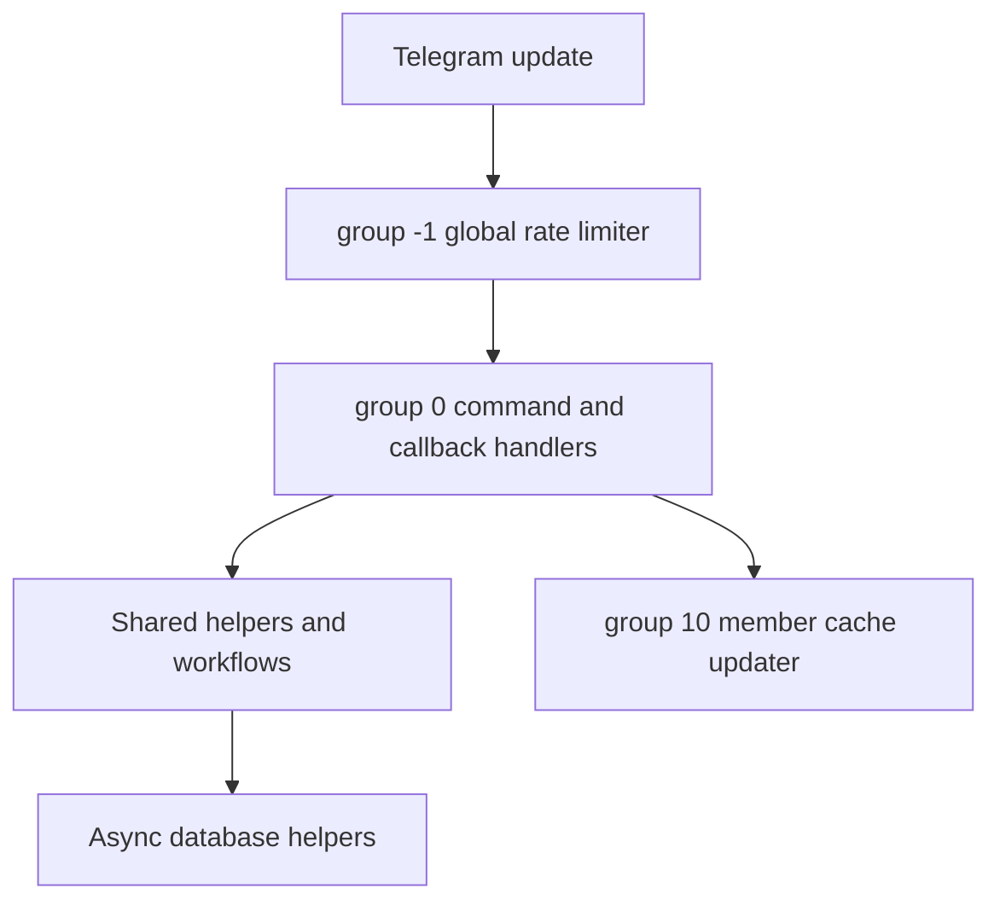

# TCF Bot: Planning and Project State

This document tracks how TCF Bot currently runs, what is considered stable, and what should be improved next, as well as the full integration plan for new features derived from the reference implementation. Keep it practical: record current behavior, known risks, and validation commands rather than aspirational placeholders.

For user-facing overview, see [`README.md`](README.md). For contributor rules and style, see [`AGENTS.md`](AGENTS.md). For deployment notes, see [`replit.md`](replit.md). For developer documentation, see [`docs/README.md`](docs/README.md). For CI/CD automation details, see [`docs/workflows-guide.md`](docs/workflows-guide.md). For changelog of recent changes, see [`CHANGELOG.md`](CHANGELOG.md).

---

## Current Project State

| Area | Status |
|---|---|
| Runtime | Long-polling Telegram bot started with `uv run python -m tcbot`. |
| Python target | Python 3.12 project target (`pyproject.toml` requires `>=3.12`). |
| Bot framework | `python-telegram-bot` (with the `[job-queue]` extra), tracking the latest compatible release. |
| Database | MongoDB through Motor, connected during PTB `post_init`. |
| Health check | Flask app in `tcbot/alive.py`, `GET /` returns `OK` on `PORT` (default `5000`). |
| Dependency management | `uv` with `uv.lock`; CI installs with frozen lockfile by default. |
| Formatting/linting | Ruff, configured in `pyproject.toml`. |
| Deployment notes | Local `config.env`, Docker Compose, and Replit/hosted environment variables are documented. |

---

## Runtime Flow

### Startup Sequence



### `post_init` Sequence

`_post_init(app)` runs after the PTB application is built and before polling starts:

1. Required env vars are parsed before startup; `BOT_TOKEN`, `MONGODB_URI`, and `OWNER_ID` must be present.
2. Enabled modules are imported during handler collection; import failures stop startup instead of silently skipping handlers.
3. `connect()` creates the Motor client and verifies MongoDB with `ping`.
4. `ensure_indexes()` creates required MongoDB indexes in parallel.
5. `ensure_initial_owner(cfg.initial_owner_id)` seeds the first owner when needed.
6. `error_reporter.attach(...)` stores the bot and error destination for async reports.
7. The asyncio loop exception handler is registered.

### Request Processing Pipeline



---

## Architecture Summary

### Main Package Boundaries

| Path | Responsibility |
|---|---|
| `tcbot/__init__.py` | Environment parsing, `Configs`, and the global `cfg` adapter. |
| `tcbot/__main__.py` | Application startup, handler registration, MongoDB startup, polling, error handling. |
| `tcbot/alive.py` | Flask health-check server. |
| `tcbot/modules/` | Command modules and Telegram handlers. |
| `tcbot/modules/helper/` | Shared formatter, keyboard, decorator, target extraction, and role guard helpers. |
| `tcbot/modules/helper/workflows/` | ConversationHandler flows, all named `*_flow.py`. |
| `tcbot/database/` | Async MongoDB access helpers and document/type definitions. |
| `tcbot/utils/` | Logging, bounded fan-out dispatch, prefix filters, datetime helpers, error reporting. |

### Module Discovery

`tcbot/modules/__init__.py` discovers top-level `*.py` files in `tcbot/modules/`, excludes `__init__.py`, applies the optional `MODULES_LOAD` allowlist and `MODULES_NO_LOAD` denylist, imports active modules, and collects their `__handlers__` lists. If any enabled module fails to import, startup exits with the failing module names so a partially registered bot is not deployed.

### Database Layer

All database operations are async and go through helper modules in `tcbot/database/`.

Current collection/domain owners:

| Collection/domain | Helper |
|---|---|
| Federation bans | `bans_db.py` |
| Connected and pending groups | `groups_db.py` |
| Member profile cache | `users_cache.py` |
| Owners/admins + dev/tester roles | `users_roles.py` |
| Warnings | `warns_db.py` |
| Kicks | `kicks_db.py` |
| Mutes | `mutes_db.py` |
| Promotion requests | `queues_db.py` |
| MongoDB client/indexes | `mongos.py` |
| In-memory caches | `cache.py` |
| Typed document shapes | `documents.py` |
| Domain primitive types | `types.py` |

### Error Handling

| Layer | Location | Purpose |
|---|---|---|
| PTB error handler | `app.add_error_handler(_error_handler)` | Reports unhandled handler exceptions. |
| Asyncio exception handler | `loop.set_exception_handler(...)` | Reports background task failures. |
| Logging integration | `tcbot/utils/error_reporter.py` | Sends formatted error details to the configured destination. |

---

## Role System Summary

Role hierarchy:

1. Founder
2. Admin
3. Developer
4. Tester

Important rules:

- Use canonical role helpers from `tcbot.database.users_roles` and `tcbot.modules.helper.decorators.resolve_and_check`.
- Do not duplicate manual role-check chains in handlers.
- Ban and kick flows must auto-demote targets that currently hold a federation role.
- Promotion and demotion workflows should preserve auditability through logs and queue records.

---

## Conversation Flow Summary

Conversation flows live in `tcbot/modules/helper/workflows/` and use `ConversationHandler` where needed.

Primary flows:

| Flow | Purpose |
|---|---|
| `ban_flow.py` | Ban proof collection, album buffering, and federation ban execution. |
| `appeal_flow.py` | Private appeal submission and staff decision handling. |
| `connected_flow.py` | Group join approval and connection checks. |
| `reason_flow.py` | Shared reason/proof steps for moderation actions. |
| `proof_flow.py` | Proof upload helpers and prompts. |
| `kicking_flow.py`, `muting_flow.py`, `warning_flow.py`, `unban_flow.py` | Action-specific moderation workflows. |
| `promote_flow.py` | Role promotion execution helpers. |
| `stats_flow.py` | Unified `Stats` class covering overview, staff roster, users, chats, bans, and search. |

---

## Development and Validation Commands

Install dependencies:

```bash
uv sync
```

Run the bot:

```bash
uv run python -m tcbot
```

Format and lint:

```bash
uv run ruff format .
uv run ruff check --fix .
```

Run local bot + MongoDB:

```bash
docker-compose up --build
```

---

## Code Review Findings

Use this section to keep code review findings in one consistent place. After a review, add each finding as a row in the table for its priority tier, where P1 is the highest and P5 is the lowest. Confirmed and prioritized items move up into the Current Priority Backlog above. Cleared items are set to `Dismissed` with the reason written in the Evidence column.

### How to record a finding

- One finding per row, specific and self-contained.
- **Location** must be a real `file.py:line` you actually opened, never a guess.
- **Evidence** must quote the relevant code or describe the behavior you observed that proves the finding is real.
- **Verify first.** Open the cited file and confirm the issue is not already handled before listing it.
- **Do not overstate severity.** Already-validated input, idiomatic framework usage, and marginal micro-optimizations are not P1 or P2.

**Status values:** `Open` | `Verified` | `In Progress` | `Resolved` | `Dismissed`

**Priority tiers:**
- **P1 (Critical):** security holes, data loss, crashes, or broken core moderation.
- **P2 (High):** incorrect behavior in critical logic such as auth and federation actions.
- **P3 (Medium):** maintainability and non-hot-path performance.
- **P4 (Low):** documentation gaps, minor cleanups, naming.
- **P5 (Optional / Future):** speculative or nice-to-have ideas.

### P1 (Critical)

| # | Finding | Location (`file.py:line`) | Evidence | Proposed Fix | Status |
|--|--|--|--|--|--|
| 1 | `_paginate`, `_nav_row`, `_date` undefined at runtime in `stats_flow.py` | `tcbot/modules/helper/workflows/stats_flow.py:1` | All call sites used private names never defined in the module; any Stats drill-down raised `NameError` | Replace with `paginate`, `nav_row`, `date_or_unknown` from `tcbot.utils.pagination` | `Resolved` |
| 2 | `_paginate`, `_nav_row`, `_date` undefined at runtime in `check_flow.py` | `tcbot/modules/helper/workflows/check_flow.py:1` | Same root cause as stats_flow | Add imports from `tcbot.utils.pagination` and replace all call sites | `Resolved` |
| 3 | `_kb` undefined at runtime in `tcbot/modules/groups.py` | `tcbot/modules/groups.py:85,103` | `_kb(False)` called but never defined; `/tcgroups` raised `NameError` | Import `tcgroups_kb` from keyboards and replace both call sites | `Resolved` |

### P2 (High)

| # | Finding | Location | Evidence | Proposed Fix | Status |
|--|--|--|--|--|--|

### P3 (Medium)

| # | Finding | Location | Evidence | Proposed Fix | Status |
|--|--|--|--|--|--|
| 1 | `uv run ruff` silently failed on Replit | `pyproject.toml` | ruff was in `optional-dependencies.dev`, not installed by `uv run` by default | Moved to `[dependency-groups] dev = ["ruff"]` | `Resolved` |

### P4 (Low)

| # | Finding | Location | Evidence | Proposed Fix | Status |
|--|--|--|--|--|--|
| 1 | `performance.yml` imported non-existent `users_db` | `.github/workflows/performance.yml:49,68` | Module split and removed; correct is `users_cache` | Replace import | `Resolved` |
| 2 | Compare-baseline script used `os.environ` without `import os` | `.github/workflows/performance.yml:207` | `NameError` on regression path | Add `import os` | `Resolved` |
| 3 | `auto-fix.yml` schedule annotated as "02:00 UTC" but fires at 04:00 | `.github/workflows/auto-fix.yml:10` | Cron is `0 4 * * 1`, comment wrong | Fix comment and four documentation references | `Resolved` |
| 4 | `config.env.example` `PORT=auto` described non-existent OS port discovery | `config.env.example:31` | `parse_port()` returns 5000 for "auto" | Rewrite comment | `Resolved` |
| 5 | `config.env.example` `PROOFS/LOGS/etc=auto` described non-existent forum thread creation | `config.env.example:57,65,73,81` | No such code exists | Remove "auto" blocks, add accurate format guidance | `Resolved` |
| 6 | 12 public functions had no docstrings | multiple files | `bold()`, `italic()`, `code()`, `link()`, `esc()`, and others | Add one-line docstrings | `Resolved` |

### P5 (Optional / Future)

| # | Finding | Location | Evidence | Proposed Fix | Status |
|--|--|--|--|--|--|
| 1 | `member_cache` batch queries benefit from covered composite index | `tcbot/database/mongos.py` | `$in` on `user_id` with `first_name` projection not covered | Added `{user_id:1, first_name:1, username:1}` index | `Resolved` |

---

## Maintenance Rules

- Do not commit real secrets or private chat IDs.
- Do not edit `config.env` for normal documentation or code changes.
- Do not add dependencies manually to a requirements file; use `uv` and `pyproject.toml`.
- Keep database schema changes backward-compatible unless a migration plan is included.
- Keep bot messages HTML-only and escape user-provided text through formatter helpers.
- Keep conversation files named `*_flow.py`.

---

---

# Integration Plan: New Features from Reference Implementation

This section documents the integration plan for all features derived from the `spr-bot-reference/` codebase. The reference uses Pyrogram + ARQ (a cloud AI API). Everything below is re-designed for PTB (python-telegram-bot) with PTB's built-in JobQueue and a local Ollama LLM — no Pyrogram, no ARQ, no paid cloud AI anywhere.

## Reference vs TCF Bot: Architectural Differences

| Concern | Reference (spr-bot) | TCF Bot (this project) |
|---|---|---|
| Framework | Pyrogram (MTProto client) | `python-telegram-bot` (Bot API, long-polling) |
| Background tasks | ARQ (Redis job queue) | PTB built-in `JobQueue` (APScheduler) |
| AI/ML backend | ARQ hosted API (`arq.nlp`, `arq.nsfw_scan`) | Local Ollama REST API (`localhost:11434`) |
| Database | SQLite (sync, `sqlite3`) | MongoDB via Motor (async) |
| Admin list | In-memory dict with 1 h TTL | Needs equivalent cache per connected group |
| Role system | Flat `SUDOERS` list | Full hierarchy: Founder / Admin / Developer / Tester |
| Federation | None (standalone spam bot) | Full federation: bans propagate to all connected groups |
| Moderation commands | Slash commands in the reference | Event-driven: AI pipeline is always-on; no slash command for automated detection |

---

## Feature 1 — AI Moderation Pipeline (Ollama-based)

### What the reference does

`spr/modules/watcher.py` registers a single `@spr.on_message` handler that fires on every text, photo, document, sticker, animation, and video message in any group. For media, it downloads the file and calls `arq.nsfw_scan(file=file)` (hosted vision API). For text, it calls `arq.nlp(text)` (hosted NLP API). When a detection threshold is exceeded and protection is enabled for the chat, it deletes the message, kicks/mutes the user, and sends a notice to a log channel.

### How it works in TCF Bot

The pipeline is automatic and silent. No slash command enables or disables a detection run — it simply fires on every incoming message in every connected group. Detection only produces a moderation action when confidence exceeds a threshold (see below). Staff (any user with a federation role) are exempted from the pipeline entirely.

**Message flow:**

```
Incoming message in connected group
    → AI pipeline handler (group 5, low priority, never blocks main handlers)
        → skip if: user is staff, message is from a bot, group has AI disabled
        → text present? → spam_check(text) via Ollama
        → media present? → nsfw_check(image) via Ollama
        → confidence >= threshold?
            → delete message
            → apply action (mute 24h for first offence, ban for repeat)
            → post moderation card to LOGS with Correct / Incorrect buttons
```

### Ollama model selection

Two model slots are needed: one for text, one for vision/NSFW. Both must run on CPU in real-time across 50 active groups. "Real-time" here means the Ollama call must complete before the message would scroll off screen — a budget of roughly 3–5 seconds per call.

**Recommended text model: `qwen2.5:0.5b`**

- 0.5 billion parameters, ~400 MB on disk, ~300–600 ms per inference on a mid-range CPU.
- Instruction-following is excellent relative to its size; handles short Telegram messages well.
- Available as `ollama pull qwen2.5:0.5b`.
- Fallback: `llama3.2:1b` (~700 MB, ~800–1500 ms) for better quality at the cost of throughput. Not recommended for busy federations.
- Do not use models ≥3B for this path; they will not keep pace with 50 active groups without a GPU.

**Recommended vision/NSFW model: `moondream2`**

- 1.8 billion parameter vision-language model, ~2 GB on disk, ~1–2 s per image on CPU.
- Accepts a base64-encoded image and a prompt; returns a natural language description which is then classified.
- Available as `ollama pull moondream2`.
- The classification prompt asks the model to describe the image and answer whether it contains sexual/adult content. The answer is parsed deterministically.
- Fallback: skip NSFW scan on servers that lack sufficient RAM (< 4 GB free); log a startup warning.
- Do not use `llava:7b`; it is 5–10 s per image and unsuitable for real-time use.

**Concurrency control:**

The Ollama server handles one request at a time by default. Wrap all Ollama calls with an `asyncio.Semaphore(3)` defined at module level so at most 3 messages are in-flight simultaneously. Messages that cannot acquire the semaphore within 2 s are silently dropped (no action, no log). This prevents queue buildup on message bursts.

### New files

| File | Responsibility |
|---|---|
| `tcbot/utils/ollama.py` | Async Ollama client: `spam_check(text) → (is_spam, confidence)`, `nsfw_check(image_bytes) → (is_nsfw, confidence)`. Manages semaphore, HTTP client (`httpx.AsyncClient`), and retry on transient errors. |
| `tcbot/modules/ai_watcher.py` | PTB `MessageHandler` (group 5) that runs the detection pipeline. Exports `__handlers__`. |
| `tcbot/database/ai_db.py` | MongoDB helpers for `ai_feedback` and `ai_settings` collections. |

### Configuration (new `cfg` fields, new env vars)

| Env var | Default | Purpose |
|---|---|---|
| `OLLAMA_BASE_URL` | `http://localhost:11434` | Ollama REST endpoint. |
| `OLLAMA_TEXT_MODEL` | `qwen2.5:0.5b` | Model used for spam classification. |
| `OLLAMA_VISION_MODEL` | `moondream2` | Model used for NSFW classification. |
| `AI_SPAM_THRESHOLD` | `0.85` | Minimum spam confidence to trigger action. |
| `AI_NSFW_THRESHOLD` | `0.90` | Minimum NSFW confidence to trigger action. |
| `AI_ENABLED` | `true` | Master switch: set to `false` to disable the entire pipeline without removing the module. |

Add all six to `tcbot/__init__.py` `Configs` / `_CfgAdapter`.

### Prompt templates

Both prompts are stored as module-level constants in `tcbot/utils/ollama.py`. They must be minimal, deterministic, and produce a structured output the caller can parse without ambiguity.

**Spam prompt (text classification):**

```
You are a moderation assistant for a Telegram community. Classify the message below as SPAM or HAM.
Spam includes: unsolicited advertisements, crypto promotions, phishing links, mass-copied messages, job scam offers, and repeated identical content.
Legitimate discussion, questions, jokes, and community chat are HAM.

{few_shot_examples}

Message: "{text}"

Reply with exactly one line in this format:
VERDICT: SPAM|HAM
CONFIDENCE: 0.00-1.00
```

**NSFW prompt (vision classification):**

```
Describe this image in one sentence, then on a new line answer: does this image contain sexual, pornographic, or adult-only content?

Reply with exactly two lines:
DESCRIPTION: <one sentence>
NSFW: YES|NO
CONFIDENCE: 0.00-1.00
```

The caller parses the structured fields with a simple regex; any parse failure is treated as a `(False, 0.0)` result so malformed responses never trigger false-positive moderation.

### `tcbot/utils/ollama.py` — implementation sketch

```python
# Core interface only — not final code

_sem = asyncio.Semaphore(3)
_client: httpx.AsyncClient | None = None   # created lazily on first call

async def spam_check(text: str, few_shot: str = "") -> tuple[bool, float]:
    """Return (is_spam, confidence). Returns (False, 0.0) on any error."""
    ...

async def nsfw_check(image_bytes: bytes) -> tuple[bool, float]:
    """Return (is_nsfw, confidence). Returns (False, 0.0) on any error."""
    ...
```

Both functions acquire `_sem` with a 2 s timeout before making the HTTP call. On `httpx.TimeoutException` or any HTTP error they return `(False, 0.0)` and log at DEBUG.

### `tcbot/modules/ai_watcher.py` — implementation sketch

```python
# Handler registered at group 5 — runs after main handlers, before member cache updater

async def _ai_watch(update: Update, ctx: ContextTypes.DEFAULT_TYPE) -> None:
    msg = update.effective_message
    user = update.effective_user
    if not msg or not user:
        return
    chat_id = msg.chat_id

    # Only run in connected groups
    if not await db.groups_db.is_connected(chat_id):
        return

    # Check per-group AI setting
    settings = await db.ai_db.get_ai_settings(chat_id)
    if not settings.get("ai_enabled", cfg.ai_enabled):
        return

    # Skip staff
    role = await db.users_roles.get_effective_role(user.id)
    if role:
        return

    # Skip bots
    if user.is_bot:
        return

    # Text spam check
    text = msg.text or msg.caption
    if text and settings.get("spam_enabled", True):
        is_spam, confidence = await ollama.spam_check(
            text, few_shot=await db.ai_db.get_few_shot_context()
        )
        if is_spam and confidence >= cfg.ai_spam_threshold:
            await _handle_detection(ctx.bot, msg, user, "spam", confidence, text[:300])
            return

    # NSFW check for media
    if settings.get("nsfw_enabled", True):
        image_bytes = await _extract_image(ctx.bot, msg)
        if image_bytes:
            is_nsfw, confidence = await ollama.nsfw_check(image_bytes)
            if is_nsfw and confidence >= cfg.ai_nsfw_threshold:
                await _handle_detection(ctx.bot, msg, user, "nsfw", confidence, None)
                return

__handlers__ = [
    MessageHandler(
        filters.ChatType.GROUPS & (filters.TEXT | filters.PHOTO | filters.Document.IMAGE),
        _ai_watch,
    )
]
```

Registration in `__main__.py`: add the handler at group 5.

```python
for handler in get_handlers():
    app.add_handler(handler)
```

The module system already collects `__handlers__` from every module, so `ai_watcher.py` just needs to exist in `tcbot/modules/`. No changes to `__main__.py` required.

### `_handle_detection` function

When a detection fires:

1. Delete the offending message (catch `TelegramError` silently; the message may already be gone).
2. Check the user's prior AI action count from `ai_feedback` to determine severity:
   - First AI-detected offence: mute for 24 hours.
   - Second offence: mute for 72 hours.
   - Third or more: federation ban (re-uses the existing `_execute_ban` path from `ban_flow.py`; admin_id = bot's own ID, reason = "AI: repeated `{type}` detection").
3. Send a moderation card to the `LOGS` destination with `Correct` / `Incorrect` buttons. The card format is described in Feature 2.
4. Store the detection event in `ai_feedback` with `verdict=None` (pending mod review).

---

## Feature 2 — Self-Correcting AI Feedback Loop

### What the reference does

`spr/modules/vote.py` registers callback handlers for `upvote_spam`, `downvote_spam`, `upvote_nsfw`, `downvote_nsfw` buttons that appear on every detection card posted to the log channels. Voting increments/decrements a counter on the report row in SQLite. There is no actual model retraining; the "trust" score per user is just a rolling average of spam confidence scores across their last 50 messages.

### How it works in TCF Bot

TCF Bot replaces the simple vote counter with a fully structured feedback record stored in MongoDB. The feedback record captures enough information to build few-shot examples that are injected into subsequent Ollama prompts — allowing the model to self-correct over time without any weight update or retraining.

**Correct button pressed:**

1. Fetch the `ai_feedback` record by `log_msg_id`.
2. Set `verdict = "correct"`.
3. Record `mod_id` and `resolved_at`.
4. No moderation action reversal.

**Incorrect button pressed:**

1. Fetch the `ai_feedback` record by `log_msg_id`.
2. Set `verdict = "incorrect"`.
3. Record `mod_id` and `resolved_at`.
4. Reverse the action:
   - If action was mute: unmute the user in all connected groups.
   - If action was ban: call the existing unban path.
5. Edit the moderation card to show "Action reversed — false positive recorded."

**Few-shot context injection:**

Before every Ollama call, `spam_check` and `nsfw_check` call `db.ai_db.get_few_shot_context()`, which:

1. Queries `ai_feedback` for the 15 most recent `verdict=correct` records matching the call type (spam or nsfw).
2. Queries `ai_feedback` for the 10 most recent `verdict=incorrect` records matching the call type.
3. Formats them as few-shot pairs: `[Message: "...", Verdict: SPAM]` / `[Message: "...", Verdict: HAM]`.
4. Returns the formatted block as a string to be interpolated into the prompt template.
5. Caches the result in-memory for 5 minutes (simple dict with timestamp, no LRU needed at this scale).

This gives the model concrete examples of what the federation's mods consider spam or not spam, effectively customising the model to the community's norms without any training.

### MongoDB schema: `ai_feedback` collection

```python
class AiFeedbackDoc(TypedDict, total=False):
    _id: object
    event_id: str                  # make_short_id() — used as callback data key
    user_id: int                   # user who sent the flagged message
    chat_id: int                   # group where the message was sent
    log_msg_id: int                # message ID of the moderation card in LOGS
    model: str                     # "qwen2.5:0.5b" / "moondream2"
    detection_type: str            # "spam" | "nsfw"
    confidence: float              # model confidence at time of detection
    message_snippet: str           # first 200 chars of text, or "" for media (never hash — raw is fine at this length)
    action_taken: str              # "mute_24h" | "mute_72h" | "ban"
    verdict: str | None            # None (pending) | "correct" | "incorrect"
    mod_id: int | None             # user_id of mod who pressed the button
    resolved_at: datetime | None
    created_at: datetime
```

**Indexes to add to `mongos.py` `ensure_indexes()`:**

```python
col("ai_feedback").create_index([("event_id", 1)], unique=True),
col("ai_feedback").create_index([("log_msg_id", 1)]),
col("ai_feedback").create_index([("detection_type", 1), ("verdict", 1), ("created_at", -1)]),
col("ai_feedback").create_index([("user_id", 1), ("created_at", -1)]),
```

### MongoDB schema: `ai_settings` collection (per-group AI configuration)

```python
class AiSettingsDoc(TypedDict, total=False):
    chat_id: int
    ai_enabled: bool      # master per-group toggle
    spam_enabled: bool    # text spam sub-toggle
    nsfw_enabled: bool    # nsfw media sub-toggle
```

**Index:**

```python
col("ai_settings").create_index([("chat_id", 1)], unique=True),
```

### Moderation card format (posted to LOGS)

```
AI DETECTION — {SPAM|NSFW}

User: {mention} ({user_id})
Group: {group_title} ({chat_id})
Confidence: {confidence:.0%}
Action taken: {mute 24h | mute 72h | ban}

Message: "{snippet}"

[Correct]  [Incorrect]
```

Callback data:
- `Correct` button: `ai_verdict:correct:{event_id}`
- `Incorrect` button: `ai_verdict:incorrect:{event_id}`

Only staff (any role ≥ Tester) may press these buttons. Non-staff get a `cq.answer("Staff only.", show_alert=True)` response.

### New callback handler

A new `CallbackQueryHandler` is registered in `ai_watcher.py`:

```python
CallbackQueryHandler(on_ai_verdict, pattern=r"^ai_verdict:(correct|incorrect):[\w]+$")
```

`on_ai_verdict` resolves the event_id, looks up the `ai_feedback` record, updates the verdict, and if `incorrect` reverses the action. It then edits the moderation card to replace the buttons with a resolved state label.

---

## Feature 3 — Report System

### What the reference does

The reference has no dedicated report system; users could only benefit from the automatic detection pipeline. The closest feature is the admin-side `upvote/downvote` on the log channel.

### How it works in TCF Bot

Users in connected groups can flag a message for mod attention. The report is triaged by the AI before reaching the mods, so trivial reports never appear on the mod team's radar.

**Trigger mechanism:**

In connected groups, a user replies to any message and sends `/tcreport [optional reason]`. The command is available to all users (no role required). This keeps the interface as a single familiar slash command and avoids requiring a message forward.

No ConversationHandler is needed — the entire flow is stateless from the user's perspective.

**Flow:**

```
User sends /tcreport [reason] as a reply to a message
    → validate: must be a reply, must be in a connected group
    → check cooldown: same user can only report once per 5 min per group (rate stored in-memory)
    → AI triage:
        text present? → spam_check(text)
        media present? → nsfw_check(image)
    → post report card to LOGS with:
        - original message content (or media type)
        - reporter user mention
        - AI verdict (Likely Spam | Likely NSFW | Unclear | Clean)
        - AI confidence score
        - action buttons (see below)
    → reply to reporter: "Your report has been received and forwarded to the mod team."
    → delete the user's /tcreport command message
```

**Report card format (posted to LOGS):**

```
USER REPORT

Reported by: {reporter_mention} ({reporter_id})
In group: {group_title} ({chat_id})
Original message by: {target_mention} ({target_id})

Content: "{snippet}"

AI verdict: {Likely Spam (87%) | Likely NSFW (93%) | Unclear | Clean}

[Dismiss]  [Warn]  [Mute]  [Kick]  [Ban]
```

All five action buttons are available regardless of AI verdict. The AI verdict is advisory only.

**Button callback data:**

- `report_dismiss:{report_id}` — mark resolved, no action.
- `report_warn:{report_id}` — trigger the existing warn flow on `target_id` (reuses `warns_db`, `warning_flow`).
- `report_mute:{report_id}` — trigger the existing mute flow.
- `report_kick:{report_id}` — trigger the existing kick flow.
- `report_ban:{report_id}` — start a special "report-sourced ban" flow: the mod still needs to supply a reason via callback inline (edit the card to show a text prompt, handle the reply, then call `_execute_ban`).

Only staff (≥ Tester) may press any action button. Non-staff get `cq.answer("Staff only.", show_alert=True)`.

After any action button is pressed, the card is edited to show: `Resolved by {mod_mention} — {action taken}`. All remaining buttons are removed.

**Cooldown:**

Track `{user_id}:{chat_id}` → `last_report_timestamp` in a module-level dict. If the gap is less than 300 seconds, reply with "You can only submit one report every 5 minutes per group." and return early.

**New files:**

| File | Responsibility |
|---|---|
| `tcbot/modules/reporting.py` | `/tcreport` command handler + action callback handlers. Exports `__handlers__`. |
| `tcbot/database/reports_db.py` | MongoDB helpers for `user_reports` collection. |

**MongoDB schema: `user_reports` collection:**

```python
class UserReportDoc(TypedDict, total=False):
    report_id: str               # make_short_id()
    reporter_id: int
    target_id: int
    chat_id: int
    log_msg_id: int              # message ID of the report card in LOGS
    message_snippet: str         # first 200 chars of reported content
    reporter_reason: str | None  # optional text from /tcreport command
    ai_verdict: str              # "spam" | "nsfw" | "unclear" | "clean"
    ai_confidence: float
    status: str                  # "pending" | "dismissed" | "actioned"
    resolved_by: int | None
    resolved_action: str | None  # "warn" | "mute" | "kick" | "ban" | "dismiss"
    created_at: datetime
    resolved_at: datetime | None
```

**Index additions in `mongos.py`:**

```python
col("user_reports").create_index([("report_id", 1)], unique=True),
col("user_reports").create_index([("log_msg_id", 1)]),
col("user_reports").create_index([("status", 1), ("created_at", -1)]),
col("user_reports").create_index([("reporter_id", 1), ("chat_id", 1), ("created_at", -1)]),
```

**Help entry in `reporting.py`:**

```python
__module_name__ = "Report"
__help_text__ = "Forward suspicious messages to the mod team for review."
__help_sections__ = [
    (SEC_COMMANDS, "<code>/tcreport</code> (alias: <code>/tcr</code>)"),
    (SEC_WHO, "Any user in a connected group."),
    (SEC_WHERE, "Connected groups only — reply to the message you are reporting."),
    (SEC_WHAT,
     "Reply to a message and run /tcreport [optional reason] to send it to the mod team. "
     "The message is triaged by the AI before it reaches mods. "
     "One report per user per group every 5 minutes."),
]
```

---

## Feature 4 — Rules System

### What the reference does

The reference has no rules system.

### How it works in TCF Bot

TCF Bot manages federation-wide rules centrally. A single authoritative rulebook is stored in MongoDB. The `/tcrules` command displays the rules; editing commands (`/tcsetrules`, `/tcaddrule`, `/tcdelrule`) are staff-only. Rules are not per-group — the same rules apply across the entire federation.

**Schema design requirements:**

A single rule can have multiple labeled sections. The real-world format looks like:

```
Rule 1 — General Conduct
  1a. No personal attacks or harassment.
  1b. No doxxing or sharing of private information.
  1c. Keep arguments civil and in DMs.

Rule 2 — Spam and Advertising
  2a. No unsolicited advertising, including referral links.
  2b. No repeated identical messages.
  2c. No message forwarding from external channels without permission.

Rule 3 — Media
  3a. No NSFW content of any kind.
  3b. No graphic violence or gore.
  3c. Stickers and GIFs must be appropriate for all ages.
```

This drives the schema: each rule document has a `title`, a `number`, and an ordered list of `sections`, each with a `label` (e.g. `"1a"`) and `body` text. This structure is flexible enough to represent any real-world community rulebook.

**MongoDB schema: `tc_rules` collection:**

```python
class RuleSectionDoc(TypedDict, total=False):
    label: str     # "1a", "1b", "2", "3c", etc. — user-facing label, not used for ordering
    body: str      # full text of this section

class RuleDoc(TypedDict, total=False):
    _id: object
    number: int             # sort order; also surfaced as "Rule N"
    title: str              # "General Conduct", "Spam and Advertising", etc.
    sections: list[RuleSectionDoc]
    created_by: int         # user_id
    updated_by: int | None
    created_at: datetime
    updated_at: datetime | None
```

**Index additions in `mongos.py`:**

```python
col("tc_rules").create_index([("number", 1)], unique=True),
```

**Command surface:**

| Command | Who | What |
|---|---|---|
| `/tcrules` | Anyone | Display all federation rules, formatted for Telegram. Paginated if long. |
| `/tcrules <number>` | Anyone | Display a specific rule by number. |
| `/tcsetrule <number> <title>` then interactive flow | Staff (≥ Developer) | Create or replace a rule at the given number. Interactive ConversationHandler collects sections one by one; `/done` finishes. |
| `/tcdelrule <number>` | Staff (≥ Admin) | Delete a rule by number. Asks for confirmation. |
| `/tcrenumber` | Staff (≥ Admin) | Re-number all rules sequentially from 1 to fix gaps after deletions. |

**Display format for `/tcrules`:**

```
<b>Federation Rules</b>
<b>Community Name</b>

<b>Rule 1 — General Conduct</b>
  1a. No personal attacks or harassment.
  1b. No doxxing or sharing of private information.
  1c. Keep arguments civil.

<b>Rule 2 — Spam and Advertising</b>
  2a. No unsolicited advertising.
  ...
```

Each rule block is prefixed with its number and title in bold. Sections are indented with two spaces and use their label as a prefix.

If the total length exceeds 4096 characters (Telegram message limit), the output is paginated using the existing `paginate` / `nav_row` helpers from `tcbot/utils/pagination.py` and inline `‹ ›` navigation buttons.

**New files:**

| File | Responsibility |
|---|---|
| `tcbot/modules/rules.py` | `/tcrules` view command + callback navigation. Exports `__handlers__`. |
| `tcbot/modules/helper/workflows/rules_flow.py` | `ConversationHandler` for the interactive rule creation/edit flow (`/tcsetrule`). |
| `tcbot/database/rules_db.py` | MongoDB helpers for `tc_rules` collection. |

**`tcbot/database/rules_db.py` interface:**

```python
async def get_all_rules() -> list[RuleDoc]: ...
async def get_rule(number: int) -> RuleDoc | None: ...
async def upsert_rule(number: int, title: str, sections: list[RuleSectionDoc], by: int) -> None: ...
async def delete_rule(number: int) -> bool: ...
async def renumber_rules() -> int: ...  # returns new count
```

---

## Feature 5 — Per-Group AI Toggle

### What the reference does

`spr/modules/manage.py` provides `/anti_nsfw [ENABLE|DISABLE]` and `/anti_spam [ENABLE|DISABLE]` commands, restricted to group admins or SUDOERS, that toggle per-chat SQLite flags.

### How it works in TCF Bot

Per-group AI toggles are staff-only commands available in connected groups and in the exec group. They control the `ai_settings` collection defined in Feature 1.

**Commands:**

| Command | Who | What |
|---|---|---|
| `/tcaispam enable|disable` | Staff (≥ Admin), in group or exec group | Enable/disable spam detection for the specified or current group. |
| `/tcainsfw enable|disable` | Staff (≥ Admin) | Enable/disable NSFW detection for the current group. |
| `/tcai enable|disable` | Staff (≥ Admin) | Master toggle: enable/disable all AI moderation for the current group. |

All three commands accept an optional `<chat_id>` argument so they can be issued from the exec group for any connected group. When issued from inside a connected group, they default to `update.effective_chat.id`.

These are thin command handlers in a new `tcbot/modules/ai_settings.py` module. No ConversationHandler needed — single-step commands.

**Help entry:**

```python
__module_name__ = "AI Settings"
__help_text__ = "Per-group AI moderation toggles."
__help_sections__ = [
    (SEC_COMMANDS, "/tcai, /tcaispam, /tcainsfw"),
    (SEC_WHO, PERM_STAFF_ABOVE),
    (SEC_WHERE, CONTEXT_EXEC_OR_GROUP),
    (SEC_WHAT,
     "Toggle AI-powered spam and NSFW detection per group. "
     "Changes take effect immediately. "
     "Use /tcai to toggle all AI moderation at once."),
]
```

---

## Feature 6 — User Trust and Reputation

### What the reference does

`spr/utils/db.py` stores a `spam_data` JSON array (last 50 spam confidence scores per user) and a `reputation` integer (increments on votes, decrements on NSFW detections). `get_user_trust()` returns `100 - average(spam_data)`. This is surfaced in `/info` output.

### How it works in TCF Bot

Trust and reputation are stored in a new `user_reputation` collection and surfaced on the existing `/check` command's output (added as an extra section) and in the stats user detail view.

**MongoDB schema: `user_reputation` collection:**

```python
class UserReputationDoc(TypedDict, total=False):
    user_id: int
    spam_scores: list[float]   # rolling window, last 50 AI confidence values
    nsfw_count: int            # total NSFW detections confirmed by mods (verdict=correct)
    reputation: int            # starts at 0; +1 on correct AI verdict, -10 on NSFW confirmed
    updated_at: datetime
```

**Trust score formula** (mirrors the reference exactly):

```python
def trust_score(spam_scores: list[float]) -> float:
    if not spam_scores:
        return 100.0
    return round(100.0 - (sum(spam_scores) / len(spam_scores)), 2)
```

**Rules:**

- `spam_scores` is capped at 50 entries; oldest entries are dropped when full.
- Each message that passes through the AI pipeline appends the spam confidence value to `spam_scores`, regardless of whether action was taken.
- `nsfw_count` is only incremented when a mod presses `Correct` on an NSFW detection card (verdict confirmed).
- `reputation` is decremented only on `nsfw_count` increment.

**Surfacing on `/check`:**

The existing `/check` command output gains an optional reputation block at the bottom:

```
Trust score: 97.4 / 100
Reputation: +3
NSFW detections (confirmed): 0
Potential spammer: No
```

"Potential spammer" = `trust_score < 70` (mirrors reference threshold).

**New file:**

| File | Responsibility |
|---|---|
| `tcbot/database/reputation_db.py` | Helpers for `user_reputation`: `update_spam_score`, `confirm_nsfw`, `get_trust_score`, `get_reputation`. |

**Index additions in `mongos.py`:**

```python
col("user_reputation").create_index([("user_id", 1)], unique=True),
```

---

## Feature 7 — Admin Cache for Connected Groups

### What the reference does

`spr/utils/misc.py` keeps a module-level dict `admins_in_chat: dict[int, dict]` with keys `last_updated_at` and `data` (list of admin user IDs). A `@spr.on_chat_member_updated` handler refreshes the cache when admin status changes. The cache TTL is 1 hour.

### How it works in TCF Bot

The AI pipeline (Feature 1) needs to skip group admins to avoid false-positive moderation of legitimate group admins who may post promotional content or links. The existing `member_cache` collection tracks user profiles but not admin status per group.

A thin in-process admin cache is added:

**New file: `tcbot/utils/admin_cache.py`**

```python
# Module-level store — lives in memory, one entry per group
_cache: dict[int, dict] = {}
# {"last_updated": float, "admin_ids": set[int]}

_TTL: float = 3600.0  # 1 hour

async def get_admin_ids(bot: Bot, chat_id: int) -> set[int]:
    """Return the set of admin user IDs for the given group, using cache."""
    now = time.monotonic()
    entry = _cache.get(chat_id)
    if entry and now - entry["last_updated"] < _TTL:
        return entry["admin_ids"]
    try:
        members = await bot.get_chat_administrators(chat_id)
        ids = {m.user.id for m in members if not m.user.is_bot}
    except TelegramError:
        return entry["admin_ids"] if entry else set()
    _cache[chat_id] = {"last_updated": now, "admin_ids": ids}
    return ids

def invalidate(chat_id: int) -> None:
    """Remove the cached admin list for a group (call on ChatMemberUpdated)."""
    _cache.pop(chat_id, None)
```

A `ChatMemberUpdated` handler in `ai_watcher.py` (or a dedicated module if preferred) calls `admin_cache.invalidate(chat_id)` whenever a member's status changes in a connected group.

The AI pipeline checks: `if user.id in await admin_cache.get_admin_ids(ctx.bot, chat_id): return` before running detection.

---

## Feature 8 — Developer Tools

### What the reference does

`spr/modules/devs.py` provides `/eval` (Python exec) and `/sh` (shell command) restricted to SUDOERS.

### How it works in TCF Bot

These are dangerous commands and should be restricted to the Founder only. They are useful for live debugging and are already a common feature in moderation bots.

**New file: `tcbot/modules/devtools.py`**

Two commands, both decorated `@owner_only` and `@log_execution`:

- `/tceval <python code>` — exec the code in an async context. Captures stdout/stderr. Replies with the output or uploads it as a document if >3000 chars.
- `/tcsh <shell command>` — runs via `asyncio.create_subprocess_shell`, captures stdout/stderr with a 10 s timeout. Replies with output or uploads as a document.

Security constraints:
- `@owner_only` is enforced by the existing decorator from `tcbot/modules/helper/decorators.py` — no additional auth check needed.
- Both commands are NOT added to the help text (no `__help_text__` or `__help_sections__`); they should not appear in `/tchelp`.
- Only usable in private DM with the bot (filter: `filters.ChatType.PRIVATE`).
- `/tcsh` has a hard 10 s timeout; exceeded timeout replies with "Timed out." and kills the subprocess.

**Help entry:** none (intentionally omitted from public help).

---

## Integration Summary: New Files

```
tcbot/
├── database/
│   ├── ai_db.py            # F1 + F2: ai_feedback, ai_settings helpers
│   ├── reports_db.py       # F3: user_reports helpers
│   ├── rules_db.py         # F4: tc_rules helpers
│   └── reputation_db.py    # F6: user_reputation helpers
├── modules/
│   ├── ai_watcher.py       # F1 + F2: message watcher, verdict callbacks
│   ├── ai_settings.py      # F5: /tcai, /tcaispam, /tcainsfw commands
│   ├── reporting.py        # F3: /tcreport command + action callbacks
│   ├── rules.py            # F4: /tcrules view command
│   └── devtools.py         # F8: /tceval, /tcsh (Founder only, private only)
│   └── helper/
│       └── workflows/
│           └── rules_flow.py   # F4: /tcsetrule interactive flow
└── utils/
    ├── ollama.py           # F1: Ollama HTTP client, spam_check, nsfw_check
    └── admin_cache.py      # F7: per-group admin ID cache
```

---

## Integration Summary: Modified Files

| File | Change |
|---|---|
| `tcbot/__init__.py` | Add `OLLAMA_BASE_URL`, `OLLAMA_TEXT_MODEL`, `OLLAMA_VISION_MODEL`, `AI_SPAM_THRESHOLD`, `AI_NSFW_THRESHOLD`, `AI_ENABLED` to `Configs` and `_CfgAdapter`. |
| `tcbot/database/mongos.py` | Add indexes for `ai_feedback`, `ai_settings`, `user_reports`, `tc_rules`, `user_reputation` in `ensure_indexes()`. |
| `tcbot/database/documents.py` | Add `AiFeedbackDoc`, `AiSettingsDoc`, `UserReportDoc`, `RuleDoc`, `RuleSectionDoc`, `UserReputationDoc` TypedDicts. |
| `tcbot/database/__init__.py` | Import and expose new database helper modules. |
| `tcbot/modules/helper/replies.py` | Add any new shared reply string constants needed by the new modules. |
| `tcbot/modules/checking.py` | Add reputation block to the `/check` output (Feature 6). |
| `pyproject.toml` | Add `httpx` (for Ollama client) to `dependencies`. |
| `config.env.example` | Document the six new AI-related env vars. |
| `replit.md` | Document the six new AI-related env vars in the environment variables table. |

---

## Integration Summary: New Environment Variables

| Variable | Default | Required |
|---|---|---|
| `OLLAMA_BASE_URL` | `http://localhost:11434` | No (defaults fine for local) |
| `OLLAMA_TEXT_MODEL` | `qwen2.5:0.5b` | No |
| `OLLAMA_VISION_MODEL` | `moondream2` | No |
| `AI_SPAM_THRESHOLD` | `0.85` | No |
| `AI_NSFW_THRESHOLD` | `0.90` | No |
| `AI_ENABLED` | `true` | No |

---

## Integration Summary: New MongoDB Indexes

To be added to `ensure_indexes()` in `tcbot/database/mongos.py`:

```python
# ai_feedback
col("ai_feedback").create_index([("event_id", 1)], unique=True),
col("ai_feedback").create_index([("log_msg_id", 1)]),
col("ai_feedback").create_index([("detection_type", 1), ("verdict", 1), ("created_at", -1)]),
col("ai_feedback").create_index([("user_id", 1), ("created_at", -1)]),

# ai_settings
col("ai_settings").create_index([("chat_id", 1)], unique=True),

# user_reports
col("user_reports").create_index([("report_id", 1)], unique=True),
col("user_reports").create_index([("log_msg_id", 1)]),
col("user_reports").create_index([("status", 1), ("created_at", -1)]),
col("user_reports").create_index([("reporter_id", 1), ("chat_id", 1), ("created_at", -1)]),

# tc_rules
col("tc_rules").create_index([("number", 1)], unique=True),

# user_reputation
col("user_reputation").create_index([("user_id", 1)], unique=True),
```

---

## Integration Order (recommended implementation sequence)

The features have the following dependency graph:

```
F7 (Admin Cache) → F1 (AI Pipeline) → F2 (Feedback Loop) → F6 (Trust/Reputation)
                                     → F5 (AI Toggles)
                 → F3 (Report System)
F4 (Rules) — independent
F8 (Dev Tools) — independent
```

Recommended build order:

1. **F7** — Admin cache (`admin_cache.py`). No dependencies. Zero user-facing changes. Enables F1.
2. **F4** — Rules system. Fully independent. Clean standalone feature.
3. **F8** — Dev tools. Fully independent. Safe to ship any time.
4. **F1** — AI pipeline (Ollama client + watcher). Depends on F7. Core new feature.
5. **F5** — AI toggles. Depends on F1 (needs `ai_settings` collection). Small command module.
6. **F2** — Feedback loop. Depends on F1 (needs `ai_feedback` collection and log cards).
7. **F6** — Trust/reputation. Depends on F1 (needs spam score updates) and F2 (confirmed verdicts).
8. **F3** — Report system. Depends on F1 (for AI triage). Can share `ollama.py` from F1.

Each feature in this order is independently deployable and testable before the next one is started.

---

## Validation Checklist (per feature, before marking done)

### F1 AI Pipeline
- [ ] `ollama.py` returns `(False, 0.0)` when Ollama is not running, with no exception propagation.
- [ ] AI handler does not fire on staff users.
- [ ] AI handler does not fire on non-connected groups.
- [ ] Semaphore correctly limits to 3 concurrent Ollama calls.
- [ ] Spam detection card posts to LOGS with Correct/Incorrect buttons.
- [ ] NSFW detection deletes the message and posts to LOGS.

### F2 Feedback Loop
- [ ] Pressing Correct updates `ai_feedback.verdict` and does not modify the moderation action.
- [ ] Pressing Incorrect updates `ai_feedback.verdict` and reverses the action.
- [ ] Non-staff get `show_alert=True` response on button press.
- [ ] Few-shot context is injected into the Ollama prompt after at least 3 feedback records exist.
- [ ] In-memory few-shot cache expires after 5 minutes.

### F3 Report System
- [ ] `/tcreport` without a reply message produces a usage error.
- [ ] `/tcreport` in a non-connected group is silently ignored or produces a graceful refusal.
- [ ] Cooldown of 300 s is enforced per (user, chat) pair.
- [ ] All five action buttons produce the correct moderation action.
- [ ] Report card is edited to resolved state after any button press.

### F4 Rules System
- [ ] `/tcrules` in an empty rulebook replies gracefully ("No rules set yet.").
- [ ] `/tcrules 1` for a non-existent rule replies gracefully.
- [ ] `/tcsetrule` flow cancels cleanly on `/cancel`.
- [ ] Rules with > 4096 chars are paginated with `‹ ›` navigation.
- [ ] `/tcdelrule` requires confirmation before deleting.

### F5 AI Toggles
- [ ] `/tcai disable` suppresses all AI detection in that group.
- [ ] Toggle commands reject non-staff with the standard `_ERR_STAFF_ONLY` message.
- [ ] Toggle in exec group with `<chat_id>` argument works for a non-current group.

### F6 Trust/Reputation
- [ ] Trust score of a new user is 100.0.
- [ ] After 10 spam-confidence values of 0.9, trust score is approximately 10.
- [ ] `/check` output includes the reputation block.
- [ ] `nsfw_count` only increments on `verdict=correct`, not on raw detection.

### F7 Admin Cache
- [ ] Cache returns stale data when Telegram API is unavailable (graceful degradation).
- [ ] `invalidate(chat_id)` causes next call to fetch fresh data.
- [ ] Group admins sending any message do not trigger AI actions.

### F8 Dev Tools
- [ ] `/tceval` is unavailable to non-Founder users.
- [ ] `/tceval` works in private chat only.
- [ ] Output longer than 3000 chars is sent as a file attachment.
- [ ] `/tcsh` kills subprocess after 10 s and replies "Timed out."
