# PRD — TCBot AI Moderation System
> **Status**: Draft v1.1 — direvisi berdasarkan audit kode nyata | **Tanggal**: 11 Juli 2026
> **Scope**: Integrasi AI moderasi otomatis berbasis rules ke dalam TCBot yang sudah ada
> **Target**: 60 grup, ~600.000 member, Telegram bot berbasis python-telegram-bot + MongoDB
>
> **Catatan revisi v1.1**: Draft v1.0 dibuat sebelum audit terhadap kode nyata (`tcbot/__main__.py`,
> `documents.py`, seluruh `*_db.py` dan `*_flow.py`). Audit menemukan beberapa asumsi PRD yang tidak
> cocok dengan implementasi aktual — lihat Bagian 21 untuk daftar lengkap koreksi. Perubahan paling
> signifikan: (1) mute AI dikonfirmasi **federation-wide ke semua grup terhubung**, bukan per-grup;
> (2) sumber "10 pesan terakhir" adalah **buffer in-memory per grup + mirror Redis**, bukan MongoDB;
> (3) `_execute_ban`/`_execute_mute`/`execute_kick` yang sudah ada **tidak disentuh** — AI moderation
> memakai jalur eksekusi baru yang terisolasi di `action_executor.py`; (4) package `ai_moderation/`
> **tidak ter-load otomatis** oleh sistem discovery module yang ada, harus didaftarkan manual.

---

## DAFTAR ISI

1. [Latar Belakang & Tujuan](#1-latar-belakang--tujuan)
2. [Batasan & Asumsi](#2-batasan--asumsi)
3. [Arsitektur Sistem Keseluruhan](#3-arsitektur-sistem-keseluruhan)
4. [Rules — Struktur & Storage](#4-rules--struktur--storage)
5. [Sistem Severity](#5-sistem-severity)
6. [Sistem Actions](#6-sistem-actions)
7. [Proof dalam Konteks AI](#7-proof-dalam-konteks-ai)
8. [Flow Lengkap: Pesan Masuk ke Keputusan AI ke Eksekusi](#8-flow-lengkap-pesan-masuk-ke-keputusan-ai-ke-eksekusi)
9. [Format JSON ke AI](#9-format-json-ke-ai)
10. [Format JSON Output dari AI](#10-format-json-output-dari-ai)
11. [Action Flows Detail](#11-action-flows-detail)
12. [Sistem Terjemahan Otomatis EN ke ID](#12-sistem-terjemahan-otomatis-en-ke-id)
13. [Seeding Rules ke Database](#13-seeding-rules-ke-database)
14. [Cooldown & Rate Limiting AI](#14-cooldown--rate-limiting-ai)
15. [Log Channel & Notifikasi Admin](#15-log-channel--notifikasi-admin)
16. [Integrasi dengan Kode yang Sudah Ada](#16-integrasi-dengan-kode-yang-sudah-ada)
17. [Rules yang Tidak Bisa Di-enforce AI](#17-rules-yang-tidak-bisa-di-enforce-ai)
18. [Edge Cases & Penanganan Error](#18-edge-cases--penanganan-error)
19. [Konfigurasi Bot](#19-konfigurasi-bot)
20. [Out of Scope](#20-out-of-scope)
21. [Koreksi Audit Kode & Pertanyaan Terbuka](#21-koreksi-audit-kode--pertanyaan-terbuka)
22. [Review Lanjutan: Skeleton Implementasi & Rencana Testing](#22-review-lanjutan-skeleton-implementasi--rencana-testing)

---

## 1. LATAR BELAKANG & TUJUAN

### Situasi Saat Ini

TCBot sudah memiliki sistem moderasi manual yang lengkap:
- `/ban` dengan bukti wajib, fan-out ke semua grup (perilaku fban)
- `/mute` dengan durasi opsional
- `/kick` single-group
- `/warn` dengan auto-escalate ke ban saat batas tercapai

Namun semua aksi ini **100% manual** — admin harus melihat pelanggaran, memutuskan, lalu menjalankan command. Di jaringan dengan 60 grup dan ratusan ribu member, ini tidak skala.

### Tujuan

Tambahkan lapisan **AI pre-screening** yang:
1. Memantau setiap pesan masuk di semua grup yang terhubung
2. Mengevaluasi pesan terhadap 27 rules
3. Mengeksekusi action ringan-sedang secara otomatis, low confidence dieskalasi ke admin
4. Memberikan rekomendasi ke mod channel untuk action berat
5. Tidak menggantikan admin — melengkapi dan meringankan beban moderasi

### Yang Tidak Berubah

Semua flow manual yang sudah ada (`/ban`, `/mute`, `/kick`, `/warn`) **tidak disentuh sama sekali**,
termasuk signature fungsinya (`ban_flow._execute_ban`, `muting_flow._execute_mute`,
`kicking_flow.execute_kick`). AI adalah lapisan tambahan di atas sistem yang sudah ada, bukan
pengganti — dan dieksekusi lewat fungsi baru yang terisolasi di `action_executor.py`, bukan dengan
menambah parameter ke fungsi existing (lihat Bagian 16).

---

## 2. BATASAN & ASUMSI

### Batasan Teknis

| Item | Keputusan |
|---|---|
| AI dapat melihat media (foto, video, stiker) | Tidak — AI hanya menerima teks pesan |
| AI dapat memberikan bukti screenshot | Tidak — bukti hanya berupa teks pesan itu sendiri |
| Action `fban` sebagai action terpisah | Dihapus — diganti `ban` yang sudah network-wide |
| Rules disimpan dalam dua bahasa di DB | Tidak — hanya EN, terjemahan dilakukan on-demand |
| Field `last_updated` per rule di DB | Tidak diperlukan |
| AI memutuskan sendiri untuk action `ban` | Dengan syarat confidence threshold — lihat Bagian 7 |

### Asumsi

- Model AI yang digunakan mampu memahami konteks percakapan Bahasa Indonesia dan Bahasa Inggris (bilingual)
- Bot sudah terhubung ke semua 60 grup sebagai admin dengan izin delete message
- `cfg.logs` channel sudah ada dan berfungsi untuk log moderasi
- MongoDB dan Redis sudah running

---

## 3. ARSITEKTUR SISTEM KESELURUHAN

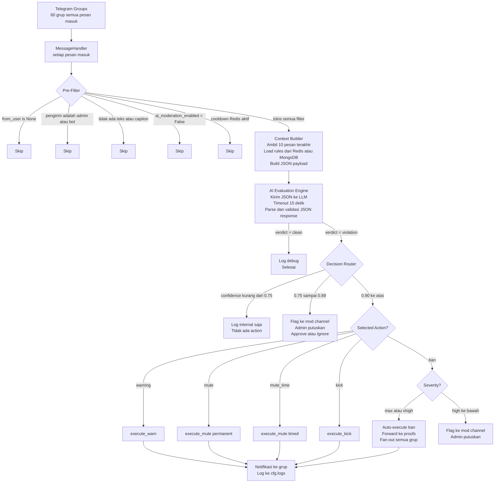

---

## 4. RULES — STRUKTUR & STORAGE

### Format File (rules/*.md)

Setiap file rule memiliki YAML frontmatter di bagian atas, diikuti konten teks EN untuk ditampilkan ke user.

**Contoh file `05-cheat.md` setelah ditambah frontmatter:**

```markdown
---
rule_id: cheat
display_name: "Cheat & Hack"
severity: xhigh
auto_actions:
  - warning
  - kick
  - ban
ai_enforceable: true
ai_description: >
  Prohibited: using or sharing any cheat, hack, maphack, wallhack, damage++,
  auto-targeting, aimbot, or any software/modification that gives unfair advantage
  in games. Sharing screenshots, videos, or download links of cheats is also
  prohibited. Discussing or promoting cheat tools of any kind is banned.
  IMPORTANT EXCEPTION: iPad View (screen mirroring) in PUBG Mobile and Mobile
  Legends is explicitly ALLOWED as it gives no unfair advantage.
  Violations result in immediate action without prior warning.
---

**CHEAT**
...konten EN lengkap...
```

### Apa yang Disimpan di MongoDB (collection: `rules`)

Hanya data yang diperlukan bot secara operasional. TypedDict berikut mengikuti konvensi persis
`documents.py` yang sudah ada (`total=False`, docstring satu baris, tanpa `_id` eksplisit karena
`rule_id` sudah jadi unique key operasional):

```python
RuleSeverity = Literal["low", "medium", "high", "xhigh", "max"]
RuleAction = Literal["warning", "mute", "mute_time", "kick", "ban"]


class RuleDoc(TypedDict, total=False):
    """MongoDB document for a single federation moderation rule."""

    rule_id: str            # unique key, contoh: "cheat"
    display_name: str       # untuk tampilan di bot, contoh: "Cheat & Hack"
    severity: RuleSeverity
    auto_actions: list[RuleAction]   # terurut ringan ke berat
    ai_enforceable: bool     # False = skip AI untuk rule ini
    ai_description: str      # dioptimalkan untuk AI, bukan untuk human
    content_en: str          # teks lengkap EN untuk ditampilkan ke user
    is_active: bool           # bisa di-disable tanpa hapus dari DB
```

> Tidak ada `content_id`, tidak ada `last_updated`. Terjemahan ID dilakukan secara on-demand (lihat Bagian 12). `last_updated` hanya relevan sebagai info di file `.md` asli, tidak perlu masuk DB.

### 27 Rules yang Ada Saat Ini

| No | rule_id | display_name | Severity | ai_enforceable |
|---|---|---|---|---|
| 01 | `18-plus` | 18+ Content | xhigh | Ya |
| 02 | `admin` | Admin Conduct | high | Tidak — butuh human judgment |
| 03 | `admin-power` | Admin Power Abuse | high | Tidak — butuh human judgment |
| 04 | `group-admin` | Group Admin Conduct | medium | Tidak — butuh human judgment |
| 05 | `cheat` | Cheat & Hack | xhigh | Ya |
| 06 | `crypto` | Cryptocurrency | high | Ya |
| 07 | `doxing` | Doxing & Privacy | high | Ya |
| 08 | `drugs` | Narcotics & Drugs | max | Ya |
| 09 | `fundraising` | Fundraising Abuse | high | Ya |
| 10 | `group-ownership` | Group Ownership | high | Tidak — tidak terdeteksi via chat |
| 11 | `gambling` | Gambling | high | Ya |
| 12 | `harmful-modules` | Harmful Modules | high | Ya |
| 13 | `keybox` | Keybox & VVIP Sales | max | Ya |
| 14 | `hate-speech` | Hate Speech | xhigh | Ya |
| 15 | `license-claiming` | License & Ownership | high | Ya |
| 16 | `nickname-pfp` | Nickname & Profile Picture | medium | Tidak — butuh inspeksi visual |
| 17 | `hoax-monopoly` | Hoax & Monopoly | high | Ya |
| 18 | `root-module` | Root Module Rules | high | Ya |
| 19 | `phishing` | Phishing | max | Ya |
| 20 | `piracy` | Piracy | high | Ya |
| 21 | `promotion` | Unauthorized Promotion | low | Ya |
| 22 | `provocation` | Provocation | medium | Ya |
| 23 | `racism-sara` | Racism & SARA | xhigh | Ya |
| 24 | `politics` | Political Content | high | Ya |
| 25 | `scam-ripper` | Scam & Ripper | max | Ya |
| 26 | `spam-flooding` | Spam & Flooding | low | Ya |
| 27 | `unethical-marketing` | Unethical Marketing | high | Ya |

**AI-enforceable: 21 rules.** Non-enforceable by AI: 6 rules (02, 03, 04, 10, 16 butuh human judgment penuh).

> **Keputusan (review lanjutan)**: rule `fundraising` (09) awalnya berstatus "Parsial — flag ke
> admin saja", tapi diputuskan **`ai_enforceable: true` penuh** — tidak dibatasi cuma
> flag-worthy, boleh juga auto-execute mengikuti aturan confidence/severity normal yang sama
> seperti 20 rule enforceable lain (Bagian 8), bukan kategori "flag only" khusus. `auto_actions`
> untuk rule ini diisi sama seperti rule severity `high` lainnya, tanpa pembatasan tambahan.

---

## 5. SISTEM SEVERITY

Severity mendefinisikan seberapa serius pelanggaran tersebut dan menentukan batas minimum action yang bisa AI rekomendasikan.

### Level Severity

| Level | Arti | Contoh Rules | Default Behavior |
|---|---|---|---|
| `low` | Gangguan kecil, tidak berbahaya | spam, flooding, promotion | AI auto-execute ringan saja |
| `medium` | Mengganggu suasana grup | provocation, nickname-pfp | AI auto-execute dengan notif |
| `high` | Pelanggaran serius, berdampak luas | politics, piracy, hate-speech | AI rekomendasikan, admin approve |
| `xhigh` | Sangat serius, multi-korban potensial | cheat, 18+, racism-sara | AI auto-ban dengan notif wajib |
| `max` | Kriminal atau zero-tolerance | phishing, scam, drugs, keybox | AI auto-ban langsung |

### Mapping Severity ke Action yang Diizinkan AI

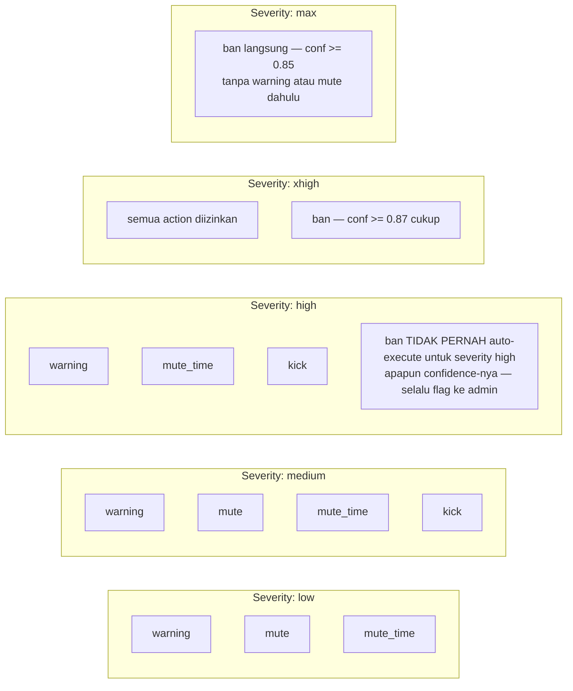

---

## 6. SISTEM ACTIONS

Tidak ada lagi `fban` sebagai action terpisah. Lima actions yang valid:

### 6.1 `warning`

Tambah peringatan ke user di grup tersebut. Jika mencapai batas warn (`cfg.warn_limit`), auto-escalate ke `ban`.

- Tersimpan di collection `warns`
- User bisa lihat warn count via `/warns @user`
- Tidak ada efek langsung ke kemampuan chat user
- Bot kirim pesan notifikasi ke grup bahwa user mendapat warn

### 6.2 `mute`

Mute permanen. **Dikonfirmasi: scope network-wide ke SEMUA grup yang terhubung**, memakai
infrastruktur mute yang sudah ada (`muting_flow._execute_mute`, `ActiveMuteDoc`) — bukan
kapabilitas single-group baru. Keputusan ini diambil sadar bahwa infrastruktur mute existing
memang federation-wide by design (`ActiveMuteDoc` bahkan tidak punya field `chat_id`), jadi
AI moderation mengikuti pola yang sama alih-alih membangun state single-group terpisah.

- `restrict_chat_member(permissions=ChatPermissions(can_send_messages=False), until_date=None)`
- Tersimpan di `mutes` (audit) dan `active_mutes` (state) — collection yang sama dengan mute manual
- Scope: **network-wide**, fan-out ke semua `active_groups()`, sama seperti `/mute` manual
- Bisa di-unmute via `/unmute` manual — tidak ada state AI mute terpisah yang bisa membingungkan

### 6.3 `mute_time`

Mute sementara dengan durasi tertentu. AI menentukan durasi berdasarkan severity. **Sama seperti
6.2, scope-nya network-wide** — mengikuti perilaku `_execute_mute` yang sudah ada, bukan per-grup.

- `restrict_chat_member(..., until_date=<datetime>)`
- Durasi yang bisa AI rekomendasikan:
  - Pelanggaran ringan pertama: `1h`
  - Pelanggaran sedang: `6h` atau `12h`
  - Pelanggaran berat pertama: `24h` atau `3d`
  - Maximum: `7d`
- Tersimpan di `active_mutes` dengan `until_date`
- Telegram handle expiry secara otomatis, tidak perlu background job

### 6.4 `kick`

Hapus user dari grup. User bisa join kembali via invite link.

- `ban_chat_member` lalu `unban_chat_member(only_if_banned=True)` — persis seperti `kicking_flow.py` yang ada
- Scope: satu grup saja
- Tidak memerlukan bukti formal
- Bot kirim notifikasi ke grup

### 6.5 `ban`

Ban permanen ke seluruh jaringan, fan-out ke semua 60 grup. Ini action paling berat.

- Memerlukan `reason` (string) + `proof` (lihat Bagian 7)
- Menggunakan `_execute_ban` yang sudah ada di `ban_flow.py`
- Fan-out via `fan_out()` ke semua `active_groups()`
- Tersimpan di collection `bans` sebagai `BanDoc`
- Appeal tetap tersedia lewat sistem yang sudah ada
- Bot kirim notifikasi ke `cfg.logs` channel dengan tombol appeal

### Tabel Ringkasan Actions

| Action | Durasi | Scope | Butuh Proof Formal | Bisa AI Otomatis |
|---|---|---|---|---|
| `warning` | Permanent (counter) | Per-grup | Tidak | Ya |
| `mute` | Permanent | **Network-wide** (semua grup terhubung) | Tidak | Ya |
| `mute_time` | Sementara 1h sampai 7d | **Network-wide** (semua grup terhubung) | Tidak | Ya |
| `kick` | Permanent tapi bisa re-join | Per-grup | Tidak | Ya |
| `ban` | Permanent bisa di-unban | Network-wide | Ya (teks pesan) | Ya, jika confidence >= threshold |

---

## 7. PROOF DALAM KONTEKS AI

### Masalah

Sistem ban yang ada di `ban_flow.py` memerlukan bukti (`proof_message_id`). Untuk ban manual, admin attach screenshot atau forward pesan. AI **tidak bisa** menghasilkan screenshot atau gambar.

### Solusi: Pesan Itu Sendiri sebagai Bukti

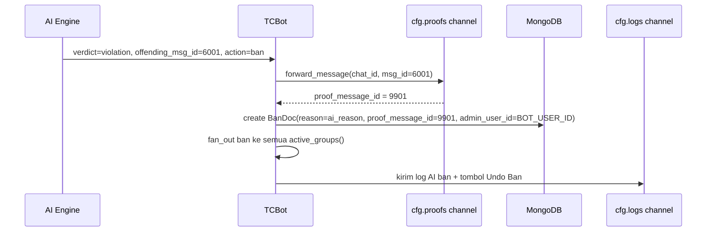

### Implikasi

- Field `proof_message_id` di `BanDoc` tetap terisi — link ke pesan asli yang di-forward ke proofs channel
- `reason` diisi oleh AI reasoning, bukan kosong
- Log channel menandai jelas bahwa ini "AI ban" bukan "manual ban"
- Admin tetap bisa undo jika AI salah via tombol di log channel

### Batas AI untuk Ban

AI tidak boleh ban atas dasar:
- Media saja (foto/video) tanpa teks pendamping yang melanggar
- Stiker tanpa konteks teks
- Link tanpa domain yang jelas berbahaya
- Pesan yang sangat ambigu dengan confidence di bawah threshold

Untuk kasus-kasus ini, AI hanya boleh flag ke admin atau pilih action lebih ringan.

### Koreksi Penting: `_execute_ban` Existing TIDAK Bisa Dipakai Langsung

Audit kode menemukan `_execute_ban` di `ban_flow.py` mem-forward `msgs: list[Message]` lewat
`upload_proof()`, yang **hanya menangani `.photo`/`.video`** — pesan teks murni (kasus AI ban)
akan gagal upload dan `proof_msg_id` jadi `None`. Menambah parameter opsional `is_ai_ban`/
`ai_proof_msg_id` ke fungsi ini **tidak menyelesaikan masalah itu** dan berisiko regresi ke jalur
ban manual yang sudah dipakai di 60 grup produksi.

**Keputusan final**: AI ban memakai fungsi baru dan terisolasi,
`action_executor.execute_ai_ban()`, yang menulis langsung ke `bans_db.create_ban()` dengan
`proof_message_id` hasil `forward_message()`, lalu memanggil `fan_out()` sendiri — meniru pola
akhir `_execute_ban` (fan-out + log + PM ke target) tanpa memanggil fungsi itu maupun
memodifikasi signature-nya. Lihat Bagian 16 untuk detail.

---

## 8. FLOW LENGKAP: PESAN MASUK KE KEPUTUSAN AI KE EKSEKUSI

### Flow Utama

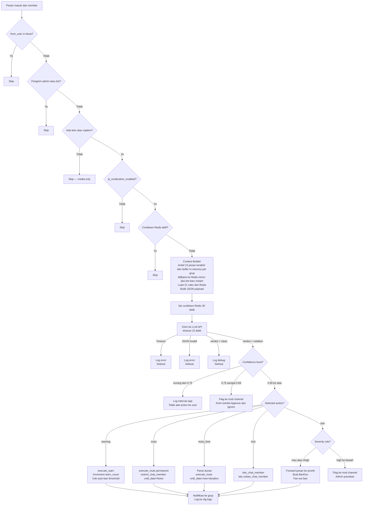

### Flow Warning dengan Auto-Escalate

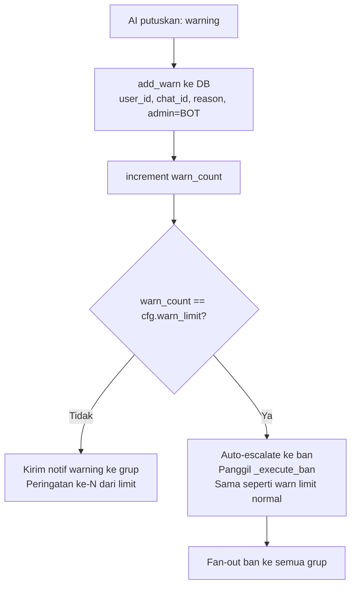

### Threshold Decision Matrix

| Confidence | Severity Action | Hasil |
|---|---|---|
| kurang dari 0.75 | apapun | Log saja, tidak ada action |
| 0.75 sampai 0.89 | apapun | Flag ke mod channel, tunggu admin |
| 0.90 ke atas | warning, mute, mute_time, kick | Auto-execute |
| 0.87 ke atas | ban + severity xhigh | Auto-execute ban |
| 0.85 ke atas | ban + severity max | Auto-execute ban |
| berapapun | ban + severity high ke bawah | **Tidak pernah** auto-execute — selalu flag ke mod channel |

> **Koreksi (review lanjutan)**: baris "0.90 ke atas, ban + severity max/xhigh, auto-execute"
> di draft sebelumnya adalah sisa draft lama yang kontradiksi dengan dua baris `AI_CONF_BAN_XHIGH`
> (0.87) dan `AI_CONF_BAN_MAX` (0.85) di Bagian 19 — sudah dihapus. Tidak ada toggle `auto_ban`
> per-grup/per-rule di skema manapun (`RuleDoc` maupun `GroupDoc`); severity `high` **selalu**
> di-flag ke admin, tidak pernah auto-ban, terlepas dari confidence berapa pun.

---

## 9. FORMAT JSON KE AI

JSON yang dikirim sebagai `user` message ke LLM. Harus tepat format ini.

### System Prompt (dikirim sekali sebagai `system` role)

```
You are a strict AI moderator for TCF (Transsion Community Network), a Telegram
tech and gaming community with 60 groups and 600,000 members. You enforce community
rules and output ONLY valid JSON.

CRITICAL INSTRUCTIONS:
1. Output ONLY a single valid JSON object. No text before {, no text after }.
2. Evaluate the ENTIRE conversation, not just the last message.
3. If multiple violations exist, pick the SINGLE most severe one.
4. "selected_action" MUST be one of the values in that rule's "auto_actions" array.
5. For "mute_time" action, you MUST include "mute_duration" field (e.g. "1h", "6h", "24h", "3d", "7d").
6. "reason" must be factual, concise (max 2 sentences), and in the same language as the offending message.
7. Confidence reflects your certainty that this IS a violation (0.0 = not sure, 1.0 = certain).

SELECTION LOGIC for "selected_action":
- Choose from the rule's auto_actions array (ordered lightest to heaviest).
- For first-time violations: prefer lighter actions unless severity is xhigh or max.
- For users who continued after being warned in the conversation: escalate one level.
- For severity "max": always pick the heaviest action in the array.

OUTPUT FORMAT if violation detected:
{
  "verdict": "violation",
  "rule_violated": "<rule_id>",
  "offending_msg_id": <integer>,
  "offending_user_id": <integer>,
  "confidence": <float 0.0-1.0>,
  "severity": "<low|medium|high|xhigh|max>",
  "selected_action": "<warning|mute|mute_time|kick|ban>",
  "mute_duration": "<string or null>",
  "reason": "<factual explanation max 2 sentences>"
}

OUTPUT FORMAT if no violation:
{
  "verdict": "clean",
  "confidence": <float 0.0-1.0>,
  "reason": "<1 sentence>"
}
```

### User Message (JSON Payload per Evaluasi)

```json
{
  "group": {
    "chat_id": -100123456789,
    "title": "TCF Gaming Indonesia"
  },
  "conversation": [
    {
      "msg_id": 5997,
      "user_id": 799,
      "name": "Budi",
      "username": "budi_gamer",
      "text": "ada yang tau cara upgrade kernel ga?",
      "reply_to": null,
      "timestamp": "2026-07-11T13:00:00Z",
      "has_media": false
    },
    {
      "msg_id": 5998,
      "user_id": 800,
      "name": "Siska",
      "username": null,
      "text": "cek channel kernel dev bro",
      "reply_to": 5997,
      "timestamp": "2026-07-11T13:00:15Z",
      "has_media": false
    },
    {
      "msg_id": 5999,
      "user_id": 801,
      "name": "KeyMaster",
      "username": "keymaster_vip",
      "text": "OPEN KEYBOX VVIP!! Keybox exclusive premium kami sudah teruji di 500+ device. Garansi aktif PlayIntegrity. Harga mulai 15rb/bulan. Daftar sekarang!",
      "reply_to": null,
      "timestamp": "2026-07-11T13:00:45Z",
      "has_media": false
    }
  ],
  "rules": [
    {
      "rule_id": "keybox",
      "severity": "max",
      "auto_actions": ["kick", "ban"],
      "description": "Keyboxes are FREE and open-source credentials. Strictly prohibited: selling/reselling keyboxes, promoting paid keybox services, labeling modules as VVIP/PREMIUM/EXCLUSIVE to charge money. Any commercialization of keyboxes = immediate ban. Community guidance: keyboxes are public and free, never pay for them."
    },
    {
      "rule_id": "promotion",
      "severity": "low",
      "auto_actions": ["warning", "mute", "kick"],
      "description": "Members are not allowed to promote products, services, or other groups without prior admin approval."
    },
    {
      "rule_id": "scam-ripper",
      "severity": "max",
      "auto_actions": ["kick", "ban"],
      "description": "Fraudulent activities (scam) or avoiding transaction responsibilities (ripper). Any form of financial fraud or deceptive transactions results in permanent removal."
    }
  ]
}
```

### Catatan Penting untuk Payload

1. **`conversation`**: Maksimal 10 pesan terakhir. AI butuh konteks, bukan seluruh riwayat.
   **Sumber data**: buffer in-memory per `chat_id` (`deque(maxlen=10)`, mengikuti pola `_albums`
   di `ban_flow.py`) sebagai jalur utama — nol latensi tambahan karena tidak menulis ke MongoDB
   setiap pesan masuk (60 grup aktif × tiap pesan ke MongoDB akan membebani database dan justru
   menambah delay). Buffer ini di-mirror secara asinkron (non-blocking) ke Redis list dengan TTL
   pendek sebagai jaring pengaman jika bot restart, sehingga context tidak hilang total. **Tidak
   ada collection MongoDB baru untuk histori pesan mentah** — ini koreksi dari asumsi awal PRD
   yang menganggap sumber data ini "sudah ada".
2. **`has_media`**: `true` jika pesan punya foto/video/stiker. Jika `has_media: true` dan `text: null`, AI tidak bisa evaluate dan harus return `clean`.
3. **`rules`**: Kirim HANYA rules dengan `ai_enforceable: true` — 21 dari 27 (termasuk
   `fundraising`, lihat Bagian 4/22.5).
4. **Order conversation**: Dari yang terlama ke yang terbaru, ascending timestamp.
5. **Field yang tidak perlu**: Jangan kirim field DB internal seperti ObjectId, timestamps DB. Hanya field yang relevan untuk konteks percakapan.

---

## 10. FORMAT JSON OUTPUT DARI AI

### Kasus: Violation Ditemukan

```json
{
  "verdict": "violation",
  "rule_violated": "keybox",
  "offending_msg_id": 5999,
  "offending_user_id": 801,
  "confidence": 0.96,
  "severity": "max",
  "selected_action": "ban",
  "mute_duration": null,
  "reason": "User KeyMaster explicitly sells keyboxes with VVIP/PREMIUM labeling and subscription pricing (15rb/month), violating the rule that keyboxes must be free and open-source."
}
```

### Kasus: Action mute_time

```json
{
  "verdict": "violation",
  "rule_violated": "spam-flooding",
  "offending_msg_id": 6012,
  "offending_user_id": 820,
  "confidence": 0.91,
  "severity": "low",
  "selected_action": "mute_time",
  "mute_duration": "1h",
  "reason": "User sent 8 identical promotional messages within 2 minutes, disrupting the discussion flow."
}
```

### Kasus: Clean

```json
{
  "verdict": "clean",
  "confidence": 0.97,
  "reason": "All messages are on-topic tech discussion with no rule violations detected."
}
```

### Validasi Output (Bot Harus Cek Sebelum Eksekusi)

```python
# Validasi wajib — jika gagal, treat as "clean" dan log error
assert output["verdict"] in ("violation", "clean")

if output["verdict"] == "violation":
    assert isinstance(output["rule_violated"], str)
    assert isinstance(output["offending_msg_id"], int)
    assert isinstance(output["offending_user_id"], int)
    assert 0.0 <= output["confidence"] <= 1.0
    assert output["severity"] in ("low", "medium", "high", "xhigh", "max")
    assert output["selected_action"] in ("warning", "mute", "mute_time", "kick", "ban")
    assert isinstance(output["reason"], str) and len(output["reason"]) > 0

    if output["selected_action"] == "mute_time":
        assert output["mute_duration"] is not None
        assert re.match(r"^\d+[hd]$", output["mute_duration"])

    # Pastikan selected_action ada di auto_actions rule yang dimaksud
    rule = get_rule_by_id(output["rule_violated"])
    assert output["selected_action"] in rule["auto_actions"]
```

### Parsing JSON Tidak Valid dari AI

AI terkadang mengirim JSON dengan karakter ekstra seperti code fences. Parsing harus robust:

```python
def parse_ai_response(raw: str) -> dict:
    raw = re.sub(r"```(?:json)?\n?", "", raw).strip()
    match = re.search(r"\{.*\}", raw, re.DOTALL)
    if not match:
        raise ValueError("No JSON object found in AI response")
    return json.loads(match.group())
```

---

## 11. ACTION FLOWS DETAIL

### 11.1 Flow `warning`

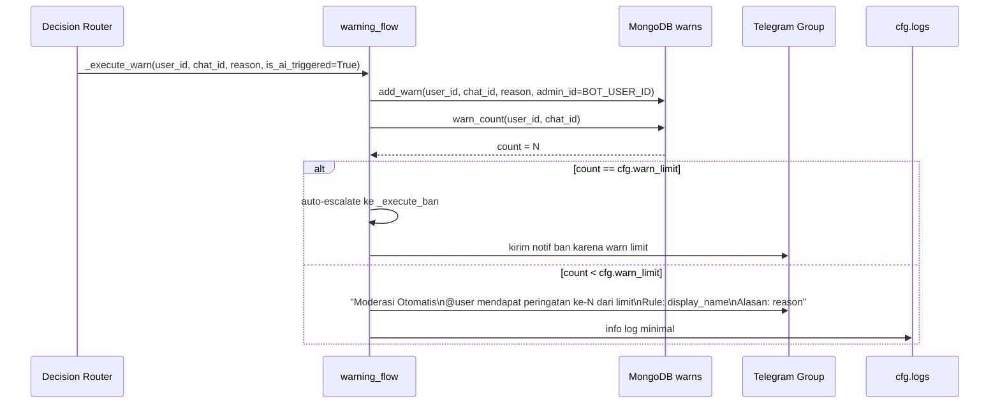

### 11.2 Flow `mute` (Permanent)

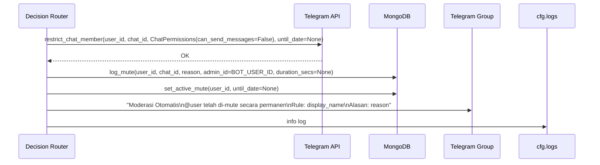

### 11.3 Flow `mute_time` (Sementara)

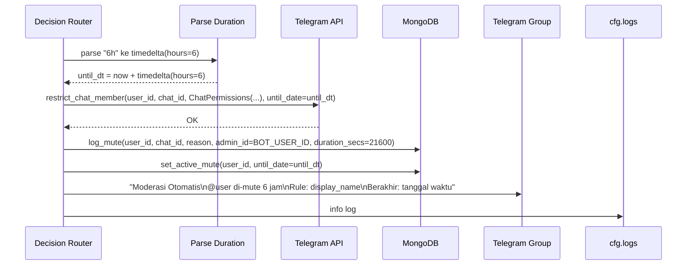

**Durasi valid (strict whitelist):** `1h`, `3h`, `6h`, `12h`, `24h`, `2d`, `3d`, `7d`

Jika AI kirim durasi di luar whitelist ini (contoh: `"forever"`, `"30m"`), bot fallback ke `1h` dan log warning.

### 11.4 Flow `kick`

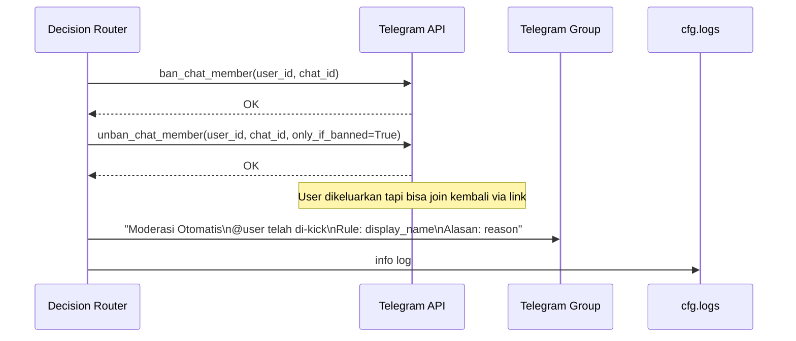

### 11.5 Flow `ban` (Network-Wide)

**Koreksi**: fungsi existing `ban_flow._execute_ban` **tidak dipanggil sama sekali** (lihat Bagian
7 dan 16). Jalur eksekusi memakai `action_executor.execute_ai_ban()` yang baru dan terisolasi,
menulis langsung ke `bans_db.create_ban()` + `fan_out()` sendiri, meniru pola akhir
`_execute_ban` tanpa dependency ke fungsi itu:

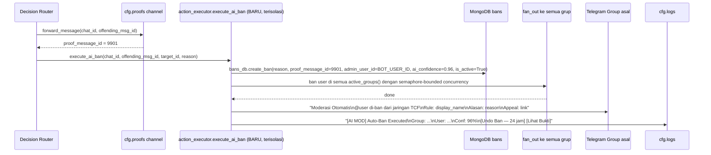

---

## 12. SISTEM TERJEMAHAN OTOMATIS EN KE ID

### Masalah

Rules hanya disimpan dalam Bahasa Inggris di DB. Ketika user minta lihat rules via `/rules`, komunitas mayoritas berbahasa Indonesia, sehingga perlu terjemahan.

### Solusi: MyMemory API (Free, Tanpa API Key)

MyMemory dipilih karena:
- Gratis sepenuhnya hingga 1.000 permintaan/hari tanpa API key
- Dengan parameter email: 10.000 karakter/hari
- Tidak perlu autentikasi untuk penggunaan basic
- Mendukung EN ke ID dengan baik

**Endpoint:**
```
GET https://api.mymemory.translated.net/get?q={text}&langpair=en|id
```

**Response:**
```json
{
  "responseStatus": 200,
  "responseData": {
    "translatedText": "teks terjemahan"
  }
}
```

### Flow Terjemahan

**Keputusan (Q5)**: tidak ada `MYMEMORY_EMAIL` yang disediakan dari awal, jadi limit tetap
1.000 req/hari. Untuk mencegah 27 rules re-translate bersamaan di hari yang sama (yang akan
langsung menghabiskan kuota), TTL cache **di-stagger** dengan jitter acak per rule alih-alih
TTL 7 hari yang identik untuk semua rule:

```python
import random

BASE_TTL = 7 * 86400          # 7 hari
JITTER_MAX = 86400            # +0 sampai +1 hari acak per rule

def stagger_ttl() -> int:
    return BASE_TTL + random.randint(0, JITTER_MAX)
```

```mermaid
flowchart TD
    A[User ketik /rules di grup] --> B{Redis cache ada?\nkey: rule_translated:rule_id:id}
    B -->|Ada, TTL 7-8 hari ter-stagger| C[Tampilkan dari cache]
    B -->|Tidak ada| D[Ambil content_en dari MongoDB]
    D --> E[Kirim ke MyMemory API\nGET langpair=en|id]
    E -->|Sukses| F[Simpan hasil ke Redis\nTTL 7 hari + jitter acak 0-24 jam]
    F --> G[Tampilkan ke user]
    E -->|Gagal timeout atau rate limit| H[Fallback tampilkan EN\ntanpa error ke user]
```

### Batasan Terjemahan

- Terjemahan otomatis tidak sempurna untuk istilah teknis seperti keybox, rootmodule, fban
- Istilah teknis dibiarkan dalam EN, tidak diterjemahkan
- Terjemahan hanya untuk tampilan user, **tidak mempengaruhi ai_description** yang selalu EN

### Perbandingan Alternatif

| Library | Tipe | Limit | Kekurangan |
|---|---|---|---|
| MyMemory | Online API | 1.000 req/hari | Tergantung internet |
| argostranslate | Offline Python | Unlimited | Model sekitar 100MB perlu download |
| GoogleTrans unofficial | Online | Unlimited tapi tidak stabil | Sering di-block Google |
| LibreTranslate self-hosted | Online atau Offline | Unlimited | Perlu hosting sendiri |

Rekomendasi: MyMemory untuk sekarang. Jika volume naik, switch ke argostranslate yang offline dan tidak ada rate limit.

---

## 13. SEEDING RULES KE DATABASE

### Kapan Seeding Terjadi

Satu kali saat bot pertama kali dijalankan, atau ketika collection `rules` kosong. Setelah itu, rules dikelola via DB dan tidak pernah baca file `.md` lagi dalam operasional normal.

### Flow Seeding

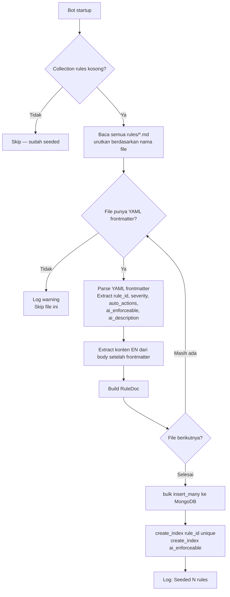

### Prasyarat: YAML Frontmatter

Setiap file `rules/*.md` harus punya YAML frontmatter (ditulis manual sekali untuk semua 27 file):

```yaml
---
rule_id: "cheat"
display_name: "Cheat & Hack"
severity: "xhigh"
auto_actions:
  - "warning"
  - "kick"
  - "ban"
ai_enforceable: true
ai_description: >
  Prohibited: maphack, wallhack, damage++, auto-targeting, aimbot, any unfair
  modification, sharing/discussing/promoting cheat tools. EXCEPTION: iPad View
  in PUBG/ML is allowed (no unfair advantage). Violations = immediate action.
---

**CHEAT**
... konten EN asli ...
```

### Lokasi Kode Seeding (Koreksi)

Tidak ada modul di `tcbot/modules/` yang melakukan seeding data sendiri — pola yang sudah ada
adalah `_post_init()` di `__main__.py` memanggil fungsi setup lewat `asyncio.gather` (lihat
`ensure_indexes()`, `ensure_initial_owner()`). Karena itu, `seed_rules()` **bukan** file terpisah
`ai_moderation/seeder.py` seperti draft awal, melainkan fungsi di `tcbot/database/rules_db.py`,
dipanggil dari `_post_init()` sejajar dengan `ensure_indexes()`. Index untuk collection `rules`
juga ditambahkan ke `mongos.py::ensure_indexes()` yang sudah ada, bukan fungsi index terpisah.

### Proses Seeding (Kode)

```python
# tcbot/database/rules_db.py
async def seed_rules(db: AsyncIOMotorDatabase) -> None:
    collection = db["rules"]

    if await collection.count_documents({}) > 0:
        logger.info("rules already seeded, skipping")
        return

    rules_dir = Path("rules")
    docs = []

    for md_file in sorted(rules_dir.glob("*.md")):
        with open(md_file) as f:
            content = f.read()

        parts = content.split("---", 2)
        if len(parts) < 3:
            logger.warning(f"No frontmatter in {md_file}, skipping")
            continue

        meta = yaml.safe_load(parts[1])
        body_en = parts[2].strip()

        doc = {
            "rule_id":        meta["rule_id"],
            "display_name":   meta["display_name"],
            "severity":       meta["severity"],
            "auto_actions":   meta["auto_actions"],
            "ai_enforceable": meta["ai_enforceable"],
            "ai_description": meta["ai_description"],
            "content_en":     body_en,
            "is_active":      True,
        }
        docs.append(doc)

    if docs:
        await collection.insert_many(docs)
        logger.info(f"Seeded {len(docs)} rules")
        # index rule_id (unique) dan ai_enforceable dibuat di mongos.py::ensure_indexes(),
        # bukan di sini — mengikuti pola index-management terpusat yang sudah ada
```

### Re-seeding dan Update Rules

Untuk update rule setelah awal seeding:
- Gunakan command admin di bot: `/admin_update_rule <rule_id>` — update field tertentu di DB
- Atau script CLI `python -m tcbot.scripts.update_rules` yang baca frontmatter terbaru dari file
- Setelah update DB, bot otomatis invalidate cache Redis untuk rule tersebut

---

## 14. COOLDOWN & RATE LIMITING AI

### Mengapa Cooldown Diperlukan

Tanpa cooldown, grup yang ramai bisa trigger AI call ratusan kali per menit, menyebabkan:
- Cost API tinggi
- Rate limit dari LLM provider
- Latency tinggi yang memblokir event loop bot

### Implementasi Cooldown

Per-grup cooldown: 30 detik

```python
COOLDOWN_KEY = "ai_moderation:cooldown:{chat_id}"
COOLDOWN_TTL = 30  # detik

async def is_cooldown_active(chat_id: int) -> bool:
    return await redis.exists(COOLDOWN_KEY.format(chat_id=chat_id))

async def set_cooldown(chat_id: int) -> None:
    await redis.setex(COOLDOWN_KEY.format(chat_id=chat_id), COOLDOWN_TTL, 1)
```

### Sliding Window Context

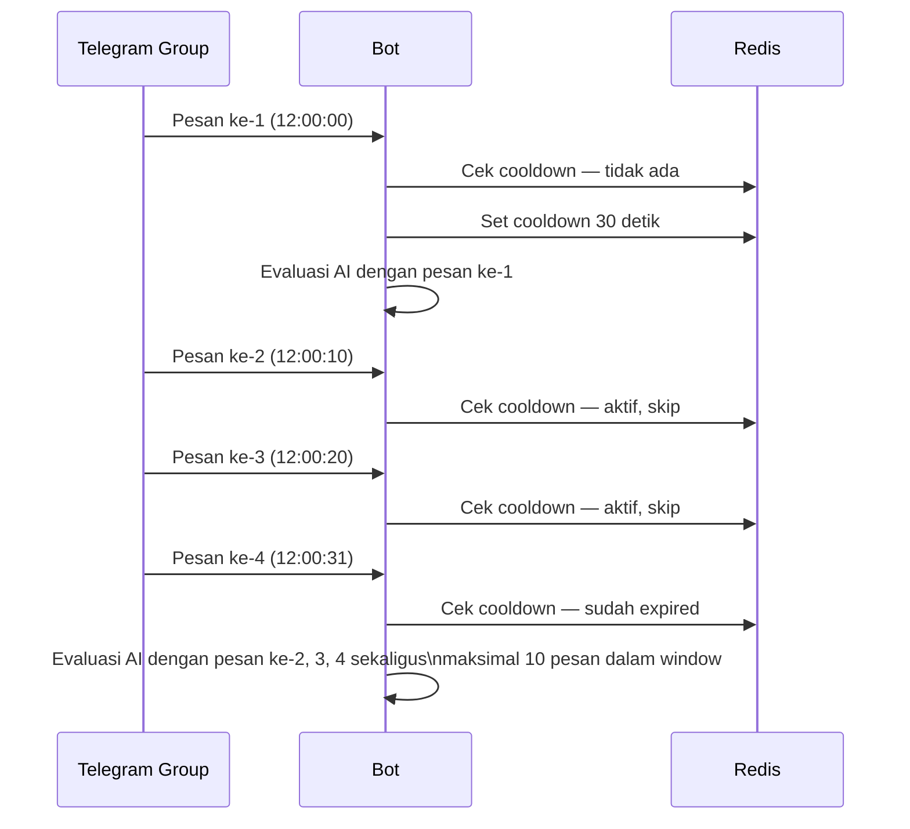

Tidak ada celah — user yang melanggar saat cooldown tetap tertangkap di evaluasi berikutnya karena pesan masuk ke context window.

### Rate Limiting Tambahan

- Max AI calls per jam per bot instance: 500 (safetynet global)
- Timeout per AI call: 15 detik. Jika timeout, tidak ada action
- Max retry: 0. Gagal berarti skip, coba di evaluasi berikutnya

---

## 15. LOG CHANNEL & NOTIFIKASI ADMIN

### Format Pesan ke Grup Setelah Action Dieksekusi

**Untuk warning:**
```
[Moderasi Otomatis]

Pengguna @username [ID: 801] mendapat peringatan.

Rule   : Cheat & Hack
Alasan : User membagikan link download cheat maphack.
Status : Peringatan ke-2 dari 3

Tidak setuju? Hubungi admin grup.
```

**Untuk mute atau mute_time:**
```
[Moderasi Otomatis]

Pengguna @username [ID: 820] telah di-mute selama 1 jam.

Rule    : Spam & Flooding
Alasan  : User mengirim 8 pesan promosi identik dalam 2 menit.
Berakhir: 11 Jul 2026 14:00 WIB
```

**Untuk kick:**
```
[Moderasi Otomatis]

Pengguna @username [ID: 905] telah di-kick dari grup.

Rule   : Piracy
Alasan : User membagikan link download FKM versi ilegal.
```

**Untuk ban:**
```
[Moderasi Otomatis]

Pengguna @keymaster_vip [ID: 801] telah di-ban dari jaringan TCF.

Rule   : Keybox & VVIP Sales
Alasan : Menjual keybox dengan label VVIP dan harga berlangganan 15rb/bulan.
Appeal : [Ajukan Banding]
```

### Format Log ke cfg.logs Channel

**Untuk semua actions yang dieksekusi otomatis:**
```
[AI MOD] Action Executed

Group  : TCF Gaming ID (-100123456789)
User   : KeyMaster (@keymaster_vip) [ID: 801]
Rule   : keybox (max severity)
Action : BAN (network-wide)
Conf.  : 96%
Reason : Menjual keybox dengan label VVIP dan harga berlangganan.

[Lihat Pesan Asli] [Lihat Bukti] [Undo Ban] (aktif 24 jam sejak ban)
```

**Untuk flag ke admin (confidence 0.75 sampai 0.89):**
```
[AI MOD] Review Required

Group  : TCF Gaming ID
User   : SomeMember (@some_user) [ID: 905]
Rule   : piracy (high severity)
Suggest: kick
Conf.  : 81%
Reason : User membahas download FKM illegal dengan link channel Telegram.

Preview Pesan:
"nah mending download FKM yang versi gratis aja, ada di t.me/..."

[Approve Kick] [Escalate to Ban] [Ignore] [Lihat Konteks]
```

**Untuk AI ban dengan bukti:**
```
[AI MOD] Auto-Ban Executed

Group  : TCF Gaming ID
User   : KeyMaster (@keymaster_vip) [ID: 801]
Rule   : keybox (MAXIMUM severity)
Conf.  : 96%
Reason : Menjual keybox dengan label VVIP dan harga berlangganan (15rb/bulan).

Ini adalah ban otomatis oleh AI. Verifikasi jika perlu.

[Lihat Bukti di proofs] [Undo Ban — aktif 24 jam] [Lihat Appeal]
```

---

## 16. INTEGRASI DENGAN KODE YANG SUDAH ADA

### Prinsip Utama

Tidak ada kode yang sudah ada yang dihapus atau diubah besar. AI moderation adalah lapisan baru
(`tcbot/modules/ai_moderation/`) yang **sebisa mungkin menulis langsung ke `*_db.py`** alih-alih
memanggil fungsi `*_flow.py` yang terikat erat ke `Update`/`ctx.user_data` dari command manual.
Satu-satunya pengecualian adalah `warning_flow.execute_warn()`, yang boleh menerima parameter
eksplisit opsional karena logic auto-ban-nya kompleks dan sayang diduplikasi.

### File Baru yang Perlu Dibuat

```
tcbot/
├── modules/
│   ├── ai_moderation/
│   │   ├── __init__.py
│   │   ├── handler.py              <- MessageHandler entry point
│   │   ├── context_builder.py      <- Build JSON payload dari buffer in-memory + rules
│   │   ├── ai_client.py            <- Panggil LLM API + parse response (class AIModerationClient)
│   │   ├── decision_router.py      <- Logic routing berdasarkan confidence
│   │   └── action_executor.py      <- Eksekusi action, ISOLASI dari *_flow.py existing
│   └── ...
├── database/
│   └── rules_db.py                 <- BARU: CRUD + cache untuk collection rules + seed_rules()
└── utils/
    └── translator.py               <- BARU: MyMemory API wrapper
```

> **Koreksi terhadap draft awal**: tidak ada `seeder.py` di dalam package (lihat Bagian 13).
> `ai_moderation/` sebagai **package** (folder dengan `__init__.py`) **tidak akan ter-load
> otomatis** oleh `_discover_modules()` di `tcbot/modules/__init__.py` — fungsi itu memakai
> `this_dir.glob("*.py")`, hanya file `.py` langsung, tidak rekursif ke subfolder. `handler.py`
> di dalamnya **tidak** boleh diasumsikan otomatis terdaftar lewat `__handlers__` seperti modul
> lain di `MODULES_LOAD`/`MODULES_NO_LOAD` — registrasinya **wajib manual** di `__main__.py`
> (lihat "Handler Registration" di bawah). Jika lupa didaftarkan, seluruh fitur silently tidak
> jalan tanpa error jelas — mitigasi: tambahkan log INFO eksplisit saat `_post_init` yang
> menyatakan status AI moderation aktif/nonaktif.

### Fungsi Existing yang Dipakai — Ulang, Bukan Dipanggil Langsung

Nama fungsi di draft awal PRD tidak seluruhnya cocok dengan kode nyata (`execute_warn` dan
`execute_kick` public tanpa underscore, `_execute_ban` memang private). Tabel berikut
mencerminkan pendekatan final: reuse langsung untuk warn, jalur baru terisolasi untuk mute/kick/ban.

| Existing / DB Layer | Dipakai AI Moderation Untuk | Cara Pakai |
|---|---|---|
| `warning_flow.execute_warn()` | Action `warning` | Panggil langsung dengan parameter eksplisit baru (chat_id/admin_id/admin_fname tidak dari `Update`) |
| `muting_flow._execute_mute()` | Action `mute` dan `mute_time` | Panggil langsung — sudah federation-wide, cocok tanpa modifikasi |
| `bans_db.create_ban()` + `fan_out()` | Action `ban` | **Tidak** lewat `_execute_ban` — `action_executor.execute_ai_ban()` menulis langsung ke DB + fan-out sendiri |
| `kicking_flow` pattern (bukan fungsi-nya) | Action `kick` | `action_executor.execute_ai_kick()` baru, meniru `ban_chat_member` + `unban_chat_member` tanpa dependency `Update` |
| `warns_db.add_warn()` dan `warn_count()` | Record AI warning | Dipanggil dari dalam `execute_warn` yang sudah ada |
| `mutes_db.log_mute()` dan `set_active_mute()` | Record AI mute | Dipanggil dari dalam `_execute_mute` yang sudah ada |
| `groups_db.active_groups()` | Fan-out mute/ban ke semua grup | Sudah dipakai otomatis oleh `_execute_mute`/`execute_ai_ban` |

### Modifikasi pada Kode Existing — Diperjelas

**`ban_flow._execute_ban()` — TIDAK DIUBAH.** Draft awal mengusulkan dua parameter opsional
(`is_ai_ban`, `ai_proof_msg_id`), tapi ini tidak menyelesaikan masalah inti: `upload_proof()`
hanya menangani `.photo`/`.video`, bukan pesan teks. Modifikasi itu dibatalkan — AI ban memakai
`action_executor.execute_ai_ban()` yang terpisah total, lihat Bagian 7.

**`muting_flow._execute_mute()` — TIDAK DIUBAH, TAPI TIDAK DIPANGGIL LANGSUNG (koreksi review
lanjutan).** Draft sebelumnya salah mengklaim fungsi ini "cocok dipanggil langsung tanpa
modifikasi" karena sudah federation-wide. Audit kode nyata menunjukkan `_execute_mute` **hard
depend** pada `update.effective_chat.id` (harus non-`None`) dan tanpa syarat memanggil
`bot.edit_message_text` ke sebuah `prompt_chat`/`prompt_id` di `meta` — field ini cuma ada karena
fungsi ini didesain sebagai ekor sebuah `ConversationHandler` interaktif (`/mute` manual, di mana
ada pesan prompt yang sedang di-edit jadi ringkasan). AI moderation tidak punya `Update` asli
maupun pesan prompt untuk di-edit; memanggil fungsi ini langsung akan **error** di baris
`edit_message_text`, bukan "jalan tanpa modifikasi" seperti klaim sebelumnya.

**Keputusan final**: `action_executor.execute_ai_mute()` dan `execute_ai_mute_time()` adalah
implementasi **baru dan terisolasi**, sama seperti `execute_ai_kick()`/`execute_ai_ban()` —
mereplikasi bagian inti `_execute_mute` (fan-out `restrict_chat_member` ke semua grup + tulis
`mutes_db.log_mute()`/`set_active_mute()` + kirim notifikasi log & grup), tapi **skip** langkah
`edit_message_text` ke prompt yang memang tidak relevan untuk pemanggilan non-interaktif. Fungsi
`_execute_mute` existing tetap tidak disentuh sama sekali dan tetap dipakai apa adanya untuk
`/mute` manual.

**`kicking_flow.execute_kick()` — TIDAK DIUBAH.** Bergantung pada `update.effective_*`, tidak
cocok dipanggil programatik oleh AI. `action_executor.execute_ai_kick()` baru dibuat terpisah,
menduplikasi logic `ban_chat_member` + `unban_chat_member(only_if_banned=True)` tanpa
menyentuh fungsi existing.

**`warning_flow.execute_warn()` — satu-satunya fungsi existing yang menerima perubahan**, berupa
parameter opsional baru dengan default `None` yang fallback ke `update.effective_*` bila
dipanggil dari command manual seperti biasa:

```python
async def execute_warn(
    update: Update | None,               # None jika dipanggil dari AI moderation
    ctx: ContextTypes.DEFAULT_TYPE,
    ...,                                   # parameter existing lainnya
    chat_id: int | None = None,            # BARU — wajib diisi jika update=None
    admin_id: int | None = None,           # BARU — diisi bot_user_id untuk AI warn
    admin_fname: str | None = None,        # BARU
) -> ...:
    # Jika update tidak None, ambil chat_id/admin_id/admin_fname dari update.effective_* seperti biasa
    # Jika update None, gunakan parameter eksplisit — wajib tidak None
    ...
```

Perubahan ini tetap butuh test regresi penuh untuk command `/warn` manual karena fungsi ini
kompleks (auto-ban logic, fed_warn_limit, dst), meski risikonya rendah karena backward-compatible.

### `parse_logmsg.py` dan `keyboards.py` yang Sudah Ada Juga Perlu Ditambah

Supaya konsisten dengan `LogBuilder` dan keyboard existing, bukan format/keyboard custom di
dalam modul baru:

- `parse_logmsg.py`: tambah `ai_action_log()`, `ai_flag_log()`, `ai_autoban_log()`
- `keyboards.py`: tambah `ai_flag_kb(eval_id)` (tombol Approve/Escalate/Ignore) dan
  `ai_autoban_kb(eval_id)` (tombol Undo Ban/Lihat Bukti)

### Handler Registration

Di `tcbot/__main__.py`, tambah handler AI moderation dengan group tinggi agar diproses terakhir.
Ini **wajib manual** karena package tidak ikut sistem `MODULES_LOAD` berbasis nama file:

```python
from tcbot.modules.ai_moderation.handler import ai_moderation_handler

app.add_handler(ai_moderation_handler, group=50)
# group 50 = setelah semua handler normal (group -1, 10, dst)
logger.info("AI moderation handler registered (group=50)")
```

### Diagram Relasi Modul

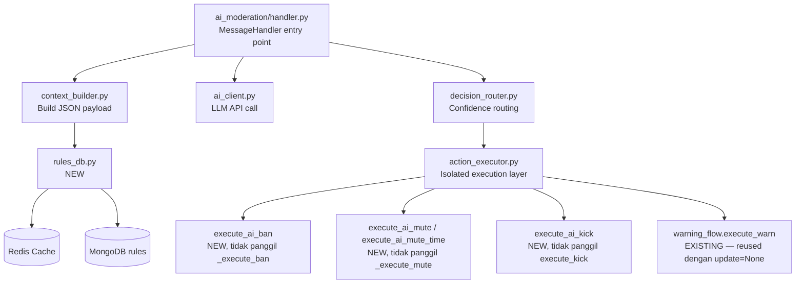

> **Koreksi (review lanjutan)**: diagram sebelumnya adalah leftover draft v1.0 sebelum keputusan
> isolasi fungsi diambil — masih mengarah ke `_execute_ban`/`_execute_mute`/`execute_kick`
> existing, kontradiksi langsung dengan teks "Modifikasi pada Kode Existing" tepat di atasnya.
> Diagram sudah diperbaiki agar konsisten: hanya `execute_warn` yang benar-benar dipanggil
> langsung (reused), tiga lainnya adalah implementasi baru yang terisolasi.

---

## 17. RULES YANG TIDAK BISA DI-ENFORCE AI

6 rules dengan `ai_enforceable: false` tetap ada di DB untuk keperluan tampilan ke user via `/rules`, referensi manual admin, dan dokumentasi. AI tidak pernah menerima rules ini dalam payload.

> **Koreksi (review lanjutan)**: `fundraising` sebelumnya masuk daftar ini sebagai "Parsial — flag
> ke admin saja". Sudah dipindah jadi `ai_enforceable: true` penuh (Bagian 4/22.5) — AI boleh
> auto-execute untuk rule ini sama seperti rule `high`-severity lain, tidak dibatasi flag-only.

| Rule | Kenapa Tidak Bisa AI | Penanganan |
|---|---|---|
| `admin` | Aturan untuk admin, bukan member biasa | Human only |
| `admin-power` | Abuse of power butuh konteks organisasi | Human only |
| `group-admin` | Tentang perilaku admin internal | Human only |
| `group-ownership` | Tentang kepemilikan grup, tidak terdeteksi via chat | Human only |
| `nickname-pfp` | Butuh inspeksi visual profil | Human only |
| `10-group-ownership` | Tidak ada sinyal teks yang bisa dideteksi | Human only |

---

## 18. EDGE CASES & PENANGANAN ERROR

### 18.1 Pesan Hanya Media Tanpa Teks

```python
if not (message.text or message.caption):
    return  # Skip — AI tidak bisa evaluate media
```

### 18.2 Pesan dari Anonymous Admin

```python
ANONYMOUS_BOT_ID = 1087968824
if from_user.id == ANONYMOUS_BOT_ID:
    return  # Skip — sudah ada guard di extraction.py
```

### 18.3 AI Return JSON Invalid

```python
try:
    result = parse_ai_response(raw_output)
    validate_ai_output(result)
except (json.JSONDecodeError, AssertionError, KeyError) as e:
    logger.error(f"AI output invalid: {e} | raw: {raw_output[:200]}")
    return  # Tidak ada action, tidak crash bot
```

### 18.4 AI Timeout

```python
try:
    result = await asyncio.wait_for(call_ai(payload), timeout=15.0)
except asyncio.TimeoutError:
    logger.warning(f"AI timeout for chat {chat_id}")
    return  # Skip, coba lagi di evaluasi berikutnya
```

### 18.5 User Sudah Kena Ban Aktif

```python
existing_ban = await bans_db.get_active_ban(user_id)
if existing_ban:
    return  # User sudah di-ban, skip evaluasi
```

### 18.6 AI Rekomendasikan Action di Luar auto_actions Rule

```python
rule = await rules_db.get_rule(output["rule_violated"])
if output["selected_action"] not in rule["auto_actions"]:
    logger.error(f"AI picked invalid action {output['selected_action']} for rule {rule['rule_id']}")
    return
```

### 18.7 Pesan Sudah Dihapus Sebelum AI Selesai

```python
try:
    await bot.forward_message(cfg.proofs, chat_id, offending_msg_id)
except MessageIdInvalid:
    # Pesan sudah dihapus, kirim teks dari context sebagai fallback
    await bot.send_message(cfg.proofs, f"[Pesan dihapus]\nKonten: {offending_text}")
```

### 18.8 Grup Tidak Mengaktifkan AI Moderation

AI moderation bersifat opt-in per grup. `GroupDoc` sudah `total=False`, jadi menambah field ini
aman tanpa migrasi data (dokumen lama otomatis dianggap `.get("ai_moderation_enabled", False)`):

```python
class GroupDoc(TypedDict, total=False):
    # ... field existing tidak berubah ...
    ai_moderation_enabled: bool  # BARU — default False
```

**Koreksi penting**: menambah field ke TypedDict saja **tidak cukup secara operasional**.
`active_groups()` dan `is_connected()` di-cache lewat `TwoLevelCache` dengan TTL 30–120 detik.
Toggle field ini **tidak boleh** dilakukan dengan update langsung ke dokumen — harus lewat dua
fungsi baru di `groups_db.py` yang menangani invalidasi cache dengan benar, mengikuti pola
`deactivate_group()` yang sudah ada:

```python
async def set_ai_moderation(chat_id: int, enabled: bool) -> None:
    """Toggle ai_moderation_enabled dan invalidasi cache grup terkait."""

async def is_ai_moderation_enabled(chat_id: int) -> bool:
    """Baca status dari cache (L1/L2), fallback ke MongoDB jika cache miss."""
```

Owner grup bisa aktifkan via command admin: `/admin_set_ai on` atau `/admin_set_ai off`.
Role minimum: **`staff_only`** — staff federation bisa toggle grup manapun, sama seperti pola
`cmd_cleanup` (lihat Bagian 21, Q4). Toggle **tidak** memvalidasi permission bot (ban/delete) di
muka — kegagalan eksekusi karena permission kurang ditangani lewat error handling standar
(log ke `cfg.logs`), bukan ditolak proaktif saat toggle (Q7).

### Ringkasan Error Handling

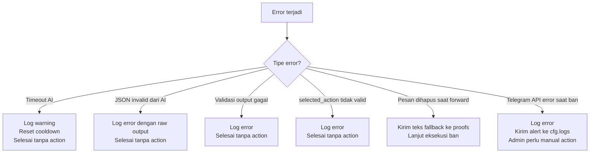

---

## 19. KONFIGURASI BOT

Field baru yang perlu ditambah ke `cfg`. **Koreksi lokasi**: config project ini sebenarnya ada di
`tcbot/__init__.py` (`Configs` dataclass + `_CfgAdapter`), **bukan** `tcbot/config.py` yang tidak
ada di codebase.

```python
# Di tcbot/__init__.py — Configs dataclass, Configs.load(), _CfgAdapter:

AI_API_URL: str           # URL LLM API endpoint
AI_API_KEY: str           # API key (dari Replit Secrets, bukan hardcode)
AI_MODEL: str             # contoh: "nvidia/nemotron-3-ultra-550b-a55b:free"
AI_TIMEOUT: int = 15      # Detik
AI_COOLDOWN: int = 30     # Detik per grup

# Confidence thresholds
AI_CONF_EXECUTE: float = 0.90     # Auto-execute action non-ban
AI_CONF_FLAG: float = 0.75        # Flag ke admin
AI_CONF_BAN_XHIGH: float = 0.87   # Auto-ban untuk severity xhigh
AI_CONF_BAN_MAX: float = 0.85     # Auto-ban untuk severity max

# Translation
MYMEMORY_EMAIL: str | None = None  # Opsional, tingkatkan limit ke 10k chars/hari
```

### Dependency Baru di `pyproject.toml`

Tidak ada `httpx`/`aiohttp` langsung di dependency saat ini (tersedia transitif via PTB, tapi
tidak boleh diandalkan sebagai dependency implisit), dan tidak ada `pyyaml`. Keduanya wajib
ditambah eksplisit untuk fitur ini:

```toml
httpx = ">=0.27,<1"    # AI API client
pyyaml = ">=6.0,<7"    # Parse YAML frontmatter di rules/*.md
```

---

## 20. OUT OF SCOPE

Item-item berikut tidak termasuk dalam PRD ini dan tidak akan dibangun:

- Dashboard web untuk melihat AI moderation history
- Training atau fine-tuning model AI sendiri
- Deteksi media foto, video, stiker — AI hanya teks
- Real-time terjemahan pesan member, bukan rules
- Integrasi dengan platform eksternal seperti Discord atau WhatsApp
- Auto-appeal system — appeal tetap manual via bot yang sudah ada
- Statistik moderasi seperti persentase AI vs manual, accuracy — mungkin fase berikutnya
- Perubahan pada sistem warn, ban, mute manual yang sudah ada

---

## 21. KOREKSI AUDIT KODE & PERTANYAAN TERBUKA

Bagian ini merangkum hasil audit terhadap kode nyata (`__main__.py`, `documents.py`, seluruh
`*_db.py` dan `*_flow.py`, `pyproject.toml`) yang dilakukan sebelum implementasi dimulai, plus
keputusan yang sudah diambil dan yang masih terbuka.

### Versi Terverifikasi dari `pyproject.toml`

Python `>=3.12`, `python-telegram-bot[rate-limiter]>=22.8,<23`, `motor>=3.7,<4`,
`redis[hiredis]>=8.0,<9`, `apscheduler[mongodb]==4.0.0a6`, `cachetools>=7.1,<8`.

### Schema Tambahan yang Belum Disebut di Draft Awal

**`AIEvaluationDoc`** — collection baru `ai_evaluations`, dibutuhkan untuk kasus yang **tidak**
menghasilkan action tercatat di collection existing (`bans`/`mutes`/`warns`): confidence < 0.75
(log internal) dan flag 0.75–0.89 (menunggu keputusan admin). Tanpa collection ini, keputusan
"Ignore" dari admin tidak punya tempat penyimpanan status, dan item yang di-flag tapi tidak
pernah diputuskan tidak punya audit trail.

```python
AIVerdict = Literal["clean", "violation"]
AIFlagStatus = Literal["pending", "approved", "escalated", "ignored"]


class AIEvaluationDoc(TypedDict, total=False):
    """MongoDB document for a single AI moderation evaluation (flag or low-confidence log)."""

    eval_id: str
    chat_id: int
    offending_msg_id: int
    offending_user_id: int
    rule_violated: str | None
    confidence: float
    severity: RuleSeverity | None
    selected_action: RuleAction | None
    mute_duration: str | None
    reason: str
    status: AIFlagStatus
    flag_log_msg_id: int | None
    resolved_by: int | None
    resolved_at: datetime | None
    timestamp: datetime
```

**`BanDoc`** — tidak perlu field baru untuk *menandai* AI ban (cukup `admin_user_id == bot.id`,
sama seperti pola `Demote.execute()` yang menerima executor ID generik). Tapi dua field baru
diperlukan untuk kebutuhan operasional yang PRD sendiri sebut (tombol "Undo Ban", audit
"confidence 96%"), konsisten dengan pola `until_date`/`duration_str` yang juga `None` untuk kasus
biasa:

```python
class BanDoc(TypedDict, total=False):
    # ... field existing tidak berubah ...
    ai_confidence: float | None   # BARU — hanya terisi untuk AI ban
    ai_eval_id: str | None        # BARU — link balik ke AIEvaluationDoc jika berasal dari flag
```

### Reuse Audit Trail — Tidak Ada Collection Baru untuk Actions yang Sudah Dieksekusi

`bans`, `mutes`, `warns` (dan `kicks` bila ada) sudah append-only dengan `admin_id`/
`admin_user_id` generik. AI moderation cukup memakai **bot's own user ID** sebagai admin di setiap
pemanggilan `create_ban()`/`log_mute()`/`add_warn()` — tidak perlu collection audit terpisah untuk
action yang benar-benar tereksekusi.

### Keputusan yang Sudah Diambil (Semua Pertanyaan Terjawab)

| # | Keputusan | Hasil |
|---|---|---|
| Q1 | Sumber "10 pesan terakhir" | Buffer in-memory per `chat_id` (`deque(maxlen=10)`) + mirror Redis TTL pendek untuk resilience restart — prioritas kecepatan, bukan MongoDB |
| Q2 | Scope mute AI | Network-wide ke semua grup terhubung, reuse `_execute_mute` existing — tidak ada kapabilitas single-group baru |
| Q3 | Mekanisme tombol "Undo Ban" | Callback aktif **24 jam** sejak AI ban dieksekusi, setelah itu tombol non-aktif dan harus `/tcunban` manual |
| Q4 | Role minimum `/admin_set_ai on\|off` | `staff_only` — staff federation bisa toggle grup manapun, sama seperti pola `cmd_cleanup` |
| Q5 | Strategi rate limit MyMemory | Tidak ada `MYMEMORY_EMAIL` disediakan — TTL cache Redis per rule di-**stagger** (jitter acak, bukan TTL 7 hari identik untuk semua rule) supaya 27 rules tidak re-translate bersamaan dan menghabiskan kuota 1.000 req/hari di hari yang sama |
| Q6 | Retensi `ai_evaluations` | TTL index **90 hari**, mengikuti pola `member_cache` — semua evaluasi (termasuk verdict `clean` dan confidence rendah) tetap masuk MongoDB untuk audit jangka menengah, bukan cuma log aplikasi |
| Q7 | Validasi permission saat toggle `/admin_set_ai on` | Tidak ada validasi proaktif — dibiarkan gagal senyap saat AI mencoba eksekusi dan gagal (log error), mengikuti pola `fan_out()` existing yang juga tidak memvalidasi permission di muka |

**Implikasi teknis dari keputusan ini:**

- **Q3 (24 jam)** → `AIEvaluationDoc`/`BanDoc` butuh timestamp ban untuk dicek saat callback
  ditekan; callback handler `ai_undo_ban` harus membandingkan `now - ban.timestamp > 24h` dan
  menonaktifkan tombol (edit reply markup ke teks statis) jika kedaluwarsa.
- **Q4 (staff_only)** → `/admin_set_ai` memakai decorator `staff_only` yang sudah ada, tanpa
  perlu `get_chat_member` check tambahan — konsisten dengan `cmd_cleanup`.
- **Q5 (stagger TTL)** → `translator.py` men-set TTL Redis dengan jitter, misal
  `TTL = 7 * 86400 + random.randint(0, 86400)` (7 hari ± jitter 1 hari), bukan TTL statis identik
  untuk seluruh 27 rules.
- **Q6 (TTL 90 hari)** → `mongos.py::ensure_indexes()` harus membuat TTL index di
  `ai_evaluations.timestamp` dengan `expireAfterSeconds = 90 * 86400`, mengikuti pola index TTL
  `member_cache` yang sudah ada. Semua verdict (termasuk `clean`) masuk collection ini — bukan
  cuma yang di-flag atau confidence rendah, supaya audit trail lengkap dalam window 90 hari.
- **Q7 (silent fail)** → tidak perlu logic validasi baru di handler toggle. Kegagalan eksekusi AI
  karena permission kurang cukup dicatat lewat mekanisme error handling yang sudah ada di
  Bagian 18 (log error ke `cfg.logs`), sama seperti kegagalan `fan_out` lain.

> Dengan semua Q1–Q7 terjawab, **tidak ada lagi blocker keputusan** untuk memulai implementasi
> Fase 0 sampai Fase 7 sesuai urutan yang sudah direncanakan.

---

## 22. REVIEW LANJUTAN: SKELETON IMPLEMENTASI & RENCANA TESTING

Bagian ini merangkum hasil review putaran kedua (setelah Bagian 21 disusun) yang membaca kode
tambahan (`groups_db.py`, `mongos.py`, `warning_flow.py`, `muting_flow.py`, `ban_flow.py`,
`bans_db.create_ban`, `fan_out`, `keyboards.py`, `parse_logmsg.py`) dan menghasilkan skeleton
kode konkret untuk Fase 0-4, plus 4 inkonsistensi yang ditemukan dan sudah diperbaiki langsung
di bagian aslinya masing-masing (lihat catatan "Koreksi (review lanjutan)" di Bagian 5, 8, dan 16).

### 22.1 Ringkasan Koreksi yang Sudah Diterapkan

| # | Lokasi | Masalah | Status |
|---|---|---|---|
| 1a | Bagian 16, diagram relasi modul | Masih mengarah ke `_execute_ban`/`execute_kick`/`_execute_warn` existing, kontradiksi dengan teks di atasnya | Diperbaiki |
| 1b | Bagian 8, threshold matrix | Baris "0.90 ke atas untuk max/xhigh" kontradiksi dengan baris "0.87/0.85" dan dengan Bagian 19 | Diperbaiki, baris lama dihapus |
| 1c | Bagian 5, diagram severity | Frasa "admin aktifkan auto_ban" mengacu toggle yang tidak ada di `RuleDoc`/`GroupDoc` manapun | Diperbaiki — severity `high` dipertegas tidak pernah auto-ban |
| 1d | Bagian 16, klaim mute "cocok tanpa modifikasi" | `_execute_mute` hard-depend ke `update.effective_chat` dan prompt message interaktif yang tidak ada di jalur AI | Diperbaiki — `execute_ai_mute`/`execute_ai_mute_time` jadi implementasi baru terisolasi, sama seperti kick/ban |

### 22.2 Signature Final Fungsi-Fungsi Kunci

Untuk dipakai persis saat implementasi (bukan pseudo-code lagi):

```python
# action_executor.py

UNDO_BAN_WINDOW_SECONDS: int = 24 * 3600   # Q3

async def execute_ai_warn(
    ctx: ContextTypes.DEFAULT_TYPE, chat_id: int, target_id: int,
    target_name: str, reason_text: str,
) -> None:
    """Reuse execute_warn(update=None, ...) — satu-satunya fungsi existing yang dipanggil."""

async def execute_ai_mute(
    bot: Bot, chat_id: int, target_id: int, target_fname: str, reason_text: str,
) -> None:
    """Mute permanen network-wide. Implementasi baru — TIDAK panggil _execute_mute (lihat 1d)."""

async def execute_ai_mute_time(
    bot: Bot, chat_id: int, target_id: int, target_fname: str,
    reason_text: str, duration_key: str,
) -> None:
    """Mute sementara. duration_key harus salah satu dari whitelist eksplisit
    {1h, 3h, 6h, 12h, 24h, 2d, 3d, 7d} — di luar whitelist fallback ke '1h' + log WARNING,
    tidak pernah mempercayai durasi mentah dari AI langsung ke aritmetika timedelta."""

async def execute_ai_kick(
    bot: Bot, chat_id: int, target_id: int, target_fname: str, reason_text: str,
) -> None:
    """ban_chat_member lalu unban_chat_member(only_if_banned=True). TIDAK panggil execute_kick."""

async def execute_ai_ban(
    ctx: ContextTypes.DEFAULT_TYPE, chat_id: int, offending_msg_id: int, target_id: int,
    target_fname: str, reason_text: str, ai_confidence: float, ai_eval_id: str | None = None,
) -> None:
    """Urutan wajib: (1) forward_message ke cfg.proofs -> proof_message_id (None jika gagal,
    TIDAK membatalkan ban), (2) bans_db.create_ban(..., ai_confidence=, ai_eval_id=),
    (3) fan_out ban_chat_member ke semua active_groups(), (4) kirim log ke cfg.logs dengan
    tombol Undo Ban (24 jam) + Lihat Bukti. TIDAK PERNAH memanggil upload_proof() atau
    ban_flow._execute_ban — lihat Bagian 7."""

async def ai_undo_ban_callback(update: Update, ctx: ContextTypes.DEFAULT_TYPE) -> None:
    """callback_data: 'ai_undo_ban:{ban_id}'. Bandingkan now - ban.timestamp terhadap
    UNDO_BAN_WINDOW_SECONDS: dalam window -> unban semua grup + is_active=False + hapus tombol;
    lewat window -> jangan coba unban sama sekali, ganti tombol jadi label statis nonaktif
    ('Undo window expired — pakai /tcunban')."""
```

```python
# tcbot/utils/translator.py

async def translate_rule(rule_id: str, content_en: str) -> str:
    """Cek Redis (key: tcbot:rule_translated:{rule_id}:id) -> MyMemory API jika miss ->
    cache dengan TTL = 7 hari + jitter acak 0-24 jam (stagger, Q5) -> fallback content_en
    asli tanpa raise pada kegagalan apa pun (timeout, non-200, rate limit, response cacat)."""
```

### 22.3 Item yang Wajib Diverifikasi Sebelum Coding Sungguhan

Beberapa nama fungsi di skeleton Bagian 21/22 masih **asumsi**, belum diverifikasi 100% terhadap
`bans_db.py`/`mutes_db.py` yang sebenarnya. Ini bukan keputusan desain, tapi tugas verifikasi
teknis wajib di awal Fase 3:

- `bans_db.create_ban()` perlu ditambah dua kwarg baru `ai_confidence`/`ai_eval_id` — signature
  saat ini belum punya, perlu ditulis diff eksplisit sebelum `execute_ai_ban` dikodekan.
- Perlu dipastikan ada (atau ditambah) helper: cara membaca satu `BanDoc` by id (`get_ban` atau
  nama lain), cara menonaktifkan ban (`revoke_ban`/`deactivate_ban` atau nama lain, untuk Undo
  Ban), dan cara update `log_message_id` setelah pesan log terkirim (pola yang sama dipakai
  `ban_flow` manual — cek nama fungsi aslinya, jangan asumsikan).
- `mutes_db.log_mute()` — verifikasi kwarg persis (bukan `ctx_bot_id`, tapi kemungkinan besar
  `admin_id` sama seperti pola lain di codebase — cek langsung ke `mutes_db.py`).
- `parse_logmsg.kick_log`/`ban_log` urutan parameter positional — jangan disalin dari skeleton
  tanpa dicocokkan ke definisi asli.

### 22.4 Rencana Testing Ringkas per Fase

| Fase | Fokus Test Kritis |
|---|---|
| Fase 0 (Config) | `AI_API_KEY` kosong -> `ai_moderation_configured=False`, bot tetap start, WARNING sekali; parse gagal (float/di luar rentang) -> fallback ke default + WARNING, bukan crash |
| Fase 1 (rules_db) | Seed 27 file valid -> 27 rules; 1 file rusak di antaranya -> 26 ter-seed + error logged, tidak abort batch; seed dipanggil 2x -> tetap 27 (idempotent); `set_ai_moderation` lalu baca lagi -> hasil konsisten tanpa delay cache |
| Fase 2 (`execute_warn` signature) | **Wajib regresi penuh command `/warn` manual dulu, tanpa perubahan test lama.** Panggil dengan `update` asli -> perilaku identik seperti sebelum ubah. Panggil dengan `update=None` + param eksplisit -> tidak ada akses `update.effective_*` yang lolos. `chat_id=None` lupa diisi -> `ValueError`/`TypeError` jelas, bukan `AttributeError` membingungkan |
| Fase 3 (`action_executor.py`) | **Test paling penting di seluruh fitur**: mock `upload_proof` dan assert **tidak pernah dipanggil** oleh `execute_ai_ban`. Urutan `ban_chat_member` -> `unban_chat_member` di kick (urutan salah = permanent ban, bukan kick). `mute_time` dengan durasi di luar whitelist -> fallback ke 1h + WARNING. Undo Ban dalam vs lewat 24 jam -> assert `unban_chat_member` dipanggil vs tidak pernah dipanggil sama sekali. Race condition dua admin tekan Undo Ban bersamaan -> unban efektif cuma sekali (idempotency di level DB) |
| Fase 4 (`translator.py`) | Cache hit tidak memanggil MyMemory lagi; 27 rule_id berbeda menghasilkan TTL yang **tidak identik** (stagger benar-benar jalan); rate limit/timeout -> fallback EN tanpa exception dan tanpa cache write hasil gagal |

### 22.5 Pertanyaan Terbuka Baru dari Review Lanjutan

Satu pertanyaan genuinely ambigu ditemukan yang berdampak ke jumlah rule AI-enforceable
(20 vs 21) — didiskusikan dan dijawab di luar dokumen ini, lihat catatan jawaban di bawah setiap
poin bila sudah diputuskan:

- **Klasifikasi rule `fundraising` (rule 09)** — **DIJAWAB**: `ai_enforceable: true` penuh,
  boleh auto-execute mengikuti aturan confidence/severity normal (bukan dibatasi flag-only).
  Jumlah rule AI-enforceable jadi **21 dari 27** (bukan 20), non-enforceable jadi 6 rule
  (02, 03, 04, 10, 16). Lihat Bagian 4 dan 17 untuk update tabel lengkap.

---

## RINGKASAN EKSEKUTIF

| Aspek | Keputusan |
|---|---|
| Actions yang tersedia | `warning`, `mute`, `mute_time`, `kick`, `ban` |
| Action yang dihapus | `fban` sebagai action terpisah — digabung ke `ban` yang sudah network-wide |
| Severity levels | `low`, `medium`, `high`, `xhigh`, `max` |
| Rules storage | EN only di MongoDB, terjemahan ID on-demand via MyMemory |
| Terjemahan | MyMemory API gratis 1.000 req/hari, cached di Redis TTL 7 hari |
| Proof untuk AI ban | Forward pesan pelanggaran ke cfg.proofs channel sebagai proof_message_id |
| Confidence threshold auto-execute | 0.90 ke atas |
| Confidence threshold flag admin | 0.75 sampai 0.89 |
| Confidence threshold log saja | di bawah 0.75 |
| Cooldown per grup | 30 detik |
| Context window | 10 pesan terakhir per grup |
| Rules di-enforce AI | 21 dari 27 — 6 butuh human judgment penuh (fundraising kini full-enforceable, bukan flag-only) |
| Integrasi kode existing | Zero breaking changes — `_execute_ban`/`_execute_mute`/`execute_kick` tidak diubah, AI pakai jalur eksekusi baru terisolasi di `action_executor.py`, terdaftar manual di `__main__.py` (group=50) |
| Opt-in per grup | Ya — field `ai_moderation_enabled` di GroupDoc (`total=False`, aman tanpa migrasi), toggle wajib lewat fungsi `groups_db.py` untuk invalidasi cache |
| Scope mute AI | Network-wide ke semua grup terhubung — reuse infrastruktur mute existing, bukan kapabilitas single-group baru |
| Sumber context 10 pesan terakhir | Buffer in-memory per grup + mirror Redis, bukan MongoDB — prioritas kecepatan respons |
| Collection baru | `rules` dan `ai_evaluations` (bukan reuse `bans`/`mutes`/`warns` untuk log evaluasi yang belum jadi action) |
| Dependency baru | `httpx`, `pyyaml` |
| Undo Ban | Callback aktif 24 jam sejak AI ban, setelah itu wajib `/tcunban` manual |
| Role `/admin_set_ai` | `staff_only` |
| Rate limit MyMemory | Tanpa email, TTL cache 7 hari + jitter acak 0-24 jam per rule (stagger) |
| Retensi `ai_evaluations` | TTL index 90 hari, semua verdict (termasuk `clean`) tercatat |
| Validasi permission saat toggle AI | Tidak ada — gagal senyap saat eksekusi, dicatat via error handling standar |

---

*PRD ini adalah dokumen hidup, sudah direvisi v1.1 berdasarkan audit kode nyata (lihat Bagian 21).
Seluruh 7 pertanyaan (Q1–Q7) sudah dijawab dan tidak ada lagi blocker keputusan — implementasi
bisa dimulai dari Fase 0.*
