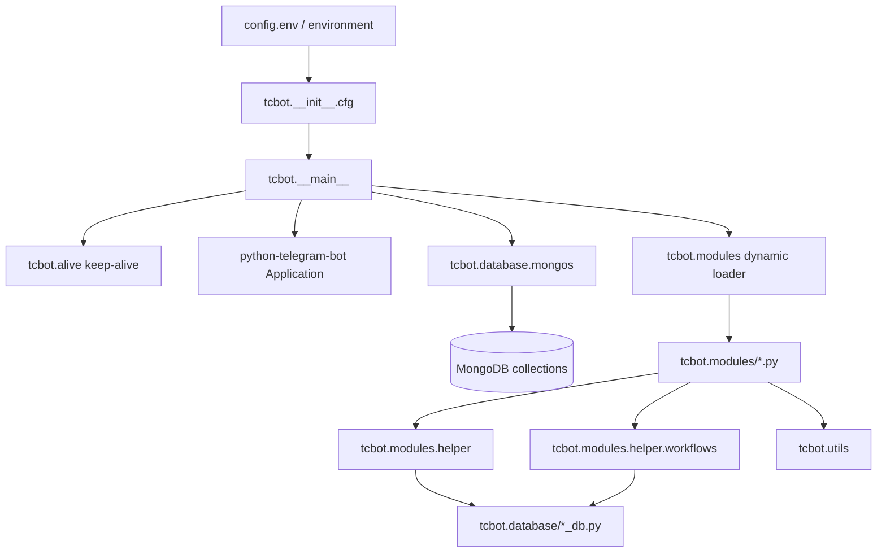

# TCF Bot Documentation

This directory documents the internal architecture and developer workflows for TCF Bot, a Python Telegram bot for Transsion Core Federation community moderation.

For user-facing setup, see [`../README.md`](../README.md). For contributor rules and style, see [`../AGENTS.md`](../AGENTS.md). For project state and improvement plan, see [`../PLAN.md`](../PLAN.md). For Replit deployment, see [`../replit.md`](../replit.md). For CI/CD automation details, see [workflows-guide.md](workflows-guide.md).

## Quick navigation

| Document | Purpose |
|---|---|
| [Setup](setup.md) | Local, Docker, and hosted setup; environment variable formats; validation commands. |
| [Project mapping](mapping.md) | Repository map, package ownership, startup flow, and cross-package boundaries. |
| [Modules](modules/modules.md) | Command modules, dynamic module discovery, handler registration, and command ownership. |
| [Workflows overview](workflows.md) | High-level user and moderation flows. |
| [Workflow internals](workflows/workflows.md) | `ConversationHandler` factories, state constants, callback patterns, and flow-specific behavior. |
| [Database layer](databases/databases.md) | MongoDB collections, helper modules, indexes, document shapes, and cache rules. |
| [Helper utilities](helper/helper.md) | Shared formatting, decorators, target extraction, keyboards, role guards, and log-message builders. |
| [Runtime utils](utils/utils.md) | Dispatch, prefixes, logging, error reporting, and datetime utilities. |
| [Button styles](button-styles.md) | Inline keyboard layout and callback-data naming conventions. |
| [Git commit style](git-commit.md) | Commit message conventions for this repository. |
| [Performance notes](performance.md) | Batch query patterns, optimization rules, and benchmarking. |
| [GitHub Actions workflows](workflows-guide.md) | All 7 CI/CD workflows: auto-fix PR, dependency updates, performance regression, TDD verification, CodeQL, and bot deployment. |

## Detailed feature guides

| Document | Purpose |
|---|---|
| [Appeals detailed](appeal-detailed.md) | Appeal deep links, private DM submission, review buttons, approval/rejection behavior, and edge cases. |
| [Banning detailed](banning-detailed.md) | Federation ban flow, proof collection, ban updates, unban checks, logs, and appeal links. |
| [Check detailed](check-detailed.md) | `/check` user-profile command, drill-down views, pagination, parallel DB reads, and edge cases. |
| [Demote detailed](demote-detailed.md) | Manual `/tcdemote`, auto-demote on ban/kick, the `Demote` class, permission rules, and unified log format. |
| [Promote detailed](promote-detailed.md) | `/tcpromote`, the `Promote` class, role hierarchy, direct vs request flow, callbacks, and edge cases. |
| [Roles detailed](role-detailed.md) | Founder/Admin/Developer/Tester hierarchy, promotion/demotion behavior, and role safety rules. |
| [Stats detailed](stats-detailed.md) | `/tcstats`, the `Stats` class, drill-downs (Staff / Users / Chats / Bans), search panel, and async design. |
| [Warnings detailed](warnings-detailed.md) | Per-group warnings, optional proof, warn-limit auto-ban behavior, and warning storage. |

## Architecture at a glance



Runtime starts with `python -m tcbot` (or `python3 -m tcbot`). The entry point loads configuration, starts the Flask health endpoint, builds the Telegram application, connects MongoDB, ensures indexes, seeds the initial owner, dynamically loads handlers, and starts long polling.

## Core rules

- Keep command handlers in `tcbot/modules/`.
- Keep shared handler helpers in `tcbot/modules/helper/`.
- Keep conversation factories in `tcbot/modules/helper/workflows/*_flow.py`.
- Keep MongoDB reads and writes behind `tcbot/database/*_db.py` helpers.
- Keep runtime utilities in `tcbot/utils/`.
- Use HTML parse mode for bot messages and escape user-provided text through formatter helpers.
- Do not commit real bot tokens, MongoDB URIs, private chat IDs, passwords, or API keys.

## Development commands

```bash
uv sync
uv run --extra test pytest tests/ -v
uv run ruff format .
uv run ruff check --fix .
python -m tcbot
```

On systems where `python3` is preferred, replace `python` with `python3`.
