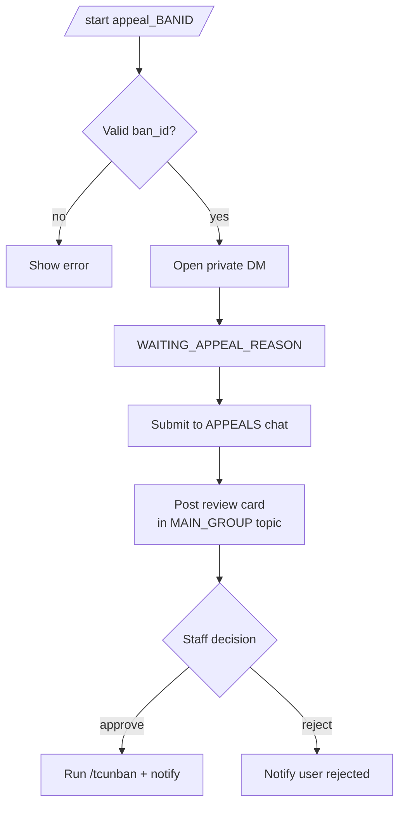

# Appeal Detailed Documentation

This document describes the current ban appeal behavior implemented by `tcbot/modules/appeals.py` and `tcbot/modules/helper/workflows/appeal_flow.py`.

For ban flow that triggers appeals, see [`banning-detailed.md`](banning-detailed.md). For check command often used during appeals, see [`check-detailed.md`](check-detailed.md). For shared helpers, see [`helper/helper.md`](helper/helper.md). For database layer, see [`databases/databases.md`](databases/databases.md).



## Purpose

The appeal flow lets a user with an active federation ban submit one appeal through the bot in private messages. The appeal is forwarded to the configured appeal channel/topic, posted for staff review in the main group, logged in the federation logs channel, and then resolved through inline callback buttons.

## Entry points

A banned user can reach the appeal flow through a bot deep link:

- The `Submit Appeal` button attached to a ban log entry.
- The `Appeal` button shown by `/checkme` when the user has an active federation ban.
- A direct deep link in this format:
  - `https://t.me/<bot_username>?start=appeal_<ban_id>`

The registered `/start` entry filter only accepts private-chat messages matching:

```text
/start appeal_<10 lowercase letters or digits>
```

The flow itself is DM-only. If the link is opened outside a private chat, the bot asks the user to open it in private messages.

## Eligibility checks

When the appeal link is opened, the bot validates the ban record before starting the conversation:

1. The `ban_id` must exist in the `bans` collection.
2. The ban must still be active (`is_active: True`).
3. The Telegram user opening the link must match `banned_user_id` on the ban record.
4. The ban must not already have a stored `review_message_id` that is still fresh. If it does and was set within the last 72 hours, the user is told their appeal is still under review. If the `review_timestamp` is older than 72 hours (or missing), the stale review is cleared automatically and the user may submit a new appeal.

Invalid, expired, or wrong-account links end the conversation without changing the database.

## User submission format

After a valid deep link is opened, the bot sends instructions in DM and waits for one text message.

The message must start with `#appeal`. The check is case-insensitive and ignores leading/trailing whitespace, so these are accepted:

```text
#appeal
#APPEAL
#Appeal
   #appeal
```

Messages that do not start with `#appeal` are ignored and the bot remains in the appeal state.

The requested appeal body contains three sections:

```text
#appeal
Log link: https://t.me/TranssionCoreFederationLogs/123
Clarification: I understand what happened and why the ban was issued.
Agreement: I will follow the community rules going forward.
```

The current implementation does not parse the section labels semantically. It validates the `#appeal` prefix and, when the ban record has a `log_message_id`, checks that the submitted text contains that log message ID as a standalone number. This makes the log-link check tolerant of full Telegram links, bare message IDs, and links with query parameters, while rejecting partial numeric matches.

Examples:

- `https://t.me/c/12345/67?thread=10` matches log message ID `67`.
- `67` as a standalone token matches log message ID `67`.
- `670` does not match log message ID `67`.
- `6` does not match log message ID `67`.

If the log message ID is missing or mismatched, the bot replies with `Invalid log link. Please check and try again.` and keeps waiting.

Appeal messages have a **maximum length of 2000 characters**. Messages that exceed this limit are rejected with a trimming instruction; the user may shorten the message and try again without restarting the session.

## Submission side effects

When a valid appeal message is submitted:

1. The user's appeal message is forwarded to the configured appeals destination (`cfg.appeals`).
2. A staff review card is posted to `cfg.main_group`, optionally inside `cfg.appeal_discussion_topic`.
3. A submitted-appeal log is posted to `cfg.logs`.
4. The ban record is updated with review/log metadata when those messages are successfully sent.
5. The original DM instruction message is edited to confirm submission.
6. The user is cached/updated in `users_cache`.

The review card contains two inline buttons:

| Button | Callback data |
|---|---|
| `Approve` | `appeal_approve_<ban_id>` |
| `Reject` | `appeal_reject_<ban_id>` |

The DM instruction message has a cancel button:

| Button | Callback data |
|---|---|
| `Cancel` | `cancel_appeal` |

Cancel clears the in-memory conversation keys and edits the instruction message to say that nothing was submitted.

## Database impact

Appeals reuse the existing `bans` collection. No separate appeal collection is used.

The following fields are read or updated on ban documents:

| Field | Used for |
|---|---|
| `ban_id` | Deep-link and callback identifier. |
| `banned_user_id` | Confirms the appeal belongs to the current user. |
| `is_active` | Blocks appeals for inactive/resolved bans. |
| `log_message_id` | Validates that the user referenced the correct ban log. |
| `review_message_id` | Marks a pending staff review and blocks duplicate appeals. |
| `review_timestamp` | Starts the 12-hour original-admin review priority window. |
| `appeal_log_msg_id` | Lets the bot edit the submitted-appeal log after approval/rejection. |
| `appeal_submitted_at` | Displayed in final appeal log edits. |
| `appeal_link` | Link to the forwarded appeal message. |

The update helpers involved are:

- `bans_db.set_review(ban_id, review_msg_id)`
- `bans_db.set_appeal_log_msg(ban_id, appeal_log_msg_id, appeal_link=...)`
- `bans_db.deactivate_all_active_bans(user_id)` on approval (clears all active records atomically)
- `users_cache.upsert_user(...)` after submission

If the review post fails, `review_message_id` is not stored. If the appeal-log post fails, `appeal_log_msg_id` is not stored. The implementation logs those failures and continues where possible.

## Staff review rules

Appeal decisions are handled by `appeal.on_decision` and are registered outside the conversation handler. Only users for whom `users_roles.is_staff(user_id)` returns true may use the review buttons. In this codebase, `is_staff` means Founder/owner or Admin; Developer and Tester custom roles are not included by that helper.

The original banning admin gets a 12-hour priority window after the appeal review timestamp is set:

- During the first 12 hours, only the `admin_user_id` stored on the ban can approve or reject.
- The original banning admin is always allowed during that window.
- After 12 hours, any staff user accepted by `is_staff` can decide.
- If `review_timestamp` or `admin_user_id` is missing, the lock does not apply.

The callback handler always answers the callback query before continuing once it has parsed a valid decision action.

## Approval behavior

When a staff member approves an appeal:

1. All active bans for the user are deactivated with `bans_db.deactivate_all_active_bans(user_id)`, which clears any duplicate active records in one atomic operation.
2. Active connected groups are fetched from `groups_db.active_groups()`.
3. The user is unbanned from every active group with `unban_chat_member(..., only_if_banned=True)` through bounded fan-out.
4. The user receives a DM telling them the appeal was approved.
5. The review message is edited to show who approved it and the inline keyboard is removed.
6. The submitted-appeal log message is edited to an approved version when possible.
7. A separate `Unban (via Appeal)` log is sent to the federation logs channel.

Approval is a federation unban. It removes the Telegram ban across all connected groups and deactivates the persistent ban record.

## Rejection behavior

When a staff member rejects an appeal:

1. The ban remains active.
2. The user receives a DM telling them the appeal was reviewed and not approved.
3. The review message is edited to show who rejected it and the inline keyboard is removed.
4. The submitted-appeal log message is edited to a rejected version when possible.
5. `bans_db.clear_review(ban_id)` clears `review_message_id` and `review_timestamp` so the user can submit a new appeal.
6. `bans_db.set_rejected_by(ban_id, admin.id, admin.first_name)` records the rejector's identity (`rejected_by_id`, `rejected_by_name`, `rejected_at`) on the ban document for the audit trail.

Steps 2–6 run in a single `asyncio.gather` so a DM failure does not block the review-message edit or the DB writes.

Rejection does not deactivate the ban. The `review_message_id` and `review_timestamp` fields **are cleared** on rejection so the user may submit a subsequent appeal without being locked out.

## Logs

Appeal-related logs are built in `tcbot/modules/helper/parse_logmsg.py`:

| Template | Destination / use |
|---|---|
| `appeal_received_log` | Staff review card in the main group / appeal discussion topic. |
| `appeal_submitted_log` | Initial log in the federation logs channel. |
| `appeal_approved_edit` | Edited version of the submitted log after approval. |
| `appeal_rejected_edit` | Edited version of the submitted log after rejection. |
| `appeal_unban_log` | Separate unban log sent after an approved appeal. |

If editing the existing appeal log fails, the bot attempts to send a new log message as a fallback.

## Timeouts and fallbacks

- The appeal conversation timeout is `cfg.appeal_timeout` (`APPEAL_TIMEOUT_SECONDS`, default `600`).
- When the timeout expires naturally (user inactive), PTB's scheduler fires `BuildAppeal._on_timeout` via `ConversationHandler.TIMEOUT`; the user receives `"Appeal session timed out. Nothing was submitted."` and the conversation ends.
- Any recognized command during the waiting state ends the session with `Appeal session ended.`
- Cancel ends the session without writing appeal metadata.
- If the user sends `#appeal` after the session state has expired or the ban ID is missing from `ctx.user_data`, the bot asks them to start the appeal again.

## Edge cases

- Non-banned users cannot submit because they cannot pass the active-ban lookup.
- A user cannot appeal someone else's ban; the `banned_user_id` must match the Telegram account opening the link.
- A user can have only one pending appeal when `review_message_id` was stored successfully.
- Case-insensitive `#appeal` tags are accepted.
- The log-link validation is number-based, not URL-domain-based; it checks for the stored log message ID as a standalone integer token.
- If the forwarded appeal message cannot be linked, the review/log text uses `N/A` for the appeal link but still posts the review/log when possible.
- If user DM notification fails during approval or rejection, the review/log operations still proceed because those calls use `asyncio.gather(..., return_exceptions=True)`.
- If a ban was already deactivated before a decision, the review message is edited to show that the appeal is already resolved.

## Behavior reference

Important appeal behaviors to keep in mind:

1. `#appeal`, `#APPEAL`, and mixed-case tags are accepted.
2. Text without a leading hash tag is rejected.
3. A log message ID matches as a standalone number inside a Telegram link.
4. Partial numeric matches are rejected.
5. Appeal messages must not exceed 2000 characters; longer messages are rejected with a trim instruction and the user can retry without restarting.
6. The 12-hour reviewer lock blocks a different admin inside the window.
7. The original banning admin is allowed inside the 12-hour window.
8. Any staff reviewer is allowed after 12 hours.
9. Missing `review_timestamp` or missing `admin_user_id` disables the reviewer lock.
10. Uppercase `#APPEAL` reaches the expired-session branch when conversation state is missing.
11. The module-level appeal builder uses the configured appeal log handle.
