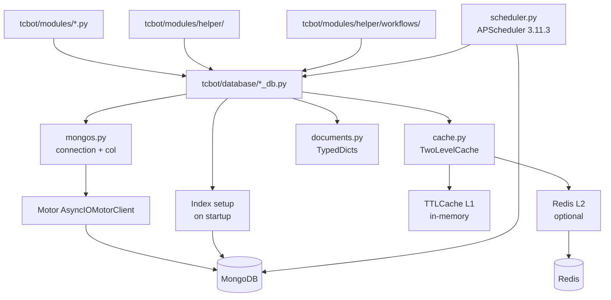

# Database Layer

The database layer lives in `tcbot/database/` and is the only place that should perform MongoDB reads and writes. Command modules and workflows call helper functions instead of calling `mongos.col()` directly.

This document is the reference spec for the TypeScript/grammY rewrite of the database layer. Every collection, index, helper signature, cache behavior, and scheduler detail below is taken from the current `tcbot/database/` Python code and should be reproduced exactly in the new implementation.

For modules that consume these database helpers, see [`modules.md`](modules.md). For shared helpers, see [`helpers.md`](helpers.md). For conversation flows, see [`workflows.md`](workflows.md).



## Access rules

- Keep all MongoDB writes and collection access inside `tcbot/database/` helpers.
- Command modules and workflows must not call `col()` directly or issue raw insert/update/delete operations.
- Put new database concerns in descriptive `*_db.py` files and add matching indexes in `mongos.ensure_indexes()`.
- Helpers are async and fully typed; they use the `TypedDict` shapes from `documents.py` and the `NewType` primitives from `types.py`.
- Stored timestamps use `utc_now()` from `tcbot.utils.time_and_date`. Stored values are plain strings, integers, booleans, and datetimes.

## Connection manager

`mongos.py` owns the Motor client lifecycle.

| Export | Purpose |
|---|---|
| `connect()` | Creates the `AsyncIOMotorClient`, selects `cfg.db_name`, and pings MongoDB through the `mongodb` circuit breaker. A successful ping records a CLOSED success; repeated failures trip the circuit to OPEN. Must run before any other database call. |
| `ensure_indexes()` | Creates all required indexes in parallel. Safe to call repeatedly; MongoDB ignores existing indexes. Raises the first index failure after logging every failure (fail-fast startup). |
| `db()` | Returns the active database or raises `RuntimeError` if `connect()` has not run. |
| `col(name)` | Returns a collection from `db()`. Use only inside database helper modules. |
| `is_connected()` | Returns `True` once a connection has been established via `connect()`. |
| `mongo_client_kwargs()` | Extra `MongoClient` kwargs shared by the Motor client and the scheduler's synchronous client: pins `tlsCAFile` to the certifi Mozilla bundle unless `cfg.mongodb_uri` already carries `tlscafile`, and sets `serverSelectionTimeoutMS` (10 s) and `connectTimeoutMS` (10 s) defaults. |
| `db_call(coro)` | Executes a Motor coroutine through the `mongodb` circuit breaker. Raises `CircuitOpenError` when the circuit is OPEN so callers fast-fail instead of waiting the 45 s socket timeout. |
| `make_short_id(length=10)` | Generates a lowercase alphanumeric ID (`a-z0-9`) from `secrets.choice`, used for ban IDs and promotion request IDs. |

### MongoDB client parameters

`connect()` builds the client with these explicit parameters (see `mongos.py`):

| Parameter | Value |
|---|---|
| `serverSelectionTimeoutMS` | `10_000` (10 s) |
| `connectTimeoutMS` | `10_000` (10 s) |
| `socketTimeoutMS` | `45_000` (45 s) |
| `maxPoolSize` | `20` |
| `minPoolSize` | `2` |
| `maxIdleTimeMS` | `60_000` |
| `heartbeatFrequencyMS` | `30_000` |
| `compressors` | `["zlib"]` |
| `retryWrites` | `True` |
| `retryReads` | `True` |
| `tlsCAFile` | `certifi.where()` unless the URI already specifies `tlsCAFile` (operator override wins); ignored for non-TLS schemes |

A DNS patch (`_patch_dns_if_needed`) installs an in-process fallback resolver pointing at public resolvers when `/etc/resolv.conf` is absent (Termux/Android), so `mongodb+srv://` SRV records resolve.

### Circuit breaker

`mongodb` (from `tcbot/utils/circuit_breaker.py`) trips OPEN after 5 consecutive failures and allows one HALF_OPEN probe after 60 s. A successful probe closes the circuit; a failed probe reopens it. `db_call` rejects with `CircuitOpenError` while OPEN. A `CircuitOpenError` from a handler logs once at WARNING in `_error_handler` instead of flooding the logs-errors channel.

## Collections at a glance

| Helper | Collection(s) | Main responsibilities |
|---|---|---|
| `users_cache.py` | `member_cache` | Member profile cache: upsert, change-detection upsert, harvest, get, batch queries, mention formatting, counts, paged listing, name search. |
| `users_roles.py` | `tc_owners`, `tc_admins`, `tc_roles` | Owner CRUD, admin CRUD, developer/tester role CRUD, effective-role resolution, `can_act_on` checks. |
| `bans_db.py` | `bans` | Active ban lookup, ban creation/update, unban deactivation, appeal/review metadata, active ban lists, per-user history. |
| `groups_db.py` | `federated_groups`, `pending_joins` | Connected group state, pending connection requests, group locale, cache invalidation, chat-migration repoint. |
| `warns_db.py` | `warns`, `warn_counts` | Warning event history, per-group counters, limit checks, backfill/sync, clear, migration. |
| `kicks_db.py` | `kicks` | Append-only kick audit records. |
| `mutes_db.py` | `mutes`, `active_mutes` | Mute audit trail plus the live active-mute store used to re-apply restrictions. |
| `queues_db.py` | `promotion_requests` | Queued Admin promotion requests and resolution status. |
| `settings_db.py` | `user_settings` | Per-user locale preference rows, kept apart from `member_cache`. |
| `cache.py` | in-process + Redis | `TTLCache[T]` (L1) and `TwoLevelCache[T]` (L1 in-process + L2 Redis) with five public singletons. |
| `redis_client.py` | Redis (optional) | Async Redis client singleton with pool management and liveness tracking. |
| `scheduler.py` | MongoDB (APScheduler) | APScheduler 3.11.3 `AsyncIOScheduler` backed by `MongoDBJobStore`. |
| `documents.py` | type-only | `TypedDict` document shapes and `Literal` aliases. |
| `types.py` | type-only | `NewType` primitives: `UserId`, `GroupId`, `ChatId`, `BanId`. |

## Member profiles (`users_cache.py`, collection `member_cache`)

### Document shape: `UserDoc`

| Field | Type | Meaning |
|---|---|---|
| `user_id` | `UserId` (int) | Telegram user ID (unique). |
| `username` | `str \| None` | Current username. |
| `first_name` | `str \| None` | Current display name. |
| `last_name` | `str \| None` | Current last name. |
| `commit_date` | `datetime` | First-seen timestamp, set only on insert (`$setOnInsert`). |
| `last_updated` | `datetime` | Last write time; drives the TTL auto-expiry. |

All fields are optional `total=False`; a real document always carries `user_id` and is written through the helpers below.

### Mutations

- `upsert_user(user_id: int, username: str | None, first_name: str, last_name: str | None = None) -> None`
  Unconditional upsert. `None` for `username`/`last_name` means "unknown, preserve the stored value"; pass `""` to clear a field. Sets `last_updated` to now and `commit_date` only on insert. Invalidates the `user_mention_cache` entry so the next read reflects the update.
- `upsert_user_if_changed(user_id: int, username: str | None, first_name: str, last_name: str | None = None) -> bool`
  Change-detection write. Compares the incoming `(first_name, username, last_name)` triple against the L1 mention-cache entry and skips the MongoDB write entirely on a match. Returns `True` when a DB write occurred, `False` when skipped. Legacy two-element cache entries count as changed. This is the hot-path writer.
- `harvest_user_identity(user_id: int, username: str | None, first_name: str, last_name: str | None = None) -> bool`
  Snapshot write for data taken from a live Telegram `User` object. Unlike `upsert_user_if_changed`, `None` means "absent on Telegram": fields the object omits are cleared via `""` so removals propagate. Delegates to `upsert_user_if_changed`. Never use with partial data from ban/promote/check-by-ID paths (those must keep `None`).
- `remember_identity(user_id: int, first_name: str | None, username: str | None, last_name: str | None) -> None`
  Mirrors a resolved identity into L1 only, no DB I/O. Used after a Telegram-side resolve because `upsert_user` invalidates rather than populates. An empty identity stores the all-`None` not-found sentinel.
- `has_recent_identity_attempt(user_id: int) -> bool`
  Returns `True` when L1 holds any mention entry (real data or the sentinel) for the user. Identity resolvers use this to skip a repeat Telegram lookup while a previous attempt is still cached.

### Queries

- `get_user(user_id: int) -> UserDoc | None`
  Full cached profile (`find_one` on the unique `user_id` index).
- `get_user_mention_data(user_id: int) -> tuple[str, str | None]`
  `(first_name, username)` for mention formatting, routed through `user_mention_cache.get_or_fetch` (L1 to L2 to DB). A missing `member_cache` document is cached as the all-`None` sentinel; the consumer converts it to `str(user_id)`, so the returned first element is never empty.
- `get_first_name(user_id: int, fallback: str = "") -> str`
  Cached `first_name`, or the caller's `fallback` when the user has no document (sentinel). Uses the same `get_or_fetch` path as `get_user_mention_data`, so calls to these helpers never cause redundant round-trips for the same user.
- `get_mention_data_batch(user_ids: list[int]) -> dict[int, tuple[str, str | None]]`
  Batch `(first_name, username)` for many users in one query. IDs already in L1 are served without I/O; only uncached IDs trigger one `$in` query. Newly fetched data is populated into the mention cache; users missing from the DB get the sentinel cached and `str(user_id)` returned.
- `get_first_names_batch(user_ids: list[int]) -> dict[int, str]`
  Batch first names only. Uncached IDs trigger one `$in` query with a `{first_name}` projection. Found rows are deliberately NOT written back (the projection omits `last_name`, and caching a partial triple would corrupt `upsert_user_if_changed` change detection). Missing users get the sentinel cached and `str(user_id)` returned.
- `total_users() -> int`
  `estimated_document_count()` over the whole collection.
- `all_users_page(*, skip: int = 0, limit: int = 200, sort_by: str = "first_name") -> list[UserDoc]`
  One server-side page. `sort_by` is validated against `_ALLOWED_USER_SORTS` (`user_id`, `username`, `first_name`, `last_name`, `commit_date`, `last_updated`), falling back to `first_name`; `last_updated` sorts descending, everything else ascending. `limit` is clamped to at least 1 and used for both cursor limit and fetch length.
- `search_by_name(needle: str, limit: int = 5) -> list[UserDoc]`
  Target-resolution search. Server-side regex, case-insensitive and anchored (`^<escaped needle>`), over `first_name` or `username`, capped at `limit` results. Only `user_id`, `first_name`, `username` are projected.

**Performance tip:** use the batch functions whenever data for more than one user is needed in a list view or fan-out result; calling single-user functions in a loop is an N+1 anti-pattern. Both batch functions are served by the covered-query index `(user_id, first_name, username)`. For partial-name target resolution use `search_by_name`; for paginated list views use `all_users_page`.

**Hot-path harvest pattern:** on every observed Telegram update `_update_member_cache` schedules `harvest_user_identity` as a fire-and-forget background task. When the cached identity has not changed, no MongoDB write is issued; the fast path is sub-microsecond.

**Error behavior:** every helper uses `db_call()`; a MongoDB outage raises `CircuitOpenError` (circuit OPEN) or the underlying Motor exception, which `_update_member_cache` logs at DEBUG and swallows so a cache failure never breaks the update path.

## Roles, owners, and admins (`users_roles.py`, collections `tc_owners`, `tc_admins`, `tc_roles`)

### Document shapes

`AdminDoc` (tc_owners and tc_admins rows):

| Field | Type | Meaning |
|---|---|---|
| `user_id` | `UserId` | Owner or admin user ID (unique in each collection). |
| `promoted_by` | `UserId` | Who promoted the admin (tc_admins only). |
| `promoted_date` | `datetime` | Promotion time (tc_admins only). |

`RoleDoc` (tc_roles):

| Field | Type | Meaning |
|---|---|---|
| `user_id` | `UserId` | Role holder (unique). |
| `role` | `RoleName` | `"founder"`, `"admin"`, `"developer"`, or `"tester"` literal; only `developer`/`tester` are stored as custom roles. |
| `assigned_by` | `UserId` | Admin who assigned the role. |
| `assigned_at` | `datetime` | Assignment time. |

`RoleRefDoc` (tc_roles): minimal document carrying only `user_id`, used for role index/roster lookups.

### Role hierarchy

```text
founder = 4 > admin = 3 > developer = 2 > tester = 1 > none = 0
```

- `VALID_ROLES`: `{"developer", "tester"}` (the only roles assignable via `set_role`).
- `role_rank(role: str | None) -> int`: maps a role string to its rank, `0` for `None`/unknown.
- `ROLE_LABEL`: human labels (`Founder`, `Admin`, `Developer`, `Tester`).

### Effective-role resolution

Resolution order in `get_effective_role`:

1. `tc_owners` match returns `"founder"`.
2. `tc_admins` match returns `"admin"`.
3. `tc_roles` custom role returns `"developer"` or `"tester"`.
4. No role returns `None`.

- `get_effective_role(user_id: int) -> str | None`
  Resolves the full effective role via `effective_role_cache.get_or_fetch` (L1 60 s, L2 90 s). The `_fetch` reads owner/admin/custom role in parallel with `return_exceptions=True`, calls `throw_if_cancelled`, and re-raises any non-cancellation exception so a degraded "founder"/"admin" result is never cached for a real database error.
- `can_act_on(executor_id: int, target_id: int) -> bool`
  Gathers both effective roles, propagates cancellation, returns `False` if either lookup failed, otherwise `role_rank(executor) > role_rank(target)`.
- `role_meta(user_id: int) -> tuple[str | None, int | None, datetime | None]`
  `(role, assigned_by, assigned_at)` for profile views. An owner has no metadata (`None`s); an admin reads `promoted_by`/`promoted_date` from `tc_admins`; a custom role reads `assigned_by`/`assigned_at` from `tc_roles`. A missing row still returns the role with `None` metadata.

### Owner CRUD

- `get_owner_id() -> int | None`
  Current owner's ID through `owner_id_cache` (L1 300 s, L2 360 s, fixed key `__owner__`).
- `is_owner(user_id: int) -> bool`
  `get_owner_id() == user_id`; cached, no MongoDB round trip on hits. Errors propagate so decorators keep their fail-closed retry reply.
- `ensure_initial_owner(initial_id: int) -> None`
  Inserts the founder when `tc_owners` is empty. On a `DuplicateKeyError` (another instance won the startup race) it invalidates the owner cache instead of failing.
- `set_owner(user_id: int) -> None`
  Replaces the owner atomically: upserts the new owner first (a crash never leaves zero owners), deletes every other row, puts the new ID in the owner cache, and calls `effective_role_cache.clear_all()` so no process keeps a stale `"founder"` role after transfer.

### Admin CRUD

- `is_admin(user_id: int) -> bool`: existence check on `tc_admins` (projection `{_id: 1}`).
- `is_staff(user_id: int) -> bool`: `get_effective_role(user_id) in ("founder", "admin")`. Keeps the historical fail-open-to-`False` contract: lookup failures log at WARNING and return `False`; cancellation still propagates. Callers that need a retry hint on outage use `get_effective_role` directly (like the appeal-review path and decorators).
- `add_admin(user_id: int, promoted_by: int) -> None`: upsert with `$setOnInsert` (`user_id`, `promoted_by`, `promoted_date`); no-op if already present. Invalidates the target's effective role cache.
- `remove_admin(user_id: int) -> bool`: delete; returns whether a row was deleted; invalidates the role cache.
- `all_admins() -> list[AdminDoc]`: all admin rows, projection `{user_id}`.
- `admin_count() -> int`: `estimated_document_count()`.

### Custom role CRUD

- `set_role(user_id: int, role: str, assigned_by: int) -> None`: upsert `tc_roles` (`user_id`, `role`, `assigned_by`, `assigned_at`); invalidates the RoleDoc role cache.
- `remove_role(user_id: int) -> bool`: delete the custom role; returns whether a row was deleted; invalidates the cache.
- `get_role(user_id: int) -> str | None`: reads `tc_roles` only (no owner/admin fallback).
- `all_by_role(role: str) -> list[RoleRefDoc]`: all users holding a specific custom role (serves the `(role)` index).
- `role_count(role: str) -> int`: `count_documents` on the role filter.

**Security notes:** role lookup failures reject the action where authorization is enforced (`get_effective_role` propagates, `can_act_on` returns `False`). `is_staff` is the only deliberately coerce-to-`False` path and is kept for its historical callers. Uses NewType `UserId` where the schema says so; DB values remain ints.

## Bans (`bans_db.py`, collection `bans`)

### Document shape: `BanDoc`

| Field | Type | Meaning |
|---|---|---|
| `ban_id` | `BanId` (str) | Short unique ban identifier (generated by `make_short_id()`, default length 10). |
| `banned_user_id` | `UserId` | Target Telegram user ID. |
| `reason` | `str` | Moderation reason. |
| `admin_user_id` | `UserId` | Admin who created or last updated the ban. |
| `proof_message_id` | `int` | Uploaded proof message ID in the proof destination. |
| `log_message_id` | `int` | Audit log message ID. |
| `previous_proof_message_id` | `int \| None` | Prior proof ID when an active ban was updated. |
| `previous_log_message_id` | `int \| None` | Prior log ID when an active ban was updated. |
| `timestamp` | `datetime` | Initial creation time. |
| `updated_timestamp` | `datetime \| None` | Last update time. |
| `until_date` | `datetime \| None` | Reserved for future timed-ban support; currently always `None`. |
| `duration_str` | `str \| None` | Reserved for future timed-ban support; currently always `None`. |
| `is_active` | `bool` | Whether the federation ban is currently active. |
| `update_count` | `int` | Number of updates applied (`$inc` per `update_ban`). |
| `review_message_id` | `int \| None` | Appeal review card message ID. |
| `review_timestamp` | `datetime \| None` | When the review slot was claimed. |
| `appeal_log_msg_id` | `int \| None` | Appeal log message ID (presence marks "appeal ever submitted"). |
| `appeal_submitted_at` | `datetime \| None` | Appeal submission time. |
| `appeal_link` | `str \| None` | Link to the submitted appeal. |
| `rejected_by_id` | `int \| None` | Rejector Telegram ID (set by `set_rejected_by`). |
| `rejected_by_name` | `str \| None` | Rejector display name. |
| `rejected_at` | `datetime \| None` | Rejection time. |

### Retrieval

- `get_active_ban(user_id: int) -> BanDoc | None`
  The currently active ban for a user: filter `{banned_user_id, is_active: True}`, sort `(timestamp desc, ban_id desc)`. Served by the compound index.
- `get_ban(ban_id: str) -> BanDoc | None`
  Any ban record by its unique `ban_id`.

### Mutations

- `create_ban(target_id: int, reason: str, admin_id: int, proof_msg_id: int, log_msg_id: int, ban_id: str | None = None, *, until_date: datetime | None = None, duration_str: str | None = None) -> BanDoc`
  Inserts a new active ban with the canonical field set. If `ban_id` is `None`, one is generated; a `DuplicateKeyError` (10-char ID collision) retries once with a fresh ID. An explicit caller-supplied `ban_id` is never swapped silently (a collision there propagates), because callers reuse it for the appeal link and log patch.
- `update_ban(ban_id: str, reason: str, admin_id: int, new_proof_id: int, new_log_id: int = 0, old_proof_id: int = 0, old_log_id: int = 0, *, until_date: datetime | None = None, duration_str: str | None = None) -> BanDoc | None`
  `find_one_and_update` (return AFTER): updates reason, admin, proof/log IDs (moving the old ones to `previous_*`), timestamps and `until_date`/`duration_str`, and `$inc`s `update_count`.
- `set_log_message_id(ban_id: str, log_msg_id: int) -> None`
  Patches only the audit log message ID (used when the ban log is edited).
- `deactivate_ban(ban_id: str) -> bool`
  Sets `is_active: False`; returns `modified_count > 0`.
- `deactivate_all_active_bans(user_id: int) -> int`
  Deactivates every active ban for a user in one `update_many`; returns the count deactivated. Used by unban and appeal-approval flows to clear any duplicate active records.
- `deactivate_extra_active_bans(user_id: int, keep_ban_id: str) -> int`
  Deactivates all active bans except the canonical `keep_ban_id` (ban-update cleanup); returns the count deactivated.
- `set_review(ban_id: str, msg_id: int) -> None`
  Stores `review_message_id` and `review_timestamp`.
- `set_review_if_absent(ban_id: str, msg_id: int) -> bool`
  Atomic claim of the pending-review slot: the filter requires `review_message_id` to be `None`, so two concurrent appeal submissions cannot both win. Returns whether this submit claimed the slot; the loser discards its orphan review card.
- `clear_review(ban_id: str) -> None`
  Clears the review slot so a rejected user can submit a new appeal.
- `set_rejected_by(ban_id: str, admin_id: int, admin_name: str) -> None`
  Persists rejector identity and `rejected_at` so the audit trail survives log-channel loss.
- `set_appeal_log_msg(ban_id: str, msg_id: int, submitted_at: datetime | None = None, appeal_link: str = "") -> None`
  Stores appeal metadata; `submitted_at` defaults to now.

### Statistics and history

- `active_ban_count() -> int`: `count_documents({is_active: True})`.
- `active_bans_page(skip: int, limit: int) -> list[BanDoc]`
  One server-side page of active bans, newest first (`(is_active, timestamp desc, ban_id desc)` index). `limit` clamped to at least 1.
- `active_bans_for_users(user_ids: list[int]) -> list[BanDoc]`
  Active bans for a set of IDs via `$in`, newest first; backs name-search results. Returns `[]` for an empty input.
- `active_ban_user_ids() -> list[int]`
  Only the `banned_user_id`s of all active bans (projection-only, fastest path), newest first.
- `user_appealable_bans(user_id: int, *, skip: int = 0, limit: int | None = None) -> list[BanDoc]`
  The user's bans that ever had an appeal (`appeal_log_msg_id` present and not `None`), newest first; served by the sparse index. `limit=None` returns the full list.
- `user_bans(user_id: int, *, skip: int = 0, limit: int | None = None) -> list[BanDoc]`
  Every ban (active and inactive) for a user, newest first.
- `user_ban_count(user_id: int) -> int`: total bans ever issued against the user.
- `user_appeal_count(user_id: int) -> int`: count of bans with an appeal submitted.

**Error behavior:** all operations route through `db_call()`. `create_ban` absorbs one random-ID collision for auto-generated IDs only; everything else propagates so moderation callers report the real failure.

## Groups (`groups_db.py`, collections `federated_groups`, `pending_joins`)

### Document shapes

`GroupDoc` (federated_groups):

| Field | Type | Meaning |
|---|---|---|
| `chat_id` | `GroupId` | Telegram group chat ID (unique). |
| `title` | `str` | Current group title. |
| `added_by` | `UserId` | Who connected the group. |
| `added_date` | `datetime` | First connect date, preserved across re-adds and title refreshes via `$setOnInsert`. |
| `is_active` | `bool` | Connection state; disconnect marks it `False` instead of deleting. |
| `locale` | `str \| None` | Optional group-wide render locale chosen via `/language`. |

`PendingGroupDoc` (pending_joins):

| Field | Type | Meaning |
|---|---|---|
| `chat_id` | `ChatId` | Awaiting-approval chat ID (unique, one pending per chat). |
| `title` | `str` | Group title at request time. |
| `owner_id` | `UserId` | Group owner requesting approval. |
| `message_id` | `int` | The approval prompt message ID. |
| `added_date` | `datetime` | Request time. |

### Queries and mutations

- `get_group_titles(chat_ids: list[int]) -> dict[int, str]`
  `{chat_id: title}` for the given chats in one `$in` query; missing groups are absent from the result. Falls back to `str(chat_id)` when a title is empty.
- `refresh_group_title(chat_id: int, title: str) -> bool`
  Atomic update: the `$ne` filter skips when the stored title already matches (one round trip on the common no-change path, no read-then-write race). Returns `True` when a change was written and the groups cache invalidated; `False` when already current or the group is unknown.
- `is_connected(chat_id: int) -> bool`
  `connected_cache.get_or_fetch` (L1 120 s, L2 180 s): existence check on `{chat_id, is_active: True}`.
- `add_group(chat_id: int, title: str, added_by: int) -> None`
  Upsert with `$setOnInsert` preserving `added_date`; sets `is_active: True`. Puts `True` in `connected_cache` and invalidates the active-groups list cache.
- `deactivate_group(chat_id: int) -> bool`
  Sets `is_active: False`; returns `False` when the row does not exist. Puts `False` in `connected_cache` and invalidates the active-groups list cache.
- `active_groups() -> list[GroupDoc]`
  All active groups, `active_groups_cache.get_or_fetch` (L1 30 s, L2 45 s, single entry keyed `__all__`), projection `{_id: 0}`.
- `active_group_count() -> int`
  `count_documents({is_active: True})`.
- `migrate_group(old_chat_id: int, new_chat_id: int) -> bool`
  Chat-migration repoint. Updates `federated_groups` and `pending_joins` in parallel (`return_exceptions=True`), logging and skipping any collection that failed while still processing the other. Returns `True` if any record moved. Invalidates caches: `connected_cache.put(old_chat_id, False)`, `connected_cache.put(new_chat_id, True)` only when the federated_groups row actually moved (a pending-only migration must not poison `is_connected`), and `active_groups_cache.invalidate(__all__)` when the group row moved. Cancellation propagates.
- `add_pending(chat_id: int, title: str, owner_id: int, message_id: int) -> None`
  Upserts a pending join request (unique `chat_id`, one pending per chat).
- `get_pending(chat_id: int) -> PendingGroupDoc | None`
  Reads one pending request.
- `remove_pending(chat_id: int) -> None`
  Deletes the pending request after approval or rejection.

### Group locale

`federated_groups.locale` rides on the connected group's row; there is no separate preference collection, and only connected groups hold settings. Reads filter on the indexed `chat_id`.

- `get_group_locale(chat_id: int) -> str | None`
  Reads the stored group locale for the shared-audience resolution path (`helper/locale.py`). Unset (`None`) is cached too. Backed by a bare `cachetools` L1 `_GROUP_LOCALE_L1` (maxsize 1024, ttl 300 s), not a Redis-backed `TwoLevelCache`.
- `set_group_locale(chat_id: int, locale: str | None) -> bool`
  Stores the locale verbatim, or `$unset`s it when `None`. Returns `True` when a group row matched; pops the L1 entry. Validity against the translation catalog is enforced by the caller and at resolution time.

**Error behavior:** every access uses `db_call()`. `migrate_group` never aborts the whole migration because one collection failed: it logs per-collection failures, skips that side, and reports whether anything moved.

## Warnings (`warns_db.py`, collections `warns`, `warn_counts`)

### Document shapes

`WarnDoc` (warns, one row per warning event):

| Field | Type | Meaning |
|---|---|---|
| `_id` | `ObjectId` | MongoDB-generated ID. |
| `user_id` | `UserId` | Warned user. |
| `reason` | `str` | Warning reason. |
| `admin_id` | `UserId` | Admin who warned. |
| `chat_id` | `ChatId` | Group where the warning was issued. |
| `timestamp` | `datetime` | Warning time. |

`WarnCountDoc` (warn_counts, one row per user/chat pair):

| Field | Type | Meaning |
|---|---|---|
| `user_id` | `UserId` | Warned user (unique with `chat_id`). |
| `chat_id` | `ChatId` | Group (unique with `user_id`). |
| `count` | `int` | Running warning total for the pair. |
| `updated_at` | `datetime` | Last counter update; drives warn-expiry pruning. |

The per-group threshold is `cfg.warn_limit` (env `WARN_LIMIT`, default 3, minimum 1). A second federation-wide threshold `cfg.fed_warn_limit` (env `FED_WARN_LIMIT`, default 0 = disabled) auto-bans when `federation_warn_count()` reaches the value. See [`../features/moderation/warnings.md`](../features/moderation/warnings.md).

### Mutations

- `add_warn(user_id: int, reason: str, admin_id: int, chat_id: int) -> int`
  Inserts the warn event, then `find_one_and_update` with `$inc` on the counter (upsert). On insert the missing `count` is treated as zero, so `$inc` sets it to 1; `count: 0` is intentionally NOT part of `$setOnInsert` (it would raise `OperationFailure` code 40 `ConflictingUpdateOperators`). If the counter update fails, the warn insert is rolled back (deleted by `_id`) and the failure re-raised so a counter outage never leaves an uncounted warning. Returns the new warn count.
- `clear_warns(user_id: int, chat_id: int) -> int`
  Deletes warn history plus the counter for one group; returns the history deleted count. Raises the warns-delete failure instead of returning 0 (a 0 return means "nothing to clear"; reporting an outage as an empty state would mislead the moderator). Counter-delete failures are error-logged but non-fatal (stale counter flagged for repair).
- `clear_all_warns(user_id: int) -> int`
  Deletes warn history plus every counter across all groups (used on federation auto-ban so a user starts with a clean slate). Raises like `clear_warns`; callers inside `gather` inspect the captured exception.

### Queries

- `warn_count(user_id: int, chat_id: int) -> int`
  Current counter for a user in a group, via `_sync_warn_count`: reads the counter doc, or atomically backfills it from warn history when missing (`find_one_and_update` upsert so concurrent callers cannot double-backfill).
- `get_warns(user_id: int, chat_id: int, *, skip: int = 0, limit: int | None = None) -> list[WarnDoc]`
  Full warn list for a user in a group, oldest first (timestamp ascending, served by the `(user_id, chat_id, timestamp asc)` index). `limit=None` returns everything.
- `remove_last_warn(user_id: int, chat_id: int) -> bool`
  Deletes the most recent warn document and decrements the counter in parallel. On any failure the counter is rebuilt from history (`_recount_and_store`) and the helper returns `False`; returns `True` only when a warn was actually removed. Cancellation propagates.
- `user_total_warns(user_id: int) -> int`
  Total warn rows recorded against the user across all groups.
- `user_warn_groups(user_id: int) -> list[tuple[int, int]]`
  `[(chat_id, count), ...]` for every group where the user has warns, sorted by `updated_at` descending.
- `federation_warn_count(user_id: int) -> int`
  Total active warn count across all federation chats: server-side `$group` aggregation summing `count` where `count > 0`. Returns 0 when there is nothing. Used to evaluate the `FED_WARN_LIMIT` threshold.
- `migrate_records(old_chat_id: int, new_chat_id: int) -> bool`
  Chat-migration repoint. Updates `warns` and `warn_counts` in parallel, logging and skipping per-collection failures. Returns `True` if any record moved. Called by `greeting.on_chat_migration` alongside `groups_db.migrate_group` so warning history and thresholds survive a basic-group to supergroup migration.

**Error behavior:** warn deletions raise when the history delete fails (empty-state misreporting is a correctness hazard); counter failures are repaired via recount or error-logged. Counter backfill is atomic so concurrent first-reads cannot double-count.

## Kicks (`kicks_db.py`, collection `kicks`)

### Document shape: `KickDoc`

| Field | Type | Meaning |
|---|---|---|
| `user_id` | `UserId` | Kicked user. |
| `chat_id` | `ChatId` | Group where the kick happened. |
| `reason` | `str` | Kick reason. |
| `admin_id` | `UserId` | Admin who kicked. |
| `timestamp` | `datetime` | Kick time. |

Kicks are an append-only audit trail; records are never deleted.

- `log_kick(user_id: int, chat_id: int, reason: str, admin_id: int) -> None`
  Inserts one kick event via `KickDoc` (fields wrapped in the `UserId`/`ChatId` NewTypes).
- `user_kicks(user_id: int, *, skip: int = 0, limit: int | None = None) -> list[KickDoc]`
  Every kick for a user, newest first. `limit=None` returns the full list.
- `user_kick_count(user_id: int) -> int`
  Total kicks ever logged against the user.

All operations route through `db_call()`.

## Mutes (`mutes_db.py`, collections `mutes`, `active_mutes`)

### Document shapes

`MuteDoc` (mutes, one row per mute event):

| Field | Type | Meaning |
|---|---|---|
| `user_id` | `UserId` | Muted user. |
| `chat_id` | `ChatId` | Group where the mute happened. |
| `reason` | `str` | Mute reason. |
| `admin_id` | `UserId` | Admin who muted. |
| `timestamp` | `datetime` | Mute time. |
| `duration_secs` | `int \| None` | Present (`int`) for timed mutes, absent or `None` for permanent mutes. |

`ActiveMuteDoc` (active_mutes, one row per currently muted user):

| Field | Type | Meaning |
|---|---|---|
| `user_id` | `UserId` | Muted user (unique). |
| `until_date` | `datetime \| None` | `None` for a permanent mute, a UTC expiry datetime for a timed mute. |
| `timestamp` | `datetime` | When the restriction was recorded. |

The live-state store powers two re-application paths: `greeting._handle_member` calls `get_active_mute` on every join event and re-restricts a still-muted user; `connected_flow.complete_join` calls `active_mute_docs()` and fans out `restrict_chat_member` for every active mute when a new group connects.

### Mutations

- `log_mute(user_id: int, chat_id: int, reason: str, admin_id: int, *, duration_secs: int | None = None) -> None`
  Appends one audit event; `duration_secs` is stored only for timed mutes.
- `set_active_mute(user_id: int, *, until: datetime | None = None) -> None`
  Upserts the active-mute row. `until=None` creates a permanent mute; timed mutes pass the UTC expiry matching the `until_date` sent to `restrict_chat_member`. Called by the mute executor before the restrict fan-out (fail-closed: no group is touched when the record cannot persist).
- `clear_active_mute(user_id: int) -> None`
  Deletes the row on unmute.

### Queries

- `get_active_mute(user_id: int) -> ActiveMuteDoc | None`
  The user's active mute, or `None` when none exists or the timed mute has expired. Both permanent (`until_date` `None`/missing) and still-valid timed mutes match the shared `_not_expired_clause` (`until_date is None OR until_date > now`).
- `active_mute_docs() -> list[ActiveMuteDoc]`
  Every currently active mute (projection `{user_id, until_date}`), used for group-connect replay. Expired timed mutes are excluded at query time (no background cleanup job for live reads).
- `user_mutes(user_id: int, *, skip: int = 0, limit: int | None = None) -> list[MuteDoc]`
  Every mute audit record for a user, newest first. `limit=None` returns the full list.
- `user_mute_count(user_id: int) -> int`
  Total mute audit records for a user.

Expired timed-mute rows are additionally pruned by the TTL index on `until_date`; permanent rows (`None`/missing) are never TTL-expired, matching the query-time filter.

## Promotion requests (`queues_db.py`, collection `promotion_requests`)

### Document shape: `PromotionRequestDoc`

| Field | Type | Meaning |
|---|---|---|
| `request_id` | `str` | Short unique request ID (generated by `make_short_id()`, length 10). |
| `target_id` | `UserId` | The user requesting promotion. |
| `username` | `str \| None` | Target username at request time. |
| `first_name` | `str` | Target display name at request time. |
| `promoted_by` | `UserId` | Admin who initiated the request. |
| `status` | `RequestStatus` | `"pending"`, `"approved"`, or `"rejected"` literal. |
| `requested_date` | `datetime` | When the request was queued. |
| `resolved_date` | `datetime \| None` | When it was resolved. |
| `resolved_by` | `UserId \| None` | Who resolved it. |

### Helpers

- `enqueue(user_id: int, username: str | None, first_name: str, promoted_by: int) -> str`
  Inserts a pending request and returns its `request_id`. Retries once with a fresh ID on a `DuplicateKeyError` (mirrors `bans_db.create_ban`); a second failure propagates, which means the partial-unique pending index rejected a real duplicate and the caller reports "already pending".
- `get_request_by_id(request_id: str) -> PromotionRequestDoc | None`
  Reads a request by its ID.
- `get_request(user_id: int) -> PromotionRequestDoc | None`
  Reads the pending request for a user.
- `all_pending() -> list[PromotionRequestDoc]`
  All pending requests, oldest first, capped at 200 rows with a list-view projection.
- `pending_count() -> int`
  Count of pending requests; kept byte-identical to `all_pending`'s status filter so "shown vs total" header arithmetic stays meaningful.
- `resolve(request_id: str, status: str, resolved_by: int) -> bool`
  Marks a request resolved. The `{"status": "pending"}` filter makes the claim atomic: concurrent decisions on the same request resolve exactly once and late taps get `False`.

## Per-user settings (`settings_db.py`, collection `user_settings`)

### Document shape: `UserSettingsDoc`

| Field | Type | Meaning |
|---|---|---|
| `user_id` | `UserId` | User ID (unique, one preference row per user). |
| `locale` | `str \| None` | Stored locale code (verbatim; validity enforced by the caller and at resolution time). |

Preference-only rows are kept out of `member_cache` on purpose, so they never inflate cached-user counts or appear in user listings.

### Helpers

- `get_user_locale(user_id: int) -> str | None`
  Returns a user's stored locale for the private-chat resolution path, or `None` when unset. Unset (`None`) is cached too. Backed by a bare `cachetools` L1 `_LOCALE_L1` (maxsize 4096, ttl 300 s), not a Redis-backed `TwoLevelCache`.
- `set_user_locale(user_id: int, locale: str | None) -> None`
  Upserts the `{user_id, locale}` row, or deletes the row entirely when `locale is None` so the collection holds only users with an explicit preference. Pops the L1 entry on write.

## Caching (`cache.py`, `redis_client.py`)

### Cache types

`TTLCache[T]` (memory TTL, maxsize, default 512): pure in-process TTL cache with LRU eviction, backed by `cachetools.TTLCache`. Reads and writes are synchronous, `get_or_fetch` is async and serialises concurrent misses per key with an `asyncio.Lock` (one `fetch()` runs; waiters share the result). Operations: `get` (returns value or the `CACHE_MISS` sentinel), `put`, `invalidate`, `clear`, `get_or_fetch`.

`TwoLevelCache[T]` wraps `TTLCache[T]` and adds an optional Redis L2 layer. Public methods are drop-in compatible with `TTLCache`, except `clear_all`, which is async. When Redis is not configured (or unreachable), every cache degrades transparently to pure in-memory behavior.

Methods:

- `get(key)` / `put(key, val)` / `invalidate(key)`: synchronous, operate on L1; `put` and `invalidate` additionally enqueue an ordered (FIFO) Redis write/delete through the shared mutation chain for the cache's prefix.
- `clear()`: synchronous, clears L1 only; never touches Redis.
- `clear_all()`: async, clears L1 and deletes every Redis key matching `tcbot:<prefix>:v2:*` via `SCAN` + `UNLINK` in batches of 100 (never blocking `KEYS`). Use when the affected key is unknown, for example after an ownership transfer. Not for hot paths.
- `get_or_fetch(key, fetch)`: async hot path. Layer order:
  1. L1 in-memory (no I/O).
  2. L2 Redis, bounded by a 1.0 s timeout (`_REDIS_GET_TIMEOUT_S`) so a stalled Redis falls through to the DB fetch.
  3. DB `fetch()` coroutine; the result populates both layers (the L2 write is fire-and-forget and 2.0 s-bounded).

A per-key `asyncio.Lock` coalesces concurrent misses so only one DB fetch runs per key; the lock is dropped after the fetch and on `invalidate` so high-cardinality callers (profile lookups) never accumulate stale locks.

### Redis key format and prefixes

- Key format: `tcbot:<prefix>:v2:<key>` (the `v2` namespace).
- Redis TTL: `max(1, int(redis_ttl))` seconds, applied with `ex=` on writes.
- Redis prefixes: `role`, `conn`, `groups`, `owner`, `umention`.
- FIFO ordering is per `(prefix, event loop)`: each mutation chains after the previous one so a slower write can never complete after a newer delete or prefix-wide clear, including across separate cache objects sharing a prefix. Background task names are `tcbot.redis.<prefix>`.
- Serialization: tagged JSON. `_MongoJSONEncoder` tags `datetime` and `ObjectId` values with `__tcbot_type__` so a cache hit has the same runtime types as the original MongoDB document; `_mongo_object_hook` restores them and tolerates untagged legacy values. Unknown scalar types fall back to strings rather than failing the write.

Sentinel: `CACHE_MISS`, compare with `is CACHE_MISS`. Distinct from `None` because `None` is a valid cached value (for example, a user with no role).

### Public singletons

| Cache | Type | L1 TTL | L2 TTL | L1 maxsize | Redis prefix | Typical key | Populated by |
|---|---|---|---|---|---|---|---|
| `effective_role_cache` | `TwoLevelCache[str \| None]` | 60 s | 90 s | 2048 | `role` | `user_id` | `users_roles.get_effective_role()`; invalidated by every role write |
| `connected_cache` | `TwoLevelCache[bool]` | 120 s | 180 s | 512 | `conn` | `chat_id` | `groups_db.is_connected()`, `add_group`/`deactivate_group`/`migrate_group` |
| `active_groups_cache` | `TwoLevelCache[list[GroupDoc]]` | 30 s | 45 s | 4 | `groups` | `__all__` | `groups_db.active_groups()`; invalidated on group changes |
| `owner_id_cache` | `TwoLevelCache[int \| None]` | 300 s | 360 s | 4 | `owner` | `__owner__` | `users_roles.get_owner_id()`; refreshed on `set_owner`/`ensure_initial_owner` |
| `user_mention_cache` | `TwoLevelCache[list[str \| None]]` | 300 s | 600 s | 4096 | `umention` | `user_id` | `users_cache` mention readers; invalidated by `upsert_user` |

L1 mention-cache entries are `[first_name, username, last_name]` triples; readers use indexes 0 and 1, index 2 exists so change detection notices last-name-only updates. The all-`None` triple is the not-found sentinel.

Bare `cachetools` L1 caches (no Redis, no L2): `groups_db._GROUP_LOCALE_L1` (maxsize 1024, ttl 300 s) and `settings_db._LOCALE_L1` (maxsize 4096, ttl 300 s).

### Redis client (`redis_client.py`)

- `connect(url: str) -> None`
  Creates the `redis.asyncio` client from a `ConnectionPool.from_url` and verifies connectivity with `PING`. Raises `redis.asyncio.RedisError` on failure (caller decides whether to abort or continue with in-memory only). Raises `RuntimeError` when the `hiredis` C extension is missing and `REDIS_URL` is set (verified lazily here, not at import, keeping "Redis is optional" intact). Reconnects close the previous pool first so sockets are not orphaned.
- `close() -> None`
  Closes the client (`aclose`) and explicitly disconnects the pool (`pool.aclose`), because with an explicitly passed pool the client does not own it and `aclose` alone would leak sockets.
- `client() -> redis.asyncio.Redis | None`
  Active client, or `None` when Redis is not configured.
- `mark_op(*, ok: bool) -> None`
  Records one Redis operation outcome (called from `cache.py`); logs the transition to unhealthy exactly once.
- `liveness() -> bool | None`
  Last known Redis liveness (`None` = no operation observed yet), used by the synchronous `/health` route.

Pool parameters: `decode_responses=True`, `max_connections=20`, `socket_connect_timeout=5 s`, `socket_timeout=10 s`, `health_check_interval=30 s`.

### Cache error/failure behavior

- A stalled or failing Redis read on `get_or_fetch` never holds the hot path longer than 1.0 s; it falls through to the DB fetch and marks the op failed.
- A serialization failure degrades the cache to L1-only instead of failing a fetch that just succeeded.
- Redis writes/deletes are fire-and-forget, bounded to 2.0 s each, and logged at DEBUG on failure; background-task errors are surfaced via a done-callback log, never raised into callers.
- Redis failures after the first are not re-logged per op (transition logging only), and the pool/health state is tracked via `mark_op`.

## Scheduler (`scheduler.py`)

`start(mongodb_uri: str, db_name: str, warn_expiry_days: int, *, bot: Bot | None = None, sync_interval_hours: int = 0) -> None` spawns the `tcbot.scheduler` background asyncio task and waits (bounded by the same 10 s grace window as `stop()`) for the scheduler to become ready, so a constructor error or a hung jobstore handshake reports a startup failure instead of hanging boot. `bot` plus a positive interval registers the `tcbot.enforcement_sync` sweep; a zero interval or `None` bot removes a stale schedule. On readiness failure it raises `RuntimeError` (wrapped from the captured error).

`stop() -> None` sets the stop event and waits up to 10 s for graceful shutdown, then cancels a stuck task so shutdown never orphans a live scheduler into the next `start()`. Safe to call when `start()` never ran.

`is_ready() -> bool` returns `True` only after the full startup sequence completed successfully (scheduler object set, ready event set, no captured error).

Job store: `MongoDBJobStore(database=db_name, host=mongodb_uri, **_mongo_client_kwargs())` inside a single `AsyncIOScheduler`. The library owns the synchronous `MongoClient`, so the same certifi TLS pinning and `serverSelectionTimeoutMS`/`connectTimeoutMS` defaults are applied, or Atlas handshakes fail on sandboxes with a stale system CA store. The job collection name is APScheduler's library default: the code does not set a `collection` parameter. UNVERIFIED: the exact default collection name is not hard-coded in this repo; it relies on the installed APScheduler 3.x default.

Recurring jobs (idempotent via `replace_existing=True`):

| Job ID | Trigger | Purpose |
|---|---|---|
| `tcbot.warn_expiry_daily` | `IntervalTrigger(hours=24)`, args `[warn_expiry_days]` | Calls `expire_old_warns(warn_expiry_days)`: deletes `warn_counts` rows older than the cutoff from `updated_at` and `warns` rows from `timestamp` in parallel (both must be pruned together or the counter backfill restores stale counts). Registered only when `WARN_EXPIRY_DAYS > 0`; otherwise the schedule is removed. Uses `misfire_grace_time=86400` and `coalesce=True` so a restart straddling the daily fire still runs expiry once, never dropping a day. On Vercel the same function runs on demand through the cron endpoint because no persistent scheduler exists there (see [`../operations/vercel.md`](../operations/vercel.md)). |
| `tcbot.enforcement_sync` | `IntervalTrigger(hours=sync_interval_hours)` | Calls `_run_scheduled_sync` (the `/tcsync` core on a timer, bounded to 200 checks, log-only results, lazy-imported `syncing.run_ban_sync`). Uses `misfire_grace_time=86400`, `coalesce=True`. Registered only when the interval is positive and a `bot` reference was passed; otherwise removed. See [`../features/moderation/sync.md`](../features/moderation/sync.md). |
| `tcbot.db_cleanup_weekly` (legacy) | removed on every startup | Legacy weekly member-cache cleanup schedule. Retired; the removal call runs on startup and `_cleanup_old_records()` remains as a no-op migration shim so any persisted schedule can deserialize without `AttributeError`. |

Member-cache cleanup is handled by the MongoDB TTL index on `last_updated` (`expireAfterSeconds=7776000`, 90 days), not by a scheduler job.

Persistent per-ban unban jobs: there are NONE in the current code. The scheduler registers only the two periodic jobs above (plus the legacy removal). There is no `DateTrigger` usage and no per-ban unban/untimed job API in `scheduler.py`; the module docstring's mention of "timed-ban" support refers to reserved `BanDoc.until_date`/`duration_str` fields that are always `None` today. No unban-job DateTrigger scheme exists to reproduce in the rewrite.

Scheduler error behavior: a background-task crash sets `_sched_error`, unblocks `start()` (so it never hangs forever), and `start()` re-raises as `RuntimeError`. `expire_old_warns` logs per-collection delete failures (a cancelled expiry propagates via `throw_if_cancelled` rather than reporting success). `_run_scheduled_sync` logs the failure and returns; the next interval re-drives, so one bad run never wedges the schedule.

## Startup indexes

`ensure_indexes()` creates the following in parallel and raises the first failure after logging every failure, so unique-constraint risks (duplicate `ban_id`, duplicate per-user counters, one-pending-request) never serve traffic.

The legacy plain `until_date_1` index on `active_mutes` is dropped first, as a sequential pre-step: Mongo auto-names both the retired plain index and the current TTL variant `until_date_1`, so a stale plain index makes the TTL recreate fail with `IndexOptionsConflict` (code 85). The drop runs only when the existing index lacks `expireAfterSeconds`; fresh or already-TTL databases skip it.

| Collection | Index | Purpose |
|---|---|---|
| `bans` | `(banned_user_id, is_active, timestamp desc, ban_id desc)` | `get_active_ban()` filter + sort. |
| `bans` | unique `(ban_id)` | Data integrity; concurrent `set_review_if_absent` claims. |
| `bans` | `(banned_user_id, appeal_log_msg_id)` sparse | `user_appeal_count()` presence filter. |
| `bans` | `(is_active, timestamp desc, ban_id desc)` | `active_ban_count()` / `active_bans_page()` filter + sort. |
| `bans` | `(banned_user_id, timestamp desc, ban_id desc)` | `/check` full ban history for a user. |
| `tc_owners` | unique `(user_id)` | One owner row per ID. |
| `tc_admins` | unique `(user_id)` | One admin row per ID. |
| `tc_roles` | unique `(user_id)` | One custom role per user. |
| `tc_roles` | `(role)` | `all_by_role()` roster filter. |
| `federated_groups` | `(chat_id, is_active)` | Group existence + active filter. |
| `federated_groups` | unique `(chat_id)` | One row per chat. |
| `federated_groups` | `(is_active)` | Active-group listing / count. |
| `pending_joins` | unique `(chat_id)` | One pending request per chat. |
| `member_cache` | unique `(user_id)` | One profile per user. |
| `member_cache` | `(user_id, first_name, username)` | Covered-query index for batch `get_mention_data_batch` / `get_first_names_batch` `$in` projections. |
| `member_cache` | `(username)` | Username lookups / search. |
| `member_cache` | `(first_name)` | Name search. |
| `member_cache` | `(last_updated)` TTL `expireAfterSeconds=7776000` | Auto-expiry of profiles older than 90 days. |
| `user_settings` | unique `(user_id)` | One preference row per user. |
| `warns` | `(user_id, chat_id, timestamp desc)` | Per-group newest-first history. |
| `warns` | `(user_id, timestamp desc)` | `/check` history across groups. |
| `warns` | `(user_id, chat_id, timestamp asc)` | `get_warns()` oldest-first sort. |
| `warns` | `(timestamp)` | Warn-expiry sweep `delete_many`. |
| `warn_counts` | unique `(user_id, chat_id)` | One counter per user/chat. |
| `warn_counts` | `(updated_at)` | Warn-expiry counter sweep. |
| `warn_counts` | `(user_id, count, updated_at desc)` | `user_warn_groups()` / `federation_warn_count()` filter + sort. |
| `kicks` | `(user_id, timestamp desc)`, `(chat_id)` | Per-user history and group lookups. |
| `mutes` | `(user_id, timestamp desc)`, `(chat_id)` | Per-user history and group lookups. |
| `active_mutes` | unique `(user_id)` | One live mute row per user (upserted by `set_active_mute`). |
| `active_mutes` | `(user_id, until_date)` | `get_active_mute()` per-user expiry filter. |
| `active_mutes` | `(until_date)` TTL `expireAfterSeconds=0` | Auto-deletes expired timed mutes; permanent rows never expire. Same auto-name as the retired plain index, hence the drop pre-step. Also serves the expiry-filtered fetch, so no separate single-field index is kept. |
| `promotion_requests` | unique `(request_id)` | One row per request ID. |
| `promotion_requests` | `(target_id, status)` | Per-target history. |
| `promotion_requests` | unique `(target_id)` partial on `status == "pending"` | One pending request per user (concurrent promotes collapse to one entry). |
| `promotion_requests` | `(status, requested_date)` | `all_pending()` filter + oldest-first sort. |

If a new query depends on a new access pattern, add the matching index in `ensure_indexes()` together with the helper change.

## Document typing

Use `documents.py` for MongoDB shapes and `types.py` for nominal ID types in new helpers. These are typing aids; stored MongoDB values remain plain strings, integers, booleans, and datetimes. All `*_db.py` modules use a TypedDict from `documents.py` when inserting records.

| Collection | TypedDict |
|---|---|
| `bans` | `BanDoc` |
| `kicks` | `KickDoc` |
| `mutes` | `MuteDoc` |
| `active_mutes` | `ActiveMuteDoc` |
| `warns` | `WarnDoc` |
| `warn_counts` | `WarnCountDoc` |
| `member_cache` | `UserDoc` |
| `federated_groups` | `GroupDoc` |
| `user_settings` | `UserSettingsDoc` |
| `pending_joins` | `PendingGroupDoc` |
| `tc_admins` | `AdminDoc` |
| `tc_roles` | `RoleDoc` |
| `tc_roles` (index reference) | `RoleRefDoc` |
| `promotion_requests` | `PromotionRequestDoc` |

Literal aliases: `RoleName = Literal["founder", "admin", "developer", "tester"]`; `RequestStatus = Literal["pending", "approved", "rejected"]`.

## Startup wiring and shutdown

`_post_init` in `tcbot/__main__.py` runs, in order: `connect()`, then in parallel `ensure_indexes()` (index failure is fatal), `ensure_initial_owner(cfg.initial_owner_id)` (failures non-fatal), and `redis_client.connect(cfg.redis_url)` when configured (connection failure degrades to in-memory cache only with a warning). Then `scheduler.start(cfg.mongodb_uri, cfg.db_name, cfg.warn_expiry_days, bot=app.bot, sync_interval_hours=cfg.sync_interval_hours)`, followed by a background `_warm_hot_caches` task that pre-loads owner ID, active groups, and the owner's effective role into L1+L2. `_post_shutdown` stops the scheduler and closes Redis in parallel. Related `cfg` fields: `db_name` (default `"tcbot"`), `redis_url`, `warn_expiry_days`, `sync_interval_hours`, `initial_owner_id`.

## Safety rules

- Do not call `col()` from command modules or workflow files.
- Keep new collection helpers in `*_db.py` files.
- Keep stored schema changes backward-compatible unless a migration plan exists (for example, the legacy `until_date_1` index drop and the removed `_cleanup_old_records` schedule keep old releases compatible).
- Use `utc_now()` from `tcbot.utils.time_and_date` for stored timestamps.
- Never log secrets or connection strings.
- Do not document or commit real MongoDB URIs, tokens, or private chat IDs; use placeholders.
