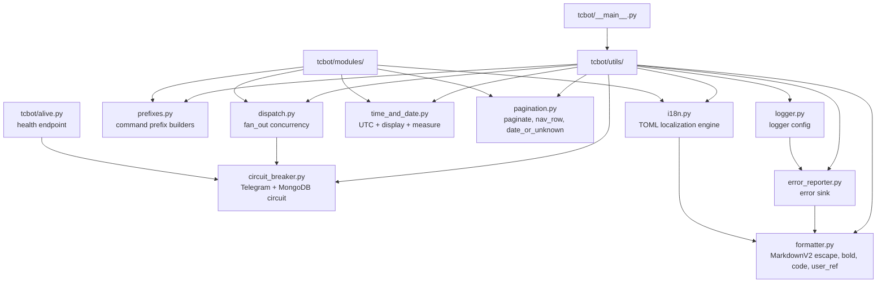

# Runtime Utilities

Runtime utilities live in `tcbot/utils/`. They provide infrastructure used across command modules, workflows, database helpers, and startup.

For modules that consume these utilities, see [`modules.md`](modules.md). For
shared helpers, see [`helpers.md`](helpers.md). For database helpers, see
[`database.md`](database.md).



## `circuit_breaker.py`

Lightweight async circuit breaker that protects the bot from wasting time on repeated timeouts when a downstream service is unresponsive.

| Export | Purpose |
|---|---|
| `CircuitBreaker(name, failure_threshold=5, recovery_timeout=60.0)` | Per-service circuit breaker instance. |
| `CircuitOpenError` | Raised when a call is rejected because the circuit is OPEN. |
| `CircuitState` | Enum: `CLOSED`, `OPEN`, `HALF_OPEN`. |
| `telegram` | Module-level singleton for Telegram API calls. |
| `mongodb` | Module-level singleton for MongoDB calls. |

States and transitions:

```
CLOSED --[5 consecutive TimedOut/NetworkError]--> OPEN
OPEN   --[60s elapsed]--> HALF_OPEN
HALF_OPEN --[probe succeeds]--> CLOSED
HALF_OPEN --[probe fails]--> OPEN
```

`CircuitBreaker.call(coro)` executes the coroutine through the breaker: a `CircuitOpenError` is raised without touching the service when the circuit is OPEN; any exception from the coroutine is re-raised after being counted against the circuit.

`record_success()` and `record_failure()` are public methods for callers that manage their own try/except (for example, `dispatch.fan_out` which only counts network errors, not expected API refusals).

The Telegram circuit state (`closed`, `open`, or `half_open`) is exposed in the `/health` endpoint under `circuit_telegram` and `circuit_mongodb`. After recovery, `CircuitBreaker.try_acquire()` admits only one `HALF_OPEN` probe; concurrent callers are rejected until that probe completes.

## `dispatch.py`

| Export | Purpose |
|---|---|
| `fan_out(coros, max_concurrent=10)` | Run awaitables concurrently up to `max_concurrent` at once; regular failures return as list elements, `asyncio.CancelledError` always propagates. |
| `gather_bounded(coros, max_concurrent=10)` | Same result contract as `fan_out` with no circuit interaction. Use it for pure database bursts (for example bulk deactivations during cleanup) where the Telegram breaker must not gate the work. |
| `count_errors(results)` | Count every `BaseException` item in a `fan_out` result list. Strict primitive for callers where any refusal means "not reached"; current broadcast, maintenance, and moderation fan-outs all count via `count_transient_errors` or structured results instead. |
| `is_benign_telegram_error(exc)` | Return True for known-benign Telegram refusals (user not participant, chat gone, bot demoted). |
| `count_transient_errors(results)` | Count only non-benign failures. Used by moderation fan-outs (ban, unban, mute, warn auto-ban) so benign refusals do not look like failed groups. |
| `throw_if_cancelled(results)` | Re-raise the first `asyncio.CancelledError` in `gather(return_exceptions=True)` results; other exceptions pass through untouched. Single owner for the cancellation check repeated at every gather site so shutdown is never coerced into data. |

`fan_out` behavior:

- preserves input order in the returned list;
- returns regular exceptions as list elements instead of raising;
- re-raises `asyncio.CancelledError` instead of capturing it as data, so shutdown is never misreported as per-group failures;
- returns an empty list for empty input;
- defaults to 10 concurrent tasks, which is safe for Telegram API fan-out operations;
- integrates the `telegram` circuit breaker: slots that run while the circuit is OPEN return `CircuitOpenError` immediately instead of issuing a Telegram request that will time out;
- only `TimedOut` and `NetworkError` are counted against the circuit; expected API refusals (403 Forbidden, 400 Bad Request) are not.
- closes an already-created coroutine when the OPEN circuit skips its slot, preventing an un-awaited coroutine warning.

Use it for multi-group actions such as ban, unban, mute, broadcast, and cleanup.

`gather_bounded` preserves input order, returns regular exceptions as list
elements, re-raises `asyncio.CancelledError`, and returns an empty list for
empty input. It never touches the Telegram circuit, so a cleanup database
burst stays bounded without being skipped while the circuit is OPEN.

```python
results = await fan_out(
    [ctx.bot.ban_chat_member(group["chat_id"], target_id) for group in groups]
)
errors = count_transient_errors(results)
```

## `prefixes.py`

Command prefix support is centralized here.

| Export | Purpose |
|---|---|
| `build_prefixed_filters(command)` | Builds a PTB message filter matching any configured prefix plus an exact lowercase command. |
| `parse_cmd_args(text)` | Returns command arguments after the first whitespace. |
| `ALL_PREFIXES_CMD_FILTER` | Matches any configured prefixed command across all configured prefixes including `/`. Used in `ConversationHandler` fallbacks to catch a new command and cancel the active conversation. |

`PREFIXES` supports a Python-style list such as `["/", "!", "."]` and falls back to common prefixes when unset. Prefix filters are case-sensitive, accept lowercase ASCII command names, and only accept `@BotName` suffixes that target the current bot.

## `logger.py`

Logging setup is installed from `tcbot.__main__.main()`.

| Export | Purpose |
|---|---|
| `BotLogFormatter` | Console formatter with time, date, module, line, level, and message. |
| `TelegramErrorHandler` | Logging handler that forwards error-level records to `error_reporter`. |
| `setup(level=logging.INFO)` | Installs console and Telegram error handlers on the root logger and quiets noisy libraries. |

Third-party loggers such as `httpx`, `telegram`, `motor`, and `pymongo` are capped to reduce noise.

## `error_reporter.py`

Error reporting sends structured MarkdownV2 messages to `LOGS_ERRORS`.

| Export | Purpose |
|---|---|
| `attach(bot, chat_id, thread_id, *, owner_id=0)` | Stores the live bot and destination after PTB startup. `set_owner()` refreshes the owner-DM target after ownership transfer. |
| `build_error_message(exc=None, record=None, context=None)` | Formats exception or log-record details for Telegram. |
| `send_to_log_errors(text)` | Sends a prepared message to the error destination. |
| `report_exc(exc, context=None)` | Reports an exception. |
| `report_record(record)` | Reports a logging record. |

The reporter classifies expected Telegram errors, trims long tracebacks, escapes MarkdownV2, and avoids raising if the destination is not configured.

`__main__.py` wires error reporting in two places:

1. PTB error handler for handler exceptions.
2. Asyncio loop exception handler for background task failures.

## `time_and_date.py`

This module is the single source of truth for every clock read: UTC datetime
handling plus monotonic measurement.

| Function | Use |
|---|---|
| `utc_now()` | Store timestamps and compare elapsed time. |
| `to_utc(dt)` | Normalize naive or aware datetimes before arithmetic. |
| `fmt_dt(dt)` | Display datetimes as `DD-MM-YYYY | HH:MM`. |
| `utc_now_str()` | Display the current UTC time using `fmt_dt()`. |
| `from_timestamp(ts)` | Convert a POSIX timestamp (e.g. log record time) to aware UTC. |
| `monotonic()` | Monotonic clock in seconds, for measuring durations. |
| `elapsed_ms(start)` | Milliseconds since a `monotonic()` reading. |
| `TELEGRAM_LOOKUP_TIMEOUT` | Standard 3s budget for single Telegram lookups. |

Do not call `datetime.utcnow()` or `datetime.now(timezone.utc)` outside this utility. Do not read `time.monotonic()` directly; use the helpers above. The only exception is Redis rate limiting, which needs wall-clock `time.time()` scores shared across processes.

## `pagination.py`

Shared pagination helpers used by `stats_flow.py` and `check_flow.py` drill-down pages.

| Export | Purpose |
|---|---|
| `paginate(items, page, page_size)` | Slice a list for a 0-based page number. Returns `(chunk, total_pages, clamped_page)`. |
| `nav_row(page, total_pages, cb_prefix)` | Build a `[« Prev]` / `[Next »]` inline keyboard row when there is more than one page. Buttons use `cb_prefix:<page>` callback data. |
| `date_or_unknown(value)` | Format a datetime field via `fmt_dt` or return `"Unknown"` if the value is falsy. |

Always import these from `tcbot.utils.pagination`; do not reimplement pagination logic inside individual flow files.

## `formatter.py`

Single source of truth for all Telegram Markdown markup. Both the utils layer (e.g. `error_reporter.py`) and the modules layer import from here.

| Function | Output/use |
|---|---|
| `esc(text)` | Escape MarkdownV2 special characters for safe inline inclusion. |
| `bold(text)` | `*...*` with escaped content. |
| `italic(text)` | `_..._` with escaped content. |
| `code(text)` | `` `...` `` with escaped content. |
| `pre(text)` | ` ```...``` ` monospace block with escaped content. |
| `link(text, url)` | MarkdownV2 link. Escape or validate untrusted URLs before passing. |
| `user_ref(user_id, name, username=None)` | ID-based mention, always a clickable `FullName` resolving via `tg://user?id=...`; usernames are never used. The `name` is used verbatim as the link text, so a bare numeric fallback from `extraction._best_name` renders as the raw ID. Sole mention helper in the formatter (the old `mention()` alias was removed). |

Always import from `tcbot.utils.formatter`.

## `i18n.py`

TOML-backed localization engine. A catalog of per-locale TOML files under the project's `i18n/` directory is loaded once on first use and held process-wide. Both the handler layer and the helper layer import from here.

The catalog layout:

```
i18n/
├── en-US/          Default locale (required)
│   ├── banning.toml
│   ├── common.toml
│   └── ...
└── id/             Optional locale (Indonesian example)
    ├── banning.toml
    ├── common.toml
    └── ...
```

Each TOML file name becomes a dotted key prefix: a key `done` in `banning.toml` registers as `banning.done`. Dotted tables in TOML (e.g. `[language.help]` + `overview = "..."`) flatten to dotted keys (`language.help.overview`).

### Core types and constants

| Export | Purpose |
|---|---|
| `Safe(str)` | Pre-formatted fragment exempt from placeholder escaping. Wrap `user_ref()`/`code()`/`bold()` output or any already-safe markup so `t()` interpolates it verbatim instead of escaping it. |
| `I18nError` | Programming error in translation usage: bad template or bad value. Inherits `KeyError`. |
| `DEFAULT_LOCALE` | `"en-US"`: fallback when the user or group locale is absent, unknown, or invalid. |

### Catalog functions

| Function | Purpose |
|---|---|
| `load_catalog(root=None)` | Load every locale under `root` (default `i18n/`). File name is the key prefix. Malformed TOML raises `I18nError` immediately so a broken catalog fails fast at startup. |
| `reload_catalog(root=None)` | Reload the process-wide catalog, primarily for tests. |
| `available_locales(catalog=None)` | Return sorted locale codes present in the catalog. |
| `is_known_locale(locale, catalog=None)` | Return `True` when `locale` has a catalog (case-insensitive). |

### Render function

| Function | Purpose |
|---|---|
| `t(key, locale=None, catalog=None, *vargs, plain=False, **kwargs)` | Render `key` for `locale` with safe placeholder interpolation. Templates are stored raw (no manual backslashes): literal segments are auto-escaped in MarkdownV2 mode (`plain=False`) and left verbatim with `plain=True` (callback alerts). Templates support strict mini-markup: `` `code` `` spans and `*bold*` spans (balanced, unnested, no braces). Unknown locales fall back to `DEFAULT_LOCALE`; missing keys are logged and returned as `[key]` (never empty, never an exception into the handler). |

### Resolution helpers

| Function | Purpose |
|---|---|
| `resolve_locale(chat_type="private", user_locale=None, group_locale=None, explicit=None, catalog=None)` | Resolve the effective locale for one message. `explicit` always wins. Private chats use `user_locale`; group-like chats use `group_locale`. Absent/unknown values fall through to `DEFAULT_LOCALE`. |
| `display_name(locale, catalog=None)` | Human-readable locale name for buttons and confirmations (reads the `button.language_name` key from the locale's catalog). |

All bot modules use `t()` rather than hard-coding user-facing strings.

## `transport.py`

Single owner for the outbound Telegram transport tuning used by every runtime entry point.

| Constant | Purpose |
|---|---|
| `HTTP_READ_TIMEOUT` / `HTTP_WRITE_TIMEOUT` / `HTTP_CONNECT_TIMEOUT` / `HTTP_POOL_TIMEOUT` | Seconds for the PTB `ApplicationBuilder` HTTP timeouts. |
| `API_POOL_SIZE` | Connection pool size for the underlying httpx client. |

Both `tcbot/__main__.py` (webhook and polling) and `tcbot/serverless.py` (Vercel) import these instead of redefining them, so timeout and pool behavior stays identical across transports.

## Utility boundaries

- Keep generic runtime concerns in `utils/`.
- Keep feature-specific text and keyboard policy in `modules/helper/` or workflows.
- Use `fan_out()` rather than hand-written unbounded `asyncio.gather()` loops for Telegram API operations across groups.
- Use `gather_bounded()` rather than unbounded `asyncio.gather()` for pure database bursts across groups.
- Use prefix helpers for all command filters so custom prefixes remain consistent.
