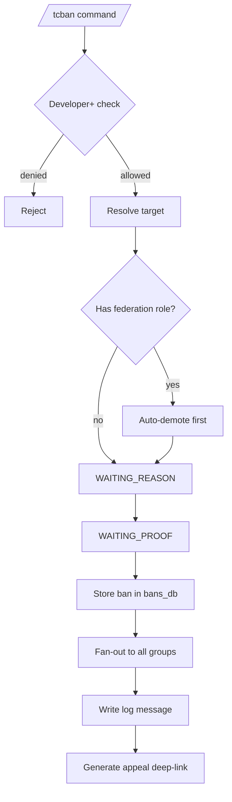

# Banning Detailed Documentation

This document describes the current federation ban, ban lookup, and unban behavior implemented by `tcbot/modules/banning.py`, `tcbot/modules/helper/workflows/ban_flow.py`, `tcbot/modules/checking.py`, `tcbot/modules/unbanning.py`, and `tcbot/database/bans_db.py`.

For appeal flow following a ban, see [`appeal-detailed.md`](appeal-detailed.md). For check command used to lookup bans, see [`check-detailed.md`](check-detailed.md). For warnings that may auto-ban, see [`warnings-detailed.md`](warnings-detailed.md). For role auto-demotion on ban, see [`role-detailed.md`](role-detailed.md). For shared helpers, see [`helper/helper.md`](helper/helper.md). For database layer, see [`databases/databases.md`](databases/databases.md).



## Purpose

A federation ban marks a user as banned in the persistent `bans` collection and applies the Telegram ban across all active connected groups. The ban workflow requires a moderator reason and proof media, records proof/log message IDs, and exposes an appeal deep link for the banned user.

## Commands and aliases

| Command | Alias | Purpose | Access |
|---|---|---|---|
| `/tcban` | `/tcb` | Create or update a federation-wide ban. | Developer and above. |
| `/tcunban` | `/tcunb` | Deactivate an active federation ban and unban across connected groups. | Developer and above via `mod_only`. |
| `/checkme` | `/cme` | Let a user check their own active federation ban and access the appeal link. | Anyone. |
| `/check` | `/c` | Look up any user's full federation profile (identity, role, bans, warns, kicks, mutes, appeals). | Anyone. |

Commands use the project's configured prefixes; slash commands are examples.

## `/tcban` flow

The ban command is a `ConversationHandler` with one proof-collection state.

1. A moderator runs `/tcban <target> <reason>` or replies to a user with `/tcb <reason>`.
2. The bot resolves the executor role and target in parallel.
3. The executor must have at least Developer rank (`founder`, `admin`, or `developer`).
4. The target must resolve to a Telegram user ID.
5. A non-empty reason is required before the proof step starts.
6. The bot rejects attempts to ban itself or the executor's own account.
7. The bot checks the target role and enforces hierarchy rules.
8. The bot prompts for proof media.
9. The moderator sends one or more photos/videos.
10. The bot uploads proof, writes or updates the ban record, posts logs, enforces the ban across connected groups, and edits the prompt with a summary.

## Target resolution and reason parsing

The target can be specified by:

- Replying to a message from the target.
- Passing a numeric user ID after the command.
- Passing an `@username` after the command, when resolvable by the project's extraction helper.

Reason parsing depends on whether the first argument is an explicit target:

```text
/tcban @username spamming in connected groups
# target: @username
# reason: spamming in connected groups

/tcban 123456789 scamming members
# target: 123456789
# reason: scamming members

# Reply to a message:
/tcb repeated harassment
# target: replied user
# reason: repeated harassment
```

If no reason remains after parsing, the bot ends the conversation and asks for `/tcban <target> <reason>`.

## Proof requirement

Ban proof is required. The ban proof builder is created as:

```python
proof = BuildProof("ban", skip_allowed=False)
```

That means the proof keyboard only provides `Cancel`; there is no `Skip` button for bans. The state accepts only photo or video messages:

- Single photo: uploaded with `send_photo` to the configured proof destination.
- Single video: uploaded with `send_video` to the configured proof destination.
- Media album: collected by `media_group_id`, debounced using `cfg.album_debounce`, and uploaded with `send_media_group`.

If the moderator cancels, the bot edits the prompt to `Cancelled. No ban was issued.` and ends the conversation.

If the proof wait times out or a recognized command is sent as a fallback, the bot replies `Timed out waiting for proof. No ban was issued.` and ends the conversation.

## New ban behavior

When the target has no active ban:

1. A new short `ban_id` is generated with `bans_db.make_ban_id()`.
2. Proof is uploaded to `cfg.proofs` with a `proof_caption_new` caption.
3. A new ban log is built with `parse_logmsg.ban_log`.
4. The ban record is inserted with `bans_db.create_ban(...)`.
5. The ban log is sent to `cfg.logs` with a keyboard containing:
   - `Proof <target_id>` URL button.
   - `Submit Appeal` URL button.
6. The sent log message ID is saved with `bans_db.set_log_message_id(...)` when available.
7. The target is banned in every active connected group returned by `groups_db.active_groups()`, plus the primary groups (`MAIN_GROUP`, `EXTEND_GROUP`) when they are not already in the connected-groups list.
8. The target user is cached with `users_cache.upsert_user(...)`.
9. The original proof prompt is edited with an applied-groups summary.

The `Submit Appeal` button opens the bot DM deep link:

```text
https://t.me/<bot_username>?start=appeal_<ban_id>
```

If `bot.username` is unavailable, the implementation falls back to `TCFBot` when building the appeal link.

## Updating an existing active ban

If the target already has an active ban, the bot updates the existing record instead of creating a duplicate.

The update flow:

1. Calls `bans_db.deactivate_extra_active_bans(target_id, keep_ban_id=existing_ban_id)` to clean up any duplicate active records, leaving only the canonical one active.
2. Reuses the existing `ban_id`.
3. Builds an update proof caption with `proof_caption_update`.
4. Preserves previous proof/log IDs as `previous_proof_message_id` and `previous_log_message_id`.
5. Updates the reason, banning admin, proof ID, log ID, and `updated_timestamp` through `bans_db.update_ban(...)`.
6. Increments `update_count`.
7. Posts an update log with `parse_logmsg.ban_update_log`.
8. Uses a keyboard with current proof, previous proof, and submit-appeal buttons when both proof links exist.
9. Enforces the Telegram ban across connected groups again.

## Connected-group enforcement

Federation enforcement uses `groups_db.active_groups()` (connected groups from the `federated_groups` collection) and then appends the primary groups (`cfg.main_group`, `cfg.exec_group`) when they are not already in the list. It calls `ban_chat_member` for each group through `fan_out(...)`. `fan_out` caps concurrency and returns exceptions instead of raising them.

The user-facing summary reports how many groups succeeded:

```text
<target> (<target_id>) has been banned.
Reason: <reason>
Applied to <success>/<total> groups.
```

Failures are counted but do not roll back the database ban record.

## Role hierarchy and target protection

Ban execution uses the role hierarchy from `users_roles`:

| Role | Rank |
|---|---:|
| Founder | 4 |
| Admin | 3 |
| Developer | 2 |
| Tester | 1 |
| No role | 0 |

The executor must have rank >= Developer. The target check behaves as follows:

- If the target is Founder, they cannot be banned.
- If the target has a role with rank greater than or equal to the executor's rank, the action is blocked.
- If the target has a lower role, the bot automatically removes that role before continuing with the ban.

Auto-demotion is handled by `Demote.execute(..., trigger="ban")` from `workflows/demote_flow.py`:

- Admin targets are removed from `tc_admins`.
- Developer/Tester targets are removed from `tc_roles`.
- A role auto-demotion log is sent to the federation logs channel.
- The target is notified by DM when possible.

## Ban database schema impact

Ban records are stored in the `bans` collection. New records include:

| Field | Meaning |
|---|---|
| `ban_id` | Unique short ban identifier and appeal deep-link token. |
| `banned_user_id` | Telegram user ID of the banned user. |
| `reason` | Moderator-provided reason. |
| `admin_user_id` | Telegram user ID of the moderator who created or most recently updated the ban. |
| `proof_message_id` | Message ID of uploaded proof in the proof destination. |
| `log_message_id` | Message ID of the ban log in the logs destination. |
| `previous_proof_message_id` | Previous proof message ID after an update. |
| `previous_log_message_id` | Previous log message ID after an update. |
| `until_date` | Reserved for future timed-ban support; currently `None` (permanent bans only). |
| `duration_str` | Human-readable duration string; reserved alongside `until_date`; currently `None`. |
| `timestamp` | Original ban creation time. |
| `updated_timestamp` | Last update time, or `None` for a new ban. |
| `is_active` | Whether the federation ban is still active. |
| `update_count` | Number of times the active ban was updated. |
| `review_message_id` | Appeal review message ID when an appeal is pending. |
| `review_timestamp` | Time the appeal review card was created. |
| `appeal_log_msg_id` | Appeal log message ID after appeal submission. |
| `appeal_submitted_at` | Appeal submission time. |
| `appeal_link` | Link to the forwarded appeal message. |
| `rejected_by_id` | Telegram user ID of the staff member who rejected the appeal. |
| `rejected_by_name` | Display name of the rejector at the time of rejection. |
| `rejected_at` | Timestamp when the appeal was rejected. |

Indexes are ensured for:

- `bans`: `banned_user_id + is_active`
- `bans`: unique `ban_id`

Active-ban reads are deterministic: when duplicate active records exist for the same user, `get_active_ban` returns the newest by `timestamp` and then `ban_id`.

## Ban logs and proof logs

Ban-related templates are defined in `parse_logmsg.py`:

| Template | Used for |
|---|---|
| `proof_caption_new` | Caption on proof media for a new ban. |
| `proof_caption_update` | Caption on proof media for an updated ban. |
| `ban_log` | New federation ban log. |
| `ban_update_log` | Existing active ban update log. |
| `unban_log` | Manual federation unban log. |
| `appeal_unban_log` | Unban log generated by approved appeal. |

Ban log keyboards are defined in `keyboards.py`:

| Function | Buttons |
|---|---|
| `ban_log_new` | `Proof <target_id>`, `Submit Appeal` |
| `ban_log_update` | `Proof <target_id>`, `Previous Proof <target_id>`, `Submit Appeal` |
| `checkme_ban_kb` | `Details`, optional `Proof`, `Appeal` |
| `checkme_detail_back_kb` | optional `Proof`, `« Back` |

## `/checkme` behavior

`/checkme` lets a user check their own federation ban status.

Special-role responses:

- Founder receives a friendly Founder-specific clean response.
- Admin receives a staff-specific clean response.
- Developer/Tester receives a role-specific clean response.

If the user has no active ban, the bot confirms they are clean.

If the user has an active ban, the bot sends a summary containing:

- User mention and ID.
- Ban reason.
- Banning admin.
- Commit date.
- Buttons for `Details`, optional `Proof`, and `Appeal`.

The `Appeal` button opens the same bot DM deep link used by the ban log `Submit Appeal` button.

### `/checkme` callbacks

| Callback data | Behavior |
|---|---|
| `checkme_detail:<ban_id>` | Loads the active ban, answers the callback, and edits the message to the full ban detail view. |
| `checkme_back:<ban_id>` | Answers the callback and edits the message back to the summary view. |

If the ban is inactive when details are requested, the callback alert says the ban is no longer active.

## `/check` behavior

`/check` (alias `/c`) builds a comprehensive federation profile for any target: identity (mention, ID, username), role and assignment metadata, active ban, ban history, warnings by group, kicks, mutes, and appeals. Each section opens a drill-down inline keyboard so staff can inspect every record individually.

The target is resolved by reply, user ID, or resolvable username.

Special cases for the active-ban summary line:

- The bot itself is always reported clean.
- Founder cannot be banned and is reported clean.
- Admin/Developer/Tester targets are reported as staff with no active ban.
- If an active ban exists, the profile shows the ban ID inline and the Bans drill-down lists the full record with a `View Proof` button when proof exists.

Unlike `/checkme`, `/check` does not provide an appeal button because it is for third-party lookup.

## `/tcunban` behavior

Manual unban is implemented by `tcbot/modules/unbanning.py` and `tcbot/modules/helper/workflows/unban_flow.py`.

Flow:

1. The moderator runs `/tcunban <target>` or replies with `/tcunb`.
2. The target is resolved.
3. The bot rejects attempts to unban itself.
4. Founder and staff targets are treated as not federation-bannable and no unban is attempted.
5. `bans_db.get_active_ban(target_id)` must return a record.
6. All active bans for the target are deactivated atomically with `bans_db.deactivate_all_active_bans(target_id)`, which handles any duplicate active records in one operation.
7. Any pending scheduled unban job is cancelled defensively with `scheduler.cancel_schedule(f"unban.{ban_id}")`. This is a no-op when no timed-ban schedule exists and future-proofs the flow for when timed bans are added.
8. The target is unbanned from all active connected groups with `only_if_banned=True`.
9. An unban log is sent to `cfg.logs`.
10. The command reply reports the success count.

Manual unban does not currently edit any pending appeal review card. It deactivates the ban and posts the unban log.

## Edge cases

- Ban proof upload failures return `None`; the ban flow still continues and stores `0` as proof ID when no proof message ID is available.
- If the ban log send fails, the database write may still complete, but no log message ID is stored.
- If active group enforcement partially fails, the ban record remains active and the summary reports partial success.
- A duplicate active ban is updated rather than creating another active record through the command path.
- A lower-ranked staff target is auto-demoted before the ban is enforced.
- Same-rank and higher-rank staff targets are protected.
- Self-ban and bot-ban attempts are rejected before database writes.
- The proof conversation is per-chat and per-user, so simultaneous ban flows are isolated by moderator/chat.
- There is no natural-expiry timeout for the ban proof step; the bot does not use `ConversationHandler.TIMEOUT` or a job-queue. `PROOF_TIMEOUT_SECONDS` is parsed from the environment but is not consumed. `on_proof_timeout` fires as a **fallback** handler when the moderator sends any command while the proof window is open; the user receives `"Timed out waiting for proof. No ban was issued."` and the conversation ends.

## Behavior reference

Key behaviors to keep in mind:

1. Developer/Admin/Founder can start `/tcban`; Tester and unroled users cannot.
2. `/tcban` without a target is rejected.
3. `/tcban <target>` without a reason is rejected.
4. Self-ban and bot-ban attempts are rejected.
5. Same-rank or higher-rank targets are protected.
6. Lower-ranked staff targets are auto-demoted before ban enforcement.
7. The proof prompt has no `Skip` option for bans.
8. Cancel during proof collection issues no ban.
9. A single photo proof creates a ban, uploads proof, logs the ban, and bans active groups.
10. A media album proof is debounced and uploaded as an album.
11. A second ban against an already active-banned target updates the existing ban and preserves previous proof/log IDs.
12. Failed group bans are counted in the final summary but do not roll back the DB record.
13. `/checkme` on an active ban shows `Details`, optional `Proof`, and `Appeal` buttons.
14. `/check` on a user shows full federation profile with bans/warns/kicks/mutes/appeals drill-down.
15. `/tcunban` deactivates the active ban and unbans across all connected groups.
16. Active-ban reads prefer the newest active duplicate record.
