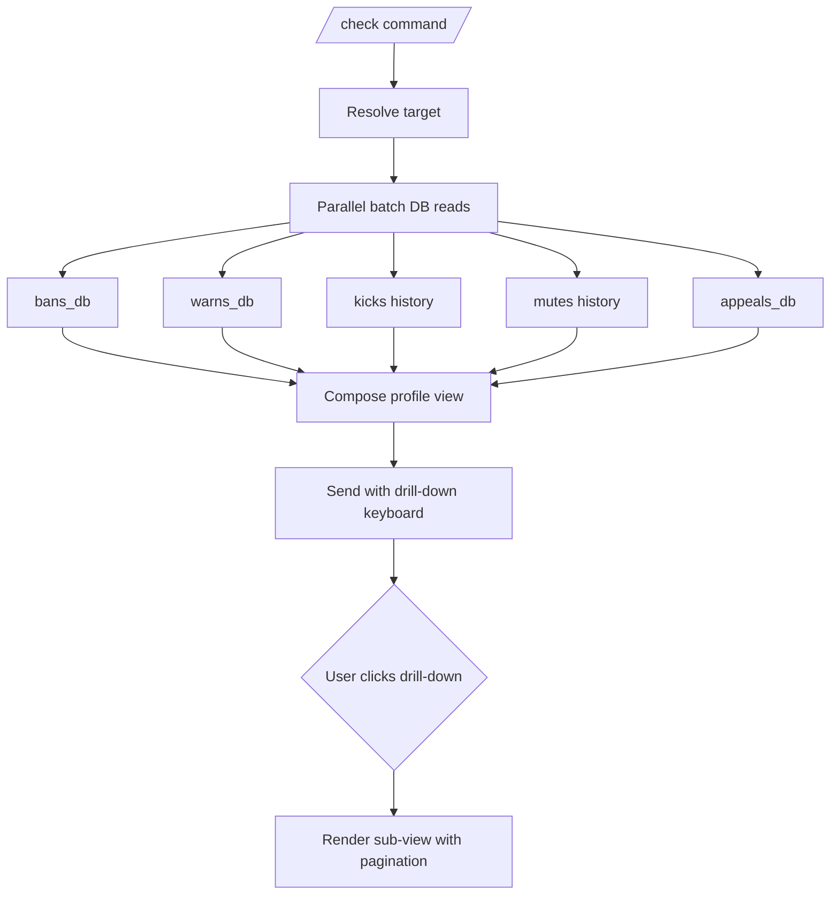

# Check Detailed Documentation

This document describes the `/check` user-profile command implemented by `tcbot/modules/checking.py` (command + callback handlers) and `tcbot/modules/helper/workflows/check_flow.py` (the `Check` class that builds every view).

For ban data shown in check, see [`banning-detailed.md`](banning-detailed.md). For warnings shown in check, see [`warnings-detailed.md`](warnings-detailed.md). For stats command which often complements check, see [`stats-detailed.md`](stats-detailed.md). For shared helpers, see [`helper/helper.md`](helper/helper.md). For database batch query patterns, see [`databases/databases.md`](databases/databases.md).



## Purpose

`/check` returns a comprehensive federation profile for any user: identity, role and assignment metadata, active ban, total ban history, warning counts per group, kick records, mute records, and appeal history. Each section opens a paginated drill-down keyboard so staff can inspect individual records.

`/checkme` remains the self-only ban-status command and is unaffected by this rebuild.

## Command surface

| Command | Aliases | Who can use | Where |
|---|---|---|---|
| `/checkme` | `/cme` | Anyone (for themselves) | Bot PM, exec group, any connected group |
| `/check` | `/c` | Anyone | Bot PM, exec group, any connected group |

The target is resolved by `extraction.extract_target`: reply, user ID, or resolvable `@username`. The old `/checkban` and `/cban` aliases have been removed; `/check` now covers and extends that surface.

## Top-level profile view

`Check.profile(bot, target_id)` returns `(html_text, keyboard)` shaped like:

```text
Profile

Name: <mention>
ID: <code id>
Username: @username or (none)
Role: <Role>
   Assigned by: <mention>
   Assigned at: dd-mm-yyyy | HH:MM

Federation Activity

Active Ban: Yes (<code ban_id>) / No
Total Bans: <n>
Warnings: <n> active across <m> group(s) (<total> total historical)
Kicks: <n>
Mutes: <n>
Appeals: <n>
```

Inline keyboard:

```text
[ Bans (n) ] [ Appeals (n) ]
[ Warnings (n active)      ]
[ Kicks (n) ] [ Mutes (n)  ]
```

Founder targets show only `Role: Founder` (no `Assigned by` / `Assigned at`; `tc_owners` does not record metadata).

## Drill-down views

Every drill-down keyboard ends with `« Back` which re-renders the profile via `Check.profile`.

### Bans (`check_bans:<target_id>:<page>`)

`Check.bans_list` lists every ban (active and inactive), newest first, 5 per page. Each line shows status (`Active` / `Inactive`), Ban ID, timestamp, and a 60-character reason snippet. Numbered buttons open `Check.ban_detail` for the full ban card.

```text
Bans: N total, page p/P

1. Active | <code ban_id> | dd-mm-yyyy HH:MM
   spam in connected groups
2. Inactive | <code ban_id> | ...
   ...
```

`Check.ban_detail(target_id, ban_id)` re-uses `helper/ban_info.build_ban_detail` so the rendered card matches `/checkme` and `/tcstats` ban-detail views. The keyboard exposes `View Proof` and `View Appeal` URL buttons when those are available.

### Appeals (`check_appeals:<target_id>:<page>`)

`Check.appeals_list` filters `user_bans` to records with a populated `appeal_log_msg_id`, then paginates them. Each line shows whether the appeal was approved (the ban is now inactive) or is still pending / was rejected (the ban is still active). Numbered buttons open the same `Check.ban_detail` view as the Bans drill-down.

### Warnings (`check_warns:<target_id>` and `check_warn_chat:<target_id>:<chat_id>:<page>`)

Two-level drill-down because warnings are per-group:

1. `Check.warns_by_group` lists groups where the user has warns, with the count and a button per group. Group titles come from `groups_db.get_group_titles`.
2. `Check.warns_in_group` paginates the individual warnings inside the chosen chat: timestamp, reason snippet, and the admin who issued the warning.

### Kicks (`check_kicks:<target_id>:<page>`)

`Check.kicks_list` paginates every kick record (`kicks_db.user_kicks`). Each line shows timestamp, group title, reason snippet, and admin.

### Mutes (`check_mutes:<target_id>:<page>`)

`Check.mutes_list` paginates every mute record (`mutes_db.user_mutes`) with the same shape as kicks.

## Callback routing

All callbacks are registered in `checking.py` and run safely on repeated taps thanks to `safe_edit_cb` swallowing benign `BadRequest` errors (e.g. `Message is not modified`).

| Callback data | Handler |
|---|---|
| `check_main:<uid>` | `on_check_main`: re-renders the profile (used by all `« Back` buttons). |
| `check_bans:<uid>:<page>` | `on_check_bans` |
| `check_ban_item:<uid>:<ban_id>` | `on_check_ban_item` |
| `check_warns:<uid>` | `on_check_warns` (warns-by-group view). |
| `check_warn_chat:<uid>:<chat_id>:<page>` | `on_check_warn_chat` |
| `check_kicks:<uid>:<page>` | `on_check_kicks` |
| `check_mutes:<uid>:<page>` | `on_check_mutes` |
| `check_appeals:<uid>:<page>` | `on_check_appeals` |

## Database helpers used

`/check` aggregates data from across the database layer. New per-user helpers were added specifically for this command:

| Helper | Purpose |
|---|---|
| `users_cache.get_user(uid)` | Cached profile snapshot: first name, username, last name. |
| `users_roles.role_meta(uid)` | `(role, assigned_by, assigned_at)` for the Role line. |
| `users_cache.get_first_name(uid, fallback)` | Cache-only name lookup used for admin attribution in drill-down lists. |
| `bans_db.get_active_ban(uid)` | Current active ban, if any. |
| `bans_db.user_bans(uid)` | Every ban record (active + inactive), newest first. |
| `bans_db.user_ban_count(uid)` | Count of bans on this user. |
| `bans_db.user_appeal_count(uid)` | Count of bans on this user that ever had an appeal submitted. |
| `warns_db.user_total_warns(uid)` | Total warning rows across all groups. |
| `warns_db.user_warn_groups(uid)` | `[(chat_id, count), ...]` for the per-group breakdown. |
| `warns_db.get_warns(uid, chat_id)` | Individual warnings inside one chat. |
| `kicks_db.user_kicks(uid)` | Kick records, newest first. |
| `kicks_db.user_kick_count(uid)` | Kick count. |
| `mutes_db.user_mutes(uid)` | Mute records, newest first. |
| `mutes_db.user_mute_count(uid)` | Mute count. |
| `groups_db.get_group_titles([chat_ids])` | Bulk title lookup for kicks / mutes / warnings lists. |

## Async behavior: zero-delay design

The profile view performs ten independent reads in a single `asyncio.gather`:

```python
(
    (fname, uname),
    (role, role_by_id, role_at),
    active_ban,
    ban_total,
    appeal_total,
    warn_total,
    warn_groups,
    fed_warn_total,
    kick_total,
    mute_total,
) = await asyncio.gather(
    _resolve_user_info(bot, target_id),
    db.users_roles.role_meta(target_id),
    db.bans_db.get_active_ban(target_id),
    db.bans_db.user_ban_count(target_id),
    db.bans_db.user_appeal_count(target_id),
    db.warns_db.user_total_warns(target_id),
    db.warns_db.user_warn_groups(target_id),
    db.warns_db.federation_warn_count(target_id),
    db.kicks_db.user_kick_count(target_id),
    db.mutes_db.user_mute_count(target_id),
    return_exceptions=True,
)
```

Per-record renderers in `kicks_list`, `mutes_list`, and `warns_in_group` also gather admin-name lookups and group-title lookups up front so the line loop is purely synchronous string-building.

`_resolve_user_info` consults the member cache first; only on a partial cache miss does it call `bot.get_chat`, and that call is wrapped in `asyncio.wait_for(timeout=3.0)` so a stalled Telegram lookup never blocks the user for more than three seconds.

## Indexes

`mongos.ensure_indexes()` creates the indexes that make this view fast:

| Collection | Index | Powers |
|---|---|---|
| `bans` | `(banned_user_id, timestamp -1)` | `user_bans` history list |
| `bans` | `(is_active, timestamp -1, ban_id -1)` | active counts, active list scans |
| `warns` | `(user_id, timestamp -1)` | `user_all_warns` |
| `warns` | `(user_id, chat_id, timestamp -1)` | per-chat warn list |
| `kicks` | `(user_id, timestamp -1)` | `user_kicks` |
| `mutes` | `(user_id, timestamp -1)` | `user_mutes` |
| `member_cache` | `(user_id)` unique | `get_user` / `get_first_name` lookups |

## Edge cases

- A user that has never interacted with the bot and has no public profile resolves to their numeric user ID (e.g. `123456789`) as the fallback display name, not `User 123456789`. This allows callers to detect a numeric fallback via `str(name) == str(uid)` comparison.
- The bans list shows both active and inactive bans; the active record (if any) appears at the top because of the timestamp-desc sort.
- The appeals list filters bans by the presence of `appeal_log_msg_id`; rejected appeals stay in the list with `Pending / Rejected` status until the ban is overturned, at which point the same record shows `Approved (unbanned)`.
- The warnings-by-group view shows only groups with a non-zero counter row; an old empty counter is cleaned by `clear_warns`.
- All inline edits go through `safe_edit_cb`, so re-tapping a button you are already on no longer reports a `Message is not modified` error.

## Behavior reference

- A user with no records shows zero counts and friendly empty-state messages in each drill-down.
- Pagination clamps to the last page when the page index exceeds the available pages.
- The Role line collapses to `Role: Founder` for the owner (no `Assigned by` / `Assigned at`).
- The Role line shows `Assigned by` + `Assigned at` for Admin (from `tc_admins`) and Developer / Tester (from `tc_roles`).
- The `View Proof` button only appears when a ban has a `proof_message_id`.
- The `View Appeal` button only appears when a ban has a non-empty `appeal_link`.
- Tapping a button you are already viewing does not raise a Telegram error.
