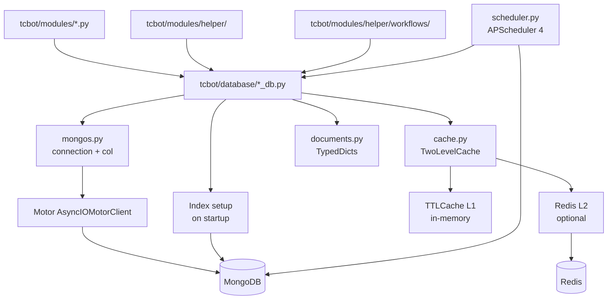

# Database Layer

The database layer lives in `tcbot/database/` and is the only place that should perform MongoDB reads and writes. Command modules and workflows should call helper functions instead of calling `mongos.col()` directly.

For modules that consume these database helpers, see [`../modules/modules.md`](../modules/modules.md). For shared helpers, see [`../helper/helper.md`](../helper/helper.md). For conversation flows, see [`../workflows/workflows.md`](../workflows/workflows.md).



## Connection manager

`mongos.py` owns the Motor client lifecycle.

| Export | Purpose |
|---|---|
| `connect()` | Creates the `AsyncIOMotorClient`, selects `cfg.db_name`, and pings MongoDB through the circuit breaker. A successful ping records a CLOSED success on the `mongodb` circuit; repeated failures trip it to OPEN. |
| `ensure_indexes()` | Creates all required indexes on startup. Safe to call repeatedly. |
| `db()` | Returns the active database or raises if `connect()` has not run. |
| `col(name)` | Returns a collection from `db()`. Use only inside database helper modules. |
| `db_call(coro)` | Executes a Motor coroutine through the `mongodb` circuit breaker. Raises `CircuitOpenError` when the circuit is OPEN so callers fast-fail instead of waiting the 45-second socket timeout. All eight DB helper modules (`bans_db`, `groups_db`, `users_roles`, `users_cache`, `warns_db`, `mutes_db`, `kicks_db`, `queues_db`) wrap every Motor operation with `db_call()`. Five consecutive failures open the circuit; a half-open probe re-closes it when MongoDB recovers. |
| `make_short_id(length=10)` | Generates lowercase alphanumeric IDs for records such as bans and promotion requests. |

## Collections and helpers

| Helper | Collection(s) | Main responsibilities |
|---|---|---|
| `users_cache.py` | `member_cache` | Member profile cache operations: upsert, change-detection upsert, get, batch queries, mention formatting, total count, all users list. |
| `users_roles.py` | `tc_owners`, `tc_admins`, `tc_roles` | Owner CRUD, admin CRUD, developer/tester role CRUD, effective-role resolution, can_act_on checks. |
| `bans_db.py` | `bans` | Active ban lookup, ban creation/update, unban deactivation, appeal/review metadata, active ban lists. |
| `warns_db.py` | `warns`, `warn_counts` | Warning history, warning counters, backfill/sync, remove latest warning, clear warnings. |
| `kicks_db.py` | `kicks` | Kick audit records. |
| `mutes_db.py` | `mutes`, `active_mutes` | Mute audit records (`mutes`). Active-mute store (`active_mutes`): one document per muted user, used to re-apply restrictions on join and on group connect. `set_active_mute` / `clear_active_mute` / `get_active_mute` / `active_mute_docs`. |
| `queues_db.py` | `promotion_requests` | Queued Admin promotion requests and resolution status. |
| `cache.py` | in-process + Redis | `TTLCache[T]` (L1 in-process) and `TwoLevelCache[T]` (L1 in-process + L2 Redis). Four public singletons: `effective_role_cache`, `connected_cache`, `active_groups_cache`, `owner_id_cache`. |
| `redis_client.py` | Redis (optional) | Async Redis client singleton via `redis.asyncio.ConnectionPool`. `connect(url)` creates the pool and runs `PING`. `client()` returns the active client or `None` when Redis is not configured. `hiredis` C extension required. |
| `scheduler.py` | MongoDB (APScheduler) | APScheduler 4.x `AsyncScheduler` backed by `MongoDBDataStore` and `CBORSerializer`. Persistent scheduled jobs (unban, warn expiry) survive bot restarts. Member-cache cleanup is handled by a MongoDB TTL index, not a scheduler job. Background asyncio task owns the cancel scope. `is_ready()` returns `True` when the scheduler background task is running. |
| `documents.py` | type-only | `TypedDict` document shapes and `Literal` aliases. |
| `types.py` | type-only | `NewType` primitives such as `UserId`, `GroupId`, `ChatId`, and `BanId`. |
| `groups_db.py` | `federated_groups`, `pending_joins` | Connected group state, pending connection requests, group cache invalidation. |

## Member cache optimization

The `member_cache` collection stores user profile data. For performance, use the appropriate query function:

| Function | Fields fetched | Use case |
|---|---|---|
| `get_user(user_id)` | All fields | When you need a complete user profile |
| `get_first_name(user_id, fallback)` | `first_name` only | When you only need the display name for one user |
| `get_user_mention_data(user_id)` | `first_name`, `username` | Single-user mention formatting (returns tuple) |
| `get_first_names_batch(user_ids)` | `first_name` only | Display names for many users in one query (returns `dict[int, str]`) |
| `get_mention_data_batch(user_ids)` | `first_name`, `username` | Mention data for many users in one query (returns `dict[int, tuple]`) |
| `search_by_name(needle, limit)` | `user_id`, `first_name`, `username` | Partial name or username search: server-side regex, max `limit` results (default 5). Used by target resolution in `extraction.py` to avoid loading the full user cache. |

For group title lookups across multiple chat IDs, use `groups_db.get_group_titles(chat_ids)` which returns `dict[int, str]` in a single query.

| `upsert_user(user_id, username, first_name, last_name)` | All fields | Unconditional DB write (used on first-seen and forced refresh) |
| `upsert_user_if_changed(user_id, username, first_name, last_name)` | All fields | Change-detection write: checks L1 mention cache; skips MongoDB write when `(first_name, username)` matches cached data. Returns `True` when a write occurred. Use this on every hot-path update (e.g. per-message member cache harvesting). |

**Performance tip:** Use batch functions whenever you need data for more than one user in a list view or fan-out result. Calling single-user functions inside a loop is an N+1 anti-pattern. Both batch functions rely on the `(user_id, first_name, username)` covered-query index in `member_cache`. For partial-name target resolution, always use `search_by_name` instead of `all_users` to avoid a full collection transfer.

**Hot-path harvest pattern:** On every observed Telegram update, call `upsert_user_if_changed` (not `upsert_user`). When the user's identity has not changed since the last observation the function returns in sub-microsecond time without any I/O. A MongoDB write only occurs when `first_name` or `username` has changed. Fire the call as a background `asyncio.Task` so the handler chain is never blocked by the DB write; keep a strong reference to the task in a module-level `set` with a `discard` done-callback to satisfy RUF006.

## Startup indexes

`ensure_indexes()` creates:

| Collection | Index |
|---|---|
| `bans` | `(banned_user_id, is_active)` |
| `bans` | unique `(ban_id)` |
| `tc_owners` | unique `(user_id)` |
| `tc_admins` | unique `(user_id)` |
| `tc_roles` | unique `(user_id)` |
| `federated_groups` | `(chat_id, is_active)` |
| `federated_groups` | unique `(chat_id)` |
| `member_cache` | unique `(user_id)` |
| `member_cache` | `(user_id, first_name, username)` (covered-query index for batch `$in` projections) |
| `warns` | `(user_id, chat_id, timestamp desc)` |
| `warn_counts` | unique `(user_id, chat_id)` |
| `kicks` | `(user_id, timestamp desc)` |
| `mutes` | `(user_id, timestamp desc)` |
| `promotion_requests` | unique `(request_id)` |
| `promotion_requests` | `(target_id, status)` |

If a new query depends on a new access pattern, add the matching index in `ensure_indexes()` together with the helper change.

## Role model

Effective roles are resolved in `users_roles.get_effective_role()`:

1. Founder from `tc_owners` returns `"founder"`.
2. Admin from `tc_admins` returns `"admin"`.
3. Custom role from `tc_roles` returns `"developer"` or `"tester"`.
4. No role returns `None`.

Rank ordering:

```text
founder = 4 > admin = 3 > developer = 2 > tester = 1 > none = 0
```

Use `users_roles.role_rank()` and `users_roles.can_act_on()` instead of hand-written comparisons.

## Ban model

`bans` documents are represented by `BanDoc` and may contain:

| Field | Meaning |
|---|---|
| `ban_id` | Short unique ban identifier. |
| `banned_user_id` | Target Telegram user ID. |
| `reason` | Moderation reason. |
| `admin_user_id` | Admin who created or updated the ban. |
| `proof_message_id` | Uploaded proof message ID in the proof destination. |
| `log_message_id` | Audit log message ID. |
| `previous_proof_message_id` / `previous_log_message_id` | Prior records when an active ban is updated. |
| `until_date` / `duration_str` | Reserved for future timed-ban support; both currently `None`. |
| `timestamp` | Initial creation time. |
| `updated_timestamp` | Last update time when applicable. |
| `is_active` | Whether the federation ban is active. |
| `update_count` | Number of updates to the ban. |
| `review_message_id` / `review_timestamp` | Appeal review card metadata. |
| `appeal_log_msg_id` / `appeal_submitted_at` / `appeal_link` | Submitted appeal metadata. |
| `rejected_by_id` / `rejected_by_name` / `rejected_at` | Rejector identity and timestamp (set by `bans_db.set_rejected_by` on appeal rejection). |

Key helper functions:

- `bans_db.get_active_ban(user_id)`: returns the currently active ban for a user, or `None`.
- `bans_db.get_ban(ban_id)`: fetches a single ban record by its short ID.
- `bans_db.create_ban(...)` / `bans_db.update_ban(...)`: write a new ban or update an existing one.
- `bans_db.deactivate_ban(ban_id)`: marks a single ban record inactive by its `ban_id`.
- `bans_db.deactivate_all_active_bans(user_id)`: marks every active ban for a user inactive in one atomic update. Returns the count of deactivated records. Used by unban and appeal-approval flows to clear all active duplicates at once.
- `bans_db.deactivate_extra_active_bans(user_id, keep_ban_id)`: marks all active bans for a user inactive except the one matching `keep_ban_id`. Used by the ban-update path to clean up duplicate active records before writing the canonical update.
- `bans_db.set_review(...)` / `bans_db.set_appeal_log_msg(...)`: store appeal/review metadata on an existing ban.
- `bans_db.active_bans()` / `bans_db.active_ban_count()` / `bans_db.active_ban_user_ids()`: federation-wide active ban queries.
- `bans_db.user_bans(user_id)` / `bans_db.user_ban_count(user_id)`: per-user ban history (all records, active and inactive).
- `bans_db.user_appeal_count(user_id)`: count of submitted appeals for a user.

## Warning model

Warnings are stored per user and chat:

- `warns` stores each warning event.
- `warn_counts` stores a counter document for fast limit checks with `unique (user_id, chat_id)` index.
- `warning_flow.WARN_LIMIT` is currently `3`. A second threshold `FED_WARN_LIMIT` (env var `FED_WARN_LIMIT`, default 0 = disabled) triggers auto-ban when a user's total warns across all groups reaches or exceeds the configured value. See `docs/warnings-detailed.md`.

Key helper functions:

- `warns_db.add_warn(user_id, reason, admin_id, chat_id)`: records a warning and returns the new warn count.
- `warns_db.warn_count(user_id, chat_id)` / `warns_db.get_warns(user_id, chat_id)`: current count and full list for a user in a group.
- `warns_db.remove_last_warn(user_id, chat_id)` / `warns_db.clear_warns(user_id, chat_id)`: undo latest warning or reset all.
- `warns_db.user_total_warns(user_id)` / `warns_db.user_warn_groups(user_id)` / `warns_db.user_all_warns(user_id)`: federation-wide warn aggregates used by `/check`.
- `warns_db.federation_warn_count(user_id)`: total warn count across all connected groups; used by `warning_flow.execute_warn` to evaluate the `FED_WARN_LIMIT` threshold.

## Kick model

Kicks are append-only audit records:

- `kicks` stores one document per kick event with fields `user_id`, `chat_id`, `reason`, `admin_id`, and `timestamp`.
- `kicks_db.user_kicks(user_id)` returns all kick records for a user, newest first.
- `kicks_db.user_kick_count(user_id)` returns the total count.
- Records are never deleted; the collection is a permanent audit trail.

## Mute model

Mutes use an append-only audit trail (`mutes`) plus a live-state store (`active_mutes`):

- `mutes` stores one document per mute event with fields `user_id`, `chat_id`, `reason`, `admin_id`, and `timestamp`. The optional `duration_secs` field is present for timed mutes (absent or `None` for permanent mutes). Records are never deleted; the collection is a permanent audit trail.
- `active_mutes` stores one document per currently-muted user. `mutes_db.set_active_mute(user_id, ...)` upserts on each `/tcmute`; `mutes_db.clear_active_mute(user_id)` deletes on `/tcunmute`. This powers two re-application paths: (1) `greeting._handle_member` calls `get_active_mute` on every join event and calls `restrict_chat_member` when an active mute is found; (2) `connected_flow.complete_join` calls `active_mute_docs()` and fans out `restrict_chat_member` for every active mute when a new group connects.
- `mutes_db.user_mutes(user_id)` returns all mute records for a user, newest first.
- `mutes_db.user_mute_count(user_id)` returns the total count.

## Group model

`federated_groups` stores active and inactive group records. Disconnecting marks a group inactive instead of deleting it. `pending_joins` stores temporary connection prompts until the owner accepts or cancels.

## Caches

`cache.py` provides two cache types and four public singletons.

### Cache types

`TTLCache[T]`: pure in-process TTL cache. All operations are synchronous and sub-microsecond (no I/O). Suitable for caches that do not need Redis distribution.

`TwoLevelCache[T]`: wraps `TTLCache[T]` and adds an optional Redis L2 layer. When Redis is available, `get_or_fetch` checks L1, then L2 (single Redis GET), then calls the DB fetch coroutine and populates both layers. `put` and `invalidate` operate on L1 synchronously and fire-and-forget a Redis write/delete for eventual L2 consistency. When Redis is not configured, degrades transparently to pure in-process behaviour.

`CACHE_MISS` sentinel: compare with `is CACHE_MISS` to detect a miss. Distinct from `None` because `None` is a valid cached value (for example, a user with no role).

### Public singletons

| Cache | Type | L1 TTL | L2 TTL | Typical key | Populated by |
|---|---|---|---|---|---|
| `effective_role_cache` | `TwoLevelCache[str \| None]` | 60 s | 90 s | `user_id` | `users_roles.get_effective_role()` |
| `connected_cache` | `TwoLevelCache[bool]` | 120 s | 180 s | `chat_id` | `groups_db.is_connected()` |
| `active_groups_cache` | `TwoLevelCache[list[GroupDoc]]` | 30 s | 45 s | fixed key | `groups_db.active_groups()` |
| `owner_id_cache` | `TwoLevelCache[int \| None]` | 300 s | 360 s | fixed key | `users_roles.get_owner_id()` |
| `user_mention_cache` | `TwoLevelCache[list[str \| None]]` | 300 s | 600 s | `user_id` | `users_cache.get_user_mention_data()` / `upsert_user()` |

Write helpers must invalidate or refresh related cache entries. Role writes invalidate the target user's effective role cache; group writes clear or update the groups and connected caches.

## Scheduler

`scheduler.py` owns the APScheduler 4.x lifecycle.

| Export | Purpose |
|---|---|
| `start(mongodb_uri, db_name, warn_expiry_days)` | Spawns the background asyncio task, waits until the scheduler is ready. |
| `stop()` | Sets the stop event; waits up to 10 s for graceful shutdown. |
| `schedule_unban(ban_id, user_id, run_at)` | Registers a persistent one-off `DateTrigger` unban job. Returns the schedule ID. |
| `cancel_schedule(schedule_id)` | Removes a schedule by ID. Returns `True` if found, `False` if already fired or never created. |
| `run_now(func, *, args, kwargs)` | Queues a one-shot immediate execution via the scheduler. |

Recurring jobs registered on every startup (idempotent via `ConflictPolicy.replace`):

| Job | Trigger | Purpose |
|---|---|---|
| `_expire_old_warns` | every 24 h | Deletes `warn_count` records older than `WARN_EXPIRY_DAYS` days via `db_call()` (circuit-breaker protected). Only registered when `WARN_EXPIRY_DAYS > 0`. |

`member_cache` cleanup is now handled automatically by a MongoDB TTL index on `last_updated` (`expireAfterSeconds=7776000`, equivalent to 90 days), created in `mongos.ensure_indexes()`. The former `_cleanup_old_records` weekly job has been retired; any persisted schedule from a previous run is removed from the APScheduler datastore on first startup after the upgrade.

## Document typing

Use `documents.py` for MongoDB shapes and `types.py` for nominal ID types in new helpers. These are typing aids; stored MongoDB values remain plain strings, integers, booleans, and datetimes.

All `*_db.py` modules use a TypedDict from `documents.py` when inserting records:

| Collection | TypedDict |
|---|---|
| `bans` | `BanDoc` |
| `kicks` | `KickDoc` |
| `mutes` | `MuteDoc` |
| `warns` | `WarnDoc` |
| `warn_counts` | `WarnCountDoc` |
| `member_cache` | `UserDoc` |
| `federated_groups` | `GroupDoc` |
| `pending_joins` | `PendingGroupDoc` |
| `tc_admins` | `AdminDoc` |
| `tc_roles` | `RoleDoc` |
| `tc_roles` (index reference) | `RoleRefDoc` |
| `active_mutes` | `ActiveMuteDoc` |
| `promotion_requests` | `PromotionRequestDoc` |

## Safety rules

- Do not call `col()` from command modules or workflow files.
- Keep new collection helpers in `*_db.py` files.
- Keep stored schema changes backward-compatible unless a migration plan exists.
- Use `utc_now()` from `tcbot.utils.timedate_format` for stored timestamps.
- Never log secrets or connection strings.
