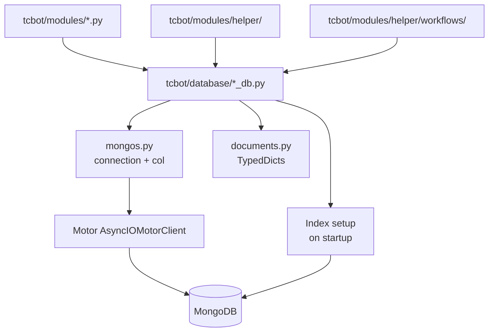

# Database Layer

The database layer lives in `tcbot/database/` and is the only place that should perform MongoDB reads and writes. Command modules and workflows should call helper functions instead of calling `mongos.col()` directly.

For modules that consume these database helpers, see [`../modules/modules.md`](../modules/modules.md). For shared helpers, see [`../helper/helper.md`](../helper/helper.md). For conversation flows, see [`../workflows/workflows.md`](../workflows/workflows.md).



## Connection manager

`mongos.py` owns the Motor client lifecycle.

| Export | Purpose |
|---|---|
| `connect()` | Creates the `AsyncIOMotorClient`, selects `cfg.db_name`, and pings MongoDB. |
| `ensure_indexes()` | Creates all required indexes on startup. Safe to call repeatedly. |
| `db()` | Returns the active database or raises if `connect()` has not run. |
| `col(name)` | Returns a collection from `db()`. Use only inside database helper modules. |
| `make_short_id(length=10)` | Generates lowercase alphanumeric IDs for records such as bans and promotion requests. |

## Collections and helpers

| Helper | Collection(s) | Main responsibilities |
|---|---|---|
| `users_cache.py` | `member_cache` | Member profile cache operations: upsert, get, batch queries, mention formatting, total count, all users list. |
| `users_roles.py` | `tc_owners`, `tc_admins`, `tc_roles` | Owner CRUD, admin CRUD, developer/tester role CRUD, effective-role resolution, can_act_on checks. |
| `bans_db.py` | `bans` | Active ban lookup, ban creation/update, unban deactivation, appeal/review metadata, active ban lists. |
| `warns_db.py` | `warns`, `warn_counts` | Warning history, warning counters, backfill/sync, remove latest warning, clear warnings. |
| `kicks_db.py` | `kicks` | Kick audit records. |
| `mutes_db.py` | `mutes` | Mute audit records. |
| `queues_db.py` | `promotion_requests` | Queued Admin promotion requests and resolution status. |
| `cache.py` | in-memory only | TTL caches for owner, roles, connection status, and active groups. |
| `documents.py` | type-only | `TypedDict` document shapes and `Literal` aliases. |
| `types.py` | type-only | `NewType` primitives such as `UserId`, `GroupId`, `ChatId`, and `BanId`. |
| `groups_db.py` | `federated_groups`, `pending_joins` | Connected group state, pending connection requests, group cache invalidation. |

## Member cache optimization

The `member_cache` collection stores user profile data. For performance, use the appropriate query function:

| Function | Fields fetched | Use case |
|---|---|---|
| `get_user(user_id)` | All fields | When you need a complete user profile |
| `get_first_name(user_id, fallback)` | `first_name` only | When you only need the display name for one user |
| `get_user_mention_data(user_id)` | `first_name`, `username` | Single-user mention formatting (returns tuple) |
| `get_first_names_batch(user_ids)` | `first_name` only | Display names for many users in one query (returns `dict[int, str]`) |
| `get_mention_data_batch(user_ids)` | `first_name`, `username` | Mention data for many users in one query (returns `dict[int, tuple]`) |

For group title lookups across multiple chat IDs, use `groups_db.get_group_titles(chat_ids)` which returns `dict[int, str]` in a single query.

**Performance tip:** Use batch functions whenever you need data for more than one user in a list view or fan-out result. Calling single-user functions inside a loop is an N+1 anti-pattern. Both batch functions rely on the `(user_id, first_name, username)` covered-query index in `member_cache`.

## Startup indexes

`ensure_indexes()` creates:

| Collection | Index |
|---|---|
| `bans` | `(banned_user_id, is_active)` |
| `bans` | unique `(ban_id)` |
| `tc_owners` | unique `(user_id)` |
| `tc_admins` | unique `(user_id)` |
| `tc_roles` | unique `(user_id)` |
| `federated_groups` | `(chat_id, is_active)` |
| `federated_groups` | unique `(chat_id)` |
| `member_cache` | unique `(user_id)` |
| `member_cache` | `(user_id, first_name, username)` (covered-query index for batch `$in` projections) |
| `warns` | `(user_id, chat_id, timestamp desc)` |
| `warn_counts` | unique `(user_id, chat_id)` |
| `kicks` | `(user_id, timestamp desc)` |
| `mutes` | `(user_id, timestamp desc)` |
| `promotion_requests` | unique `(request_id)` |
| `promotion_requests` | `(target_id, status)` |

If a new query depends on a new access pattern, add the matching index in `ensure_indexes()` together with the helper change.

## Role model

Effective roles are resolved in `users_roles.get_effective_role()`:

1. Founder from `tc_owners` returns `"founder"`.
2. Admin from `tc_admins` returns `"admin"`.
3. Custom role from `tc_roles` returns `"developer"` or `"tester"`.
4. No role returns `None`.

Rank ordering:

```text
founder = 4 > admin = 3 > developer = 2 > tester = 1 > none = 0
```

Use `users_roles.role_rank()` and `users_roles.can_act_on()` instead of hand-written comparisons.

## Ban model

`bans` documents are represented by `BanDoc` and may contain:

| Field | Meaning |
|---|---|
| `ban_id` | Short unique ban identifier. |
| `banned_user_id` | Target Telegram user ID. |
| `reason` | Moderation reason. |
| `admin_user_id` | Admin who created or updated the ban. |
| `proof_message_id` | Uploaded proof message ID in the proof destination. |
| `log_message_id` | Audit log message ID. |
| `previous_proof_message_id` / `previous_log_message_id` | Prior records when an active ban is updated. |
| `timestamp` | Initial creation time. |
| `updated_timestamp` | Last update time when applicable. |
| `is_active` | Whether the federation ban is active. |
| `update_count` | Number of updates to the ban. |
| `review_message_id` / `review_timestamp` | Appeal review card metadata. |
| `appeal_log_msg_id` / `appeal_submitted_at` / `appeal_link` | Submitted appeal metadata. |

Key helper functions:

- `bans_db.get_active_ban(user_id)`: returns the currently active ban for a user, or `None`.
- `bans_db.get_ban(ban_id)`: fetches a single ban record by its short ID.
- `bans_db.create_ban(...)` / `bans_db.update_ban(...)`: write a new ban or update an existing one.
- `bans_db.deactivate_ban(ban_id)`: marks a ban inactive (used by unban flow).
- `bans_db.set_review(...)` / `bans_db.set_appeal_log_msg(...)`: store appeal/review metadata on an existing ban.
- `bans_db.active_bans()` / `bans_db.active_ban_count()` / `bans_db.active_ban_user_ids()`: federation-wide active ban queries.
- `bans_db.user_bans(user_id)` / `bans_db.user_ban_count(user_id)`: per-user ban history (all records, active and inactive).
- `bans_db.user_appeal_count(user_id)`: count of submitted appeals for a user.

## Warning model

Warnings are stored per user and chat:

- `warns` stores each warning event.
- `warn_counts` stores a counter document for fast limit checks with `unique (user_id, chat_id)` index.
- `warning_flow.WARN_LIMIT` is currently `3`.

Key helper functions:

- `warns_db.add_warn(user_id, reason, admin_id, chat_id)`: records a warning and returns the new warn count.
- `warns_db.warn_count(user_id, chat_id)` / `warns_db.get_warns(user_id, chat_id)`: current count and full list for a user in a group.
- `warns_db.remove_last_warn(user_id, chat_id)` / `warns_db.clear_warns(user_id, chat_id)`: undo latest warning or reset all.
- `warns_db.user_total_warns(user_id)` / `warns_db.user_warn_groups(user_id)` / `warns_db.user_all_warns(user_id)`: federation-wide warn aggregates used by `/check`.

## Kick model

Kicks are append-only audit records:

- `kicks` stores one document per kick event with fields `user_id`, `chat_id`, `reason`, `admin_id`, and `timestamp`.
- `kicks_db.user_kicks(user_id)` returns all kick records for a user, newest first.
- `kicks_db.user_kick_count(user_id)` returns the total count.
- Records are never deleted; the collection is a permanent audit trail.

## Mute model

Mutes follow the same append-only pattern as kicks:

- `mutes` stores one document per mute event with fields `user_id`, `chat_id`, `reason`, `admin_id`, and `timestamp`.
- `mutes_db.user_mutes(user_id)` returns all mute records for a user, newest first.
- `mutes_db.user_mute_count(user_id)` returns the total count.
- Records are never deleted; the collection is a permanent audit trail.

## Group model

`federated_groups` stores active and inactive group records. Disconnecting marks a group inactive instead of deleting it. `pending_joins` stores temporary connection prompts until the owner accepts or cancels.

## Caches

`cache.py` provides `TTLCache` plus public cache instances:

| Cache | Typical key | Used by |
|---|---|---|
| `effective_role_cache` | `user_id` | `users_roles.get_effective_role()` |
| `connected_cache` | `chat_id` | `groups_db.is_connected()` |
| `active_groups_cache` | fixed key | `groups_db.active_groups()` |
| `owner_id_cache` | fixed key | `users_roles.get_owner_id()` |

Write helpers must invalidate or refresh related cache entries. For example, role writes invalidate the target user's effective role cache, and group writes clear or update group caches.

## Document typing

Use `documents.py` for MongoDB shapes and `types.py` for nominal ID types in new helpers. These are typing aids; stored MongoDB values remain plain strings, integers, booleans, and datetimes.

## Safety rules

- Do not call `col()` from command modules or workflow files.
- Keep new collection helpers in `*_db.py` files.
- Keep stored schema changes backward-compatible unless a migration plan exists.
- Use `utc_now()` from `tcbot.utils.timedate_format` for stored timestamps.
- Never log secrets or connection strings.
