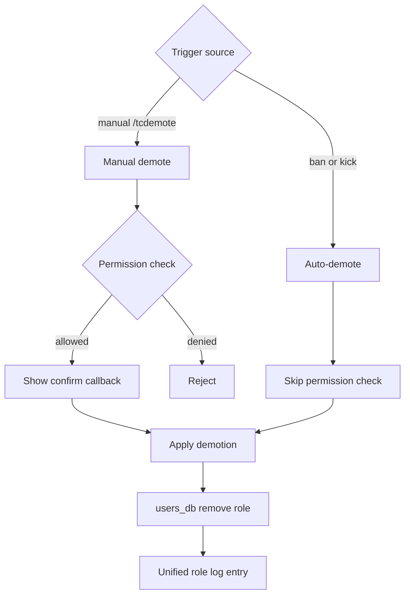

# Demote Detailed Documentation

This document describes the current demotion behavior implemented by `tcbot/modules/admins.py` (command + callback handlers) and `tcbot/modules/helper/workflows/demote_flow.py` (the `Demote` class shared by manual demotion and auto-demote on ban/kick).

For role hierarchy and rules, see [`role-detailed.md`](role-detailed.md). For promote (counterpart) flow, see [`promote-detailed.md`](promote-detailed.md). For ban flow that triggers auto-demotion, see [`banning-detailed.md`](banning-detailed.md). For shared helpers, see [`helper/helper.md`](helper/helper.md).



## Purpose

Demotion removes a federation role from a user. Three callers reach the same `Demote.execute` method:

1. `/tcdemote` — manual demotion by Founder or Admin.
2. Ban entry handler (`/tcban`) — auto-demote a role-holding target before the federation ban.
3. Kick entry handler (`/tckick`) — auto-demote a role-holding target before the per-group kick.

The same log format is emitted in every case — there is no separate "Auto-Demote" template.

## Command surface

- `/tcdemote <target>` (alias: `/tcd`)
- Confirmation buttons: `Confirm`, `Cancel` (from `keyboards.demote_confirm_kb`).

The target is resolved by `extraction.extract_target` — reply, user ID, or `@username`.

| Who | Targets they can demote |
|---|---|
| Founder | Admin / Developer / Tester |
| Admin | Developer / Tester only |
| Developer / Tester / no-role | — (rejected by `@staff_only`) |

Founder is never demotable through this flow; ownership transfer uses `/transferowner`.

## `Demote` class API

```python
from tcbot.modules.helper.workflows.demote_flow import Demote

await Demote.remove_role(target_id, target_role)              # bool
await Demote.execute(bot,
                     target_id, target_fname, target_role,
                     executor_id, executor_fname,
                     *,
                     trigger: str | None = None)              # bool
```

| Member | Purpose |
|---|---|
| `Demote.remove_role(target_id, target_role)` | Deletes the matching record from `tc_admins` (when `target_role == "admin"`) or `tc_roles` (Developer/Tester). Returns True if a record was actually removed. |
| `Demote.execute(...)` | Removes the role, posts the federation log, and DMs the target. Returns True if the role was actually removed. Supports both manual and auto-demote callers via the `trigger` keyword. |

The `trigger` parameter controls only the DM body wording:

- `trigger=None` (manual): `Your <Role> role in <community> has been removed by <executor>.`
- `trigger="ban"`: `Your <Role> role in <community> has been removed - you were banned from the federation.`
- `trigger="kick"`: `Your <Role> role in <community> has been removed - you were kicked from the federation.`

The federation log emitted by `parse_logmsg.demoted` is identical in every case — `trigger` is accepted in the signature for caller API compatibility but ignored in the rendered output.

## Manual demotion flow (`/tcdemote`)

1. Founder or Admin runs `/tcdemote <target>`. The `@staff_only` decorator rejects non-staff executors.
2. `cmd_demote` resolves the target via `extract_target` in parallel with the executor's effective role (`users_db.get_effective_role`).
3. The bot reads the target's effective role:
   - If `None` or `"founder"`, the bot replies `That user doesn't hold a role that can be removed.` and stops.
   - If the target is `"admin"` and the executor is not Founder, the bot replies `Only the Founder can demote an Admin.` and stops.
4. Otherwise the bot sends a confirmation card with `Confirm` / `Cancel` buttons via `keyboards.demote_confirm_kb(target_id)`.

### Confirmation callback

Callback data: `demote_confirm:<target_id>` and `demote_cancel:<target_id>`.

`on_demote_confirm`:

1. Re-checks the executor's effective role; if no longer Founder/Admin, answers with an alert and removes the keyboard.
2. Fetches the target role and the target's cached first name in parallel with `q.answer()`.
3. Re-applies the Admin-only-Founder rule.
4. Calls `Demote.execute(ctx.bot, target_id, target_fname, target_role, admin.id, admin.first_name, trigger=None)`.
5. On a successful removal, edits the confirmation message to `Done. <mention> - <code id> has been removed from <Role>.` and clears the keyboard.
6. If `Demote.execute` returns False (nothing was removed — the record was cleared by another path), edits to `Couldn't remove the role - it may have already been cleared.`

`on_demote_cancel` simply answers the callback and edits the message to say no changes were made.

## Auto-demote flow (ban / kick)

`/tcban` and `/tckick` entry handlers call `Demote.execute(..., trigger="ban")` or `trigger="kick"` after `resolve_and_check` confirms the executor outranks a role-holding target, before the actual moderation action.

```python
if target_role:
    await Demote.execute(
        ctx.bot,
        target_id,
        target_fname or str(target_id),
        target_role,
        admin.id,
        admin.first_name,
        trigger="ban",  # or "kick"
    )
```

Auto-demote is also invoked by `warning_flow.execute_warn` when a warn-limit auto-ban is about to fire and the warned user happens to hold a federation role (an edge case — staff should not normally accumulate warnings).

## Permission matrix

The combined effect of `@staff_only` on `cmd_demote` plus the Admin-only-Founder check inside the callback:

| Executor | Demote Admin | Demote Developer / Tester |
|---|---|---|
| Founder | Yes | Yes |
| Admin | No (Founder only) | Yes |
| Developer / Tester / no-role | — | — |

## Logs

Every demotion (manual and auto) emits the same log template via `parse_logmsg.demoted`:

```text
<community> Demoted

User: <mention>
User ID: <id>
Role removed: <Role>

Demoted by: <mention>
ID: <id>

Date: <utc>
```

No `Auto-Demote` title, no `Trigger:` field — auto-paths look identical to manual demotion in the log channel. The next federation log entry (the ban or kick that triggered the auto-demote) provides the surrounding context.

## DB writes

`Demote.remove_role` is the single point where the database is mutated:

- `users_db.remove_admin(target_id)` for Admin targets — deletes from `tc_admins`.
- `users_db.remove_role(target_id)` for Developer/Tester targets — deletes from `tc_roles`.

Both helpers invalidate the affected user's entry in `effective_role_cache` so the next role read returns the post-demote state.

## Edge cases

- If the target's role record was already gone by the time the callback fires, `Demote.execute` returns False and the caller surfaces a friendly message.
- DM and log channel sends are wrapped in `asyncio.gather(..., return_exceptions=True)` — a failed DM does not roll back the role removal.
- Self-demotion is rejected by `cmd_demote` (`Can't demote yourself - ask a higher-up if needed.`).
- Founder demotion is rejected at the role check (`That user doesn't hold a role that can be removed.`).
- Auto-demote is best-effort: a failure inside `warning_flow.execute_warn` is logged via `log.error` but never aborts the surrounding action.

## Testable scenarios

- `/tcdemote` blocks self-demotion and Founder demotion.
- Admin cannot demote Admin; Founder is required.
- Confirmation callback re-checks executor permission at click time.
- Confirm removes the correct collection record (`tc_admins` for Admin, `tc_roles` for Developer/Tester).
- Ban / kick on a role-holding target removes the role before the destructive action.
- The auto-demote DM mentions the trigger verb (banned/kicked); the federation log does not.
- A pre-existing role record that is missing causes `Demote.execute` to return False without raising.
