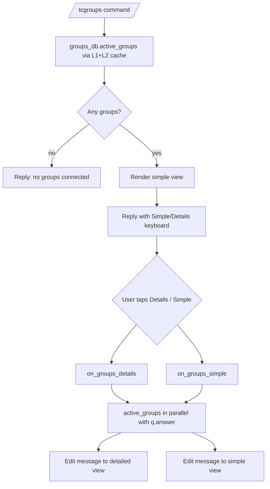

# Groups

This document describes the current connected-group list behavior implemented by `tcbot/modules/groups.py` (the `/tcgroups` command and the inline toggle callbacks) and `tcbot/database/groups_db.py` (the shared connected-groups collection and cache).

For the connect flow, see [`connecting.md`](connecting.md). For the disconnect
flow, see [`disconnecting.md`](disconnecting.md). For shared helpers, see
[`../../architecture/helpers.md`](../../architecture/helpers.md). For the
database layer, see [`../../architecture/database.md`](../../architecture/database.md).



## Purpose

`/tcgroups` lists every group currently connected to the federation, with an optional `Details` view that adds each group's chat ID alongside its title. The command is open to anyone, so the same `/tcgroups` reply in any chat shows the same global list.

The list source is `groups_db.active_groups()`, which reads `federated_groups` where `is_active: True`, backed by the process-wide L1+L2 cache (`active_groups_cache` in `tcbot/database/cache.py` keyed on `_ALL_GROUPS_KEY`). There is no per-user `ctx.user_data` caching: every toggle callback re-reads through the cache layer and edits the existing message in place.

## Commands and aliases

| Command | Alias | Purpose | Access |
|---|---|---|---|
| `/tcgroups` | `/tcg` | List every group currently connected to the federation. | Anyone. |

Commands use the project's configured prefixes; slash commands are examples.

## `/tcgroups` flow

`/tcgroups` is registered as a plain `MessageHandler`; there is no conversation. The handler:

1. Fetches the active-groups list with `db.groups_db.active_groups()`. This call is backed by the L1+L2 cache defined in `tcbot/database/cache.py`, so repeat calls within the cache TTL are free.
2. If the list is empty, replies `No groups are currently connected to <community>.` and stops.
3. Otherwise replies with the simple view rendered by `_render(groups, detailed=False)`.
4. The reply keyboard is `tcgroups_kb(detailed=False)` from `tcbot/modules/helper/keyboards.py` and shows a single `Details` button (localized `button.details_toggle`).

## Render helpers

`_render(groups, *, detailed, locale)` is the local helper in `groups.py`:

```python
def _render(groups, *, detailed, locale=None):
    header = t("groups.list.header", locale, n=len(groups))
    lines = [header]
    used = len(header) + 1
    for i, g in enumerate(groups):
        title = g.get("title", "Unknown")
        if detailed:
            line = t(
                "groups.list.item_detailed",
                locale,
                title=title,
                id=Safe(code(str(g.get("chat_id", 0)))),
            )
        else:
            line = t("groups.list.item", locale, title=title)
        if used + len(line) + 1 > _MAX_RENDER_CHARS:
            lines.append(t("groups.list.more", locale, n=len(groups) - i))
            break
        lines.append(line)
        used += len(line) + 1
    return "\n".join(lines)
```

The header, item, and overflow lines all render from the localized `groups.list.header`, `groups.list.item`, `groups.list.item_detailed`, and `groups.list.more` templates. Chat IDs in the detailed view are wrapped with `code()` via `Safe()`.

Rendered output is capped at `_MAX_RENDER_CHARS` (3800) with a localized `groups.list.more` suffix when the cap is hit, so a federation with a very large group count cannot produce an over-long message.

## Toggle callbacks

Two `CallbackQueryHandler` registrations handle the inline toggle:

- `on_groups_details` with pattern `^groups_details$`.
- `on_groups_simple` with pattern `^groups_simple$`.

Both call the shared `_toggle(update, ctx, detailed=...)` helper:

1. Runs `q.answer()` and `db.groups_db.active_groups()` in parallel via `asyncio.gather(..., return_exceptions=True)`.
2. On a fetch failure, edits the prompt to the localized `replies.err_groups_load_failed(locale)` text while keeping the toggle keyboard (so the user can retry), and returns without rendering an empty list.
3. On success, edits the existing message in place via `safe_edit(message, _render(groups, detailed=..., locale=...), reply_markup=tcgroups_kb(detailed=..., locale=...))`.

There is **no** per-user `ctx.user_data["groups_cache"]` snapshot. Every toggle reads the shared L1+L2 `active_groups_cache` (30 s TTL), so connects, disconnects, and title refreshes that happened elsewhere in the federation become visible as soon as the cache layer expires.

`safe_edit` swallows benign `BadRequest` errors (such as `Message is not modified`) so re-tapping a button that is already in view does not surface a Telegram error to the user.

## Required bot permissions

The command itself does not require any bot permissions; it only reads from the federation DB. However, every connected group must have granted the bot `can_delete_messages`, `can_restrict_members`, and `can_invite_users`; that requirement lives in [`connecting.md`](connecting.md).

## Database impact

`/tcgroups` does not write to the database. It reads `federated_groups` through `groups_db.active_groups()` and renders the result.

`federated_groups` document fields used by the renderer:

| Field | Meaning |
|---|---|
| `chat_id` | Telegram chat ID. |
| `title` | Last-seen group title. |
| `is_active` | Whether the group is currently connected. |

`active_groups` filters on `is_active: True`. The call goes through `active_groups_cache.get_or_fetch(_ALL_GROUPS_KEY, _fetch)` so the cache layer short-circuits repeated reads within the TTL.

The cache is invalidated whenever `add_group`, `deactivate_group`, or `migrate_group` mutates the collection, so the listing picks up new connects, disconnects, and supergroup migrations without manual intervention.

## Edge cases

- An empty list replies `No groups are currently connected to <community>.` and does not show the toggle keyboard.
- A group with a missing `title` renders as `Unknown`.
- A failed `active_groups()` read in the command replies the localized `replies.err_groups_load_failed(locale)` text instead of a (misleading) empty list.
- A failed `active_groups()` read in a toggle keeps the toggle keyboard in place so re-tapping retries the fetch; it never renders `Count: 0` from a broken read.
- Rendered output longer than `_MAX_RENDER_CHARS` (3800) is truncated with a localized `groups.list.more` suffix.
- `safe_edit` silently swallows `Message is not modified` errors, so re-tapping a button already in view does not raise a Telegram error.
- The L1+L2 cache backed by `active_groups_cache` short-circuits repeat reads within the TTL (30 s); the DB is only queried on cache miss. Because the cache is process-wide and not per-user, a `/tcconnect` or `/tcdisconnect` elsewhere in the federation becomes visible on the next toggle or command after the cache expires.
- Disconnected groups (`is_active: False`) are excluded from the list because `active_groups` filters on `is_active: True`.
- The command is open to anyone; no decorator-level role gate.
- Both the command and the toggle callbacks are rate-limited (command 8/30 s, callbacks 15/30 s).

## Behavior reference

Key behaviors to keep in mind:

1. `/tcgroups` is open to anyone.
2. `/tcgroups` renders a title-only list by default with a `Count: N` header.
3. `/tcgroups` with no connected groups replies a friendly empty-state message.
4. A failed group fetch replies an error text, never a fake empty list.
5. `Details` switches the view to include each group's chat ID alongside its title.
6. `Simple` switches back to the title-only view.
7. Toggle callbacks run `q.answer()` and `active_groups()` in parallel and edit the existing message in place.
8. There is no per-user `ctx.user_data` groups cache; all reads go through the shared L1+L2 `active_groups_cache`.
9. `safe_edit` swallows benign `BadRequest` errors so re-tapping a button does not raise a Telegram error.
10. The list source is `groups_db.active_groups()` filtered on `is_active: True`.
11. The L1+L2 cache short-circuits repeat reads within the TTL.
12. The cache is invalidated whenever `add_group`, `deactivate_group`, or `migrate_group` runs.
13. Disconnected groups are excluded from the list.
14. A group with a missing title renders as `Unknown`.
15. `/tcgroups` does not write to the database.
16. `/tcgroups` is reply-only; there is no conversation state.
17. Rendering truncates to `_MAX_RENDER_CHARS` (3800) with a localized `... and N more` suffix.