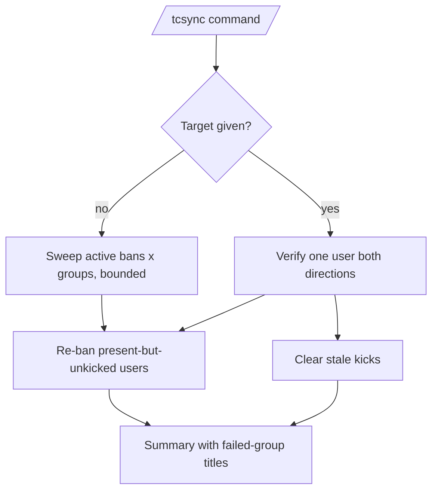

# Sync

This document describes the enforcement-reconciliation behavior implemented by
`tcbot/modules/syncing.py` (the `/tcsync` command plus the shared sweep core)
and the optional scheduled sweep in `tcbot/database/scheduler.py`.

For the ban flow that this reconciles, see [`banning.md`](banning.md). For the
unban flow, see [`unbanning.md`](unbanning.md). For shared helpers, see
[`../../architecture/helpers.md`](../../architecture/helpers.md). For the
database layer, see [`../../architecture/database.md`](../../architecture/database.md).

## Purpose

Fan-out enforcement can miss groups (transient Telegram failures, bot
demoted at fan-out time, groups connected later without a replay). The join
handler and connect replay close most of those gaps, but a banned user who is
already inside a missed group, or a stale kick surviving an unban, has no
trigger left. Sync re-drives enforcement on demand instead of waiting for
one.

## Command surface

Aliases (matched in any prefix configured by `cfg.prefixes`):

- `/tcsync` · `/tcsynchronize`

| Command | Who can use | Purpose |
|---|---|---|
| `/tcsync` | Developer and above (`@mod_only`) | Sweep every active ban against every connected group, bounded. |
| `/tcsync <target>` | Developer and above | Verify one user both directions in every connected group. |

The target is resolved by `extraction.extract_target`; accepts a reply, user ID, or resolvable `@username`.

## How a run works

1. The bot replies `Syncing enforcement state...` with its own status message (kept for the final edit, since the operator's command message cannot be edited by the bot).
2. Bare run: builds the `(banned user x connected group)` cross product capped at 200 pairs (`take_pairs`, stable order, truncation flagged). Targeted run: one user against every connected group (bounded by group count).
3. Each pair probes membership with a bounded `get_chat_member` (3 s), then enforces through `fan_out`:
   - Active ban + present and not kicked: `ban_chat_member` (`enforced`).
   - Already kicked, absent, or privileged (admin/owner): skipped, never counted as failure.
   - Targeted run without an active ban + still kicked: `unban_chat_member` (`unenforced`).
   - Unexpected failures: `error` (retryable).
4. Benign Telegram refusals (`USER_NOT_PARTICIPANT` and friends, via `is_benign_telegram_error`) count as absent, never as failures.
5. The status message is edited to the summary; on edit failure the summary is sent as a reply instead.

## Scheduled sweep (opt-in)

When `SYNC_INTERVAL_HOURS` is greater than 0, `scheduler.start()` registers
`tcbot.enforcement_sync` (interval trigger, `replace_existing`,
`misfire_grace_time` 86400, `coalesce`), which runs the same bounded bare
sweep and logs the counts (no operator message exists in that context). A
missing bot reference or any failure logs and returns; the next interval
re-drives. Setting the value back to 0 removes a stale schedule on the next
startup. Default `0` (disabled, manual `/tcsync` only).

## Database impact

Read-only except enforcement side effects: `active_groups()`,
`active_ban_user_ids()` / `get_active_ban(user_id)`, then per-miss
`ban_chat_member` / `unban_chat_member`. No ban records are created,
modified, or deactivated by a sync run.

## Logging behavior

Per-miss enforcement logs at info level; unexpected pair failures log a
warning with user and chat IDs. Scheduled runs log one summary line with
checked/enforced/skipped/failed/truncated counts.

## Edge cases

- No active bans (bare run) or no connected groups: the summary reports zeros; nothing is touched.
- Group-list or ban-list fetch outage: the command replies with the groups-load retry notice; nothing is touched.
- Unresolvable target: replies with the cannot-resolve notice.
- Pair cap reached: the summary notes the truncation; re-running continues from the same stable order, so repeated runs converge.
- Rate limiting: the command is capped at 2 runs per 5 minutes (`mod_only` gate applies first).

## Behavior reference

- `/tcsync` never creates, modifies, or deactivates ban records.
- Skipped pairs (absent, already enforced, privileged) are not failures.
- Targeted runs cover both directions; bare runs cover the ban direction.
- The scheduled sweep is off unless `SYNC_INTERVAL_HOURS > 0`.

## Validation hints

- `tests/test_syncing.py` covers pair bounding, outcome classification per status, and summary rendering with fakes (no I/O).
- `uv run ruff check tcbot/modules/syncing.py` plus an import check of the module.
