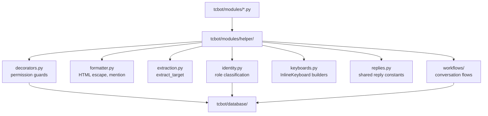

# Helper Package

Shared handler helpers live in `tcbot/modules/helper/`. These modules support command modules and workflow files but do not perform top-level module discovery.

For command modules that consume these helpers, see [`../modules/modules.md`](../modules/modules.md). For conversation flows, see [`../workflows/workflows.md`](../workflows/workflows.md). For database helpers used by these helpers, see [`../databases/databases.md`](../databases/databases.md).



## `decorators.py`

Decorators provide authorization, handler-level rate limiting, and debug tracing.

| Decorator/helper | Purpose |
|---|---|
| `ratelimiter(limit=5, period=60.0)` | Per-handler sliding-window user throttle. Use as the outermost command decorator. |
| `log_execution` | DEBUG-level entry/exit/exception tracing. Use as the innermost decorator. |
| `owner_only` | Founder-only commands. |
| `staff_only` | Founder/Admin commands. |
| `mod_only` | Developer+ commands, such as ban and unban. |
| `basic_mod_only` | Tester+ commands, such as kick, mute, and warn. |
| `global_rate_limit_handler` | Universal rate limiter registered by `__main__.py` at group `-1`. |

Typical command decorator order:

```python
@decorators.ratelimiter(limit=5, period=60)
@decorators.mod_only
@decorators.log_execution
async def cmd_example(update, ctx):
    ...
```

## `formatter.py`

All bot messages use Telegram HTML parse mode.

| Function | Output/use |
|---|---|
| `esc(text)` | Escape user-provided text. |
| `bold(text)` | `<b>...</b>` with escaped content. |
| `italic(text)` | `<i>...</i>` with escaped content. |
| `code(text)` | `<code>...</code>` with escaped content. |
| `link(text, url)` | HTML link. Escape or validate URLs before passing untrusted values. |
| `mention(user_id, name, username=None)` | Smart mention with username fallback. If username is provided, creates a global `https://t.me/username` link that works across all groups. Otherwise, falls back to plain text name with copyable user ID. |

Use `esc()`, `code()`, or `mention()` for any user-provided value in HTML messages.

## `extraction.py`

Target resolution for moderation commands.

| Export | Purpose |
|---|---|
| `ResolvedTarget` | Dataclass-like resolved target with ID, first name, optional username, and raw object. |
| `extract_target(update, args, bot=None)` | Resolves targets with priority: reply → args (ID/username) → args (partial name search in DB) → text mentions → @mentions. |

**Resolution priority for `extract_target()`:**
1. **Reply** - Most common use case, checked first
2. **Args with full info** - Numeric ID or @username
3. **Args with partial info** - Searches users_cache by name (e.g., `/ban John` finds users with "John" in their name)
4. **Text mention entity** - Direct user mention in message
5. **@Mention entity** - Username mention in message

This priority order makes reply-based targeting more natural while adding support for partial name searches.

## `keyboards.py`

All inline keyboard factories live here. Command modules and workflows should import keyboard factories instead of constructing repeated keyboard layouts inline.

Main groups:

| Factory group | Examples |
|---|---|
| Ban/checking | `ban_log_new`, `ban_log_update`, `checkme_ban_kb`, `checkme_detail_back_kb` |
| Admin roles | `promote_role_kb`, `demote_confirm_kb`, `promo_decision_kb` |
| Menus/help | `main_menu_kb`, `group_start_kb`, `help_modules`, `help_topics_menu_kb`, `help_topics_kb`, `back_to_start_kb`, `back_to_help_kb`, `back_to_help_cmd_kb` |
| Privacy | `privacy_kb`, `back_to_privacy_kb` |

See [button styles](../button-styles.md) for layout and callback-data conventions.

## `identity.py`

`identity.classify(bot, executor_id, target_id, target_fname)` returns an `Identity` dataclass that classifies a moderation target as one of: `self`, `this_bot`, `other_bot`, `telegram`, `founder`, `admin`, `developer`, `tester`, `user`. 

The `Identity` dataclass now includes:
- `kind`: The identity type
- `target_id`: User ID
- `fname`: First name
- `username`: Optional username (used for global mentions)
- `is_bot`: Boolean flag

The companion helpers `identity.refuse_message(action, ident)` and `identity.staff_notice(action, ident, community_name)` produce the witty refusal lines and staff heads-up notices used by every moderation entry handler.

Every moderation command (ban, kick, mute, warn, unban, unmute, promote, demote) must call `identity.classify` once and route through `refuse_message` instead of inlining `target_id == ctx.bot.id` / `user.id == owner_id` / role-string branches. Refusal copy lives in `identity.py` so the bot's voice stays consistent across the whole project.

## Permission helpers in `decorators.py`

The `decorators.py` module centralizes both auth-guard decorators and the shared executor-vs-target permission check used by ban/kick/mute/warn entry handlers.

| Export | Purpose |
|---|---|
| `resolve_and_check(msg, executor_id, target_id, min_role=...)` | Resolves executor and target roles, checks minimum executor rank, checks executor outranks target, and replies on failure. |

Ban and kick entry points pair this with `Demote.execute(..., trigger="ban"/"kick")` from `workflows/demote_flow.py` to remove the target's role before the moderation action.

## `replies.py`

Shared bot-reply string constants used by multiple command modules. Import with `from tcbot.modules.helper import replies`.

| Constant | Purpose |
|---|---|
| `TARGET_SYNTAX` | Usage hint for commands that accept a target argument. |
| `ERR_NO_TARGET` | Error when no target can be resolved. |
| `ERR_CANNOT_RESOLVE` | Error when the target ID/username cannot be resolved via Telegram. |
| `ERR_CANT_FIND_USER` | Error when a user is not found in the cache or Telegram. |
| `ERR_ROLE_VERIFY` | Error when executor or target role cannot be verified. |
| `ERR_GROUP_ONLY` | Error when a command is used outside a group. |
| `ERR_NO_CONNECTED_GROUPS` | Error when no connected groups exist for the operation. |
| `ERR_GROUP_NOT_FOUND` | Error when the target group is not found or already removed. |
| `CONTEXT_BOT_OR_GROUP` | Context guard: command must be used in a bot DM or group. |
| `CONTEXT_EXEC_OR_GROUP` | Context guard: command must be used in an executor-owned group or DM. |
| `CONTEXT_ANYONE` | Context hint shown to regular users. |
| `PERM_FOUNDER_ONLY` | Permission hint: Founder only. |
| `PERM_STAFF_ONLY` | Permission hint: Admin and above required. |
| `PERM_ADMIN_ABOVE` | Permission hint: Admin and above (Founder / Admin). |
| `PERM_DEV_ABOVE` | Permission hint: Developer or above required. |
| `PERM_TESTER_ABOVE` | Permission hint: Tester or above required. |

Command modules import from `replies.py` instead of inlining these strings.

## `ban_info.py`

`build_ban_detail(ban, target_fname=None)` returns formatted HTML ban details and an optional proof link. It is shared by checking and stats flows to avoid duplicate ban rendering.

## `parse_link.py`

| Function | Purpose |
|---|---|
| `chat_id_to_link_id(chat_id)` | Converts Telegram supergroup IDs to `t.me/c` path IDs. |
| `message_link(chat_id, message_id, thread_id=None)` | Builds a private-channel/group message link; pass `thread_id` for topic threads. |
| `appeal_deep_link(bot_username, ban_id)` | Builds `https://t.me/<bot>?start=appeal_<ban_id>`. |

## `parse_logmsg.py`

This file builds HTML audit log messages for moderation, appeals, staff roles, group connections, broadcasts, and auto-demotions.

Common families:

- `ban_log`, `ban_update_log`, `proof_caption_new`, `proof_caption_update`;
- `mute_log`, `unmute_log`, `kick_log`, `warn_log`, `unwarn_log`, `unban_log`;
- `appeal_received_log`, `appeal_submitted_log`, appeal decision edit messages, `appeal_unban_log`;
- `promoted`, `demoted`, `ownership_transferred`, promotion request logs (`promote_request_log`, `promote_approved_log`, `promote_rejected_log`);
- `group_connected_log`, `group_connection_rejected_log`, `group_disconnected_log`, `group_bot_removed_log`;
- `broadcast_log`.

Use the `LogBuilder` class in this module to compose new audit-log messages; avoid hand-rolled f-strings so layout stays consistent.

## `parse_editmsg.py`

`safe_edit(msg, text, **kwargs)` edits a message with `parse_mode="HTML"` and ignores expected Telegram `BadRequest` cases such as `message is not modified`, `message to edit not found`, and `chat not found`.

Unexpected edit failures are logged as warnings.

## Helper usage rules

- Keep user-facing HTML escaped.
- Keep keyboard callback-data stable because handlers match it with regex patterns.
- Do not duplicate role checks that already exist in `users_cache` or `decorators.resolve_and_check`.
- Do not create keyboard factories outside `keyboards.py` unless the workflow needs a one-off private helper for local pagination.
