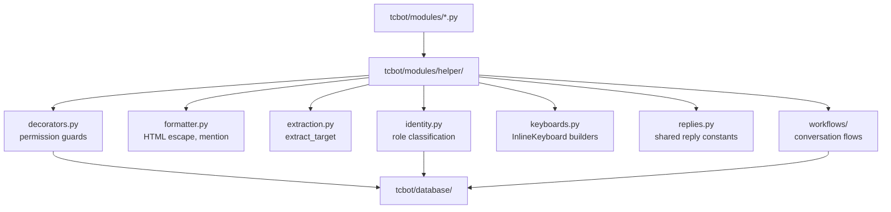

# Helper Package

Shared handler helpers live in `tcbot/modules/helper/`. These modules support command modules and workflow files but do not perform top-level module discovery.

For command modules that consume these helpers, see [`../modules/modules.md`](../modules/modules.md). For conversation flows, see [`../workflows/workflows.md`](../workflows/workflows.md). For database helpers used by these helpers, see [`../databases/databases.md`](../databases/databases.md).



## `decorators.py`

Decorators provide authorization, handler-level rate limiting, and debug tracing.

| Decorator/helper | Purpose |
|---|---|
| `ratelimiter(limit=5, period=60.0)` | Per-handler sliding-window user throttle backed by Redis sorted set when available; falls back to in-process sliding window. Use as the outermost command decorator. |
| `log_execution` | DEBUG-level entry/exit/exception tracing. Use as the innermost decorator. |
| `owner_only` | Founder-only commands. |
| `staff_only` | Founder/Admin commands. |
| `mod_only` | Developer+ commands, such as ban and unban. |
| `basic_mod_only` | Tester+ commands, such as kick, mute, and warn. |
| `global_rate_limit_handler` | Universal rate limiter registered by `__main__.py` at group `-1`. Uses `_AsyncRateLimiter` (Redis sorted-set + in-process fallback) for both command and callback-query buckets. |

### Rate limiter backend

`_AsyncRateLimiter` backs the global `_cmd_limiter` (8 calls / 30 s), `_cbq_limiter` (20 presses / 10 s), and each `ratelimiter()` per-handler instance:

- **Redis available**: atomic Lua script on a sorted-set key `rl:{prefix}:{uid}`. Expired entries are purged each check via `ZREMRANGEBYSCORE`. State survives bot restarts, so the quota is consistent across the scheduled 4-hour `run-bot.yml` cycle.
- **Redis absent or error**: transparent fallback to `_RateLimiter` (in-process `deque`-based sliding window). Rate limiting is never silently disabled; the fallback is logged at DEBUG level.

Typical command decorator order:

```python
@decorators.ratelimiter(limit=5, period=60)
@decorators.mod_only
@decorators.log_execution
async def cmd_example(update, ctx):
    ...
```

## `formatter.py`

This file is a **backward-compatible re-export shim**. All formatter logic lives in `tcbot/utils/formatter.py` (the single source of truth). The shim re-exports every public name so that existing callers using `from tcbot.modules.helper.formatter import bold` continue to work unchanged.

All bot messages use Telegram HTML parse mode. Functions are documented in full at [`../utils/utils.md#formatterpy`](../utils/utils.md).

| Function | Output/use |
|---|---|
| `esc(text)` | Escape user-provided text. |
| `bold(text)` | `<b>...</b>` with escaped content. |
| `italic(text)` | `<i>...</i>` with escaped content. |
| `code(text)` | `<code>...</code>` with escaped content. |
| `pre(text)` | `<pre>...</pre>` monospace block with escaped content. |
| `link(text, url)` | HTML link. Escape or validate URLs before passing untrusted values. |
| `mention(user_id, name, username=None)` | Smart mention with username fallback. |
| `user_ref(user_id, name, username=None)` | Action-summary reference: omits redundant ID when name equals numeric fallback. |
| `proof_line(proof_desc)` | `\nProof: <desc>` or `""` when proof_desc is falsy. |

Use `esc()`, `code()`, `mention()`, or `user_ref()` for any user-provided value in HTML messages. Use `user_ref()` in action summaries and audit logs where both name and ID are displayed.

## `extraction.py`

Target resolution for moderation commands.

| Export | Purpose |
|---|---|
| `ResolvedTarget` | Dataclass: resolved target with `user_id`, `fname`, optional `username`, and raw `user` object. Used internally; not returned by `extract_target`. |
| `extract_target(update, args, bot=None)` | Resolves targets; returns `tuple[int, str]` (user_id, fname) on success or `tuple[None, None]` on failure. Priority: reply to sender_chat-aware → args (ID/username) → args (partial name search in DB) → text mentions → @mentions. |

**Resolution priority for `extract_target()`:**
1. **Reply** - Most common use case, checked first
2. **Args with full info** - Numeric ID or @username
3. **Args with partial info** - Searches users_cache by name (e.g., `/ban John` finds users with "John" in their name)
4. **Text mention entity** - Direct user mention in message
5. **@Mention entity** - Username mention in message

This priority order makes reply-based targeting more natural while adding support for partial name searches.

## `keyboards.py`

All inline keyboard factories live here. Command modules and workflows should import keyboard factories instead of constructing repeated keyboard layouts inline.

Main groups:

| Factory group | Examples |
|---|---|
| Ban/checking | `ban_log_new`, `ban_log_update`, `checkme_ban_kb`, `checkme_detail_back_kb` |
| Admin roles | `promote_role_kb`, `demote_confirm_kb`, `promo_decision_kb` |
| Menus/help | `main_menu_kb`, `group_start_kb`, `help_topics_menu_kb`, `help_topics_kb`, `back_to_start_kb`, `back_to_help_kb`, `back_to_help_cmd_kb`, `module_help_kb`, `back_to_module_kb`, `additional_menu_kb` |
| Privacy | `privacy_kb`, `back_to_privacy_kb` |
| Groups | `groups_menu_kb`, `tcgroups_kb` |
| Stats | `main_kb` (in `stats_flow`), `back_kb` (in `stats_flow`) |

See [button styles](../button-styles.md) for layout and callback-data conventions.

## `identity.py`

`identity.classify(bot, executor_id, target_id, target_fname, *, target_is_bot=None)` returns an `Identity` dataclass that classifies a moderation target as one of: `self`, `this_bot`, `other_bot`, `telegram`, `founder`, `admin`, `developer`, `tester`, `user`. Pass `target_is_bot=True` to skip the Telegram bot lookup when the caller already knows the target is a bot.

The `Identity` dataclass now includes:
- `kind`: The identity type
- `target_id`: User ID
- `fname`: First name
- `username`: Optional username (used for global mentions)
- `is_bot`: Boolean flag

The companion helpers `identity.refuse_message(action, ident)` and `identity.staff_notice(action, ident, community_name)` produce the witty refusal lines and staff heads-up notices used by every moderation entry handler.

Every moderation command (ban, kick, mute, warn, unban, unmute, promote, demote) must call `identity.classify` once and route through `refuse_message` instead of inlining `target_id == ctx.bot.id` / `user.id == owner_id` / role-string branches. Refusal copy lives in `identity.py` so the bot's voice stays consistent across the whole project.

## Permission helpers in `decorators.py`

The `decorators.py` module centralizes both auth-guard decorators and the shared executor-vs-target permission check used by ban/kick/mute/warn entry handlers.

| Export | Purpose |
|---|---|
| `resolve_and_check(msg, executor_id, target_id, min_role=...)` | Resolves executor and target roles, checks minimum executor rank, checks executor outranks target, and replies on failure. |

Ban and kick entry points pair this with `Demote.execute(..., trigger="ban"/"kick")` from `workflows/demote_flow.py` to remove the target's role before the moderation action.

## `replies.py`

Shared bot-reply string constants and typed help-entry interface used by multiple command modules. Import with `from tcbot.modules.helper import replies`.

### `HelpEntry` TypedDict

```python
class HelpEntry(TypedDict):
    name: str                       # display name (matches __module_name__)
    overview: str                   # one-line or short paragraph overview
    sections: list[tuple[str, str]] # (section_header, section_body) pairs
```

Each help-bearing module declares exactly one `__help__: replies.HelpEntry = {...}` instead of three separate attributes. `help.py` reads this dict via `_builder_help()` and falls back to the legacy `__help_text__` / `__help_sections__` attributes for backward compatibility during migration.

### Section constructor helpers

| Helper | Returns | Purpose |
|---|---|---|
| `who_section(perm)` | `tuple[str, str]` | Builds a `(SEC_WHO, perm)` section entry. |
| `where_section(ctx)` | `tuple[str, str]` | Builds a `(SEC_WHERE, ctx)` section entry. |
| `target_section()` | `tuple[str, str]` | Builds a `(SEC_TARGET, TARGET_SYNTAX)` section entry. |

All 15 command modules use these helpers rather than raw inline tuple literals.

### String constants

| Constant | Purpose |
|---|---|
| `TARGET_SYNTAX` | Usage hint for commands that accept a target argument. |
| `ERR_CANNOT_RESOLVE` | Error when the target cannot be resolved — covers both "no target provided" and "target provided but unresolvable". Used by all command modules at `extract_target` return sites. |
| `ERR_ROLE_VERIFY` | Error when executor or target role cannot be verified. |
| `ERR_GROUP_ONLY` | Error when a command is used outside a group. |
| `ERR_NO_CONNECTED_GROUPS` | Error when no connected groups exist for the operation. |
| `ERR_GROUP_NOT_FOUND` | Error when the target group is not found or already removed. |
| `CONTEXT_BOT_OR_GROUP` | Context guard: command must be used in a bot DM or group. |
| `CONTEXT_EXEC_OR_GROUP` | Context guard: command must be used in an executor-owned group or DM. |
| `CONTEXT_ANYONE` | Context hint shown to regular users. |
| `PERM_FOUNDER_ONLY` | Permission hint: Founder only. |
| `PERM_STAFF_ONLY` | Permission hint: TC Staff (Admin and above). |
| `PERM_ADMIN_ABOVE` | Permission hint: Admin and above (Founder / Admin). |
| `PERM_DEV_ABOVE` | Permission hint: Developer or above required. |
| `PERM_TESTER_ABOVE` | Permission hint: Tester or above required. |
| `ERR_PERM_EXPIRED` | Error when the caller no longer has permission (e.g. after a role change mid-flow). |
| `ERR_UNKNOWN_ROLE` | Error for an unrecognised role string. |
| `WHERE_CONNECTED_GROUP` | Context hint: inside any connected group. |
| `NO_REASON` | Default fallback text when no moderation reason is supplied. |
| `SEC_COMMANDS` | Help-text section header: `Commands & Aliases`. |
| `SEC_WHO` | Help-text section header: `Who can use`. |
| `SEC_WHERE` | Help-text section header: `Where to use`. |
| `SEC_WHAT` | Help-text section header: `What it does`. |
| `SEC_EXAMPLES` | Help-text section header: `Examples`. |
| `SEC_TARGET` | Help-text section header: `Target syntax`. |

Command modules import from `replies.py` instead of inlining these strings.

## `ban_info.py`

`build_ban_detail(ban, target_fname=None)` returns formatted HTML ban details and an optional proof link. It is shared by checking and stats flows to avoid duplicate ban rendering.

## `parse_link.py`

| Function | Purpose |
|---|---|
| `chat_id_to_link_id(chat_id)` | Converts Telegram supergroup IDs to `t.me/c` path IDs. |
| `message_link(chat_id, message_id, thread_id=None)` | Builds a private-channel/group message link; pass `thread_id` for topic threads. |
| `appeal_deep_link(bot_username, ban_id)` | Builds `https://t.me/<bot>?start=appeal_<ban_id>`. |

## `parse_logmsg.py`

This file builds HTML audit log messages for moderation, appeals, staff roles, group connections, broadcasts, and auto-demotions.

Common families:

- `ban_log`, `ban_update_log`, `proof_caption_new`, `proof_caption_update`;
- `mute_log`, `unmute_log`, `kick_log`, `warn_log`, `unwarn_log`, `unban_log`;
- `appeal_received_log`, `appeal_submitted_log`, `appeal_approved_edit`, `appeal_rejected_edit`, `appeal_unban_log`;
- `promoted`, `demoted`, `ownership_transferred`, promotion request logs (`promote_request_log`, `promote_approved_log`, `promote_rejected_log`);
- `group_connected_log`, `group_connection_rejected_log`, `group_disconnected_log`, `group_bot_removed_log`;
- `broadcast_log`.

Use the `LogBuilder` class in this module to compose new audit-log messages; avoid hand-rolled f-strings so layout stays consistent.

## `parse_editmsg.py`

| Function | Purpose |
|---|---|
| `safe_edit(msg, text, **kwargs)` | Edit a `Message` object with `parse_mode="HTML"`; swallows harmless `BadRequest` cases such as `message is not modified`, `message to edit not found`, and `chat not found`. Unexpected failures are logged as warnings. |
| `safe_edit_cb(q, text, **kwargs)` | Edit a `CallbackQuery` message via `q.edit_message_text`; same error-swallow policy as `safe_edit`. Use when a user can re-tap a button that lands them on the same content to avoid `BadRequest: message is not modified` noise. |

## Helper usage rules

- Keep user-facing HTML escaped.
- Keep keyboard callback-data stable because handlers match it with regex patterns.
- Do not duplicate role checks that already exist in `users_cache` or `decorators.resolve_and_check`.
- Do not create keyboard factories outside `keyboards.py` unless the workflow needs a one-off private helper for local pagination.
