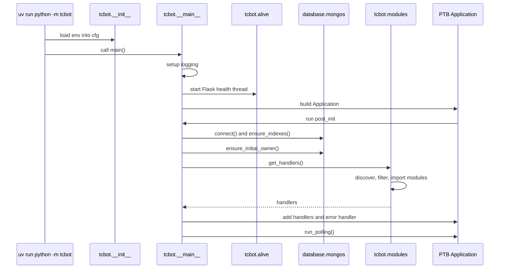
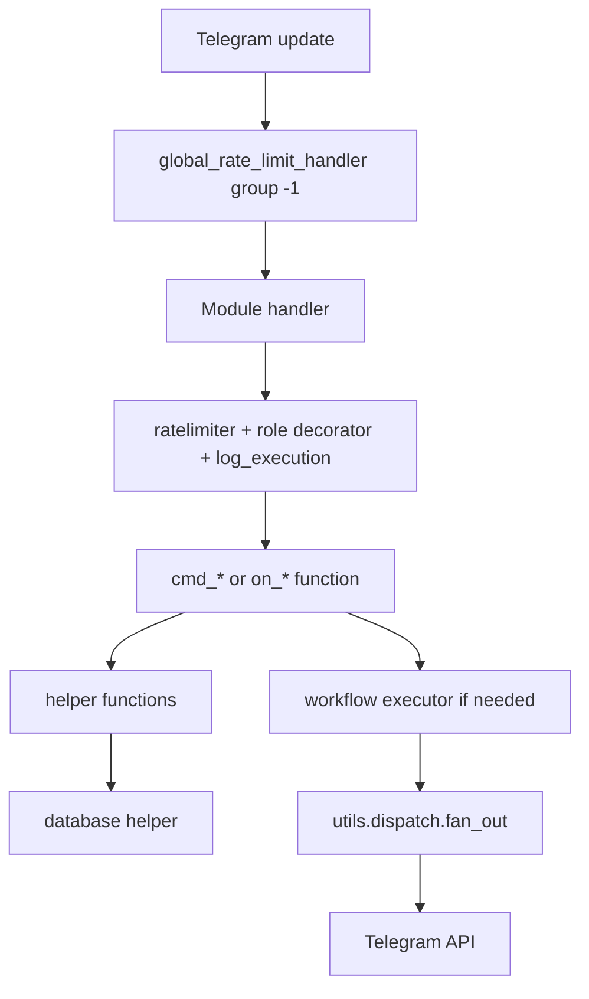

# Project Mapping

For project overview, see [`../README.md`](../README.md). For runtime state and priorities, see [`../PLAN.md`](../PLAN.md). For module breakdown, see [`modules/modules.md`](modules/modules.md). For database layer, see [`databases/databases.md`](databases/databases.md). For shared helpers, see [`helper/helper.md`](helper/helper.md). For runtime utilities, see [`utils/utils.md`](utils/utils.md).

This page maps the repository structure and the service boundaries between packages.

## Top-level layout

```text
tgbot/
├── tcbot/                  Main Python package
├── tests/                  Offline pytest suite
├── docs/                   Developer documentation
├── .agents/                 Contributor and agent rules
├── pyproject.toml          Dependencies, pytest config, Ruff config
├── uv.lock                 Locked dependency graph
├── config.env.example      Environment variable template
├── docker-compose.yml      Bot + MongoDB local stack
└── Dockerfile              Container image
```

## Runtime package map

```text
tcbot/
├── __init__.py             Environment loader and cfg adapter
├── __main__.py             PTB app setup, DB init, handler registration, polling
├── alive.py                Flask health endpoint
├── database/
│   ├── mongos.py           Motor client, collection accessor, indexes
│   ├── bans_db.py          Federation ban records (incl. per-user history)
│   ├── groups_db.py        Connected groups and pending joins
│   ├── users_cache.py      Member profile cache operations
│   ├── users_roles.py      Owners/admins + dev/tester roles, effective-role resolution
│   ├── warns_db.py         Warnings and warning counters (incl. per-user aggregates)
│   ├── kicks_db.py         Kick audit records (incl. per-user history)
│   ├── mutes_db.py         Mute audit records (incl. per-user history)
│   ├── queues_db.py        Promotion request queue
│   ├── cache.py            Single-process TTL caches
│   ├── documents.py        TypedDict document shapes
│   └── types.py            NewType ID primitives
├── modules/
│   ├── __init__.py         Dynamic module discovery and handler collection
│   ├── *.py                Command and callback modules
│   └── helper/
│       ├── decorators.py   Auth, per-handler rate limits, tracing, resolve_and_check
│       ├── extraction.py   Target resolution
│       ├── formatter.py    HTML escaping and formatting
│       ├── keyboards.py    Inline keyboard factories
│       ├── ban_info.py     Ban detail renderer
│       ├── parse_*.py      Link, log, and safe-edit helpers
│       └── workflows/
│           └── *_flow.py   Conversation factories, plus Promote / Demote / Check classes
└── utils/
    ├── dispatch.py         Bounded concurrent fan-out
    ├── error_reporter.py   Telegram error classification and reporting
    ├── logger.py           Console formatter and error log handler
    ├── prefixes.py         Prefix parsing and command filters
    └── timedate_format.py  UTC datetime helpers
```

## Ownership boundaries

| Area | Owns | Must not own |
|---|---|---|
| `tcbot/__main__.py` | Application startup, global handlers, DB init, polling | Feature business logic |
| `tcbot/modules/*.py` | Command entry points, handler registration, user-facing permissions | Raw MongoDB writes, duplicate conversation state handlers |
| `tcbot/modules/helper/` | Shared handler helpers and keyboard factories | Top-level command registration |
| `tcbot/modules/helper/workflows/*_flow.py` | Conversation factories, state transitions, flow executors | Module discovery or `__handlers__` exports |
| `tcbot/database/*_db.py` | Collection-specific DB operations | Telegram API calls |
| `tcbot/utils/` | Runtime infrastructure utilities | Feature-specific moderation policy |

## Startup flow



## Dynamic module discovery

`tcbot/modules/__init__.py` discovers every top-level `tcbot/modules/*.py` file except `__init__.py`.

Filtering order:

1. If `MODULES_LOAD` is set, only those module names are loaded. Invalid names cause startup to exit.
2. If `MODULES_NO_LOAD` is set, matching names are removed from the discovered list.
3. `get_handlers()` imports active modules and extends the application handler list with each module's `__handlers__`.

Module names are filenames without `.py`, for example `banning`, `appeals`, or `maintenance`.

## Request handling layers



## Cross-links

- Setup and environment: [setup.md](setup.md)
- Command modules: [modules/modules.md](modules/modules.md)
- Workflows: [workflows.md](workflows.md) and [workflows/workflows.md](workflows/workflows.md)
- Database layer: [databases/databases.md](databases/databases.md)
- Shared helpers: [helper/helper.md](helper/helper.md)
- Runtime utils: [utils/utils.md](utils/utils.md)
