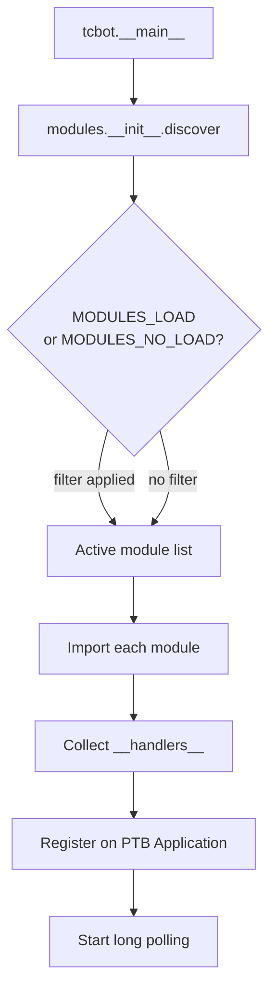

# Modules and Handler Registration

Command and callback modules live in `tcbot/modules/`. They define user-facing entry points, attach decorators, and export PTB handlers through `__handlers__`.

For shared helpers consumed by these modules, see [`../helper/helper.md`](../helper/helper.md). For conversation flows, see [`../workflows/workflows.md`](../workflows/workflows.md). For database access, see [`../databases/databases.md`](../databases/databases.md). For runtime utilities, see [`../utils/utils.md`](../utils/utils.md).

## Dynamic discovery

`tcbot/modules/__init__.py` discovers every top-level `.py` file in `tcbot/modules/` except `__init__.py`.



Environment filters:

| Variable | Behavior |
|---|---|
| `MODULES_LOAD` | Comma-separated whitelist. If set, only these module names load. Invalid names stop startup. |
| `MODULES_NO_LOAD` | Comma-separated blacklist. Removes matching names from the discovered list. |

A module name is the filename without `.py`, for example `banning` or `stats`.

`get_handlers()` imports active modules and appends each module's `__handlers__` to the PTB application.

## Module contract

Visible help modules expose:

```python
__module_name__ = "Ban"
__help_text__ = "<b>Commands & Aliases</b>\n..."
__handlers__ = [ ... ]
```

Set `__module_name__ = None` for internal/menu modules hidden from `/help`.

## Command modules

| Module | Visible help topic | Main handlers/commands | Notes |
|---|---|---|---|
| `admins.py` | `Admins` | `/tcpromote`, `/tcp`, `/tcdemote`, `/tcd`, `/transferowner`, `/tfowner`, `/tcpromoterequests`, `/tcreqs`, `/tcpromotelist`, `/tcplist` | Role assignment, demotion confirmation, owner transfer, promotion queue callbacks. |
| `appeals.py` | `Appeal` | `/start appeal_<ban_id>` plus appeal decision callbacks | Registers `appeal.build_handler()` and approve/reject callbacks. |
| `banning.py` | `Ban` | `/tcban`, `/tcb` | Validates Developer+ access, auto-demotes role holders, enters `ban_flow`. |
| `broadcasting.py` | `Broadcast` | `/tcbroadcast`, `/bc` | Sends a message to all active groups and logs results. |
| `checking.py` | `Checking` | `/checkme`, `/cme`, `/check`, `/c` | Ban status lookup (`/checkme`) and comprehensive user profile (`/check`) with bans/warns/kicks/mutes/appeals drill-down. |
| `connecting.py` | `Connect` | `/tcconnect`, `/tccon`, bot-added updates, connect/cancel callbacks | Group connection approval and permission checks. |
| `disconnecting.py` | `Disconnect` | `/tcdisconnect`, `/tcdiscon`, `/rmtc` | Group-owner disconnect and staff remote disconnect. |
| `groups.py` | `Groups` | `/tcgroups`, `/tcg` | Connected group list and details toggle. |
| `kicking.py` | `Kick` | `/tckick`, `/tck` | Tester+ current-group kick through shared reason/proof flow. |
| `maintenance.py` | `Cleanup` | `/leaveall`, `/exitall`, `/tcleave`, `/cleanup`, `/tcclean`, `/tcc` | Emergency leave-all and staff cleanup operations. |
| `muting.py` | `Mute` | `/tcmute`, `/tcm`, `/tcunmute`, `/tcunm`, `/tcum` | Federation-wide mute conversation and direct unmute. |
| `stats.py` | `Stats` | `/tcstats` plus stats callbacks | Summary, staff list, active bans, connected chats, search/detail callbacks. |
| `unbanning.py` | `Unban` | `/tcunban`, `/tcunb` | Developer+ federation unban. |
| `warnings.py` | `Warnings` | `/tcwarn`, `/tcw`, `/tcunwarn`, `/tcunw`, `/warns`, `/warnlist`, `/resetwarns`, `/clearwarns` | Warning conversation and direct warning management commands. |

## Internal/menu modules

| Module | Purpose |
|---|---|
| `about.py` | Start-menu About page callback. |
| `additional.py` | Start-menu Additional page callback. |
| `greeting.py` | New/left member status handlers for watched groups. |
| `help.py` | `/help` command and help-menu callbacks generated from loaded modules. |
| `privacy.py` | Start-menu Privacy and Privacy Policy callbacks. |
| `start.py` | `/start` menu and group-PM handoff callbacks. |

These modules usually set `__module_name__ = None` so they are not listed as separate `/help` topics.

## Handler patterns

### Message commands

Most commands use `build_prefixed_filters()` so `/`, `!`, `.`, and configured prefixes work consistently. Command matching is case-sensitive and lowercase-only, and `@BotName` suffixes are accepted only when they target the current bot.

```python
_BAN_CMDS = build_prefixed_filters("tcban") | build_prefixed_filters("tcb")
__handlers__ = [ban_conversation(cmd_ban_start, _BAN_CMDS)]
```

### Conversation entry points

Command modules pass their entry function and command filter into workflow factories:

- `ban_conversation(cmd_ban_start, _BAN_CMDS)`
- `kick_conversation(cmd_kick, _KICK_CMDS)`
- `mute_conversation(cmd_mute, _MUTE_CMDS, escape_filter=_UNMUTE_CMDS)`
- `warn_conversation(cmd_warn_entry, _WARN_CMDS, escape_filter=_WARN_ESCAPE_CMDS)`

### Callback handlers

Callback data should be namespace-prefixed and matched with explicit regexes:

```python
CallbackQueryHandler(on_demote_confirm, pattern=r"^demote_confirm:\d+$")
```

Always call `await q.answer()` at the beginning of callback handlers.

## Permission conventions

| Decorator | Minimum effective role | Typical modules |
|---|---|---|
| `owner_only` | Founder | Owner transfer, leave-all. |
| `staff_only` | Founder/Admin | Broadcast, cleanup, promotion requests. |
| `mod_only` | Developer+ | Ban and unban. |
| `basic_mod_only` | Tester+ | Kick, mute, warn. |

Use role helpers from `users_roles` and `decorators.resolve_and_check`; avoid manual chains of `is_owner()` + `is_admin()` checks.

## Module implementation checklist

- Use `from __future__ import annotations` as the first non-comment line.
- Keep imports grouped: standard library, third-party, internal.
- Name async command handlers `cmd_*` and event handlers `on_*`.
- Define command filters near the bottom.
- Export `__handlers__` at the bottom.
- Use database helper modules instead of raw MongoDB collection access.
- Put new conversation logic in `tcbot/modules/helper/workflows/*_flow.py`.
- Keep user-facing messages in English and `parse_mode="HTML"`.
