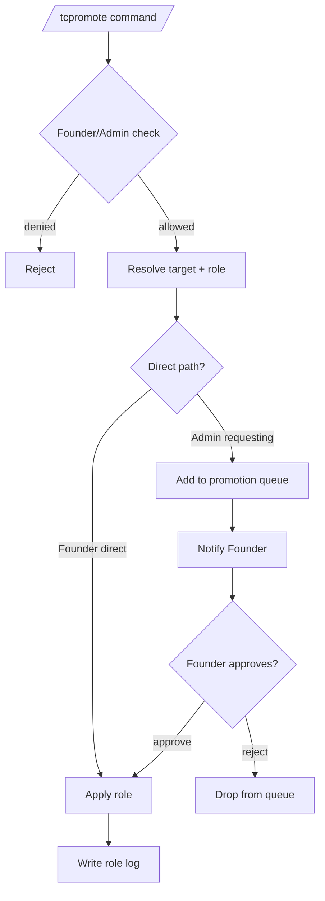

# Promote Detailed Documentation

This document describes the current promotion behavior implemented by `tcbot/modules/admins.py` (command + callback handlers) and `tcbot/modules/helper/workflows/promote_flow.py` (the `Promote` class and shared logic).

For role hierarchy and rules, see [`role-detailed.md`](role-detailed.md). For demote (counterpart) flow, see [`demote-detailed.md`](demote-detailed.md). For shared helpers, see [`helper/helper.md`](helper/helper.md). For database layer, see [`databases/databases.md`](databases/databases.md).



## Purpose

Promotion assigns one of the federation roles (Admin, Developer, or Tester) to a user. Founder is not assignable through `/tcpromote`; ownership transfer uses `/transferowner` instead.

## Command surface

Aliases (matched in any prefix configured by `cfg.prefixes`):

- `/tcpromote` · `/tcp`
- `/tcpromoterequests` · `/tcreqs`
- `/tcpromotelist` · `/tcplist`

| Command | Who can use | Purpose |
|---|---|---|
| `/tcpromote <target> [role]` | Founder, Admin | Assigns a role directly, or sends a request when Admin promotes to Admin. |
| `/tcpromoterequests` | Anyone | User submits a request for themselves to become Admin. |
| `/tcpromotelist` | Founder, Admin (`@staff_only`) | Lists pending Admin promotion requests. |

The target is resolved by `extraction.extract_target`; accepts a reply, user ID, or resolvable `@username`.

## Role aliases

The first argument after the target accepts these tokens (case-insensitive):

| Argument | Resolves to |
|---|---|
| `admin` | `admin` |
| `developer` · `dev` | `developer` |
| `tester` · `test` | `tester` |

Omitting the role triggers the inline button menu built by `keyboards.promote_role_kb()`.

## `Promote` class API

`workflows/promote_flow.py` exposes a single `Promote` class with three entry points used by the command and callbacks. The module-level `ROLE_ALIASES` dict is exported for use by the command parser.

```python
from tcbot.modules.helper.workflows.promote_flow import ROLE_ALIASES, Promote

Promote.available_roles_for(executor_role)        # list[str]
await Promote.execute(bot, admin_id, admin_fname,
                      executor_role,
                      target_id, target_fname,
                      current_role, role)         # tuple[ok, reply_text]
await Promote.request_admin(bot, admin_id,
                            target_id, target_fname,
                            target_username=None) # tuple[ok, reply_text]
```

| Member | Purpose |
|---|---|
| `Promote.available_roles_for(executor_role)` | Returns the roles an executor with `executor_role` can assign. |
| `Promote.execute(...)` | Full role-assignment flow used by `/tcpromote` (command + inline button). Routes to `_assign_admin`, `_assign_subrole`, or `request_admin` depending on requested role and executor role. |
| `Promote.request_admin(...)` | Enqueues an Admin promotion request and notifies the Founder via DM, with the log channel as a fallback. |
| `Promote._assign_admin(...)` | Founder-only path that upserts `tc_admins`, removes any existing Developer/Tester role, sends the promotion log, and DMs the target. |
| `Promote._assign_subrole(...)` | Founder/Admin path for Developer/Tester role; removes the previous custom role if any, calls `users_roles.set_role`, sends the promotion log, and DMs the target. |

## Permission matrix

| Executor | Direct role choices | Admin promotion |
|---|---|---|
| Founder | Admin / Developer / Tester | Direct assign |
| Admin | Developer / Tester | Submits request to Founder |
| Developer / Tester / no-role | N/A | N/A (no permission) |

The executor's role is enforced by the `@decorators.staff_only` decorator on `cmd_promote`; the actual decision logic inside `Promote.execute` then rejects rank-equal or rank-higher targets.

## Guardrails

`Promote.execute` rejects the following:

- Target is Founder (`That's the Founder - can't assign a role over them.`)
- Target already holds the requested role or a higher role.
- Admin tries to assign Admin to someone who is already Admin (handled by the rank check above).
- Promoting a user who is currently Admin into Developer/Tester (must demote first).

The command-level handler `cmd_promote` rejects self-promotion and the bot itself before delegating.

## Direct Founder promotion to Admin

When the Founder issues `/tcpromote @user admin`:

1. `users_roles.add_admin(target_id, founder_id)` upserts into `tc_admins`.
2. If the target previously held Developer or Tester, `users_roles.remove_role(target_id)` clears `tc_roles`.
3. `users_cache.upsert_user(target_id, None, target_fname)` refreshes the member cache.
4. A `parse_logmsg.promoted(role="admin", ...)` log is sent to `cfg.logs`.
5. The target is DM'd a welcome notification.
6. The command replies with `Done. <mention> - <code id> is now a <community> Admin.`

## Founder/Admin promotion to Developer/Tester

When Founder or Admin assigns Developer/Tester:

1. Existing Developer/Tester is removed first (if any).
2. `users_roles.set_role(target_id, role, assigned_by)` upserts into `tc_roles`.
3. `users_cache.upsert_user(...)` refreshes the cache.
4. A `parse_logmsg.promoted(role=role, ...)` log is sent to `cfg.logs`.
5. Target is DM'd.

## Admin request to promote to Admin

Admins cannot directly assign Admin. `Promote.execute` detects this and delegates to `Promote.request_admin`, which:

1. Checks for an existing pending request via `queues_db.get_request(target_id)`.
2. Inserts a new `promotion_requests` document with `status="pending"` via `queues_db.enqueue(...)`.
3. Resolves the Founder's user ID via `users_roles.get_owner_id()`.
4. DMs the Founder a review card with Approve / Reject buttons (`keyboards.promo_decision_kb`).
5. Falls back to posting in `cfg.logs` when the Founder DM fails.
6. Returns `Submitted - the Founder has been notified and will review it shortly.`

Only one pending request per target is allowed.

## `/tcpromoterequests` behavior

A user submits a request for themselves to become Admin. `cmd_promote_request` first calls `identity.classify(ctx.bot, user.id, user.id, user.first_name)` and refuses through `identity.refuse_message("promote", ident)` when the requester is the Founder, this bot, the Telegram service account, another bot, or already an Admin. Otherwise it delegates to `Promote.request_admin` with `admin_id = user.id` and `target_id = user.id`, and the same DM/log/queue path applies. Only one pending request per requester is allowed.

## Callback routing

| Button | Callback data | Handler |
|---|---|---|
| Role option | `promo_role:<role>:<target_id>` | `on_promote_role_btn` |
| Cancel | `promo_role_cancel:<target_id>` | `on_promote_role_cancel` |
| Approve / Reject (Founder DM) | `promo_approve:<request_id>` / `promo_reject:<request_id>` | `on_promo_decision` |

All callbacks re-check the executor's current effective role before applying any write, so a user who lost permission between selecting and confirming is rejected with an alert.

### Approval path

1. `users_roles.add_admin(target_id, admin.id)` upserts `tc_admins`.
2. `queues_db.resolve(request_id, "approved", admin.id)` marks the request resolved.
3. `parse_logmsg.promote_approved_log(...)` is sent to `cfg.logs`.
4. Target is DM'd a welcome notification.
5. The review message is edited to append `- Approved by <admin name>` and the keyboard is removed.

Approval does not remove any pre-existing Developer/Tester role; effective-role resolution still returns Admin because Admin outranks custom roles.

### Rejection path

1. `queues_db.resolve(request_id, "rejected", admin.id)`.
2. `parse_logmsg.promote_rejected_log(...)` is sent to `cfg.logs`.
3. Target is DM'd a rejection notification.
4. The review message is edited to append `- Rejected by <admin name>`.

## Logs

All promotion paths share a single log builder for consistency:

| Function | Trigger |
|---|---|
| `parse_logmsg.promoted(role, ...)` | Direct role assignment (Admin/Developer/Tester). Title: `New <community> Promoted`. |
| `parse_logmsg.promote_request_log(...)` | A new Admin promotion request is created. |
| `parse_logmsg.promote_approved_log(...)` | The Founder approves a pending request. |
| `parse_logmsg.promote_rejected_log(...)` | The Founder rejects a pending request. |

The unified `promoted` builder places the role as a field below the user (`Role: Admin`) so the title stays the same regardless of which role is assigned.

## Edge cases

- The effective-role cache (`effective_role_cache` in `tcbot/database/cache.py`) is invalidated by every write so subsequent reads see the new role.
- A user can hold both a Developer/Tester record and an Admin record at once; effective-role resolution prefers Admin.
- The promotion-request approve path does not clear an existing Developer/Tester role, so the user becomes Admin but the custom-role document may remain in `tc_roles` until manually removed.
- DM notification failures are tolerated through `asyncio.gather(..., return_exceptions=True)` or explicit fallback logging; promotion still completes.
- Pending requests are not deleted after approval/rejection; they are flagged with `status`, `resolved_date`, and `resolved_by`.

## Behavior reference

- Founder can promote any role directly.
- Admin can promote Developer / Tester directly.
- Admin promoting to Admin enqueues a request rather than writing `tc_admins`.
- Duplicate pending requests for the same target are rejected.
- Non-Founder cannot approve/reject promotion requests.
- Self-promotion, bot promotion, and promotion-of-Founder are rejected.
- Inline role-button menu re-checks executor role at click time.
