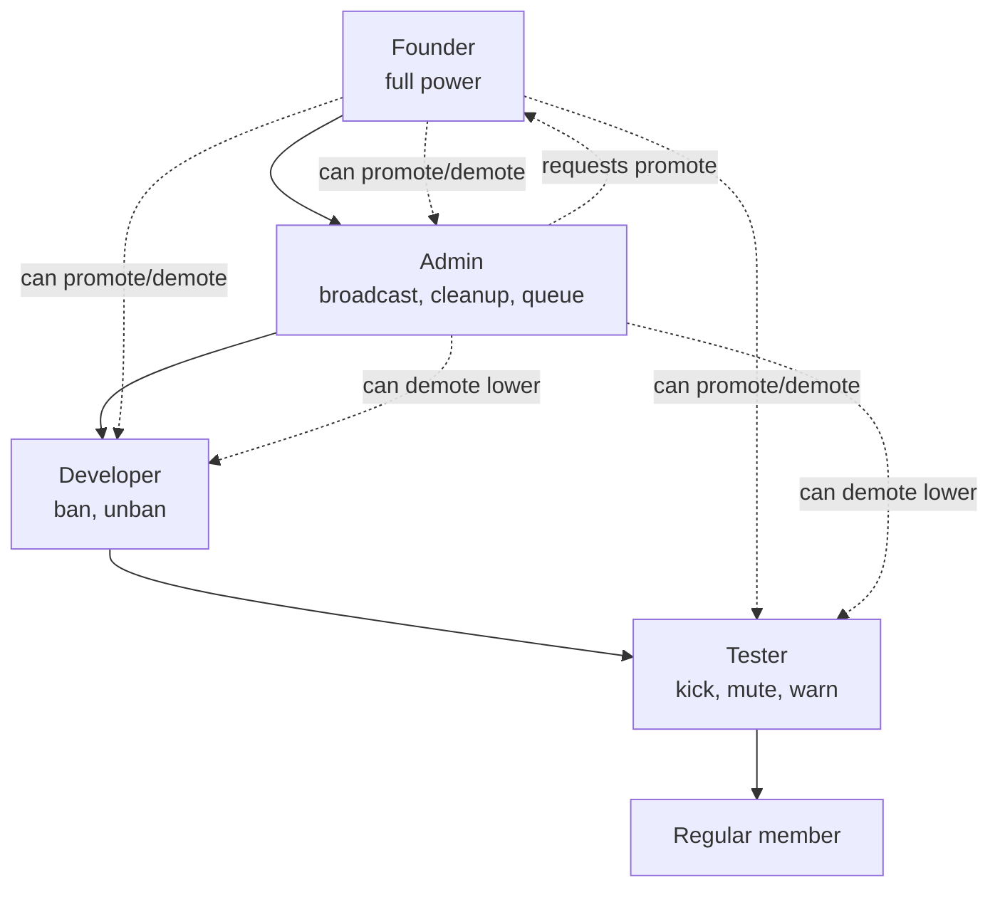
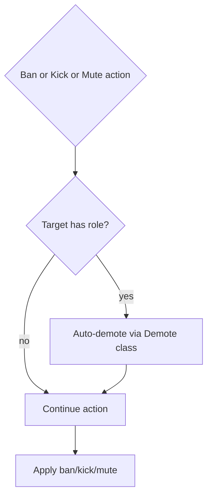

# Role Detailed Documentation

This document describes the current role and staff-management behavior implemented by `tcbot/modules/admins.py`, `tcbot/modules/helper/workflows/promote_flow.py`, `tcbot/modules/helper/workflows/demote_flow.py`, `tcbot/modules/helper/decorators.py` (for `resolve_and_check`), `tcbot/modules/helper/identity.py` (for target identity refusals), `tcbot/database/users_roles.py`, and `tcbot/database/queues_db.py`.

For promote command details, see [`promote-detailed.md`](promote-detailed.md). For demote command details, see [`demote-detailed.md`](demote-detailed.md). For module structure, see [`modules/modules.md`](modules/modules.md). For shared helpers, see [`helper/helper.md`](helper/helper.md). For database layer, see [`databases/databases.md`](databases/databases.md).

Every staff-management command (`/tcpromote`, `/tcdemote`, `/tcpromoterequests`, `/transferowner`, `/tcunwarn`, `/resetwarns`) classifies the target through `identity.classify(...)` and refuses disallowed identities (self, this bot, Telegram service account, other bots, Founder, and higher-rank staff where applicable) via `identity.refuse_message(action, ident)` before mutating state.

## Purpose

The role system controls who can perform moderation and administrative actions. It combines one Founder/owner, Admin records, and custom Developer/Tester roles into a single effective hierarchy used across bans, kicks, warnings, unbans, promotion flows, and role protection.

## Effective role hierarchy

Effective roles are resolved by `users_roles.get_effective_role(user_id)`:

1. Check whether the user is the current owner in `tc_owners`.
2. Check whether the user is an Admin in `tc_admins`.
3. Check whether the user has a custom role in `tc_roles`.
4. Cache the result in `effective_role_cache`.

The rank table is:

| Effective role | Rank | Source |
|---|---:|---|
| `founder` | 4 | `tc_owners` |
| `admin` | 3 | `tc_admins` |
| `developer` | 2 | `tc_roles.role` |
| `tester` | 1 | `tc_roles.role` |
| `None` | 0 | No role |

`ROLE_LABEL` maps these internal names to display labels: Founder, Admin, Developer, Tester.

Only `developer` and `tester` are valid custom roles in `tc_roles`. Founder and Admin are stored separately.

## Permission model

The helper `role_rank(role)` converts an effective role into its numeric rank. `can_act_on(executor_id, target_id)` returns true only when the executor rank is strictly greater than the target rank.

Common moderation thresholds:

| Action | Minimum effective role |
|---|---|
| `/tcban` | Developer |
| `/tcunban` | Developer/Admin/Founder via `mod_only` |
| `/tckick` | Tester |
| `/tcwarn` | Tester |
| `/tcunwarn` | Tester/Admin/Founder via `basic_mod_only` |
| `/resetwarns` | Tester/Admin/Founder via `basic_mod_only` |
| Appeal decision buttons | Founder or Admin via `users_roles.is_staff` |
| `/tcpromote` | Founder or Admin |
| `/tcdemote` | Founder or Admin |
| `/transferowner` | Founder only |
| `/tcpromotelist` | Founder or Admin via `staff_only` |
| Promotion approve/reject buttons | Founder only |

## Persistent collections

| Collection | Purpose | Key fields |
|---|---|---|
| `tc_owners` | Stores the single Founder/owner. | `user_id` |
| `tc_admins` | Stores Admin users. | `user_id`, `promoted_by`, `promoted_date` |
| `tc_roles` | Stores custom Developer/Tester roles. | `user_id`, `role`, `assigned_by`, `assigned_at` |
| `promotion_requests` | Stores pending/resolved Admin promotion requests. | `request_id`, `target_id`, `status`, `requested_date`, `resolved_date`, `resolved_by` |

Indexes are ensured for unique user IDs in `tc_owners`, `tc_admins`, and `tc_roles`, plus unique `promotion_requests.request_id` and `promotion_requests.target_id + status`.

Role and owner/admin writes invalidate relevant cache entries so permission checks see updated state.

## `/tcpromote` behavior

`/tcpromote` assigns a role or starts an approval request, depending on executor role and target role.

Aliases:

- `/tcpromote`
- `/tcp`

Accepted role arguments:

| Argument | Normalized role |
|---|---|
| `admin` | `admin` |
| `developer` | `developer` |
| `dev` | `developer` |
| `tester` | `tester` |
| `test` | `tester` |

Target resolution supports reply, user ID, and resolvable username.

### Promotion permissions

| Executor | Direct role choices |
|---|---|
| Founder | Admin, Developer, Tester |
| Admin | Developer, Tester |
| Developer/Tester/unroled | No promotion access |

If the command omits the role argument, the bot shows an inline role-selection menu using `keyboards.promote_role_kb(...)`.

Role-selection callback data:

| Button | Callback data |
|---|---|
| Role option | `promo_role:<role>:<target_id>` |
| Cancel | `promo_role_cancel:<target_id>` |

The callback re-checks the executor's current effective role before executing. If the user lost permission, the bot answers with an alert and removes the markup when possible.

### Promotion guardrails

The promotion executor rejects these cases:

- The executor is not Founder/Admin.
- The target cannot be resolved.
- The executor tries to promote themselves.
- The target is the bot.
- The target is Founder.
- The target already has the requested role or a higher role.
- The target is already Admin and the requested role is Developer/Tester; they must be demoted first.

### Direct Founder promotion to Admin

When Founder promotes a target to Admin:

1. `users_roles.add_admin(target_id, founder_id)` upserts into `tc_admins`.
2. If the target had a Developer/Tester role, `users_roles.remove_role(target_id)` removes it from `tc_roles`.
3. `users_cache.upsert_user(...)` caches the display name.
4. A `promoted` log (with `role="admin"`) is sent to `cfg.logs`.
5. The target is notified by DM when possible.
6. The command message is updated/replied with a success message.

### Founder/Admin promotion to Developer or Tester

When Founder or Admin assigns Developer/Tester:

1. Existing Developer/Tester custom role is removed first if present.
2. `users_roles.set_role(target_id, role, assigned_by)` upserts into `tc_roles`.
3. `users_cache.upsert_user(...)` caches the display name.
4. A `promoted` log (with the assigned role) is sent to `cfg.logs`.
5. The target is notified by DM when possible.

### Admin request to promote someone to Admin

Admins cannot directly assign Admin. When an Admin tries to promote a target to Admin:

1. The bot checks for an existing pending request for that target.
2. A new request is inserted into `promotion_requests` with status `pending`.
3. The Founder is fetched from `tc_owners`.
4. The Founder is notified by DM with Approve/Reject buttons if possible.
5. If the Founder DM fails or no owner ID exists, the request is posted to the logs channel as a fallback.
6. The command replies that the request was submitted.

The pending-request guard is target-based: only one pending Admin promotion request is allowed for the same target.

## `/tcpromoterequests` behavior

Aliases:

- `/tcpromoterequests`
- `/tcreqs`

This command lets a user submit a request for themselves to become Admin.

Flow:

1. If the user already has a pending request, the bot returns that request ID.
2. Otherwise, it enqueues a new `promotion_requests` document with `target_id` equal to the user's ID.
3. The Founder is notified by DM with approve/reject buttons when possible.
4. The logs channel is used as a fallback notification destination.
5. The user receives the new request ID.

This command does not check that the requester already has a lower staff role.

## Promotion request callbacks

Approve/reject buttons are generated by `keyboards.promo_decision_kb(request_id)`.

| Button | Callback data |
|---|---|
| `Approve` | `promo_approve:<request_id>` |
| `Reject` | `promo_reject:<request_id>` |

Only the Founder can use these callbacks. The handler checks `users_roles.is_owner(admin.id)` before reading the request.

### Approval

Approval does the following:

1. Adds the target to `tc_admins` with `users_roles.add_admin(...)`.
2. Marks the request `approved` with `queues_db.resolve(...)`.
3. Sends a `promote_approved_log` to `cfg.logs`.
4. Notifies the target by DM when possible.
5. Edits the review message to append who approved it and removes the keyboard.

Approval does not remove an existing Developer/Tester role in this callback path. Effective role resolution still returns Admin because Admin outranks custom roles, but the custom role document may remain unless removed elsewhere.

### Rejection

Rejection does the following:

1. Marks the request `rejected` with `queues_db.resolve(...)`.
2. Sends a `promote_rejected_log` to `cfg.logs`.
3. Notifies the target by DM when possible.
4. Edits the review message to append who rejected it and removes the keyboard.

## `/tcpromotelist` behavior

Aliases:

- `/tcpromotelist`
- `/tcplist`

This command is staff-only and lists all pending promotion requests. The output includes:

- Target mention.
- Target ID.
- Username when known.
- Request ID.

If no pending requests exist, the bot replies `No pending promotion requests.`

## `/tcdemote` behavior

Aliases:

- `/tcdemote`
- `/tcd`

Demotion removes an Admin, Developer, or Tester role after a confirmation step.

Flow:

1. Founder/Admin runs `/tcdemote <target>` or replies with `/tcdemote`.
2. The bot resolves executor role and target in parallel.
3. The executor must currently be Founder or Admin.
4. The target must hold a removable role.
5. Founder cannot be demoted through this command.
6. Admin targets can only be demoted by Founder.
7. The bot sends a confirmation keyboard.

Confirmation callback data:

| Button | Callback data |
|---|---|
| `Confirm` | `demote_confirm:<target_id>` |
| `Cancel` | `demote_cancel:<target_id>` |

The confirmation callback re-checks executor permission and target role before writing. If the target is Admin, it calls `users_roles.remove_admin(target_id)`. Otherwise, it calls `users_roles.remove_role(target_id)`.

On success:

- A `demoted` log is sent to `cfg.logs`.
- The target is notified by DM when possible.
- The confirmation message is edited with a success message and keyboard removed.

Cancel answers the callback and edits the message to say no changes were made.

## `/transferowner` behavior

Aliases:

- `/transferowner`
- `/tfowner`

Only the current Founder can transfer ownership.

Flow:

1. The target is resolved by reply, user ID, or username.
2. The command rejects transferring ownership to the current owner.
3. The current owner is added to `tc_admins` before ownership changes.
4. `users_roles.set_owner(target_id)` replaces the single owner record in `tc_owners`.
5. The owner cache and effective-role cache are updated/cleared.
6. An `ownership_transferred` log is sent to `cfg.logs`.
7. The command replies with the new owner mention.

After transfer, the previous Founder becomes Admin and the new target becomes Founder.

## Auto-demotion on moderation actions

`Demote.execute(..., trigger="ban"|"kick"|"mute")` from `workflows/demote_flow.py` is used before ban/kick/mute when the target has a lower staff role than the executor.

Behavior:

- Admin target: remove from `tc_admins`.
- Developer/Tester target: remove from `tc_roles`.
- Send a `demoted` log (with the applicable trigger) to `cfg.logs`.
- DM the target that their role was removed because they were banned, kicked, or muted.

Ban, kick, and mute command modules block equal/higher-ranked targets before calling auto-demotion, so auto-demotion only applies to lower-ranked staff targets.

A single warning below the warn limit does not auto-demote. However, when the warn limit is reached, `warning_flow.execute_warn` calls `Demote.execute(trigger="ban")` before issuing the federation-wide auto-ban, so a role-holding target loses their role at that point. Individual warnings below the threshold leave the role intact.

## Logs

Role and promotion logs are built in `parse_logmsg.py`:

| Template | Trigger |
|---|---|
| `promoted(role)` | Founder/Admin promotes a user to the named role (Admin, Developer, or Tester). |
| `demoted(role, trigger=None)` | Role removed. `trigger=None` for manual demotion; `trigger="ban"` / `"kick"` / `"mute"` for auto-demote during a ban, kick, or mute. |
| `ownership_transferred` | Founder transfers ownership. |
| `promote_request_log` | Admin promotion request created. |
| `promote_approved_log` | Founder approves a promotion request. |
| `promote_rejected_log` | Founder rejects a promotion request. |

## Edge cases

- Effective role cache can make reads fast, but writes invalidate affected users or clear the cache when ownership changes.
- A user can technically have both an Admin record and a custom role; effective role resolution returns Admin because it is checked before `tc_roles`.
- Direct Founder promotion to Admin removes existing Developer/Tester custom role, but promotion-request approval currently does not.
- Promotion and demotion callbacks re-check current permissions at click time; losing permission after the menu was created blocks the callback.
- Founder cannot be assigned over or demoted through the normal role commands.
- Admin cannot demote Admin; Founder is required.
- Admin cannot directly promote a target to Admin; a request is created instead.
- Pending promotion requests are not deleted after approval/rejection; they are marked with `status`, `resolved_date`, and `resolved_by`.
- DM notification failures are tolerated in most role flows through `asyncio.gather(..., return_exceptions=True)` or explicit fallback logging.

## Behavior reference

Key role-system behaviors to keep in mind:

1. `get_effective_role` returns Founder over Admin/custom role, Admin over custom role, then custom role.
2. `role_rank(None)` returns `0`.
3. `can_act_on` is true only when executor rank is strictly higher than target rank.
4. Founder can directly promote Admin/Developer/Tester.
5. Admin can directly promote Developer/Tester.
6. Admin attempting to promote Admin creates a pending request.
7. Duplicate pending promotion requests for the same target are rejected.
8. Non-Founder cannot approve/reject promotion request callbacks.
9. Founder approval adds `tc_admins` and resolves the request.
10. Founder rejection resolves the request without adding Admin.
11. `/tcdemote` blocks self-demotion and Founder demotion.
12. Admin cannot demote Admin.
13. Confirm demotion removes the correct collection record (`tc_admins` for Admin, `tc_roles` for Developer/Tester).
14. Transfer ownership makes the old Founder an Admin and replaces the owner record.
15. Ban/kick/mute auto-demotes lower-ranked staff targets and logs the role removal.
16. Equal-rank and higher-rank targets are protected from ban/kick/mute/warn actions.
