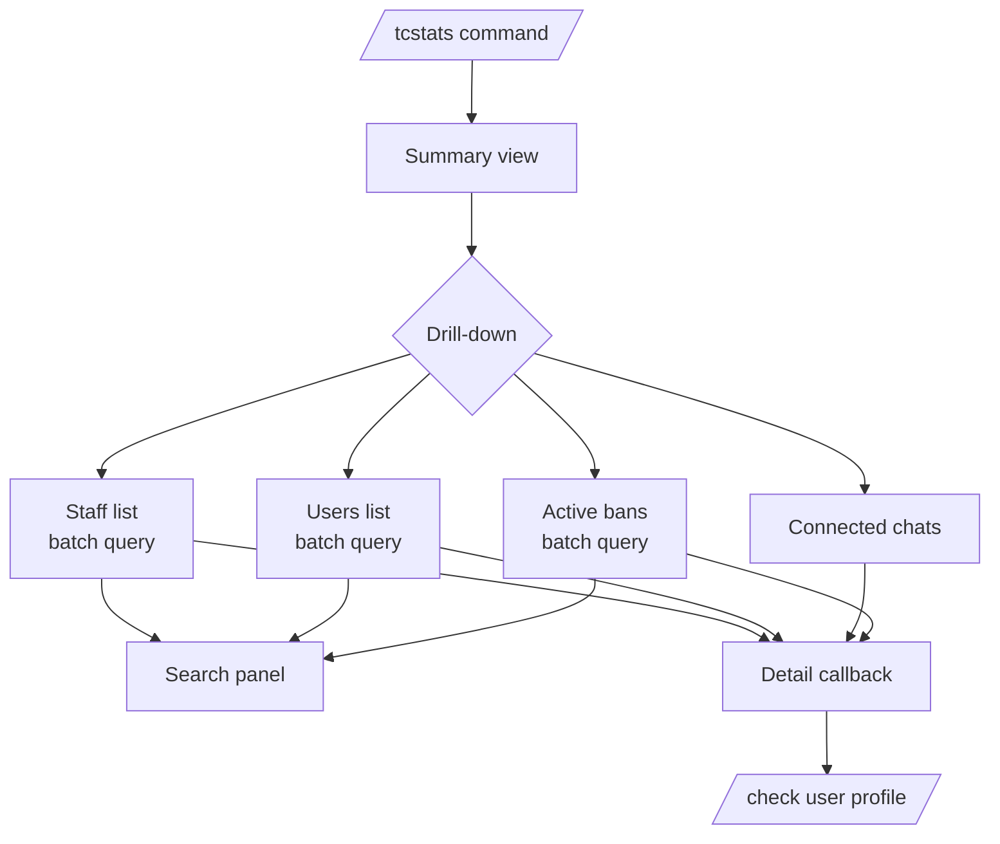

# Stats Detailed Documentation

This document describes the unified federation statistics command implemented by `tcbot/modules/stats.py` and `tcbot/modules/helper/workflows/stats_flow.py`.

For module structure, see [`modules/modules.md`](modules/modules.md). For shared helpers and decorators, see [`helper/helper.md`](helper/helper.md). For database access patterns, see [`databases/databases.md`](databases/databases.md). For check command which often complements stats, see [`check-detailed.md`](check-detailed.md).



## Purpose

`/tcstats` is the federation's read-only situational awareness console. A single inline keyboard fans out into four drill-down panes (Staff Roster, Users, Connected Chats, User Bans) plus a search panel for active bans. Every pane returns to the same overview through a `« Back` button.

Aliases:

- `/tcstats`
- `/tcs`

## Command surface

| Command | Aliases | Who can use | Where |
|---|---|---|---|
| `/tcstats` | `/tcs` | Anyone | Bot PM, exec group, or any connected group |

## Top-level overview

`Stats.main()` returns the overview card:

```text
<community> Stats

Founder: <mention>
Staff: <total> (Admins n, Devs n, Testers n)
Users tracked: <n>
Active bans: <n>
Connected chats: <n>
```

Inline keyboard:

```text
[ Staff Roster ] [ Users ]
[ Connected Chats ] [ User Bans ]
```

Every counter and the Founder mention are fetched in a single `asyncio.gather` so the card renders in one round-trip.

## Drill-downs

### Staff Roster (`stats_admins`)

`Stats.staff_roster()` lists every staff member, grouped by role. Names are resolved in a single parallel pass for the whole roster: owner first, then each role section.

```text
Staff Roster - <community>

Founder
- <mention>

Admins (n)
- <mention>

Developers (n)
- <mention>
- <mention>

Testers (n)
- None assigned
```

### Users (`stats_users:<page>` and `stats_user_item:<page>:<idx>`)

`Stats.users_list(page)` paginates `users_cache.all_users()` (sorted by `first_name`). Each row shows the cached display name, ID, and `@username` when present. Numbered buttons open `Stats.user_detail(page, idx)` which renders:

```text
User Details

Name: <mention>
ID: <id>
Username: @username or -
Last name: <last_name or ->

First seen: <utc>
Last seen: <utc>

Use /check <id> for the full profile.
```

The detail view links into `/check` so staff can transition from "who is this user" to "what is their federation history" in one tap.

### Connected Chats (`stats_chats:<page>` and `stats_chat_item:<page>:<idx>`)

`Stats.chats_list(page)` paginates `groups_db.active_groups()`. Each row shows the chat title and ID. Numbered buttons open `Stats.chat_detail(page, idx)` which renders:

```text
Group Details

Name: <title>
Chat ID: <chat_id>

Connected by: <mention>
Date: <utc>
```

### User Bans (`stats_bans:<page>` and `stats_ban_item:<page>:<idx>`)

`Stats.bans_list(page)` paginates `bans_db.active_bans()`. The list is ordered newest first via the existing index. The page footer adds a `[ Search ]` button that opens the search panel. Numbered buttons open `Stats.ban_detail(page, idx)`, which reuses `helper/ban_info.build_ban_detail` and exposes a `View Proof` URL when proof exists.

### Search panel (`stats_bans_search`, `stats_search_*`)

`Stats.open_search` records `(chat_id, message_id)` in `ctx.user_data` so the user's free-text query message can be deleted and the original card edited in place. Search runs through `Stats.search_run`:

- Numeric query → `bans_db.get_active_ban(int(query))`.
- Non-numeric query → match against cached first names of every active ban (resolved in parallel).

Results are rendered with a numbered keyboard. Each hit opens `Stats.search_detail`, which reuses `build_ban_detail` and offers `View Proof` plus `Back to Results`.

The free-text input handler is scoped to private chats and only fires while the search panel is active; it ignores every other text message.

## Class architecture

`Stats` is a stateless container. Every method is a `@classmethod` returning `(text, InlineKeyboardMarkup)`. Callbacks pair an `await q.answer()` with `safe_edit_cb()` so the same content can be re-tapped without raising `Message is not modified`.

```python
class Stats:
    PAGE_SIZE = 6

    @classmethod async def main() -> tuple[str, InlineKeyboardMarkup]
    @classmethod async def staff_roster() -> tuple[str, InlineKeyboardMarkup]
    @classmethod async def users_list(page) -> tuple[str, InlineKeyboardMarkup]
    @classmethod async def user_detail(page, idx) -> tuple[str, InlineKeyboardMarkup]
    @classmethod async def chats_list(page) -> tuple[str, InlineKeyboardMarkup]
    @classmethod async def chat_detail(page, idx) -> tuple[str, InlineKeyboardMarkup]
    @classmethod async def bans_list(page) -> tuple[str, InlineKeyboardMarkup]
    @classmethod async def ban_detail(page, idx) -> tuple[str, InlineKeyboardMarkup]
    @classmethod def    open_search(ctx, q) -> tuple[str, InlineKeyboardMarkup]
    @staticmethod      clear_search(ctx) -> None
    @classmethod async def search_run(query) -> list[dict]
    @classmethod async def search_results(query, results) -> tuple[str, InlineKeyboardMarkup]
    @classmethod async def search_detail(results, idx) -> tuple[str, InlineKeyboardMarkup]
```

The previous `stats_chats_flow.py` has been removed; its responsibilities live entirely inside `Stats`.

## Database helpers used

| Helper | Purpose |
|---|---|
| `users_roles.get_owner_id()` | Founder's user ID for the overview line. |
| `users_roles.admin_count()` | Total Admins for the overview. |
| `users_roles.all_admins()` | Full Admin list for the staff roster. |
| `users_roles.all_by_role("developer" \| "tester")` | Per-role lists for the staff roster. |
| `users_cache.total_users()` | Cached-user count for the overview. |
| `users_cache.all_users()` | Paginated user list (server-sorted by `first_name`). |
| `users_cache.get_first_name(uid, fallback)` | Display-name lookups. |
| `bans_db.active_ban_count()` | Active-ban count for the overview. |
| `bans_db.active_bans()` | Paginated ban list and search corpus. |
| `bans_db.get_active_ban(uid)` | Direct ID search hit. |
| `groups_db.active_group_count()` | Connected-group count for the overview. |
| `groups_db.active_groups()` | Paginated chat list and detail lookup. |

## Async behaviour

Every list view that needs more than one read parallelises with `asyncio.gather`. Per-item lookups (admin names, banned-user names) are pre-resolved in a single gather before the formatting loop runs, so the final string-building stays synchronous. The search input handler runs the search and the user's message-delete in parallel so the bot edits the existing card without any visible delay.

## Edge cases

- A user with no cached profile renders as `User <id>` in every list, never as a bare numeric ID.
- An empty roster ("None assigned") never crashes pagination because the user/chat/ban lists have their own empty-state branch.
- Re-tapping the same drill-down does not raise; `safe_edit_cb` swallows the `Message is not modified` `BadRequest`.
- The search input handler is private-chat only and gated by `SEARCH_KEY`; it never absorbs unrelated group messages.
- `Stats.clear_search(ctx)` is called whenever the user navigates away from the bans panel so stale results never leak into a new search.

## Behavior reference

- `/tcstats` and `/tcs` both reach `cmd_stats` regardless of prefix (`/`, `!`, `.`).
- `Staff Roster` page shows the Founder mention exactly once, then each role section, even when a role list is empty.
- `Users` pagination clamps to the last page when the requested page exceeds `total_pages`.
- `Connected Chats` detail card matches the format produced by the previous `stats_chats_flow.build_chat_detail`.
- `User Bans` Search panel handles numeric IDs and free-text queries; each hit drills into the same detail card as the regular bans list.
- All callbacks ack the query before editing, so Telegram never marks them as unanswered.
