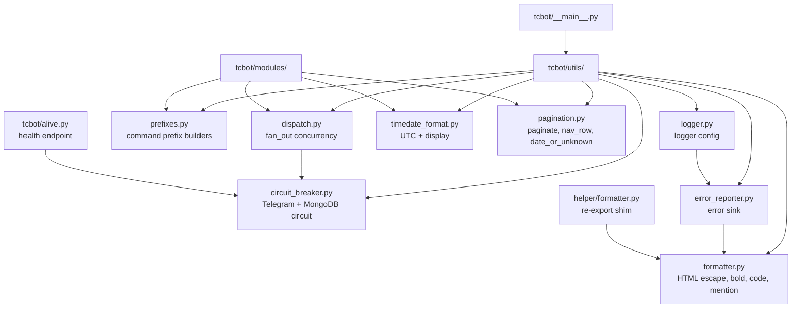

# Runtime Utilities

Runtime utilities live in `tcbot/utils/`. They provide infrastructure used across command modules, workflows, database helpers, and startup.

For modules that consume these utilities, see [`../modules/modules.md`](../modules/modules.md). For shared helpers, see [`../helper/helper.md`](../helper/helper.md). For database helpers, see [`../databases/databases.md`](../databases/databases.md).



## `circuit_breaker.py`

Lightweight async circuit breaker that protects the bot from wasting time on repeated timeouts when a downstream service is unresponsive.

| Export | Purpose |
|---|---|
| `CircuitBreaker(name, failure_threshold=5, recovery_timeout=60.0)` | Per-service circuit breaker instance. |
| `CircuitOpenError` | Raised when a call is rejected because the circuit is OPEN. |
| `CircuitState` | Enum: `CLOSED`, `OPEN`, `HALF_OPEN`. |
| `telegram` | Module-level singleton for Telegram API calls. |
| `mongodb` | Module-level singleton for MongoDB calls. |

States and transitions:

```
CLOSED --[5 consecutive TimedOut/NetworkError]--> OPEN
OPEN   --[60s elapsed]--> HALF_OPEN
HALF_OPEN --[probe succeeds]--> CLOSED
HALF_OPEN --[probe fails]--> OPEN
```

`CircuitBreaker.call(coro)` executes the coroutine through the breaker: a `CircuitOpenError` is raised without touching the service when the circuit is OPEN; any exception from the coroutine is re-raised after being counted against the circuit.

`record_success()` and `record_failure()` are public methods for callers that manage their own try/except (for example, `dispatch.fan_out` which only counts network errors, not expected API refusals).

The Telegram circuit state (`closed`, `open`, or `half_open`) is exposed in the `/health` endpoint under `circuit_telegram` and `circuit_mongodb`.

## `dispatch.py`

| Export | Purpose |
|---|---|
| `fan_out(coros, max_concurrent=10)` | Run awaitables concurrently up to `max_concurrent` at once; never raises; returns exceptions as list elements. |
| `count_errors(results)` | Count `BaseException` items in a `fan_out` result list. Replaces the inline `sum(1 for r in results if isinstance(r, BaseException))` pattern. |

`fan_out` behavior:

- preserves input order in the returned list;
- returns exceptions as list elements instead of raising;
- returns an empty list for empty input;
- defaults to 10 concurrent tasks, which is safe for Telegram API fan-out operations;
- integrates the `telegram` circuit breaker: slots that run while the circuit is OPEN return `CircuitOpenError` immediately instead of issuing a Telegram request that will time out;
- only `TimedOut` and `NetworkError` are counted against the circuit; expected API refusals (403 Forbidden, 400 Bad Request) are not.

Use it for multi-group actions such as ban, unban, mute, broadcast, and cleanup.

```python
results = await fan_out([
    ctx.bot.ban_chat_member(group["chat_id"], target_id)
    for group in groups
])
errors = count_errors(results)
```

## `prefixes.py`

Command prefix support is centralized here.

| Export | Purpose |
|---|---|
| `build_prefixed_filters(command)` | Builds a PTB message filter matching any configured prefix plus an exact lowercase command. |
| `parse_cmd_args(text)` | Returns command arguments after the first whitespace. |
| `register_command(name, callback)` | Registers an async callback for alternate-prefix dispatch. |
| `dispatch_alt_prefix(update, context)` | Dispatches configured non-slash prefix commands from the registry. |
| `ANY_CMD_FILTER` | Matches any custom-prefix command (e.g. `!`, `.`); excludes Telegram-native `/` commands. Used in `__main__.py` member-cache guard. |
| `ALL_PREFIXES_CMD_FILTER` | Matches any prefixed command across all configured prefixes including `/`. Used in `ConversationHandler` fallbacks to catch all commands and cancel conversations. |

`PREFIXES` supports a Python-style list such as `["/", "!", "."]` and falls back to common prefixes when unset. Prefix filters are case-sensitive, accept lowercase ASCII command names, and only accept `@BotName` suffixes that target the current bot.

## `logger.py`

Logging setup is installed from `tcbot.__main__.main()`.

| Export | Purpose |
|---|---|
| `BotLogFormatter` | Console formatter with time, date, module, line, level, and message. |
| `TelegramErrorHandler` | Logging handler that forwards error-level records to `error_reporter`. |
| `setup(level=logging.INFO)` | Installs console and Telegram error handlers on the root logger and quiets noisy libraries. |

Third-party loggers such as `httpx`, `telegram`, `motor`, and `pymongo` are capped to reduce noise.

## `error_reporter.py`

Error reporting sends structured HTML messages to `LOGS_ERRORS`.

| Export | Purpose |
|---|---|
| `attach(bot, chat_id, thread_id)` | Stores the live bot and destination after PTB startup. |
| `build_error_message(exc=None, record=None, context=None)` | Formats exception or log-record details for Telegram. |
| `send_to_log_errors(text)` | Sends a prepared message to the error destination. |
| `report_exc(exc, context=None)` | Reports an exception. |
| `report_record(record)` | Reports a logging record. |

The reporter classifies expected Telegram errors, trims long tracebacks, escapes HTML, and avoids raising if the destination is not configured.

`__main__.py` wires error reporting in two places:

1. PTB error handler for handler exceptions.
2. Asyncio loop exception handler for background task failures.

## `timedate_format.py`

This module is the single source of truth for UTC datetime handling.

| Function | Use |
|---|---|
| `utc_now()` | Store timestamps and compare elapsed time. |
| `to_utc(dt)` | Normalize naive or aware datetimes before arithmetic. |
| `fmt_dt(dt)` | Display datetimes as `DD-MM-YYYY | HH:MM`. |
| `utc_now_str()` | Display the current UTC time using `fmt_dt()`. |

Do not call `datetime.utcnow()` or `datetime.now(timezone.utc)` outside this utility.

## `pagination.py`

Shared pagination helpers used by `stats_flow.py` and `check_flow.py` drill-down pages.

| Export | Purpose |
|---|---|
| `paginate(items, page, page_size)` | Slice a list for a 0-based page number. Returns `(chunk, total_pages, clamped_page)`. |
| `nav_row(page, total_pages, cb_prefix)` | Build a `[« Prev]` / `[Next »]` inline keyboard row when there is more than one page. Buttons use `cb_prefix:<page>` callback data. |
| `date_or_unknown(value)` | Format a datetime field via `fmt_dt` or return `"Unknown"` if the value is falsy. |

Always import these from `tcbot.utils.pagination`; do not reimplement pagination logic inside individual flow files.

## `formatter.py`

Single source of truth for all Telegram HTML markup. Both the utils layer (e.g. `error_reporter.py`) and the modules layer import from here. `tcbot/modules/helper/formatter.py` is a thin re-export shim that preserves backward-compatible import paths for existing callers.

| Function | Output/use |
|---|---|
| `esc(text)` | Escape HTML special characters for safe inline inclusion. |
| `bold(text)` | `<b>...</b>` with escaped content. |
| `italic(text)` | `<i>...</i>` with escaped content. |
| `code(text)` | `<code>...</code>` with escaped content. |
| `pre(text)` | `<pre>...</pre>` monospace block with escaped content. |
| `link(text, url)` | HTML anchor tag. Escape or validate untrusted URLs before passing. |
| `mention(user_id, name, username=None)` | Smart mention: `https://t.me/username` link when username available; otherwise plain name + copyable ID. |
| `user_ref(user_id, name, username=None)` | Action-summary reference: `mention - code(id)`. Omits redundant ID when name equals the numeric string fallback. |
| `proof_line(proof_desc)` | `\nProof: <desc>` or `""` when proof_desc is falsy. Embed directly in kick/mute/warn action messages. |

Always import from `tcbot.utils.formatter` in utils-layer code. Modules-layer code may continue using `tcbot.modules.helper.formatter` (the shim) for backward compatibility.

## Utility boundaries

- Keep generic runtime concerns in `utils/`.
- Keep feature-specific text and keyboard policy in `modules/helper/` or workflows.
- Use `fan_out()` rather than hand-written unbounded `asyncio.gather()` loops for Telegram API operations across groups.
- Use prefix helpers for all command filters so custom prefixes remain consistent.
