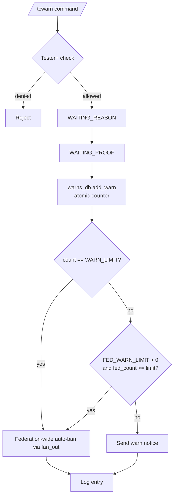

# Warnings Detailed Documentation

This document describes the current warning behavior implemented by `tcbot/modules/warnings.py`, `tcbot/modules/helper/workflows/warning_flow.py`, `tcbot/modules/helper/workflows/reason_flow.py`, and `tcbot/database/warns_db.py`.

For ban flow triggered by warning limit, see [`banning-detailed.md`](banning-detailed.md). For check command showing warning history, see [`check-detailed.md`](check-detailed.md). For shared helpers, see [`helper/helper.md`](helper/helper.md). For database layer, see [`databases/databases.md`](databases/databases.md).



## Purpose

Warnings are per-group moderation records. Each warn is keyed by `(user_id, chat_id)`. Two automatic federation-ban thresholds exist:

1. **Per-group threshold** (`WARN_LIMIT`, default 3): fires when a user's warn count in the current group reaches exactly `WARN_LIMIT`. Uses `==` to prevent double-ban race conditions when two concurrent warns bracket the limit.
2. **Federation-wide threshold** (`FED_WARN_LIMIT`, env var, default 0 = disabled): fires when the user's total warns across all groups reaches or exceeds the configured value, even if no single group has reached its per-group limit. Uses `>=` because the cross-group aggregate is a separate DB read with no atomicity guarantee. Set to a positive integer to close the evasion path of spreading warns thinly across many groups.

In both cases the user is issued a **federation-wide ban** across all active connected groups, a ban document is created in the `bans` collection (appealable), and warnings are cleared for the originating group.

The per-group limit constant is:

```python
WARN_LIMIT = 3
```

## Commands and aliases

| Command | Alias | Purpose | Access |
|---|---|---|---|
| `/tcwarn` | `/tcw` | Add a warning in the current group. | Tester and above. |
| `/tcunwarn` | `/tcunw` | Remove the most recent warning in the current group. | Tester and above via `basic_mod_only`. |
| `/warns` | `/warnlist` | Show warning count and reasons for a target in the current group. | Anyone. |
| `/resetwarns` | `/clearwarns` | Clear all warnings for a target in the current group. | Tester and above via `basic_mod_only`. |

Commands use configured prefixes; slash commands are examples.

## Scope

Warnings are keyed by `(user_id, chat_id)`.

This means:

- Warning count is calculated per group (current chat only) for the per-group `WARN_LIMIT` threshold.
- When `FED_WARN_LIMIT > 0`, the bot also checks the user's total warns across all connected groups after each `/tcwarn`; reaching that limit triggers the same federation-wide auto-ban regardless of any single group's count.
- Auto-ban at either threshold issues a **federation-wide ban** via `fan_out()` to all active connected groups plus primary groups.
- `/tcunwarn`, `/warns`, and `/resetwarns` operate on the current group only.

## `/tcwarn` flow

The warning command uses the shared reason/proof conversation infrastructure.

1. A moderator runs `/tcwarn <target> [reason]` or replies to a user with `/tcw [reason]`.
2. The bot resolves the executor role and target in parallel.
3. The executor must have at least Tester rank.
4. The target must resolve to a Telegram user ID.
5. The bot rejects attempts to warn itself.
6. The target role is checked against the executor role.
7. If a reason was supplied inline, the bot skips directly to proof collection.
8. If no reason was supplied, the bot asks for a reason.
9. Proof is optional; the moderator can send photo/video proof or tap `Skip`.
10. The bot writes the warning, sends a federation log, and replies with the new count or auto-ban result.

## Target resolution and reason parsing

Target resolution supports:

- Replying to a user's message.
- Passing a numeric user ID.
- Passing a resolvable `@username`.

Inline reason parsing mirrors other moderation actions:

```text
/tcwarn @username off-topic spam
# target: @username
# reason: off-topic spam

/tcw 123456789 repeated flooding
# target: 123456789
# reason: repeated flooding

# Reply to a message:
/tcw insulting other members
# target: replied user
# reason: insulting other members
```

If no inline reason is present, the bot prompts for a reason. Warning reasons are required, so the reason keyboard does not include `Skip` for `/tcwarn`.

## Proof behavior

Warning proof is optional. The proof step uses `BuildProof("warn")`, which allows `Skip` by default.

Proof options:

- Send a photo.
- Send a video.
- Tap `Skip` to warn without proof.
- Tap `Cancel` to stop the operation.

When proof is provided, `execute_warn` uploads it to the proof channel (`cfg.proofs`) using `upload_proof()` and attaches the resulting URL as a `keyboards.action_proof_kb()` inline keyboard button to all outgoing messages (the warning reply, the warning log, and — if the warn triggers an auto-ban — the auto-ban log and auto-ban notice). If upload fails, outgoing messages still send without a proof button. When proof is skipped, no upload is attempted and no proof button is shown. No proof message ID is stored in the warning database document (`warns` collection).

## Role hierarchy and target protection

Warnings use the same effective role rank table as other moderation actions:

| Role | Rank |
|---|---:|
| Founder | 4 |
| Admin | 3 |
| Developer | 2 |
| Tester | 1 |
| No role | 0 |

Rules for `/tcwarn`:

- Executor must be Tester or higher.
- Founder targets are protected.
- Targets with rank equal to or higher than the executor are protected.
- A higher-ranked executor can warn a lower-ranked staff target.
- A single warning below the warn limit does not auto-demote the target. However, if the target holds a federation role when their warn count reaches exactly `WARN_LIMIT` (checked with `==`, not `>=`, to prevent race conditions), the auto-demote (`Demote.execute(trigger="ban")`) fires before the group auto-ban.

`/tcunwarn` and `/resetwarns` handle staff targets differently:

- Founder target: command replies that there are no warnings to remove/clear.
- Admin/Developer/Tester target: command sends a heads-up message but proceeds with unwarn/reset.
- Bot target: command replies that there is nothing to remove/clear.

`/warns` is open to anyone and does not perform role-based target protection.

## Database impact

Warnings use two collections:

| Collection | Purpose |
|---|---|
| `warns` | Stores individual warning history documents. |
| `warn_counts` | Stores the current atomic counter for each `(user_id, chat_id)` pair. |

A warning document contains:

| Field | Meaning |
|---|---|
| `user_id` | Warned Telegram user ID. |
| `reason` | Warning reason text. |
| `admin_id` | Moderator Telegram user ID. |
| `chat_id` | Group where the warning was issued. |
| `timestamp` | Warning creation time. |

A warning counter document contains:

| Field | Meaning |
|---|---|
| `user_id` | Warned Telegram user ID. |
| `chat_id` | Group ID. |
| `count` | Current warning count for this user/group pair. |
| `updated_at` | Last counter update time. |

Indexes are ensured for:

- `warns`: `user_id + chat_id + timestamp`
- `warn_counts`: unique `user_id + chat_id`

## Atomic counter behavior

`warns_db.add_warn(...)` inserts a warning document and increments the matching `warn_counts` record atomically with `find_one_and_update(..., upsert=True)`.

If the counter update fails after the warning insert, the inserted warning is deleted and the exception is re-raised. This avoids creating a warning history row without a matching counter update.

`warns_db.warn_count(...)` reads `warn_counts`. If a counter document is missing but historical warnings exist, it backfills the counter from the warning history.

`warns_db.clear_warns(...)` deletes all warning documents for the user/chat pair and deletes the counter document.

`warns_db.remove_last_warn(...)` deletes the newest warning by timestamp and `_id`, then decrements the counter. If the counter update cannot be applied, it recalculates and stores the count from remaining history.

## Warning auto-ban behavior

When `execute_warn(...)` adds a warning, it receives the new warning count. Two thresholds are then evaluated in order:

**Step 1: Per-group check.** If `count == WARN_LIMIT`, the auto-ban trigger is set to `"per_group"`. The `==` operator (not `>=`) ensures that only the call that gets exactly `WARN_LIMIT` from the atomic `$inc` enters the auto-ban path; a concurrent warn returning `WARN_LIMIT+1` takes the plain warn-notice path.

**Step 2: Federation-wide check (only if step 1 did not fire).** If `cfg.fed_warn_limit > 0`, the bot reads `federation_warn_count(target_id)` (total warns across all groups). If `fed_count >= cfg.fed_warn_limit`, the auto-ban trigger is set to `"fed_global"`. This `>=` is intentional: the aggregate is not atomic across groups, so `>=` ensures no trigger is missed; the already-banned guard prevents double bans.

If `auto_ban_trigger is None` (both checks below threshold):

1. A warning log is sent to `cfg.logs`.
2. The group receives a reply such as `<target> has been warned (1/3) - <reason>`.
3. If proof was supplied, the reply includes a proof description line.

If `auto_ban_trigger == "per_group"` or `auto_ban_trigger == "fed_global"`:

The trigger uses `==` for per-group (race-condition-safe) and `>=` for federation-wide (cross-group aggregate with no atomicity guarantee).

1. Active federation groups, any existing active ban, and the audit log are fetched/sent in parallel via `asyncio.gather`.
2. If the user does not already hold an active federation ban, `bans_db.create_ban()` creates a ban document in the `bans` collection (the same document used by `/tcban`). This makes the ban appealable via the standard appeal flow.
3. `fan_out()` propagates `ban_chat_member` to all active connected groups plus MAIN_GROUP and EXTEND_GROUP.
4. Per-group failures are logged at WARNING level with group title, chat_id, and exception.
5. An applied-to summary is computed: "Applied to X/Y groups", "Applied to X/Y groups (Z failed: ...)", or "WARNING: ban not enforced in any group" when all fail.
6. If at least one group ban succeeds, `warns_db.clear_warns(target_id, chat_id)` clears warning history and the counter for the originating group.
7. The originating group receives a reply that the user hit the warn limit and has been federation-banned, including the applied-to summary.
8. If the user already holds an active federation ban, a new ban document is not created; `fan_out()` still runs to ensure enforcement in any newly connected groups.

Both auto-ban branches behave as follows:

- On successful auto-ban (at least one group), warnings are cleared.
- On complete fan-out failure, warnings are kept.

## `/tcunwarn` behavior

`/tcunwarn` removes the most recent warning for the target in the current group.

Flow:

1. Resolve target.
2. Reject unresolved target.
3. Handle bot/Founder/staff messages as described above.
4. Read current warning count.
5. If count is zero, reply that the target has no warnings in this group.
6. Remove the newest warning document with `warns_db.remove_last_warn(...)`.
7. Send an `unwarn_log` to `cfg.logs`.
8. Reply with the new count.

The newest warning is selected by `timestamp` descending, then `_id` descending.

## `/warns` / `/warnlist` behavior

`/warns` shows warning history for the target in the current group.

Flow:

1. Resolve target.
2. If unresolved, ask for a target.
3. Fetch all warnings with `warns_db.get_warns(target_id, chat_id)` sorted oldest first.
4. If none exist, reply that the target has no warnings in this group.
5. Otherwise, reply with count and numbered reason list.

The displayed count is the length of fetched warning history, not a separate read from `warn_counts`.

## `/resetwarns` behavior

`/resetwarns` clears all warnings for the target in the current group without triggering the auto-ban threshold.

Flow:

1. Resolve target.
2. Reject unresolved target.
3. Handle bot/Founder/staff messages as described above.
4. Delete all matching warning history and the counter with `warns_db.clear_warns(...)`.
5. If nothing was removed, reply that there are no warnings to clear.
6. Otherwise, send an audit log to the federation log channel and reply with how many warning documents were cleared. Both actions run in parallel via `asyncio.gather`.

## Logs

Warning-related log templates are in `parse_logmsg.py`:

| Template | Trigger |
|---|---|
| `warn_log` | Every warning, including the warning that reaches the auto-ban threshold. |
| `unwarn_log` | Removing the latest warning with `/tcunwarn`. |
| `resetwarns_log` | Clearing all warnings with `/resetwarns` when at least one warning was removed. |

`warn_log` includes:

- Community name.
- Moderator mention.
- Target mention and user ID.
- Reason.
- Warning count such as `2/3` or `3/3`.
- Group title and chat ID.
- Date.

`unwarn_log` includes:

- Community name.
- Moderator mention.
- Target mention and user ID.
- New warning count.
- Group title and chat ID.
- Date.

`resetwarns_log` includes:

- Community name.
- Moderator mention.
- Target mention and user ID.
- Number of warnings cleared.
- Group title and chat ID.
- Date.

## Callbacks

The warning conversation uses callback buttons from the shared reason/proof builders:

| State | Button | Callback data | Behavior |
|---|---|---|---|
| Reason | `Cancel` | `warn_cancel` | Cancels the warning. |
| Proof | `Skip` | `warn_skip_proof` | Executes the warning without proof. |
| Proof | `Cancel` | `warn_cancel` | Cancels the warning. |

There is no `warn_skip_reason` callback because warning reasons are required.

The conversation fallback excludes `/tcunwarn`, `/warns`, `/warnlist`, `/resetwarns`, and `/clearwarns` so those commands are not swallowed by an active warning conversation.

## Timeouts and fallbacks

The warning conversation does not have an active timeout handler. `PROOF_TIMEOUT_SECONDS` is parsed from the environment but is not currently consumed; conversations end only via the configured escape commands or an explicit cancel.

A recognized command during the conversation cancels the warning operation unless it is one of the configured escape commands listed above.

Cancel edits the prompt to say no action was taken.

## Edge cases

- Warning proof is optional and only stored as a text description in the user-facing reply.
- Warning auto-ban creates a federation ban record via `bans_db.create_ban()` (same as `/tcban`), making it appealable through the standard appeal flow. If the user already holds an active federation ban, the record creation is skipped but `fan_out()` still runs.
- If auto-ban fails at 3 warnings, warning history is deliberately kept so moderators can retry or investigate.
- If sending the warning log fails, the warning action still completes and the error is logged.
- If clearing warnings after a successful auto-ban fails, the error is logged; the user has still been banned from the group.
- `/warns` can be used by anyone, but it only reads warnings in the current group.
- `/tcunwarn` removes the latest warning only; use `/resetwarns` to clear all warnings.
- Staff targets are protected only against `/tcwarn` when equal/higher ranked. Unwarn/reset proceed for Admin/Developer/Tester after a heads-up.

## Behavior reference

Key warning behaviors to keep in mind:

1. Tester/Admin/Founder can start `/tcwarn`; unroled users cannot.
2. `/tcwarn` without a target is rejected.
3. `/tcwarn` with inline reason skips the reason prompt and asks for proof.
4. `/tcwarn` without inline reason asks for a reason and does not offer `Skip` for reason.
5. Proof step offers `Skip` and `Cancel`.
6. Warning count increments per `(user_id, chat_id)`.
7. Warning counts are stored per group but two auto-ban thresholds exist: `WARN_LIMIT` (per-group, default 3, uses `==` to prevent race condition) and `FED_WARN_LIMIT` (federation-wide, default 0 = disabled, uses `>=` because the cross-group aggregate is not atomic).
8. `/warns` lists reasons oldest first.
9. `/tcunwarn` removes the newest warning and decrements the counter.
10. `/resetwarns` clears history and counter without banning.
11. At `WARN_LIMIT` per-group, successful federation-wide auto-ban clears warnings in the originating group.
12. At `WARN_LIMIT`, failed auto-ban (all groups) keeps warnings and tells moderators to ban manually.
13. When `FED_WARN_LIMIT > 0`: if `federation_warn_count(target_id)` reaches or exceeds the limit (but the per-group limit was not hit), the same federation-wide auto-ban fires via the `"fed_global"` trigger path.
14. Equal/higher staff targets are protected from `/tcwarn`.
15. Lower-ranked staff targets can be warned by higher-ranked executors. A single warning below the limit does not auto-demote them. At the warn limit, if the target holds a federation role, they are auto-demoted (`trigger="ban"`) before the auto-ban fires.
16. Warning log send failures do not roll back the warning record.
