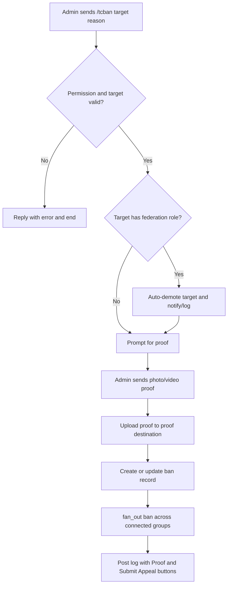
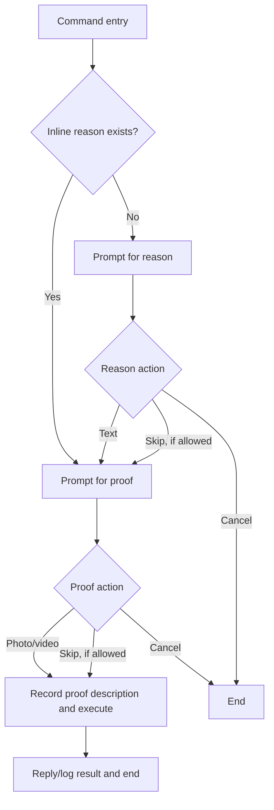
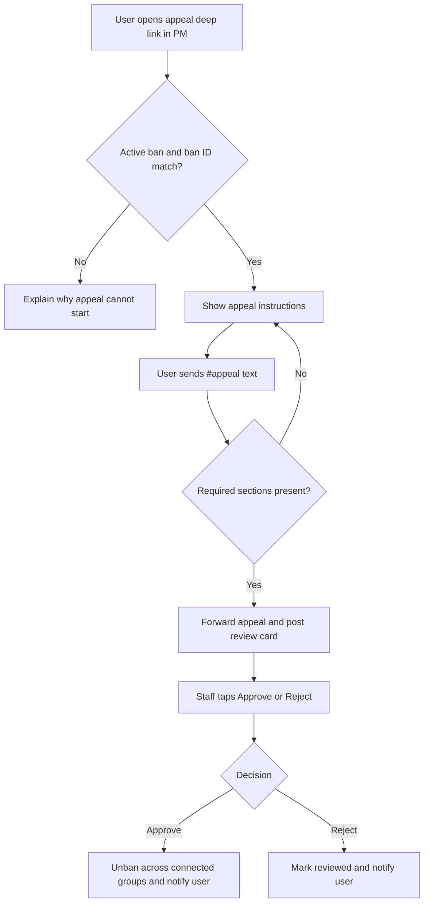
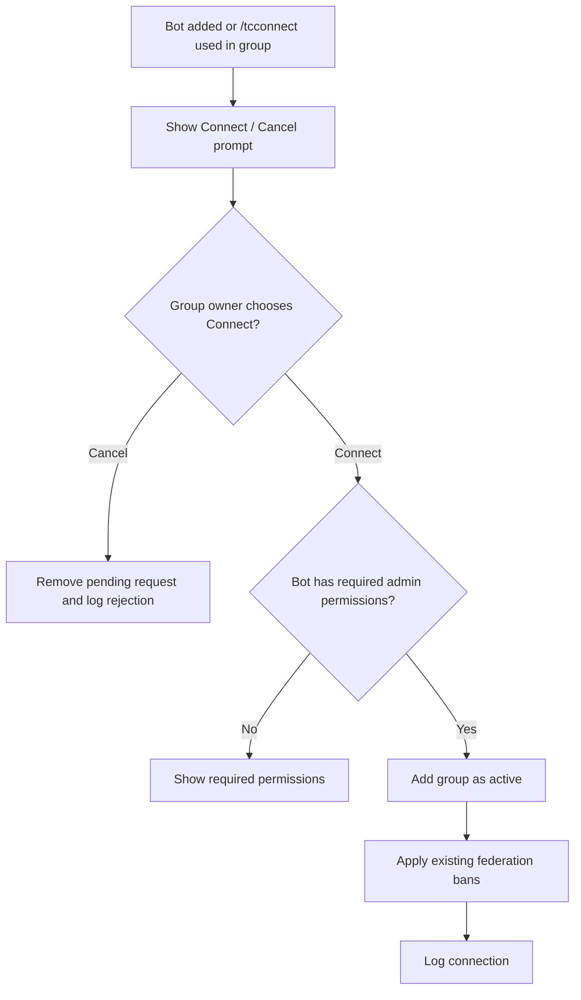

# Workflow Overview

This page describes the user-visible flows in TCF Bot. For state constants, factories, and callback details, see [workflow internals](workflows/workflows.md).

## Moderation flows

| Flow | Entry commands | Permission | Scope | Notes |
|---|---|---|---|---|
| Ban | `/tcban`, `/tcb` | Developer+ | All connected groups | Requires inline reason and proof media; updates existing active ban instead of duplicating. |
| Unban | `/tcunban`, `/tcunb` | Developer+ | All connected groups | Direct command; resolves an active ban and removes it federation-wide. |
| Kick | `/tckick`, `/tck` | Tester+ | Current group only | Conversation asks for reason/proof; auto-demotes role holders before kicking. |
| Mute | `/tcmute`, `/tcm` | Tester+ | All connected groups | Optional duration token before reason, for example `7d`. |
| Unmute | `/tcunmute`, `/tcunm`, `/tcum` | Tester+ | All connected groups | Direct command; restores send permissions. |
| Warn | `/tcwarn`, `/tcw` | Tester+ | Current group warning history | Reason required; auto-ban is attempted at 3 warnings. |
| Unwarn | `/tcunwarn`, `/tcunw` | Tester+ | Current group warning history | Removes the newest warning. |
| Warn list | `/warns`, `/warnlist` | Anyone | Current group warning history | Shows a user's warnings. |
| Reset warns | `/resetwarns`, `/clearwarns` | Tester+ | Current group warning history | Clears all warnings for a user in the chat. |

## Ban flow



Ban proof supports Telegram media albums. Album items are buffered for `ALBUM_DEBOUNCE_SECONDS` before processing.

## Reason + proof flows

Kick, mute, and warn use the shared `reason_flow.build_modaction_conv()` factory.



Warns configure `BuildReason("warn", skip_allowed=False)`, so a reason cannot be skipped.

## Appeal flow

Appeals start from a deep link: `/start appeal_<ban_id>` in bot PM.



Required appeal sections:

```text
#appeal
Log link: https://t.me/...
Clarification: explanation of the situation
Agreement: commitment to follow community rules
```

The original banning admin has a 12-hour priority review window. During that window, only the banning admin and the Founder can review. After the window, any admin-level reviewer can act.

## Group connection flow



Disconnected groups are marked inactive rather than deleted, preserving historical data.

## Staff role flows

- `/tcpromote` assigns `admin`, `developer`, or `tester` based on executor rank.
- Founder can assign Admin, Developer, or Tester.
- Admin can assign Developer or Tester directly.
- Admin-to-Admin promotion creates a queued request for Founder approval.
- `/tcdemote` uses confirm/cancel buttons before removing a role.
- `/transferowner` transfers Founder ownership.

## Statistics and lookup flows

- `/checkme` shows the caller's active ban status and appeal/proof buttons when applicable.
- `/checkban` / `/cban` lets staff inspect a user's ban status.
- `/tcgroups` lists connected groups with a details toggle.
- `/tcstats` shows summary cards, active bans, connected chats, and search/detail views.

## Maintenance and broadcast flows

- `/tcbroadcast` sends a message to every active connected group through bounded fan-out and logs success/failure counts.
- `/cleanup` performs staff cleanup actions.
- `/leaveall`, `/exitall`, and `/tcleave` are Founder-only emergency commands that make the bot leave connected groups and mark them inactive.
