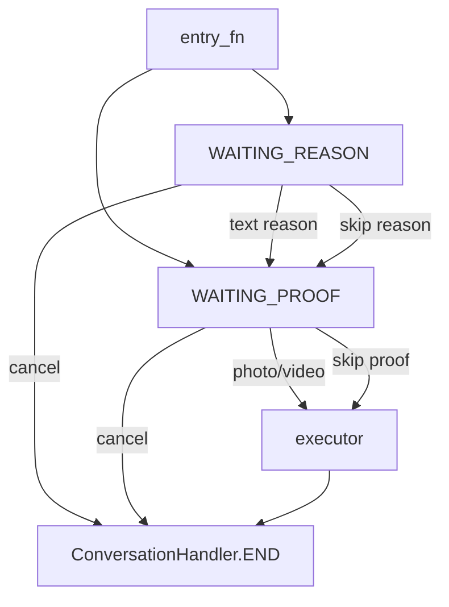

# Workflow Internals

For modules that register these conversation handlers, see [`../modules/modules.md`](../modules/modules.md). For shared helpers (formatter, decorators, extraction), see [`../helper/helper.md`](../helper/helper.md). For database helpers consumed by these flows, see [`../databases/databases.md`](../databases/databases.md). For per-feature flow details, see [`../banning-detailed.md`](../banning-detailed.md), [`../warnings-detailed.md`](../warnings-detailed.md), [`../appeal-detailed.md`](../appeal-detailed.md), [`../promote-detailed.md`](../promote-detailed.md), [`../demote-detailed.md`](../demote-detailed.md).

Conversation and multi-step logic lives in `tcbot/modules/helper/workflows/`. New conversation files must be named `*_flow.py`; do not create `*_conv.py` files.

## Package rules

- Command modules own command filters and `__handlers__` registration.
- Workflow files own state constants, `ConversationHandler` factories, and execution adapters.
- Shared reason/proof logic belongs in `reason_flow.py` and `proof_flow.py`.
- Callback handlers must call `await q.answer()` before doing further work.
- Timeouts use configuration values such as `cfg.proof_timeout`, `cfg.appeal_timeout`, and `cfg.album_debounce`. All timed conversations must register a `ConversationHandler.TIMEOUT` state with a `TypeHandler(Update, handler)` so PTB's scheduler notifies the user when the window expires naturally.

## Shared proof builder: `proof_flow.py`

`BuildProof` builds proof-step keyboards and messages.

| Export | Purpose |
|---|---|
| `BuildProof(action, skip_allowed=True, skip_label="Skip", cancel_label="Cancel")` | Configures proof buttons and prompts for an action. |
| `BuildProof.keyboard()` | Returns `[Skip] [Cancel]` when skipping is allowed, otherwise `[Cancel]`. |
| `BuildProof.step_prompt(...)` | Prompt after an in-conversation reason. |
| `BuildProof.noted_prompt(...)` | Prompt when a reason was provided inline. |
| `BuildProof.record(msg)` | Returns a short proof description for photo/video messages. |
| `upload_proof(bot, msgs, caption, proof_chat, proof_thread)` | Uploads one proof item or an album and returns the uploaded message ID. |

## Shared reason factory: `reason_flow.py`

State constants:

```python
WAITING_REASON = 0
WAITING_PROOF = 1
```

Exports:

| Export | Purpose |
|---|---|
| `parse_inline_reason(args, has_explicit_target)` | Returns reason text after the target token when needed. |
| `BuildReason(...)` | Configures reason-step prompts and buttons. |
| `build_modaction_conv(reason, proof, entry_fn, executor, entry_filter, escape_filter=None)` | Builds the shared kick/mute/warn conversation. |

The shared factory stores action-specific values in `ctx.user_data`, then calls the supplied executor adapter.



## Ban: `ban_flow.py`

| Item | Value |
|---|---|
| State | `WAITING_PROOF = 0` |
| Factory | `ban_conversation(entry_fn, entry_filter)` |
| Module instance | `proof = BuildProof("ban", skip_allowed=False)` |
| Entry module | `tcbot/modules/banning.py` |

Ban differs from the shared reason flow:

- The reason must be supplied in the command message.
- Proof is required by UI (`skip_allowed=False`).
- Photo/video albums are buffered by `media_group_id` and flushed after `cfg.album_debounce`.
- `_execute_ban()` creates or updates the `bans` document, uploads proof, applies bans to active groups with `fan_out()`, and posts the audit log.

## Kick: `kicking_flow.py`

| Item | Value |
|---|---|
| Factory | `kick_conversation(entry_fn, entry_filter)` |
| Module instances | `reason = BuildReason("kick")`, `proof = BuildProof("kick")` |
| Executor | `execute_kick(update, ctx, target_id, target_name, reason_text, proof_desc=None)` |

Kick is current-group-only. It bans the user from the current chat and immediately unbans them so the action behaves as a kick rather than a permanent group ban.

## Mute: `muting_flow.py`

| Item | Value |
|---|---|
| Factory | `mute_conversation(entry_fn, entry_filter, escape_filter=None)` |
| Module instances | `reason = BuildReason("mute")`, `proof = BuildProof("mute")` |
| Duration parser | `parse_duration(raw)` |
| Formatter | `fmt_duration(td)` |
| Executors | `_execute_mute(...)`, `execute_unmute(...)` |

Duration tokens are parsed before entering the conversation.

| Token | Unit | Example |
|---|---|---|
| `s` | seconds | `45s` |
| `m` | minutes | `30m` |
| `h` | hours | `2h` |
| `d` | days | `7d` |
| `w` | weeks | `1w` |
| `mo` | months (30 days) | `3mo` |
| `ye` | years (365 days) | `1ye` |

Mute applies restrictions across all connected groups with `fan_out()`.

## Warn: `warning_flow.py`

| Item | Value |
|---|---|
| Factory | `warn_conversation(entry_fn, entry_filter, escape_filter=None)` |
| Module instances | `reason = BuildReason("warn", skip_allowed=False)`, `proof = BuildProof("warn")` |
| Limit | `WARN_LIMIT = 3` |
| Executors | `execute_warn`, `execute_unwarn`, `execute_warnlist`, `execute_resetwarns` |

Warns are tracked per `(user_id, chat_id)`. At `WARN_LIMIT`, the flow attempts an automatic federation ban and then clears warnings for that user/chat.

## Unban: `unban_flow.py`

`execute_unban(update, ctx, target_id, target_fname)` is a direct executor, not a `ConversationHandler`. It finds the active ban, deactivates it, unbans the user from all active groups with `fan_out()`, and posts an audit log.

## Appeal: `appeal_flow.py`

| Item | Value |
|---|---|
| State | `WAITING_APPEAL = 0` |
| Factory | `BuildAppeal.build_handler(entry_filter)` |
| Decision handler | `BuildAppeal.on_decision(update, ctx)` |
| Lock helper | `reviewer_locked_out(review_timestamp, ban_admin_id, reviewer_id)` |

Appeal flow requirements:

- Entry is `/start appeal_<ban_id>` in private chat.
- The user must have an active ban matching the deep-link ban ID.
- The appeal text must start with `#appeal` and include `Log link:`, `Clarification:`, and `Agreement:`.
- A review card is posted to `APPEAL_DISCUSSION_TOPIC` in `MAIN_GROUP`.
- Approve calls unban logic and notifies the user; reject marks the appeal reviewed and notifies the user.

## Connection: `connected_flow.py`

`BuildConnection` handles group connection prompts and bot-added events.

| Method | Purpose |
|---|---|
| `join_prompt()` | Prompt shown when connecting a group. |
| `join_keyboard()` | `Connect` / `Cancel` buttons. |
| `check_perms(member)` | Verifies required bot admin permissions. |
| `complete_join(...)` | Adds the group, applies existing bans, and logs the connection. |
| `on_bot_added(update, ctx)` | Handles `MY_CHAT_MEMBER` updates. |
| `on_join_decision(update, ctx)` | Handles connect/cancel callback decisions. |

## Promotion: `promote_flow.py`

Promotion is not a conversation. `Promote.execute(...)` in `workflows/promote_flow.py` performs direct role assignment or creates a promotion request for Founder approval when required. `admins.py` registers the command and callback handlers.

## Demotion: `demote_flow.py`

Demotion is not a conversation. `Demote.execute(...)` in `workflows/demote_flow.py` handles two distinct paths controlled by the optional `trigger` argument:

| Call | Trigger | Path |
|---|---|---|
| `Demote.execute(...)` | `None` | Manual `/tcdemote`: sends a confirmation prompt with `Confirm` / `Cancel` buttons, then removes the role and logs it. |
| `Demote.execute(..., trigger="ban")` | `"ban"` | Auto-demote before a federation ban: silently removes the role and notes the trigger in the log. |
| `Demote.execute(..., trigger="kick")` | `"kick"` | Auto-demote before a current-group kick: same silent path as `"ban"`. |

`Demote.remove_role(target_id, target_role)` is the shared DB write used by all three paths. It delegates to `users_roles` and returns `True` if a role was actually removed.

## Stats: `stats_flow.py`

`stats_flow.py` exposes the unified `Stats` class used by `/tcstats`. Every drill-down (overview, staff roster, users, connected chats, active bans, and the search panel) is a classmethod on `Stats` returning `(text, InlineKeyboardMarkup)`. Callbacks pair `q.answer()` with `safe_edit_cb` so the same view can be re-tapped without raising `Message is not modified`. See `docs/stats-detailed.md` for the full method list and callback namespaces.

## Check: `check_flow.py`

`check_flow.py` exposes the `Check` class used by `/check`. It is not a conversation; every method is a classmethod returning `(text, InlineKeyboardMarkup)` that `checking.py` sends or edits directly.

| Method | Callback prefix | Purpose |
|---|---|---|
| `Check.profile(bot, target_id)` | `check_main:<uid>` | Top-level profile card: identity, role, active ban, total ban count, warn counts, kick count, mute count, and drill-down buttons. |
| `Check.bans_list(target_id, page)` | `check_bans:<uid>:<page>` | Paginated list of all bans (active + inactive), newest first. Each row shows status, Ban ID, timestamp, reason snippet, and a numbered button. |
| `Check.ban_detail(target_id, ban_id)` | `check_ban_item:<uid>:<ban_id>` | Full ban card via `ban_info.build_ban_detail`; exposes `View Proof` and `View Appeal` URL buttons when available. |
| `Check.warns_by_group(target_id)` | `check_warns:<uid>` | Lists groups where the user has active warnings, with count and a drill-in button per group. |
| `Check.warns_in_group(target_id, chat_id, page)` | `check_warn_chat:<uid>:<chat>:<page>` | Paginated per-group warning list: timestamp, reason snippet, admin. |
| `Check.kicks_list(target_id, page)` | `check_kicks:<uid>:<page>` | Paginated kick records: timestamp, group, reason snippet, admin. |
| `Check.mutes_list(target_id, page)` | `check_mutes:<uid>:<page>` | Paginated mute records: same shape as kicks. |
| `Check.appeals_list(target_id, page)` | `check_appeals:<uid>:<page>` | Paginated list of bans that have an associated appeal; items drill into `Check.ban_detail`. |

All drill-down views include a `« Back` button that returns to `Check.profile` via `check_main:<uid>`. See `docs/check-detailed.md` for the full behavior reference.
